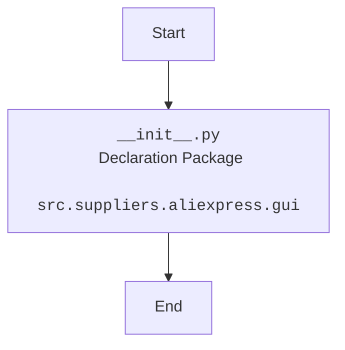

## АНАЛИЗ КОДА: `hypotez/src/suppliers/aliexpress/gui/__init__.py`

### 1. <алгоритм>

Файл `__init__.py` в Python обычно служит для обозначения директории как пакета и может содержать код инициализации для этого пакета. В данном случае, файл пустой, но он по-прежнему необходим для того, чтобы директория `gui` считалась пакетом `src.suppliers.aliexpress.gui`.

**Пошаговая блок-схема:**

```
Start --> PackageDeclaration[Объявление директории как пакета]
PackageDeclaration --> End[Конец]

```

**Пример:**

1.  **Start:** Начало анализа.
2.  **PackageDeclaration:** Директория `src/suppliers/aliexpress/gui` интерпретируется как пакет благодаря наличию `__init__.py`. Это позволяет импортировать модули, находящиеся в этой директории.
3.  **End:** Конец процесса. Код не выполняет никаких действий, но определяет пакет.

### 2. <mermaid>



**Объяснение `mermaid` диаграммы:**

-   `Start`: Начальная точка процесса.
-   `PackageDeclaration`: Обозначает файл `__init__.py`, который делает директорию `src/suppliers/aliexpress/gui` пакетом.
-   `End`: Конечная точка.

### 3. <объяснение>

**Импорты:**

-   В данном файле нет явных импортов. Это нормально для файла `__init__.py`, который может и не содержать импортов.

**Классы:**

-   В данном файле не определены классы.

**Функции:**

-   В данном файле не определены функции.

**Переменные:**

-   В данном файле не определены переменные.

**Объяснение:**

Файл `__init__.py` в директории `src/suppliers/aliexpress/gui`  является стандартным для Python-пакетов. Его основное назначение — сделать директорию `gui` распознаваемой Python как пакет, что позволяет импортировать модули и подпакеты из этой директории. 

**Потенциальные области для улучшения:**

1.  **Инициализация пакета:** Хотя сейчас файл пустой, в будущем в него можно добавить код для инициализации пакета `gui`, например, для настройки глобальных переменных или импорта наиболее часто используемых модулей, чтобы упростить их использование.
2.  **Документация:** Можно добавить Docstring с кратким описанием пакета для лучшей читаемости кода.

**Цепочка взаимосвязей с другими частями проекта:**

-   **`src.suppliers.aliexpress`:** Этот пакет (`gui`) является подпакетом более общего пакета `src.suppliers.aliexpress`. Это означает, что `gui` будет вероятно использоваться для создания пользовательского интерфейса для функциональности, связанной с поставщиками Aliexpress.
-   **Импорт из пакета:** Другие части проекта могут импортировать модули и пакеты из `src.suppliers.aliexpress.gui` с помощью оператора `import`.
-   **Взаимосвязь:** `gui` будет зависеть от модулей и функциональности `src.suppliers.aliexpress` для предоставления пользовательского интерфейса.