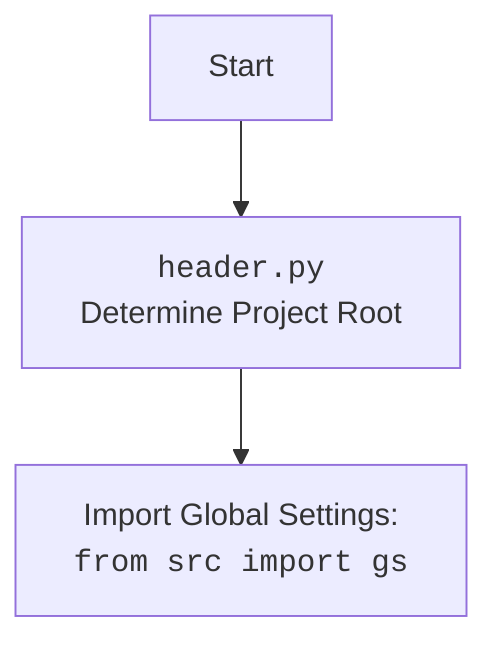

## `CategoryEditor`: Объяснение кода

### 1. <алгоритм>

**Блок-схема работы `CategoryEditor`:**

```mermaid
graph LR
    Start[Начало] --> Init[Инициализация: создание экземпляра CategoryEditor]
    Init --> UI[Настройка UI: кнопки, лейблы]
    UI --> OpenFileButton[Нажатие кнопки "Open JSON File"]
    OpenFileButton --> FileDialog[Открытие диалога выбора файла]
    FileDialog -- Выбран файл --> LoadFile[Загрузка JSON файла]
    FileDialog -- Файл не выбран --> End[Конец]
    LoadFile -- Успех --> CreateWidgets[Создание виджетов на основе данных]
    LoadFile -- Ошибка --> ErrorDialog[Отображение диалога ошибки]
    CreateWidgets --> PrepareAllButton[Нажатие кнопки "Prepare All Categories"]
    PrepareAllButton --> PrepareAllAsync[Асинхронная подготовка всех категорий]
    PrepareAllAsync -- Успех --> SuccessDialog1[Отображение сообщения об успехе]
    PrepareAllAsync -- Ошибка --> ErrorDialog1[Отображение диалога ошибки]
    CreateWidgets --> PrepareCategoryButton[Нажатие кнопки "Prepare Category"]
    PrepareCategoryButton --> PrepareCategoryAsync[Асинхронная подготовка конкретной категории]
    PrepareCategoryAsync -- Успех --> SuccessDialog2[Отображение сообщения об успехе]
    PrepareCategoryAsync -- Ошибка --> ErrorDialog2[Отображение диалога ошибки]
    SuccessDialog1 --> End
    ErrorDialog1 --> End
    SuccessDialog2 --> End
    ErrorDialog2 --> End
    End[Конец]
    style Start fill:#f9f,stroke:#333,stroke-width:2px
    style End fill:#ccf,stroke:#333,stroke-width:2px
```

**Примеры для каждого логического блока:**

*   **Init**: Создается экземпляр `CategoryEditor`, сохраняется ссылка на `MainApp` (если передана), вызываются методы `setup_ui` и `setup_connections`.
*   **UI**: Создаются кнопки "Open JSON File", "Prepare All Categories", "Prepare Category", а также лейбл для отображения имени файла, добавляются в вертикальный `QVBoxLayout`.
*   **OpenFileButton**: При нажатии на кнопку "Open JSON File" вызывается метод `open_file`.
*   **FileDialog**: Открывается диалог выбора файла для выбора JSON файла. Если файл выбран, вызывается `load_file`.
*   **LoadFile**: Загружает JSON из выбранного файла в `self.data` используя `j_loads_ns`, устанавливает имя файла в лейбл, извлекает имя кампании и языка, создает экземпляр `AliCampaignEditor`, вызывает `create_widgets`.
*   **CreateWidgets**: Удаляет старые виджеты (кроме кнопок и лейбла), создает новые лейблы для заголовка и имени кампании, а также лейблы для каждой категории в данных.
*   **PrepareAllButton**: При нажатии на кнопку "Prepare All Categories" вызывается асинхронный метод `prepare_all_categories_async`.
*   **PrepareAllAsync**: Асинхронно вызывает метод `prepare_all_categories` экземпляра `AliCampaignEditor`. Отображает сообщение об успехе или ошибке.
*   **PrepareCategoryButton**: При нажатии на кнопку "Prepare Category" вызывается асинхронный метод `prepare_category_async`.
*   **PrepareCategoryAsync**: Асинхронно вызывает метод `prepare_category` экземпляра `AliCampaignEditor`. Отображает сообщение об успехе или ошибке.
*   **ErrorDialog**:  В случае возникновения исключения в `load_file`, `prepare_all_categories_async` или `prepare_category_async`, вызывается `QtWidgets.QMessageBox.critical()` для отображения сообщения об ошибке.
*   **SuccessDialog**: В случае успешного выполнения `prepare_all_categories_async` или `prepare_category_async` вызывается `QtWidgets.QMessageBox.information()` для отображения сообщения об успехе.

### 2. <mermaid>

```mermaid
flowchart TD
    Start[<code>category.py</code><br>CategoryEditor] --> ImportModules[Импорт модулей и библиотек]
    ImportModules --> header[<code>header.py</code> <br>Определение корневой директории проекта]
    ImportModules --> sys[<code>sys</code>]
    ImportModules --> asyncio[<code>asyncio</code>]
    ImportModules --> pathlib[<code>pathlib</code>]
    ImportModules --> types[<code>types</code>]
    ImportModules --> PyQt6[<code>PyQt6</code>]
    ImportModules --> qasync[<code>qasync</code>]
    ImportModules --> jjson[<code>src.utils.jjson</code>]
    ImportModules --> AliCampaignEditor[<code>src.suppliers.aliexpress.campaign</code>]
    Start --> ClassDef[Определение класса <code>CategoryEditor</code>]
    ClassDef --> Attributes[Атрибуты класса:<br><code>campaign_name</code>, <code>data</code>, <code>language</code>, <code>currency</code>, <code>file_path</code>, <code>editor</code>]
    ClassDef --> Constructor[<code>__init__(self, parent, main_app)</code>]
    Constructor --> SetupUI[<code>setup_ui(self)</code><br>Настройка UI]
    Constructor --> SetupConnections[<code>setup_connections(self)</code>]
    ClassDef --> OpenFile[<code>open_file(self)</code><br>Диалог выбора файла]
    OpenFile --> LoadFile[<code>load_file(self, campaign_file)</code><br>Загрузка данных из файла]
     LoadFile --> JLoadsNS[<code>j_loads_ns(campaign_file)</code><br>Десериализация JSON]
     LoadFile --> AliCampaignEditorCreate[Создание экземпляра <code>AliCampaignEditor</code>]
    LoadFile --> CreateWidgets[<code>create_widgets(self, data)</code><br>Создание виджетов]
    ClassDef --> PrepareAllAsync[<code>prepare_all_categories_async(self)</code><br>Асинхронная подготовка всех категорий]
    PrepareAllAsync --> AliCampaignEditorPrepareAll[<code>editor.prepare_all_categories()</code><br>Вызов метода подготовки всех категорий]
    ClassDef --> PrepareCategoryAsync[<code>prepare_category_async(self)</code><br>Асинхронная подготовка одной категории]
   PrepareCategoryAsync --> AliCampaignEditorPrepareCategory[<code>editor.prepare_category(self.data.campaign_name)</code><br>Вызов метода подготовки конкретной категории]
    style Start fill:#f9f,stroke:#333,stroke-width:2px
```



**Объяснение зависимостей:**

*   `header.py`: Определяет корневую директорию проекта, позволяет получить доступ к глобальным настройкам.
*   `sys`: Предоставляет доступ к системным переменным и функциям.
*   `asyncio`: Библиотека для асинхронного программирования.
*   `pathlib`: Библиотека для работы с путями к файлам.
*   `types`: Модуль для работы с динамическими типами.
*   `PyQt6`: Библиотека для создания графического интерфейса.
*   `qasync`: Интегрирует `asyncio` с циклом событий `Qt`.
*   `jjson`: Модуль `src.utils.jjson` для работы с JSON, включая загрузку/сохранение `SimpleNamespace`.
*   `AliCampaignEditor`: Класс `src.suppliers.aliexpress.campaign` для подготовки кампании.

### 3. <объяснение>

**Импорты:**

*   `header`: Импортирует модуль для определения корневого каталога проекта и глобальных настроек.
*   `sys`: Предоставляет доступ к переменным и функциям, связанным с системой.
*   `asyncio`: Используется для асинхронных операций, что позволяет не блокировать основной поток GUI при выполнении длительных задач.
*   `pathlib`: Используется для работы с путями к файлам, что делает код более читабельным.
*   `types`:  Предоставляет типы, такие как `SimpleNamespace`, для удобного доступа к атрибутам.
*   `PyQt6`:  Библиотека для создания графического интерфейса пользователя (GUI).
    *   `QtWidgets`: Содержит классы для создания виджетов (кнопок, лейблов, диалогов и т.д.).
    *   `QtGui`: Предоставляет дополнительные классы для графического интерфейса.
    *   `QtCore`:  Содержит основные классы Qt (например, сигналы/слоты).
*   `qasync`:  Интегрирует асинхронные операции `asyncio` с циклом событий `Qt`, что необходимо для асинхронных операций в GUI.
*   `jjson`: Модуль `src.utils.jjson` для работы с JSON.
    *   `j_loads_ns`: Загружает данные из JSON-файла и преобразует их в `SimpleNamespace`.
    *   `j_dumps`: Сохраняет данные из `SimpleNamespace` в JSON-файл.
*   `AliCampaignEditor`: Класс `src.suppliers.aliexpress.campaign` для редактирования и подготовки кампании AliExpress.

**Классы:**

*   `CategoryEditor(QtWidgets.QWidget)`: Основной класс для создания окна редактирования категорий.
    *   **Атрибуты:**
        *   `campaign_name (str)`: Имя кампании.
        *   `data (SimpleNamespace)`: Данные, загруженные из JSON файла.
        *   `language (str)`: Язык кампании (по умолчанию 'EN').
        *   `currency (str)`: Валюта кампании (по умолчанию 'USD').
        *   `file_path (str)`: Путь к выбранному файлу.
        *   `editor (AliCampaignEditor)`: Экземпляр редактора кампании.
        *   `main_app (MainApp)`: Ссылка на главное приложение.
    *   **Методы:**
        *   `__init__(self, parent=None, main_app=None)`: Конструктор класса, инициализирует UI и связи.
        *   `setup_ui(self)`: Настраивает пользовательский интерфейс (окно, кнопки, лейблы).
        *   `setup_connections(self)`: Устанавливает связи между сигналами и слотами (не используется в текущей реализации).
        *   `open_file(self)`: Открывает диалог выбора файла и загружает данные.
        *   `load_file(self, campaign_file)`: Загружает данные из JSON-файла в `SimpleNamespace` и создает экземпляр `AliCampaignEditor`.
        *   `create_widgets(self, data)`: Создает виджеты на основе загруженных данных.
        *   `prepare_all_categories_async(self)`: Асинхронно запускает подготовку всех категорий.
        *   `prepare_category_async(self)`: Асинхронно запускает подготовку конкретной категории.

**Функции:**

*   `__init__(self, parent=None, main_app=None)`:
    *   Аргументы: `parent` - родительский виджет (по умолчанию `None`), `main_app` - экземпляр главного приложения (по умолчанию `None`).
    *   Назначение: Инициализирует окно, сохраняет ссылку на главное приложение, настраивает UI и устанавливает связи.
*   `setup_ui(self)`:
    *   Аргументы: `self` - экземпляр класса `CategoryEditor`.
    *   Назначение: Создает и настраивает элементы GUI (кнопки, лейблы), добавляет их в вертикальный слой.
*   `setup_connections(self)`:
    *   Аргументы: `self` - экземпляр класса `CategoryEditor`.
    *   Назначение:  Устанавливает соединения сигналов и слотов (в текущей версии пустой).
*   `open_file(self)`:
    *   Аргументы: `self` - экземпляр класса `CategoryEditor`.
    *   Назначение: Открывает диалог выбора файла, вызывает `load_file` при выборе файла.
*   `load_file(self, campaign_file)`:
    *   Аргументы: `self` - экземпляр класса `CategoryEditor`, `campaign_file` - путь к файлу.
    *   Назначение: Загружает данные JSON файла, создает `AliCampaignEditor` и вызывает `create_widgets`.
*   `create_widgets(self, data)`:
    *   Аргументы: `self` - экземпляр класса `CategoryEditor`, `data` - объект `SimpleNamespace` с данными.
    *   Назначение: Создает виджеты на основе данных `data`, добавляет их в `layout` окна.
*   `prepare_all_categories_async(self)`:
    *   Аргументы: `self` - экземпляр класса `CategoryEditor`.
    *   Назначение: Вызывает асинхронный метод подготовки всех категорий `AliCampaignEditor`.
    *   Возвращает: `None`.
*    `prepare_category_async(self)`:
    *    Аргументы: `self` - экземпляр класса `CategoryEditor`.
    *    Назначение: Вызывает асинхронный метод подготовки конкретной категории `AliCampaignEditor`.
    *    Возвращает: `None`.

**Переменные:**

*   `campaign_name (str)`: Имя текущей кампании, извлекается из JSON файла.
*   `data (SimpleNamespace)`: Объект для хранения данных, загруженных из JSON файла.
*   `language (str)`: Язык кампании, извлекается из имени файла, например `RU.json`, тогда `RU`.
*   `currency (str)`: Валюта кампании (по умолчанию 'USD').
*   `file_path (str)`: Путь к загруженному файлу.
*   `editor (AliCampaignEditor)`: Экземпляр редактора кампании, созданный на основе выбранного файла.
*   `main_app`: Ссылка на экземпляр главного приложения, если есть.
*   `open_button`, `file_name_label`, `prepare_all_button`, `prepare_specific_button`, `layout`, `title_label`, `campaign_label`, `category_label`: Виджеты PyQt.

**Потенциальные ошибки и области для улучшения:**

*   Обработка ошибок: Ошибки обрабатываются с помощью `try-except` блоков, выводя сообщения через `QMessageBox`, но можно добавить более детальную обработку ошибок, например, логирование.
*   Повторяющийся код: Код для создания виджетов (лейблы для заголовка и имени кампании) можно вынести в отдельную функцию, чтобы не дублировать код.
*   Не используется `setup_connections`: Необходимо реализовать этот метод, если нужны кастомные сигналы и слоты.
*   Асинхронность: Необходимо убедиться, что все блокировки GUI вынесены в отдельный поток, чтобы приложение оставалось отзывчивым во время асинхронных операций.
*   Настройка UI: Настройки UI (размеры окна, расположение элементов) можно сделать более гибкими.
*   Зависимости: Жестко задан путь `c:/user/documents/repos/hypotez/data/aliexpress/campaigns` в `open_file`.

**Взаимосвязь с другими частями проекта:**

*   Зависит от `header.py` для определения корневой директории и глобальных настроек.
*   Использует `src.utils.jjson` для работы с JSON.
*   Использует `src.suppliers.aliexpress.campaign.AliCampaignEditor` для редактирования кампании.
*   Предположительно является частью GUI приложения (например `src.gui.main.py`) для управления кампаниями AliExpress.