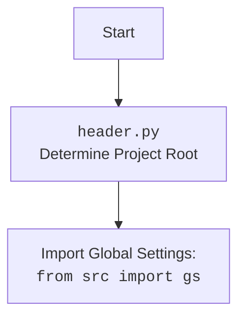

## АНАЛИЗ КОДА: `hypotez/src/suppliers/aliexpress/gui/header.py`

### 1. <алгоритм>

1.  **`set_project_root(marker_files)`**:
    *   **Вход**: кортеж `marker_files` (имена файлов/папок, обозначающих корень проекта). По умолчанию (`'__root__', '.git'`).
    *   **Инициализация**:
        *   `current_path` - путь к директории, в которой находится текущий файл `header.py`.
        *   `__root__` - изначально присваивается `current_path`.
    *   **Поиск корня**:
        *   Обход родительских директорий, начиная с `current_path`.
        *   Для каждой директории проверяется, содержит ли она хотя бы один из `marker_files`.
            *   **Пример**: Если `marker_files` - `('.git')`, то проверяется существование `parent / '.git'`
        *   Если маркер найден, `__root__` устанавливается в эту родительскую директорию, цикл завершается.
    *   **Добавление в `sys.path`**:
        *   Если `__root__` нет в `sys.path`, то он добавляется в начало списка путей поиска модулей.
    *   **Выход**: `__root__` - путь к корню проекта.
2.  **`__root__ = set_project_root()`**:
    *   Вызывается функция `set_project_root` для определения корня проекта. Результат сохраняется в глобальную переменную `__root__`.
3.  **Импорт глобальных настроек:**
    *   Импортируются глобальные настройки из `src.gs`.
4.  **Загрузка настроек из JSON:**
    *   Инициализируется переменная `settings` в `None`.
    *   **Попытка загрузки**:
      *   Пытаемся открыть файл `src/settings.json`, расположенный относительно корня проекта (`gs.path.root`) в режиме чтения (`'r'`).
      *   Пытаемся загрузить данные из файла в переменную `settings` с помощью `json.load()`.
    *   **Обработка ошибок**:
      *   Если происходит ошибка `FileNotFoundError` (файл не найден) или `json.JSONDecodeError` (ошибка декодирования JSON), выполнение переходит к блоку `except`, в котором ничего не выполняется (`...`).
        *  Это означает, что если файл настроек не будет найден или будет иметь некорректный формат, то `settings` останется `None`.

### 2. <mermaid>

```mermaid
flowchart TD
    Start --> FindRoot[<code>set_project_root()</code><br>Determine Project Root];
    
    FindRoot --> InitPath[Initialize: <br><code>current_path = Path(__file__).resolve().parent</code> <br><code>__root__ = current_path</code>];
    
    InitPath --> LoopParents[Loop through parent directories];
    
    LoopParents -- Marker Found --> SetRoot[Set <code>__root__ = parent</code><br> Break loop];
        SetRoot --> CheckSysPath[Check if <code>__root__</code> in <code>sys.path</code>];
    LoopParents -- Marker Not Found --> CheckParent[Check Parent];
        CheckParent -- More Parents --> LoopParents;
        CheckParent -- No More Parents --> CheckSysPath;

    CheckSysPath -- Not in <code>sys.path</code> --> InsertSysPath[Insert <code>__root__</code> to <code>sys.path</code>];
    CheckSysPath -- In <code>sys.path</code> --> ReturnRoot[Return <code>__root__</code>];
    InsertSysPath --> ReturnRoot;

    ReturnRoot --> SetGlobalRoot[<code>__root__ = set_project_root()</code>];
    
    SetGlobalRoot --> ImportSettings[Import Global Settings:<br><code>from src import gs</code>];
    
    ImportSettings --> LoadSettings[Load settings.json:<br><code>settings = json.load(settings_file)</code>];
    
    LoadSettings --> End;
        LoadSettings -- Error --> End;
    
    
     
     
    classDef var fill:#f9f,stroke:#333,stroke-width:2px
    class Start,End, InitPath, SetGlobalRoot, ImportSettings, LoadSettings var
```


**Описание зависимостей (mermaid):**

*   **`flowchart TD`**: Определяет тип диаграммы как блок-схему, где `TD` означает "Top to Down" (сверху вниз).
*   **`Start`, `End`**: Начало и конец процесса.
*   **`FindRoot`**: Вызов функции `set_project_root()`, которая отвечает за определение корня проекта.
*    **`InitPath`**: Инициализация переменных: путь к текущей директории (`current_path`) и первоначальное значение корня проекта (`__root__`).
*   **`LoopParents`**: Цикл по родительским директориям для поиска маркера корня проекта.
*   **`SetRoot`**: При обнаружении маркера корня проекта, переменная `__root__` обновляется значением родительской директории и цикл обрывается.
*   **`CheckSysPath`**: Проверка наличия корня проекта (`__root__`) в списке путей (`sys.path`).
*    **`CheckParent`**: Проверка на наличие родительской директории.
*   **`InsertSysPath`**: Добавление корня проекта (`__root__`) в `sys.path`.
*   **`ReturnRoot`**: Возврат определенного корня проекта.
*   **`SetGlobalRoot`**: Присвоение результата вызова функции `set_project_root` глобальной переменной `__root__`.
*   **`ImportSettings`**: Импорт глобальных настроек из `src.gs`.
*   **`LoadSettings`**: Загрузка настроек из файла `settings.json`.
*   **Связи:** Стрелки показывают поток управления между блоками.
*   **`classDef`**: Определяет стили для визуального выделения переменных.
*   **`class Start,End, InitPath, SetGlobalRoot, ImportSettings, LoadSettings var`**: Применяет определенный стиль к блокам, представляющим инициализацию переменных.

### 3. <объяснение>

**Импорты:**

*   `sys`: Модуль для доступа к системным параметрам и функциям, используется для добавления пути к корню проекта в `sys.path`.
*   `json`: Модуль для работы с JSON данными, используется для загрузки настроек из файла `settings.json`.
*   `packaging.version.Version`: Модуль `packaging` нужен для работы с версиями программного обеспечения. В данном коде напрямую не используется, но возможно используется в дальнейшем проекте.
*   `pathlib.Path`: Модуль для работы с путями в файловой системе, обеспечивает более удобный и кроссплатформенный способ манипуляции путями.
*   `from src import gs`: Импортирует модуль `gs` из пакета `src`, который предположительно содержит глобальные настройки и пути проекта.

**Функции:**

*   **`set_project_root(marker_files)`**:
    *   **Аргументы**:
        *   `marker_files` (tuple): Кортеж с именами файлов/папок, которые служат индикаторами корня проекта.
    *   **Возвращаемое значение**:
        *   `Path`: Объект `Path`, представляющий путь к корню проекта.
    *   **Назначение**:
        *   Определяет корневую директорию проекта, начиная с директории, в которой расположен текущий файл.
        *   Производит поиск по родительским директориям до тех пор, пока не будет найден хотя бы один из `marker_files`.
        *   Добавляет путь к корню проекта в `sys.path`, чтобы обеспечить возможность импорта модулей из других частей проекта.
    *   **Пример**: Если файл `header.py` находится в `project/src/suppliers/aliexpress/gui/` и в `project/` есть файл `__root__`, то функция вернёт `project/`.
*   **Глобальные переменные**:
    *  `__root__`:  Хранит путь к корневой директории проекта (тип `Path`). Определяется путем вызова `set_project_root()`
    *  `settings`:  Словарь, хранящий загруженные настройки проекта (тип `dict` или `None`, если загрузка не удалась).

**Объяснения:**

*   **`set_project_root`**:
    *   Функция использует `Path` из модуля `pathlib` для представления путей.
    *   Использование `__file__` позволяет получить путь к текущему файлу.
    *   Используется метод `resolve()`, для преобразования относительного пути в абсолютный.
    *   Родительские директории перебираются с помощью `current_path.parents`.
    *   Функция может быть полезна для определения путей к файлам настроек, ресурсам или другим частям проекта.
*   **`sys.path`**:  Список путей, где Python ищет модули. Добавление пути к корню проекта в этот список позволяет импортировать модули из других директорий проекта.
*   **Загрузка настроек**:
    *   Используется блок `try...except` для обработки возможных ошибок при открытии и загрузке `settings.json`.
    *   Если файл `settings.json` не найден или содержит невалидный JSON, то переменная `settings` останется `None`.
*   **Взаимосвязь с другими частями проекта:**
    *   Этот модуль устанавливает корень проекта и обеспечивает доступ к файлу настроек.
    *   Путь к корню проекта `__root__` используется в других частях проекта для поиска необходимых ресурсов.
    *   Глобальные настройки `settings` могут использоваться для конфигурации различных модулей и компонентов проекта.

**Потенциальные ошибки или области для улучшения:**

*   **Отсутствие обработки ошибки загрузки настроек**:  Сейчас ошибки при загрузке настроек просто игнорируются. Возможно, следует добавить логирование или вывод предупреждения, чтобы разработчик знал о проблеме.
*   **Зависимость от `gs` до `__root__`**:  `gs` импортируется после определения корня проекта, хотя сам `gs` может содержать пути, зависящие от корня проекта, что является циклической зависимостью. Возможно, стоит сделать часть настроек, определяющих корневой каталог в другом месте.
*   **Использование `...` в `except`**: Пустой блок `except` может скрыть важные ошибки. Лучше либо логировать их, либо обрабатывать.
*   **Жесткое задание пути к `settings.json`**:  Путь к файлу `settings.json` жестко прописан. Было бы лучше иметь возможность задавать этот путь через параметры или переменные окружения.
*   **Отсутствует валидация настроек**: Загруженные настройки никак не проверяются на корректность, что может вызвать проблемы в других частях программы.

**Цепочка взаимосвязей:**
1.  **`header.py`**: Определяет корень проекта (`__root__`) и загружает основные настройки `settings`.
2.  **`src.gs`**: Содержит пути и другие глобальные параметры. Используется в `header.py` для получения пути к файлу `settings.json`.
3.  Другие модули проекта: используют `__root__` для доступа к файлам ресурсов, используют `settings` для конфигурации.

В целом, данный код выполняет важную функцию по определению корня проекта и загрузке настроек, но имеет некоторые области для улучшения.