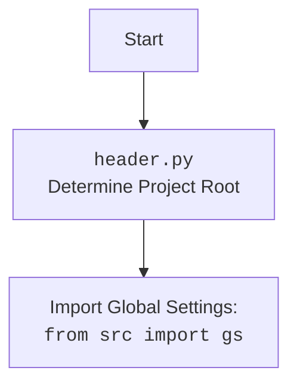

## ИНСТРУКЦИЯ:

Анализируй предоставленный код подробно и объясни его функциональность. Ответ должен включать три раздела:  

1. **<алгоритм>**: Опиши рабочий процесс в виде пошаговой блок-схемы, включая примеры для каждого логического блока, и проиллюстрируй поток данных между функциями, классами или методами.  
2. **<mermaid>**: Напиши код для диаграммы в формате `mermaid`, проанализируй и объясни все зависимости, 
    которые импортируются при создании диаграммы. 
    **ВАЖНО!** Убедитесь, что все имена переменных, используемые в диаграмме `mermaid`, 
    имеют осмысленные и описательные имена. Имена переменных вроде `A`, `B`, `C`, и т.д., не допускаются!  
    
    **Дополнительно**: Если в коде есть импорт `import header`, добавьте блок `mermaid` flowchart, объясняющий `header.py`:\
    ```mermaid
    flowchart TD
        Start --> Header[<code>header.py</code><br> Determine Project Root]
    
        Header --> import[Import Global Settings: <br><code>from src import gs</code>] 
    ```

3. **<объяснение>**: Предоставьте подробные объяснения:  
   - **Импорты**: Их назначение и взаимосвязь с другими пакетами `src.`.  
   - **Классы**: Их роль, атрибуты, методы и взаимодействие с другими компонентами проекта.  
   - **Функции**: Их аргументы, возвращаемые значения, назначение и примеры.  
   - **Переменные**: Их типы и использование.  
   - Выделите потенциальные ошибки или области для улучшения.  

Дополнительно, постройте цепочку взаимосвязей с другими частями проекта (если применимо).  

Это обеспечивает всесторонний и структурированный анализ кода.
## Формат ответа: `.md` (markdown)
**КОНЕЦ ИНСТРУКЦИИ**
```
## <алгоритм>

1. **Инициализация приложения:**
   - Создается экземпляр `QtWidgets.QApplication` для управления GUI-приложением.
   - Инициализируется `QEventLoop` для работы с асинхронными операциями.
   - Создается главное окно `MainApp`.
   - `MainApp` создает главное окно с тремя вкладками: "JSON Editor", "Campaign Editor" и "Product Editor".
   
2. **Создание меню:**
   - `create_menubar`: Создает меню "File" с пунктами "Open", "Save", "Exit" и "Open Product File".
   - Создает меню "Edit" с пунктами "Copy" и "Paste".
   
3. **Обработка событий:**
   - **`open_file`**: При нажатии на "Open" вызывает диалоговое окно выбора файла (`QtWidgets.QFileDialog`). Если выбран файл, проверяет какая вкладка открыта и загружает JSON данные в `CampaignEditor`.
   - **`save_file`**: При нажатии на "Save", в зависимости от выбранной вкладки, сохраняет изменения в `CampaignEditor` или `ProductEditor`.
   - **`exit_application`**: При нажатии на "Exit" закрывает приложение.
   - **`copy`**: Копирует текст из виджета с фокусом, если это `QLineEdit`, `QTextEdit` или `QPlainTextEdit`.
   - **`paste`**: Вставляет текст в виджет с фокусом, если это `QLineEdit`, `QTextEdit` или `QPlainTextEdit`.
   - **`open_product_action`**: При нажатии на "Open Product File" вызывает `product_editor_app.open_file` для открытия файла продукта.
   
4. **Загрузка и сохранение данных:**
   - **`load_file(campaign_file)`**: Загружает JSON данные из указанного файла в `CampaignEditor`.
   - **`save_changes`** и **`save_product`** : Методы вызываемые для сохранения данных. 

5. **Запуск приложения:**
   - `main` функция:
     - Создает и показывает главное окно `MainApp`.
     - Запускает асинхронный цикл событий `loop.run_forever()`.

**Пример потока данных:**
   
   - **Открытие файла:** Пользователь нажимает "File" -> "Open", вызывается `open_file`, открывается диалог выбора файла, возвращается путь к файлу. Затем вызывается `load_file`, данные из файла передаются в `CampaignEditor`.
   - **Сохранение файла:** Пользователь нажимает "File" -> "Save", вызывается `save_file`, в зависимости от активной вкладки либо `CampaignEditor.save_changes()` либо `ProductEditor.save_product()` сохраняет данные.
   - **Копирование:** Пользователь нажимает "Edit" -> "Copy", вызывается `copy`, определяется текущий виджет, если это текстовый виджет, вызывается метод `copy`.
   - **Вставка:** Пользователь нажимает "Edit" -> "Paste", вызывается `paste`, определяется текущий виджет, если это текстовый виджет, вызывается метод `paste`.

## <mermaid>
```mermaid
flowchart TD
    Start[Start Application] --> Initialize[Initialize QApplication and QEventLoop];
    Initialize --> MainAppCreation[Create MainApp Instance];
    MainAppCreation --> TabsCreation[Create Tabs: JSON, Campaign, Product];
    TabsCreation --> MenuCreation[Create Menu Bar];
    MenuCreation --> FileMenu[Create File Menu];
    FileMenu --> OpenAction[Add "Open" Action];
    FileMenu --> SaveAction[Add "Save" Action];
    FileMenu --> ExitAction[Add "Exit" Action];
    FileMenu --> OpenProductAction[Add "Open Product File" Action];
    MenuCreation --> EditMenu[Create Edit Menu];
    EditMenu --> CopyAction[Add "Copy" Action];
    EditMenu --> PasteAction[Add "Paste" Action];
    OpenAction --> openFileFunction[Call open_file() Function];
    openFileFunction --> FileDialog[Open File Dialog];
    FileDialog -- File Selected --> LoadJSON[Call load_file()];
    LoadJSON --> CampaignEditorLoad[CampaignEditor.load_file()]
    SaveAction --> saveFileFunction[Call save_file() Function];
     saveFileFunction -- Tab 1 Active --> CampaignEditorSave[CampaignEditor.save_changes()];
    saveFileFunction -- Tab 2 Active --> ProductEditorSave[ProductEditor.save_product()];
    ExitAction --> exitApp[Call exit_application()];
    CopyAction --> copyText[Call copy()];
    PasteAction --> pasteText[Call paste()];
    OpenProductAction --> OpenProductFile[Call product_editor_app.open_file()];

    MainAppCreation --> ShowMainApp[Show Main Application];
    ShowMainApp --> RunEventLoop[Start Event Loop];
     RunEventLoop --> End[End Application];

    style Start fill:#f9f,stroke:#333,stroke-width:2px
    style End fill:#ccf,stroke:#333,stroke-width:2px
    style RunEventLoop fill:#ccf,stroke:#333,stroke-width:2px

```


**Объяснение `mermaid` диаграммы:**

*   **Start Application**: Начало выполнения программы.
*   **Initialize QApplication and QEventLoop**: Инициализация основных компонентов `PyQt6` и асинхронного цикла событий.
*   **Create MainApp Instance**: Создание экземпляра главного окна приложения.
*   **Create Tabs: JSON, Campaign, Product**: Создание вкладок для разных редакторов.
*   **Create Menu Bar**: Создание меню бара.
*   **Create File Menu**: Создание меню "File".
*   **Add "Open" Action**: Добавление действия "Open" в меню "File".
*   **Add "Save" Action**: Добавление действия "Save" в меню "File".
*   **Add "Exit" Action**: Добавление действия "Exit" в меню "File".
*   **Add "Open Product File" Action**: Добавление действия "Open Product File" в меню "File".
*  **Create Edit Menu**: Создание меню "Edit".
*   **Add "Copy" Action**: Добавление действия "Copy" в меню "Edit".
*   **Add "Paste" Action**: Добавление действия "Paste" в меню "Edit".
*   **Call `open_file()` Function**: Вызов функции `open_file` при нажатии на "Open".
*   **Open File Dialog**: Открытие диалогового окна выбора файла.
*   **Call `load_file()`**: Вызов функции `load_file` после выбора файла.
*   **`CampaignEditor.load_file()`**: Загрузка данных в редактор кампаний.
*    **Call `save_file()` Function**: Вызов функции `save_file` при нажатии на "Save".
*   **`CampaignEditor.save_changes()`**: Сохранение изменений в редакторе кампаний.
*  **`ProductEditor.save_product()`**: Сохранение изменений в редакторе продуктов.
*   **Call `exit_application()`**: Вызов функции `exit_application` при нажатии на "Exit".
*   **Call `copy()`**: Вызов функции `copy` при нажатии на "Copy".
*   **Call `paste()`**: Вызов функции `paste` при нажатии на "Paste".
*    **Call product_editor_app.open_file()**: Вызов метода `open_file` в `product_editor_app` при нажатии на "Open Product File".
*   **Show Main Application**: Отображение главного окна.
*   **Start Event Loop**: Запуск цикла обработки событий.
*   **End Application**: Завершение работы приложения.

**Объяснение зависимостей:**

*   **QtWidgets, QtGui, QtCore**: Компоненты библиотеки `PyQt6`, обеспечивающие GUI функциональность.
*   **qasync**: Библиотека для интеграции асинхронных операций с `PyQt6`.
*  **pathlib.Path**: Библиотека для работы с путями к файлам.
*   **src.utils.jjson**: Модуль для загрузки и сохранения JSON данных.
*   **product, campaign, category**: Модули для работы с редакторами продукта, кампании и категорий.
*   **src.suppliers.aliexpress.campaign**: Модуль для редактора кампаний AliExpress.
*   **styles**: Модуль для управления стилями.
*  **header**: Модуль для определения корневой директории проекта и импорта общих настроек.

## <объяснение>

**Импорты:**

*   `import header`: Импортирует модуль `header`, который, вероятно, используется для определения корневой директории проекта и загрузки глобальных настроек. (связь с `src` - вероятно, находится в `src/header.py` и импортирует `src.gs`)
*   `import asyncio`: Используется для работы с асинхронными операциями.
*   `import sys`: Предоставляет доступ к некоторым переменным и функциям, взаимодействующим с интерпретатором Python, используется для получения аргументов командной строки.
*   `from PyQt6 import QtWidgets, QtGui, QtCore`: Импортирует классы для создания GUI из библиотеки `PyQt6`.
    *   `QtWidgets`: Содержит классы для создания виджетов (кнопок, окон, полей ввода и т.д.).
    *   `QtGui`: Содержит классы для работы с графикой (иконки, курсоры, шрифты и т.д.).
    *   `QtCore`: Содержит базовые классы, включая механизм сигналов и слотов.
*   `from qasync import QEventLoop`: Импортирует `QEventLoop` для интеграции асинхронного кода с `PyQt6`.
*  `from pathlib import Path`: Класс для работы с путями к файлам в операционной системе.
*   `from src.utils.jjson import j_loads_ns, j_dumps`: Импортирует функции `j_loads_ns` и `j_dumps` из модуля `jjson` для работы с JSON данными. `j_loads_ns` вероятно, загружает JSON и возвращает namespace, а `j_dumps` сохраняет namespace в JSON.
*   `from product import ProductEditor`: Импортирует класс `ProductEditor` для редактирования продуктов. (связь с `src` - возможно, `src/suppliers/aliexpress/gui/product.py`).
*   `from campaign import CampaignEditor`: Импортирует класс `CampaignEditor` для редактирования кампаний. (связь с `src` - возможно, `src/suppliers/aliexpress/gui/campaign.py`).
*   `from category import CategoryEditor`: Импортирует класс `CategoryEditor` для редактирования категорий. (связь с `src` - возможно, `src/suppliers/aliexpress/gui/category.py`).
*   `from src.suppliers.aliexpress.campaign import AliCampaignEditor`: Импортирует класс `AliCampaignEditor` для редактирования кампаний AliExpress. (связь с `src` - `src/suppliers/aliexpress/campaign.py`)
*   `from styles import set_fixed_size`: Импортирует функцию `set_fixed_size` для управления размерами виджетов. (связь с `src` - возможно, `src/suppliers/aliexpress/gui/styles.py`)

**Классы:**

*   **`MainApp(QtWidgets.QMainWindow)`:**
    *   **Роль**: Главное окно приложения, управляющее вкладками и меню.
    *   **Атрибуты**:
        *   `tab_widget`: `QtWidgets.QTabWidget` для отображения вкладок.
        *   `tab1`, `tab2`, `tab3`: `QtWidgets.QWidget` для вкладок.
        *   `promotion_app`: Экземпляр `CampaignEditor` для вкладки "JSON Editor".
        *   `campaign_editor_app`: Экземпляр `CategoryEditor` для вкладки "Campaign Editor".
        *  `product_editor_app`: Экземпляр `ProductEditor` для вкладки "Product Editor".
    *   **Методы**:
        *   `__init__`: Инициализирует окно, создает вкладки и устанавливает виджеты редакторов.
        *   `create_menubar`: Создает меню бар с пунктами "File" и "Edit".
        *   `open_file`: Открывает диалог выбора JSON файла и загружает его в редактор кампаний.
        *   `save_file`: Сохраняет изменения в зависимости от активной вкладки.
        *   `exit_application`: Закрывает приложение.
        *   `copy`: Копирует текст из виджета с фокусом.
        *   `paste`: Вставляет текст в виджет с фокусом.
        *   `load_file`: Загружает JSON файл в `CampaignEditor`.

**Функции:**

*   **`main()`**:
    *   **Аргументы**: Нет.
    *   **Возвращаемое значение**: Нет.
    *   **Назначение**: Инициализирует и запускает приложение.
        *   Создает `QtWidgets.QApplication`.
        *   Создает асинхронный цикл событий `QEventLoop`.
        *   Создает экземпляр `MainApp` и показывает его.
        *   Запускает цикл обработки событий `loop.run_forever()`.

**Переменные:**

*   `app`: Экземпляр `QtWidgets.QApplication`, управляющий приложением.
*   `loop`: Экземпляр `QEventLoop`, обеспечивающий асинхронную обработку событий.
*   `main_app`: Экземпляр `MainApp`, главное окно приложения.
*   `file_dialog`: Экземпляр `QtWidgets.QFileDialog`, диалоговое окно для выбора файла.
*   `file_path`: Строка, содержащая путь к выбранному файлу.
*   `menubar`, `file_menu`, `edit_menu`: Меню и пункты меню.
*   `open_action`, `save_action`, `exit_action`, `copy_action`, `paste_action`, `open_product_action`: Действия меню.
*   `current_index`: Индекс текущей активной вкладки.

**Потенциальные ошибки и области для улучшения:**

*   **Обработка ошибок**: Обработка ошибок в методе `load_file` реализована через `try-except`, но обработка в остальных методах не предусмотрена.
*  **Разделение логики**: Логику открытия и сохранения можно было бы вынести в отдельные функции для переиспользования.
*  **Управление виджетами**:  Код проверяет тип виджета в методах `copy` и `paste`. Возможно, стоит использовать более гибкий подход (например, через полиморфизм)
*   **Интеграция редакторов**: В коде не показано, как именно взаимодействуют `CampaignEditor`, `CategoryEditor`, и `ProductEditor`, возможно, стоит добавить больше деталей в объяснения.
*  **Асинхронность**: В коде используется асинхронный цикл событий, но асинхронные операции не показаны, стоит добавить пример использования.
* **Стилизация**: В коде используется импорт `styles`, но не показано, как именно стили применяются.
*   **Расширяемость**: Добавление новых вкладок и редакторов требует изменения класса `MainApp`. Возможно стоит переработать структуру для большей гибкости.

**Взаимосвязи с другими частями проекта:**

*   Этот файл является частью GUI приложения для управления рекламными кампаниями в AliExpress. Он зависит от:
    *   `src.utils.jjson`: Для загрузки и сохранения данных в формате JSON.
    *   `src.suppliers.aliexpress.campaign`: Для редактирования кампаний AliExpress.
    *   `product`, `campaign`, `category`: Для общих интерфейсов редактирования данных.
    *   `styles`: Для стилизации GUI.
*   Также этот файл использует глобальные настройки проекта через импорт `header`, что обеспечивает интеграцию с общими настройками приложения.
*   `QEventLoop` обеспечивает взаимодействие с асинхронными операциями, которые могут быть связаны с сетевыми запросами к API AliExpress или другими операциями, не блокирующими GUI.

В целом, код представляет собой основу для GUI приложения, использующего `PyQt6` для создания интерфейса и реализующего базовую функциональность для управления и редактирования данных.