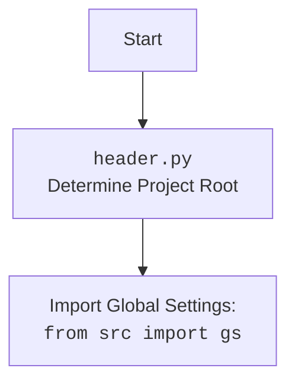

## АНАЛИЗ КОДА: `hypotez/src/suppliers/aliexpress/gui/product.py`

### 1. <алгоритм>

**Блок-схема работы `ProductEditor`:**

1.  **Инициализация (`__init__`)**:
    *   Создается экземпляр `ProductEditor`, наследующий от `QtWidgets.QWidget`.
    *   Сохраняется ссылка на главное приложение (`main_app`).
    *   Вызываются методы `setup_ui()` и `setup_connections()` для настройки интерфейса и связей.

2.  **Настройка UI (`setup_ui`)**:
    *   Устанавливается заголовок окна "Product Editor" и его размер.
    *   Создаются виджеты:
        *   Кнопка "Open JSON File" (`open_button`).
            *   Пример: при нажатии на кнопку открывается диалоговое окно для выбора JSON-файла.
        *   Метка для имени файла (`file_name_label`), изначально "No file selected".
        *    Кнопка "Prepare Product" (`prepare_button`)
    *   Создается вертикальный `QVBoxLayout` и добавляются виджеты.

3.  **Настройка связей (`setup_connections`)**:
    *   В данном коде данный метод пустой, что означает что никакие дополнительные связи не настраиваются.

4.  **Открытие файла (`open_file`)**:
    *   Открывается диалоговое окно для выбора JSON файла (`QtWidgets.QFileDialog.getOpenFileName`).
        *   Пример: Пользователь выбирает файл `product.json`.
    *   Если файл выбран, вызывается `load_file(file_path)`.
    *   Если файл не выбран, функция завершается.

5.  **Загрузка файла (`load_file`)**:
    *   Загружает JSON-данные из выбранного файла используя `j_loads_ns(file_path)`
        *   Пример: Из `product.json` загружаются данные в виде `SimpleNamespace`, например, `data.title` и `data.details`.
    *   Сохраняет путь к файлу в `self.file_path`.
    *   Обновляет текст `self.file_name_label`.
    *   Создает экземпляр `AliCampaignEditor`.
    *   Вызывает `create_widgets(self.data)` для отображения данных в UI.
    *   Если происходит ошибка загрузки, выводится диалоговое окно с сообщением об ошибке.

6.  **Создание виджетов на основе данных (`create_widgets`)**:
    *   Получает текущий `QVBoxLayout`.
    *   Удаляет старые виджеты (кроме `open_button`, `file_name_label`, `prepare_button`).
    *   Создает метки для отображения данных:
        *   `title_label` с заголовком продукта (`data.title`).
        *   `product_details_label` с деталями продукта (`data.details`).
    *   Добавляет созданные метки в `QVBoxLayout`.

7. **Асинхронная подготовка продукта (`prepare_product_async`)**:
    *   Проверяет, инициализирован ли `self.editor`.
    *   Вызывает асинхронный метод `self.editor.prepare_product()`.
    *   В случае успешного завершения отображает сообщение "Product prepared successfully.".
    *   В случае ошибки выводит сообщение с ошибкой.

**Поток данных:**

1.  Пользователь нажимает на кнопку "Open JSON File".
2.  `open_file()` открывает диалоговое окно.
3.  Выбирается файл, его путь передается в `load_file()`.
4.  `load_file()` загружает JSON данные используя `j_loads_ns` , создаёт `AliCampaignEditor` и вызывает `create_widgets()`.
5.  `create_widgets()` создаёт UI элементы отображающие загруженные данные.
6. Пользователь нажимает на кнопку "Prepare Product".
7. `prepare_product_async` вызывает метод `prepare_product`  `AliCampaignEditor`.
8. В зависимости от результата отображается сообщение об успехе или ошибке.

### 2. <mermaid>

```mermaid
flowchart TD
    Start[Start ProductEditor] --> Init[Initialize ProductEditor];
    Init --> SetupUI[Setup User Interface];
    SetupUI --> CreateButtons[Create Open JSON Button & Other UI Elements];
    CreateButtons --> OpenFileButton(Open JSON File Button);
    CreateButtons --> PrepareProductButton(Prepare Product Button);
    OpenFileButton -- Click --> OpenFileDialog[Open File Dialog];
    OpenFileDialog -- File Selected --> LoadFile[Load JSON File];
    OpenFileDialog -- No File Selected --> End[End];
    LoadFile --> ParseJSON[Parse JSON Data using j_loads_ns];
    ParseJSON --> CreateAliCampaignEditor[Create AliCampaignEditor];
    CreateAliCampaignEditor --> CreateWidgets[Create UI Widgets based on loaded data];
    CreateWidgets --> DisplayWidgets[Display Product Data];
    PrepareProductButton -- Click --> PrepareProductAsync[Prepare Product Asynchronously];
     PrepareProductAsync --> CheckEditor[Check AliCampaignEditor is initialized];
    CheckEditor -- Yes --> PrepareProductCall[Call AliCampaignEditor.prepare_product()];
    CheckEditor -- No --> ErrorMessageEditorNotInitialized[Error: AliCampaignEditor is not initialized];
    PrepareProductCall -- Success --> SuccessMessage[Success Message: "Product prepared successfully."];
    PrepareProductCall -- Error --> ErrorMessagePrepareProduct[Error Message: "Failed to prepare product"];
    DisplayWidgets --> End;
    SuccessMessage --> End
    ErrorMessagePrepareProduct --> End
    ErrorMessageEditorNotInitialized --> End;
    LoadFile -- Error --> ErrorMessageLoadFile[Error Message: Failed to load JSON file]
    ErrorMessageLoadFile --> End
    style Start fill:#f9f,stroke:#333,stroke-width:2px
    style End fill:#f9f,stroke:#333,stroke-width:2px

```

**Описание диаграммы:**

*   `Start`: Начало работы `ProductEditor`.
*   `Init`: Инициализация `ProductEditor`, где устанавливаются параметры и сохраняется ссылка на главное приложение.
*   `SetupUI`: Настройка пользовательского интерфейса, включая создание кнопок и меток.
*   `CreateButtons`: Создание кнопок "Open JSON File" (`OpenFileButton`) и "Prepare Product" (`PrepareProductButton`), а также других элементов UI.
*   `OpenFileButton`: Кнопка для открытия диалогового окна выбора JSON файла.
*   `OpenFileDialog`: Открывается диалоговое окно выбора файла.
*   `LoadFile`: Загрузка JSON файла, если файл выбран.
*   `ParseJSON`: Парсинг загруженного JSON файла с использованием `j_loads_ns`.
*   `CreateAliCampaignEditor`: Создание экземпляра `AliCampaignEditor`.
*   `CreateWidgets`: Создание и отображение виджетов, основанных на загруженных данных.
*    `PrepareProductButton`: Кнопка запускающая асинхронную подготовку продукта
*   `PrepareProductAsync`: Вызов асинхронного метода `prepare_product`.
*    `CheckEditor`: Проверка инициализации `AliCampaignEditor`
*  `PrepareProductCall`: Вызов метода `prepare_product` класса `AliCampaignEditor`
*   `ErrorMessageEditorNotInitialized`: Сообщение об ошибке, если `AliCampaignEditor` не был инициализирован.
*   `SuccessMessage`: Отображение сообщения об успешной подготовке продукта.
*   `ErrorMessagePrepareProduct`: Отображение сообщения об ошибке в процессе подготовки продукта.
*   `DisplayWidgets`: Отображение данных продукта в UI.
*   `ErrorMessageLoadFile`: Сообщение об ошибке, если не удалось загрузить json файл.
*   `End`: Завершение процесса.

**Импорт `header.py`:**

**Описание диаграммы:**
* `Start`: Начало выполнения
* `Header`: Файл `header.py` определяет корень проекта.
* `import`: Импорт глобальных настроек из `src`

### 3. <объяснение>

**Импорты:**

*   `import header`: Импортирует модуль `header` из проекта. Предположительно, он используется для определения корневой директории проекта и настройки путей.
*   `import sys`:  Импортирует модуль `sys`, который предоставляет доступ к некоторым переменным и функциям, которые взаимодействуют с интерпретатором Python. В данном случае он не используется напрямую.
*   `from pathlib import Path`: Импортирует класс `Path` из модуля `pathlib`, который предоставляет удобный способ работы с путями к файлам и директориям.
*   `from types import SimpleNamespace`:  Импортирует класс `SimpleNamespace` из модуля `types`. Используется для создания объектов, которые ведут себя как обычные объекты, но могут создаваться с использованием именованных аргументов.
*   `from PyQt6 import QtWidgets, QtGui, QtCore`: Импортирует модули `QtWidgets`, `QtGui` и `QtCore` из библиотеки PyQt6. Это основная библиотека для создания графического интерфейса.
*   `from src.utils.jjson import j_loads_ns, j_dumps`: Импортирует функции `j_loads_ns` (для загрузки JSON в `SimpleNamespace`) и `j_dumps` (для сохранения JSON) из модуля `src.utils.jjson`.
*   `from src.suppliers.aliexpress.campaign import AliCampaignEditor`: Импортирует класс `AliCampaignEditor` из модуля `src.suppliers.aliexpress.campaign`. Предполагается, что этот класс используется для управления и редактирования кампаний AliExpress.

**Классы:**

*   `ProductEditor(QtWidgets.QWidget)`:
    *   **Роль**: Основной класс для создания и управления окном редактирования продукта. Наследует `QtWidgets.QWidget`, что делает его виджетом PyQt.
    *   **Атрибуты**:
        *   `data: SimpleNamespace`: Данные продукта, загруженные из JSON-файла.
        *   `language: str = 'EN'`: Язык (по умолчанию 'EN').
        *   `currency: str = 'USD'`: Валюта (по умолчанию 'USD').
        *   `file_path: str = None`: Путь к загруженному JSON-файлу.
        *   `editor: AliCampaignEditor`: Экземпляр редактора кампаний `AliCampaignEditor`.
        *   `main_app`: Ссылка на главное приложение.
    *   **Методы**:
        *   `__init__(self, parent=None, main_app=None)`: Конструктор класса, инициализирует виджет, настраивает UI и связи.
        *   `setup_ui(self)`: Настраивает пользовательский интерфейс, создаёт виджеты.
        *   `setup_connections(self)`: Устанавливает связи между сигналами и слотами.
        *   `open_file(self)`: Открывает диалоговое окно для выбора JSON-файла.
        *   `load_file(self, file_path)`: Загружает JSON-данные из файла, создаёт экземпляр `AliCampaignEditor` и отображает данные.
        *   `create_widgets(self, data)`: Создаёт виджеты на основе данных продукта.
        *   `prepare_product_async(self)`: Асинхронно вызывает метод подготовки продукта у `AliCampaignEditor`.

**Функции:**

*   `__init__(self, parent=None, main_app=None)`:
    *   **Аргументы**:
        *   `parent`: Родительский виджет (по умолчанию `None`).
        *   `main_app`: Экземпляр главного приложения.
    *   **Назначение**: Инициализирует объект `ProductEditor`, сохраняет ссылку на `main_app`, вызывает `setup_ui` и `setup_connections`.
    *   **Пример**: `editor = ProductEditor(parent=self, main_app=self.main_app)`

*   `setup_ui(self)`:
    *   **Аргументы**: `self`.
    *   **Назначение**: Настраивает пользовательский интерфейс, создавая виджеты и размещая их в окне.
    *   **Пример**: Вызывается при инициализации виджета.
*   `setup_connections(self)`:
     *   **Аргументы**: `self`.
     *   **Назначение**: Настраивает связи сигнал-слот. В данном коде пустой.
     *  **Пример**:  В данном коде ничего не делает, но должен  быть местом где настраиваются связи.

*   `open_file(self)`:
    *   **Аргументы**: `self`.
    *   **Назначение**: Открывает диалог выбора файла, получает путь к выбранному файлу и вызывает `load_file`.
    *   **Пример**: Вызывается при нажатии на кнопку "Open JSON File".
*   `load_file(self, file_path)`:
    *   **Аргументы**:
        *   `file_path`: Путь к JSON-файлу.
    *   **Назначение**: Загружает JSON-данные из файла, сохраняет путь, создаёт `AliCampaignEditor`, обновляет UI, вызывает `create_widgets`, обрабатывает ошибки загрузки.
    *   **Пример**: `load_file('/path/to/product.json')`
*   `create_widgets(self, data)`:
    *   **Аргументы**:
        *   `data`: Данные продукта в виде `SimpleNamespace`.
    *   **Назначение**: Создаёт виджеты для отображения данных продукта на экране. Удаляет старые виджеты.
    *   **Пример**: `create_widgets(data)`
*   `prepare_product_async(self)`:
      *   **Аргументы**: `self`.
      *   **Назначение**: Асинхронно вызывает метод `prepare_product` у `AliCampaignEditor` и отображает результат.
      *   **Пример**: Вызывается при нажатии на кнопку "Prepare Product".

**Переменные:**

*   `data`: Содержит данные продукта в виде `SimpleNamespace`.
*   `language`: Строка, представляющая язык (по умолчанию 'EN').
*   `currency`: Строка, представляющая валюту (по умолчанию 'USD').
*   `file_path`: Строка, содержащая путь к выбранному файлу.
*   `editor`: Экземпляр класса `AliCampaignEditor`.
*   `open_button`:  Кнопка `QPushButton` для открытия файла.
*   `file_name_label`: Метка `QLabel` отображающая имя файла.
*   `prepare_button`: Кнопка `QPushButton` для подготовки продукта.
* `main_app`: Ссылка на главное приложение

**Потенциальные ошибки и улучшения:**

1.  **Отсутствие обработки ошибок в `prepare_product_async`:**
    *   Нужно добавить более детальную обработку ошибок при вызове `self.editor.prepare_product()`. Можно выводить более конкретные сообщения об ошибках, полученные от `AliCampaignEditor`.
2.  **Отсутствие проверок на наличие `self.editor` в `prepare_product_async`:**
    *   Перед вызовом `self.editor.prepare_product()` нужно проверять, что `self.editor` был создан, иначе возникнет ошибка.
3.  **Обработка путей файлов:**
    *   Желательно обрабатывать пути к файлам более гибко, использовать `pathlib` для конструирования путей.
4.  **Отсутствие  сигнал-слот связей:**
     * В методе `setup_connections` не настроено никаких связей.
5.  **Отсутствие валидации данных:**
    *  Перед передачей данных в `AliCampaignEditor`  необходимо валидировать их.
6.  **Отсутствие механизма для сохранения изменений:**
      * После редактирования данных продукта,  необходимо добавить механизм для их сохранения.

**Цепочка взаимосвязей с другими частями проекта:**

*   `header.py`: Используется для определения корневой директории проекта и настройки путей.
*   `src.utils.jjson`: Предоставляет функции `j_loads_ns` и `j_dumps` для работы с JSON.
*   `src.suppliers.aliexpress.campaign.AliCampaignEditor`: Используется для подготовки продукта и работы с кампаниями AliExpress.
*   `PyQt6`: Используется для создания графического интерфейса.