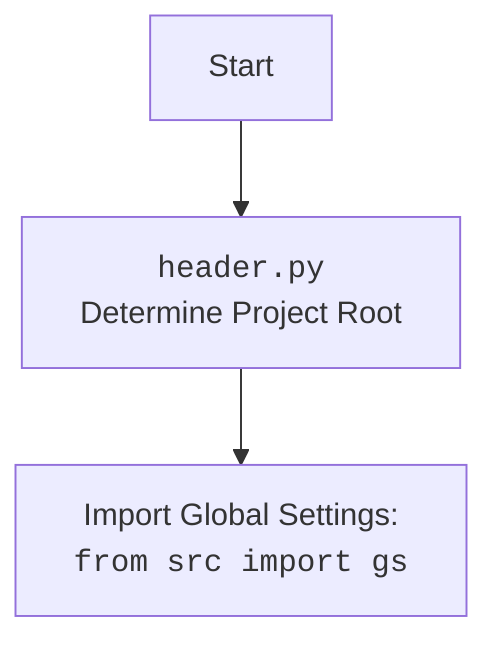

## ИНСТРУКЦИЯ:

Анализируй предоставленный код подробно и объясни его функциональность. Ответ должен включать три раздела:  

1.  **<алгоритм>**: Опиши рабочий процесс в виде пошаговой блок-схемы, включая примеры для каждого логического блока, и проиллюстрируй поток данных между функциями, классами или методами.  
2.  **<mermaid>**: Напиши код для диаграммы в формате `mermaid`, проанализируй и объясни все зависимости, 
    которые импортируются при создании диаграммы. 
    **ВАЖНО!** Убедитесь, что все имена переменных, используемые в диаграмме `mermaid`, 
    имеют осмысленные и описательные имена. Имена переменных вроде `A`, `B`, `C`, и т.д., не допускаются!  
    
    **Дополнительно**: Если в коде есть импорт `import header`, добавьте блок `mermaid` flowchart, объясняющий `header.py`:\
    ```mermaid
    flowchart TD
        Start --> Header[<code>header.py</code><br> Determine Project Root]
    
        Header --> import[Import Global Settings: <br><code>from src import gs</code>] 
    ```

3.  **<объяснение>**: Предоставьте подробные объяснения:  
    - **Импорты**: Их назначение и взаимосвязь с другими пакетами `src.`.  
    - **Классы**: Их роль, атрибуты, методы и взаимодействие с другими компонентами проекта.  
    - **Функции**: Их аргументы, возвращаемые значения, назначение и примеры.  
    - **Переменные**: Их типы и использование.  
    - Выделите потенциальные ошибки или области для улучшения.  

Дополнительно, постройте цепочку взаимосвязей с другими частями проекта (если применимо).  

Это обеспечивает всесторонний и структурированный анализ кода.
## Формат ответа: `.md` (markdown)
**КОНЕЦ ИНСТРУКЦИИ**

## 1. <алгоритм>

**Функция `set_project_root`:**

1.  **Начало:** Функция `set_project_root` принимает необязательный параметр `marker_files` (кортеж имен файлов или каталогов, которые указывают на корень проекта). По умолчанию это `('__root__', '.git')`.

2.  **Инициализация:**
    *   Определяется путь к директории, в которой находится текущий файл (`__file__`). Это становится начальным значением для `current_path`.
    *   Путь `current_path` присваивается переменной `__root__` как начальное предположение корня проекта.

3.  **Поиск корня проекта:**
    *   Функция перебирает текущий путь и все его родительские каталоги, начиная от текущего каталога.
        *   Для каждого родительского каталога проверяется, существует ли в нем какой-либо из файлов или каталогов, указанных в `marker_files`. Это проверка наличия маркеров корня проекта.
        *   **Пример:** Если `marker_files` это `('__root__', '.git')`,  то для каждого родительского каталога проверяется наличие либо файла `__root__` либо каталога `.git`.
    *   Если один из маркеров найден, то текущий родительский каталог становится новым значением для `__root__`, цикл поиска прерывается.

4.  **Добавление корня проекта в `sys.path`:**
    *   Проверяется, находится ли найденный путь `__root__` в списке путей поиска модулей Python `sys.path`. Если нет, он добавляется в начало списка. Это позволяет импортировать модули из корня проекта.

5.  **Возврат:** Функция возвращает найденный путь к корню проекта (`__root__`) в виде объекта `Path`. Если маркеры не найдены, возвращает директорию, где расположен скрипт.

**Основной поток программы:**

1.  **Вызов `set_project_root`:** Функция `set_project_root()` вызывается без аргументов, чтобы определить корень проекта. Результат сохраняется в глобальной переменной `__root__`.

2.  **Импорт `gs`:** Импортируется модуль `gs` из пакета `src`.

3.  **Загрузка настроек:**
    *   Переменная `settings` инициализируется значением `None`.
    *   Попытка открыть и загрузить JSON-файл настроек, расположенный по пути `gs.path.root / 'src' / 'settings.json'`. `gs.path.root` - это путь к корню проекта, полученный ранее.
        *   Если файл успешно открыт, он читается и его содержимое JSON загружается в переменную `settings` как словарь.
    *   Если происходит `FileNotFoundError` (файл не найден) или `json.JSONDecodeError` (ошибка декодирования JSON), то обработка исключения происходит через `...` (ничего не выполняется).

## 2. <mermaid>

```mermaid
flowchart TD
    Start[Начало скрипта <code>header.py</code>] --> SetProjectRootCall[Вызов функции <code>set_project_root()</code>]

    SetProjectRootCall --> SetCurrentPath[Определение пути текущего файла: <br><code>current_path = Path(__file__).resolve().parent</code>]
    SetCurrentPath --> SetRootToCurrent[Установка <code>__root__ = current_path</code>]
    SetRootToCurrent --> StartSearch[Начало цикла поиска корня проекта по родительским каталогам]

    StartSearch -- Перебор родительских каталогов --> CheckMarker[Проверка наличия маркеров в текущем родительском каталоге: <br><code>(parent / marker).exists()</code>]
    CheckMarker -- Маркер найден --> SetRootToParent[Установка <code>__root__ = parent</code>]
    SetRootToParent --> StopSearch[Завершение цикла поиска]
    CheckMarker -- Маркер не найден --> StartSearch
    StopSearch --> CheckSysPath[Проверка <code>__root__</code> в <code>sys.path</code>]
    CheckSysPath -- <code>__root__</code> не в <code>sys.path</code> --> AddRootToSysPath[Добавление <code>__root__</code> в <code>sys.path</code>]
    CheckSysPath -- <code>__root__</code> в <code>sys.path</code> --> ReturnRoot[Возврат значения <code>__root__</code> из функции]
    AddRootToSysPath --> ReturnRoot
    ReturnRoot --> StoreRoot[Сохранение результата в глобальной переменной: <code>__root__</code>]

    StoreRoot --> ImportGS[Импорт глобальных настроек: <br><code>from src import gs</code>]
    ImportGS --> InitializeSettings[Инициализация переменной <code>settings = None</code>]
    InitializeSettings --> TryLoadSettings[Попытка загрузить файл настроек: <br><code>settings.json</code>]
    TryLoadSettings -- Успешно загружено --> StoreSettings[Сохранение настроек в <code>settings</code>]
    TryLoadSettings -- Ошибка загрузки --> End[Завершение скрипта]

    StoreSettings --> End
```



**Объяснение зависимостей:**

*   `sys`: Модуль `sys` используется для доступа к переменным и функциям, которые взаимодействуют с интерпретатором Python. В частности, `sys.path` используется для добавления пути к корню проекта, чтобы Python мог находить модули.
*   `json`: Модуль `json` используется для работы с JSON-данными. В данном случае, он используется для загрузки настроек из файла `settings.json`.
*   `packaging.version`: Импортируется `Version` (хотя в коде не используется) из `packaging.version`. Это может быть предназначено для будущей работы с версиями.
*   `pathlib.Path`: Класс `Path` используется для удобной работы с путями к файлам и каталогам.
*   `src.gs`: `gs` - это предполагаемый модуль из пакета `src`, который, скорее всего, содержит общие настройки и константы для проекта, включая путь к корню проекта.

## 3. <объяснение>

**Импорты:**

*   `import sys`: Модуль `sys` предоставляет доступ к некоторым переменным и функциям, которые тесно связаны с интерпретатором Python. В данном случае, он используется для работы с `sys.path`, чтобы добавить путь к корню проекта в список путей поиска модулей. Это позволяет импортировать модули из корня проекта без необходимости указывать полные пути.
*   `import json`: Модуль `json` используется для работы с данными в формате JSON. В этом коде он используется для загрузки настроек из файла `settings.json`.
*   `from packaging.version import Version`: Импортируется класс `Version` из модуля `packaging.version`. Хотя он не используется в этом коде, он предназначен для сравнения версий.
*   `from pathlib import Path`: Класс `Path` из модуля `pathlib` обеспечивает объектно-ориентированный способ работы с путями к файлам и каталогам. Это упрощает и делает более читабельными операции с путями.
*   `from src import gs`: Импортируется модуль `gs` из пакета `src`. Этот модуль, вероятно, содержит глобальные настройки и константы проекта, включая путь к корню проекта и другие параметры, необходимые для работы.

**Классы:**

*   В данном коде нет определения собственных классов.

**Функции:**

*   `set_project_root(marker_files: tuple = ('__root__', '.git')) -> Path`:
    *   **Аргументы:**
        *   `marker_files`: Необязательный параметр типа `tuple` (кортеж), содержащий имена файлов или каталогов, которые служат маркерами для определения корня проекта. По умолчанию это `('__root__', '.git')`.
    *   **Возвращаемое значение:** Возвращает объект `Path`, представляющий путь к корню проекта. Если маркеры не найдены, возвращает путь к директории, в которой расположен скрипт.
    *   **Назначение:** Функция определяет корень проекта, начиная поиск с директории текущего файла и поднимаясь вверх по родительским каталогам. Поиск завершается при нахождении каталога, содержащего хотя бы один из маркеров из `marker_files`.
    *   **Примеры:**
        *   Если запустить скрипт, находящийся в `/home/user/my_project/src/suppliers/aliexpress/header.py`, и файл `.git` находится в `/home/user/my_project/`, то функция вернет `Path('/home/user/my_project')`.
        *   Если запустить скрипт, находящийся в `/home/user/my_project/src/suppliers/aliexpress/header.py` и в родительских каталогах нет файлов или директорий `__root__` или `.git`, то функция вернет `Path('/home/user/my_project/src/suppliers/aliexpress/')`.

**Переменные:**

*   `__root__: Path`: Глобальная переменная, хранящая путь к корню проекта. Ее значение определяется вызовом функции `set_project_root()`.
*   `current_path: Path`: Локальная переменная внутри функции `set_project_root`, хранит абсолютный путь к директории, где находится текущий файл.
*  `settings: dict = None`: Глобальная переменная, которая хранит словарь с настройками, загруженными из файла `settings.json`. Изначально устанавливается в `None`, и потом может быть заполнена данными из файла настроек, если они успешно загрузятся.

**Потенциальные ошибки и области для улучшения:**

*   **Обработка исключений:** В блоке `try-except` загрузки настроек используется `...` в качестве обработки исключений. Это означает, что любые исключения `FileNotFoundError` или `json.JSONDecodeError` будут просто проигнорированы, что может затруднить отладку, если файл `settings.json` отсутствует или некорректен. Лучше было бы явно обрабатывать исключения, выводя сообщение об ошибке или используя значения по умолчанию.
*   **Неиспользуемый импорт:** Импортируется `Version` из `packaging.version`, но не используется. Его можно удалить, если не предполагается работа с версиями.
*   **Предположение о структуре проекта:** Код предполагает, что файл `settings.json` находится в `src/settings.json` относительно корня проекта. Если структура изменится, это приведет к сбою загрузки. Возможно, стоит сделать путь к файлу настроек настраиваемым или использовать константу из `gs`.
*   **Зависимость от наличия маркеров:** Поиск корня проекта зависит от наличия определенных файлов или каталогов. Если эти маркеры отсутствуют, корень проекта будет определен неверно. Можно добавить логику для определения корня проекта по другим критериям или использовать переменную окружения для указания корня.
*   **Отсутствие проверок:**  Не проверяется существование директории при добавлении ее в `sys.path`.

**Взаимосвязи с другими частями проекта:**

*   Этот модуль используется для определения корня проекта и загрузки глобальных настроек, поэтому он является основой для других модулей проекта.
*   Модуль `gs` из пакета `src` используется для доступа к глобальным константам и путям, которые, вероятно, используются во всем проекте.
*   Другие модули проекта, скорее всего, будут использовать глобальную переменную `__root__` для доступа к файлам и каталогам внутри проекта, а также переменную `settings` для доступа к настройкам.