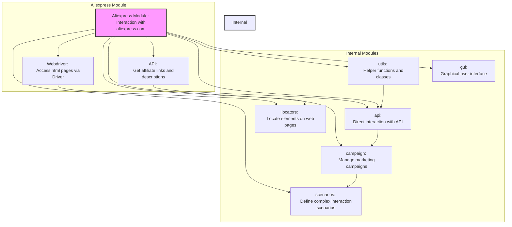

## АНАЛИЗ README.MD: `hypotez/src/suppliers/aliexpress/readme.md`

### <алгоритм>

1. **Описание модуля:**
   - Модуль предназначен для взаимодействия с поставщиком `aliexpress.com`.
   - Обеспечивает доступ к данным поставщика через протоколы `HTTPS` (webdriver) и `API`.
2. **Webdriver:**
   - Использует `Driver` для прямого доступа к `html`-страницам продуктов.
   - Позволяет выполнять скрипты сбора данных, включая навигацию по категориям.
3. **API:**
   - Используется для получения `affiliate links` и кратких описаний продуктов.
4. **Внутренние модули:**
   - **`utils`**:
     - Содержит вспомогательные функции и классы для общих операций.
     - Примеры: форматирование данных, обработка ошибок, логирование.
   - **`api`**:
     - Предоставляет методы и классы для взаимодействия с API AliExpress.
     - Примеры: отправка запросов, обработка ответов, управление аутентификацией.
   - **`campaign`**:
     - Управляет маркетинговыми кампаниями на AliExpress.
     - Примеры: создание, обновление и отслеживание кампаний.
   - **`gui`**:
     - Предоставляет графические интерфейсы для взаимодействия с функциональностью AliExpress.
     - Примеры: формы, диалоги и другие визуальные компоненты.
   - **`locators`**:
     - Содержит определения для поиска элементов на веб-страницах AliExpress.
     - Используется с инструментами WebDriver для автоматических взаимодействий.
   - **`scenarios`**:
     - Определяет сложные сценарии или последовательности действий для взаимодействия с AliExpress.
     - Примеры: синхронизация продуктов, управление заказами, выполнение кампаний.

### <mermaid>

**Объяснение диаграммы `mermaid`:**

-   Диаграмма показывает высокоуровневую структуру модуля `Aliexpress` и его подмодулей.
-   `Aliexpress Module`  представляет собой корневой модуль, который объединяет функциональности для работы с  `aliexpress.com`.
-  `Webdriver` и `API` - это два основных подхода для взаимодействия с `aliexpress.com`.
-   `Internal Modules`  группирует внутренние модули, каждый из которых отвечает за определенную функциональность.
-   Стрелки показывают, какие модули зависят от других.
    Например, `Webdriver` использует `locators`, а `api` взаимодействует с `campaign` и `scenarios`.

### <объяснение>

**Общее:**

-   Модуль `aliexpress` предназначен для автоматизации работы с платформой `aliexpress.com`, предлагая методы для сбора данных, управления кампаниями и интеграции через API и веб-интерфейс.

**Внутренние модули:**

1.  **`utils`**:
    -   **Назначение**: Предоставляет общие вспомогательные функции и классы, используемые в других модулях.
    -   **Примеры**:
        -   Функции для форматирования строк и чисел.
        -   Классы для ведения логов и обработки исключений.
        -   Утилиты для работы с конфигурационными файлами.
    -   **Взаимосвязь**: Используется почти всеми модулями для выполнения стандартных задач.
2.  **`api`**:
    -   **Назначение**: Реализует взаимодействие с API AliExpress.
    -   **Примеры**:
        -   Функции для отправки запросов к API.
        -   Классы для обработки ответов API (парсинг JSON/XML).
        -   Методы для аутентификации и авторизации.
    -   **Взаимосвязь**: Используется модулем `campaign` и другими для получения и отправки данных.
3.  **`campaign`**:
    -   **Назначение**: Управляет маркетинговыми кампаниями на AliExpress.
    -   **Примеры**:
        -   Методы для создания, обновления и удаления кампаний.
        -   Функции для отслеживания статистики и производительности кампаний.
        -   Инструменты для оптимизации рекламных объявлений.
    -   **Взаимосвязь**: Зависит от `api` для взаимодействия с API AliExpress.
4.  **`gui`**:
    -   **Назначение**: Предоставляет графический пользовательский интерфейс для работы с AliExpress.
    -   **Примеры**:
        -   Формы для ввода данных.
        -   Диалоговые окна для отображения информации.
        -   Интерфейсы для управления функциями модуля.
    -   **Взаимосвязь**: Зависит от других модулей для получения и обработки данных.
5.  **`locators`**:
    -   **Назначение**: Содержит определения (локаторы) для поиска элементов на веб-страницах AliExpress.
    -   **Примеры**:
        -   Локаторы для кнопок, полей ввода, ссылок.
        -   Локаторы для конкретных элементов на страницах продуктов.
        -   Обеспечивает стабильность при изменениях верстки сайта.
    -   **Взаимосвязь**: Используется webdriver для навигации и сбора данных.
6.  **`scenarios`**:
    -   **Назначение**: Определяет сложные сценарии и последовательности действий для автоматизации задач.
    -   **Примеры**:
        -   Синхронизация продуктов между разными платформами.
        -   Управление заказами (обновление статусов, отмена).
        -   Запуск и отслеживание рекламных кампаний.
    -   **Взаимосвязь**: Координирует выполнение задач, используя функции других модулей (api, gui, webdriver).

**Потенциальные ошибки и области для улучшения:**

-   **Обработка изменений API/веб-страниц**:
    -   Необходимо регулярно обновлять `locators` и API запросы для адаптации к изменениям сайта aliexpress.com.
-   **Обработка ошибок**:
    -   Должна быть предусмотрена надежная обработка ошибок для ситуаций, когда API недоступен или веб-страницы не загружаются.
-   **Оптимизация скорости**:
    -   Использование webdriver может быть медленным; оптимизация скорости сбора данных критична.
-   **Масштабируемость**:
    -   Необходимо убедиться, что модуль масштабируется на большие объемы данных и множество запросов.

**Взаимосвязь с другими частями проекта:**

-   Модуль `aliexpress` является поставщиком данных, вероятно, используется совместно с другими модулями, такими как модули для обработки данных, каталогизации, и интеграции с другими системами.
-   Он может взаимодействовать с модулями для управления заказами и запасами, если проект имеет функциональность электронной коммерции.
-   Возможно взаимодействие с модулями аналитики для отслеживания результатов маркетинговых кампаний.