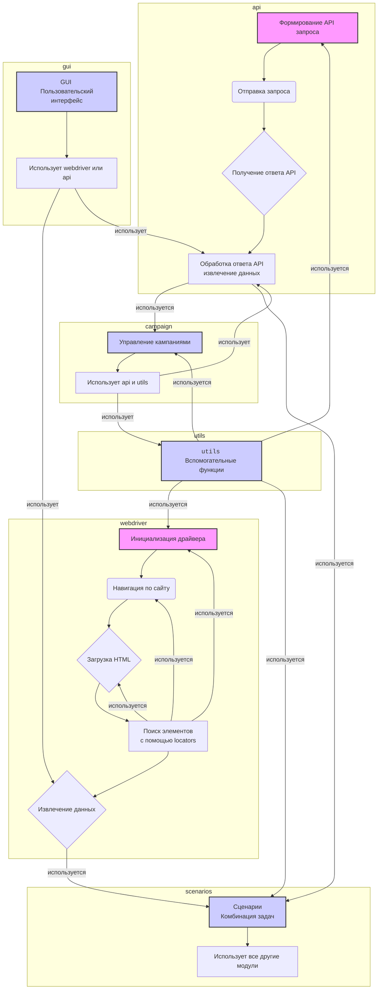

## Анализ модуля Aliexpress

### 1. <алгоритм>

Модуль `aliexpress` предназначен для взаимодействия с поставщиком aliexpress.com. Он предоставляет два основных способа доступа к данным: через веб-драйвер (webdriver) и через API.

**webdriver:**
   1.  **Инициализация драйвера:** Создается экземпляр веб-драйвера (например, `selenium.webdriver`), который управляет браузером.
   2.  **Навигация по сайту:** Драйвер переходит по URL-адресам страниц товаров или категорий.
   3.  **Извлечение HTML:** Драйвер загружает HTML-содержимое страницы.
   4.  **Парсинг HTML:** Используются селекторы (`locators`) для поиска нужных элементов данных (например, название товара, цена).
   5.  **Сбор данных:** Извлеченные данные структурируются и сохраняются (например, в список или базу данных).

  **Пример:**

    ```
    driver = webdriver.Chrome() # Инициализация драйвера
    driver.get("https://aliexpress.com/item/123456789.html") # Переход на страницу товара
    title = driver.find_element(By.CSS_SELECTOR, ".product-title").text # Извлечение названия товара
    price = driver.find_element(By.CSS_SELECTOR, ".product-price").text # Извлечение цены товара
    print(f"Товар: {title}, Цена: {price}") # Вывод данных
    driver.quit() # Закрытие браузера
    ```

**api:**
   1.  **Создание запроса:** Формируется HTTP-запрос к API AliExpress.
   2.  **Отправка запроса:** Запрос отправляется на сервер AliExpress.
   3.  **Получение ответа:** Сервер возвращает ответ в формате JSON или XML.
   4.  **Обработка ответа:** Ответ анализируется, и извлекаются нужные данные (например, `affiliate links`, краткие описания товаров).
  
  **Пример:**

    ```
    import requests
    api_url = "https://api.aliexpress.com/v1/product/get" # URL API
    params = {"product_id": 123456789, "api_key": "your_api_key"}  # Параметры запроса
    response = requests.get(api_url, params=params) # Отправка запроса
    if response.status_code == 200: # Проверка статуса
        data = response.json() # Преобразование JSON
        affiliate_link = data['affiliate_link'] # Извлечение affiliate link
        description = data['description']  # Извлечение описания
        print(f"Affiliate link: {affiliate_link}, Описание: {description}")
    ```
**Взаимодействие внутренних модулей:**

-   `utils`: Вспомогательные функции используются во всех других модулях для обработки данных, логирования ошибок и т.д.
-   `api`: Используется для запросов к API AliExpress, результаты могут использоваться в `scenarios` и `gui`.
-   `campaign`: Вероятно, использует `api` для создания и отслеживания кампаний, и `utils` для обработки данных.
-   `gui`: Отображает пользовательский интерфейс, который может взаимодействовать с `webdriver`, `api` и другими модулями.
-   `locators`: Используется модулем `webdriver` для поиска элементов на веб-страницах.
-   `scenarios`: Использует все остальные модули для реализации комплексных сценариев.

### 2. <mermaid>

**Зависимости:**

*   **webdriver:**
    *   Инициализирует и управляет веб-драйвером для взаимодействия с веб-страницами.
    *   Использует `locators` для поиска элементов на странице.
*   **api:**
    *   Формирует и отправляет HTTP-запросы к API AliExpress.
    *   Обрабатывает ответы API (JSON, XML).
*   **utils:**
    *   Предоставляет вспомогательные функции для других модулей (логирование, обработка ошибок, форматирование данных). Используется во всех других модулях.
*   **campaign:**
    *   Управляет маркетинговыми кампаниями на AliExpress, взаимодействуя с `api` и используя `utils`.
*   **gui:**
    *   Обеспечивает пользовательский интерфейс для управления функциями AliExpress, взаимодействует с `webdriver` или `api`.
*   **locators:**
    *   Определяет локаторы для поиска элементов на веб-страницах.
*   **scenarios:**
    *   Реализует комплексные сценарии, комбинируя задачи из других модулей.

### 3. <объяснение>

**Импорты:**

Модуль не содержит явных импортов в предоставленном описании, но подразумевается, что каждый из подмодулей (`utils`, `api`, `campaign`, `gui`, `locators`, `scenarios`) будет импортировать необходимые библиотеки и модули из пакета `src`. Например:

*   `src.utils`: Содержит функции, общие для всего проекта, такие как логирование, обработка ошибок и т.д.
*   `src.api`: Может импортировать `requests` для выполнения HTTP-запросов.
*   `src.gui`: Может импортировать `tkinter`, `PyQt` или другую библиотеку для построения графического интерфейса.
*   `src.locators`: Может импортировать `selenium.webdriver.common.by` для работы с селекторами.

**Классы:**

Модуль `aliexpress` как таковой не содержит классов, но подразумевает их наличие в подмодулях:
*  `utils`:
     *  Может содержать классы для работы с логами (`Logger`), обработки ошибок (`ErrorHandler`), форматирования данных.
*  `api`:
     * Может содержать классы для API-клиента (`AliExpressAPI`), обрабатывающего запросы и ответы.
*   `campaign`:
     *  Может содержать классы для управления кампаниями (`CampaignManager`), создания отчетов (`ReportGenerator`).
*   `gui`:
     *  Может содержать классы для окон, форм, диалогов и других элементов интерфейса.
*   `locators`:
     *   Не будет содержать классов, а лишь константы, определяющие селекторы для веб-страниц.
*   `scenarios`:
     *  Может содержать классы для реализации сложных сценариев (`ProductSyncScenario`, `OrderManagerScenario`).

**Функции:**

Модуль сам по себе не содержит функций, но их можно найти в подмодулях:

*  `utils`:
    *   Функции для логирования (`log_message(message, level)`), обработки ошибок (`handle_error(exception)`) и т.д.
*  `api`:
    *  Функции для отправки запросов API (`send_api_request(url, params)`), авторизации (`authenticate_user()`), обработки ответов (`parse_response(response)`).
*  `campaign`:
    *  Функции для создания кампаний (`create_campaign(campaign_data)`), отслеживания (`track_campaign(campaign_id)`), анализа (`analyze_campaign(campaign_id)`)
*   `gui`:
     * Функции для обработки событий, отрисовки форм, и др.
*   `locators`:
     *   не будет функций, только константы с селекторами
*  `scenarios`:
    *  Функции для выполнения конкретных сценариев (`synchronize_products()`, `process_orders()`).

**Переменные:**

В описании модуля явно переменные не указаны, но внутри кода модулей будут содержаться:

*   URL-адреса API, ключи API, идентификаторы кампаний.
*   Локаторы элементов на веб-страницах (`CSS-селекторы`, `XPath` выражения) в модуле `locators`.
*   Настройки конфигурации.
*   Данные для запросов и ответов.

**Потенциальные ошибки и области для улучшения:**

*   **Обработка ошибок:** Необходима тщательная обработка ошибок при взаимодействии с API и веб-страницами (например, сетевые ошибки, ошибки парсинга).
*   **Безопасность:** Безопасное хранение и обработка ключей API, токенов авторизации.
*   **Масштабируемость:** Модуль должен быть спроектирован с учетом возможного увеличения объема данных и интенсивности запросов.
*   **Расширяемость:**  Упростить добавление новых функций и поставщиков в будущем.
*   **Производительность:** Оптимизация запросов к API и веб-драйверу для минимизации времени выполнения.
*  **Логирование:** Необходимо внедрить детальное логирование для облегчения отладки и мониторинга.

**Взаимосвязь с другими частями проекта:**

Модуль `aliexpress` взаимодействует с другими частями проекта через импорты и API. Например:

*   Может использоваться модулем управления товарами для синхронизации данных.
*   Может использоваться модулем управления заказами для отслеживания статусов заказов.
*   Может использоваться модулем управления кампаниями для запуска рекламных кампаний.

В целом, этот модуль является важной частью системы, позволяющей автоматизировать взаимодействие с AliExpress. Правильная архитектура и хорошая реализация этого модуля являются ключевыми для надежности и масштабируемости системы.