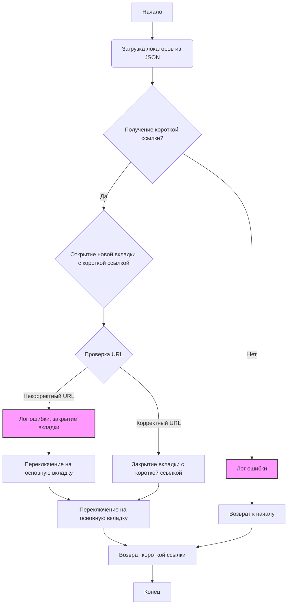

## ИНСТРУКЦИЯ:

Анализируй предоставленный код подробно и объясни его функциональность. Ответ должен включать три раздела:

1.  **<алгоритм>**: Опиши рабочий процесс в виде пошаговой блок-схемы, включая примеры для каждого логического блока, и проиллюстрируй поток данных между функциями, классами или методами.
2.  **<mermaid>**: Напиши код для диаграммы в формате `mermaid`, проанализируй и объясни все зависимости,
    которые импортируются при создании диаграммы.
    **ВАЖНО!** Убедитесь, что все имена переменных, используемые в диаграмме `mermaid`,
    имеют осмысленные и описательные имена. Имена переменных вроде `A`, `B`, `C`, и т.д., не допускаются!

    **Дополнительно**: Если в коде есть импорт `import header`, добавьте блок `mermaid` flowchart, объясняющий `header.py`:
    ```mermaid
    flowchart TD
        Start --> Header[<code>header.py</code><br> Determine Project Root]

        Header --> import[Import Global Settings: <br><code>from src import gs</code>]
    ```

3.  **<объяснение>**: Предоставьте подробные объяснения:
    -   **Импорты**: Их назначение и взаимосвязь с другими пакетами `src.`.
    -   **Классы**: Их роль, атрибуты, методы и взаимодействие с другими компонентами проекта.
    -   **Функции**: Их аргументы, возвращаемые значения, назначение и примеры.
    -   **Переменные**: Их типы и использование.
    -   Выделите потенциальные ошибки или области для улучшения.

Дополнительно, постройте цепочку взаимосвязей с другими частями проекта (если применимо).

Это обеспечивает всесторонний и структурированный анализ кода.
## Формат ответа: `.md` (markdown)
**КОНЕЦ ИНСТРУКЦИИ**

## <алгоритм>

**Блок-схема:**



**Примеры:**

1.  **Загрузка локаторов из JSON**: Функция `j_loads_ns` загружает данные из `affiliate_links_shortener.json`, содержащего локаторы для веб-элементов. Например, `locator.textarea_target_url` будет содержать CSS-селектор поля ввода URL, а `locator.button_get_tracking_link` - селектор кнопки получения короткой ссылки.

2.  **Получение короткой ссылки**:
    -   `d.execute_locator(locator.textarea_target_url, url)`: Ввод URL в поле ввода, например, `url = "https://example.com/product123"`.
    -   `d.execute_locator(locator.button_get_tracking_link)`: Нажатие кнопки "Получить короткую ссылку".
    -   `d.wait(1)`: Ожидание 1 секунду для загрузки короткой ссылки.
    -   `short_url = d.execute_locator(locator.textarea_short_link)[0]`: Извлечение короткой ссылки, например, `short_url = "https://s.click.aliexpress.com/e/_d3f4g5h"`.

3.  **Открытие новой вкладки с короткой ссылкой**: `d.execute_script(f"window.open('{short_url}');")` открывает новую вкладку с полученной короткой ссылкой.

4.  **Проверка URL**: Проверяется, что `d.current_url` (URL во вкладке) не начинается с `https://error.taobao.com`. Если это так, значит что-то пошло не так и ссылка некорректная.

5.  **Закрытие вкладки с короткой ссылкой**: После проверки, вкладка с короткой ссылкой закрывается, и фокус переключается обратно на основную вкладку.

## <mermaid>

```mermaid
flowchart TD
    Start[Начало] --> LoadLocators[Загрузка локаторов: `j_loads_ns`];
    LoadLocators --> InputURL[Ввод URL: `d.execute_locator`];
    InputURL --> ClickButton[Нажатие кнопки: `d.execute_locator`];
    ClickButton --> Wait[Ожидание: `d.wait(1)`];
    Wait --> GetShortURL[Получение короткой ссылки: `d.execute_locator`];
    GetShortURL --> CheckShortURLEmpty{Короткая ссылка пустая?};
    CheckShortURLEmpty -- Да --> LogErrorShortURL[Лог ошибки: `logger.error`]
     LogErrorShortURL --> EndError[Конец: с ошибкой];
    CheckShortURLEmpty -- Нет --> OpenNewTab[Открытие новой вкладки: `d.execute_script`];
    OpenNewTab --> SwitchToNewTab[Переключение на новую вкладку: `d.switch_to.window`];
    SwitchToNewTab --> CheckURLStart[Проверка URL: `d.current_url.startswith`];
    CheckURLStart -- Некорректный URL --> LogErrorIncorrectURL[Лог ошибки: `logger.error`]
    LogErrorIncorrectURL --> CloseNewTab[Закрытие новой вкладки: `d.close`];
    CloseNewTab --> SwitchToMainTabFromError[Переключение на основную вкладку: `d.switch_to.window`];
    SwitchToMainTabFromError --> EndError;
    CheckURLStart -- Корректный URL --> CloseNewTabFromSuccess[Закрытие новой вкладки: `d.close`];
    CloseNewTabFromSuccess --> SwitchToMainTabFromSuccess[Переключение на основную вкладку: `d.switch_to.window`];
    SwitchToMainTabFromSuccess --> ReturnShortURL[Возврат короткой ссылки];
    ReturnShortURL --> End[Конец];

```

**Анализ зависимостей:**

1.  **`pathlib.Path`**: Используется для работы с путями к файлам, в частности, для определения пути к файлу с локаторами.
2.  **`typing.List`, `typing.Union`**: Используются для аннотации типов, хотя в данном коде фактически не применяются.
3.  **`types.SimpleNamespace`**: Используется для хранения локаторов, загруженных из JSON.
4.  **`time`**: Используется для ожидания (паузы) после действий с веб-элементами (`d.wait(1)`).
5.  **`src.gs`**: Это глобальные настройки проекта, включающие пути и другие параметры.
6.  **`src.utils.jjson`**: Модуль для загрузки JSON-данных, в частности для `j_loads_ns` который загружает данные в `SimpleNamespace`.
7.  **`src.logger.logger`**: Модуль для логирования ошибок и другой информации.
8.  **`src.webdriver.driver.Driver`**: Класс, представляющий веб-драйвер, с методами для взаимодействия с браузером (`execute_locator`, `execute_script`, `switch_to.window`, `current_url`, `close` и т.д.).

## <объяснение>

### Импорты:

*   `from pathlib import Path`: `Path` используется для создания объектов путей к файлам, что делает код более читаемым и платформонезависимым. В данном случае, используется для указания пути к файлу `affiliate_links_shortener.json`, где хранятся локаторы элементов веб-страницы.
*   `from typing import List, Union`: Используются для аннотации типов переменных (хотя в данном коде фактически не применяются). `List` обозначает список, а `Union` позволяет переменной иметь несколько возможных типов.
*   `from types import SimpleNamespace`: `SimpleNamespace` - это простой класс для создания объектов, где атрибуты доступны как через точку. Он используется для хранения данных о локаторах веб-элементов, загруженных из JSON файла.
*   `import time`: Модуль для работы со временем. Используется здесь для создания небольшой паузы после совершения действий с веб-элементами, что позволяет странице прогрузиться (`time.sleep(1)`).
*   `from src import gs`: Импортирует глобальные настройки проекта, которые могут содержать различные пути, настройки и другие глобальные параметры. `gs.path.src` указывает на корневую директорию `src` проекта.
*   `from src.utils.jjson import j_loads_ns`: Импортирует функцию `j_loads_ns` из модуля `jjson`, которая предназначена для загрузки данных из JSON-файла в виде объекта `SimpleNamespace`. Это позволяет удобно обращаться к значениям как к атрибутам объекта, например, `locator.textarea_target_url`.
*   `from src.logger.logger import logger`: Импортирует объект `logger` из модуля `logger`, который используется для записи логов (ошибок, предупреждений, информации) в файл.
*   `from src.webdriver.driver import Driver`: Импортирует класс `Driver` из модуля `driver`, который представляет собой оболочку над веб-драйвером (например, Selenium) для управления браузером. Он содержит методы для выполнения действий в браузере.

### Классы:

*   **`Driver`** (из `src.webdriver.driver`):
    *   **Роль**: Управляет веб-браузером.
    *   **Атрибуты**: (В данном коде не видны, но предполагается, что они есть) Объект вебдрайвера, текущая вкладка, текущий URL и т.д.
    *   **Методы**:
        *   `execute_locator(locator, value=None)`: Находит веб-элемент по локатору и, если передано `value`, вводит его в элемент. В данном коде используется для ввода URL в поле и нажатия на кнопку.
        *   `execute_script(script)`: Выполняет JavaScript-код в браузере. Используется для открытия новой вкладки.
        *   `switch_to.window(handle)`: Переключает фокус веб-драйвера на другую вкладку.
        *   `current_url`: Возвращает URL текущей страницы.
        *   `window_handles`: Возвращает список идентификаторов всех открытых окон (вкладок).
        *   `close()`: Закрывает текущую вкладку.
        *    `wait(seconds)`: Приостанавливает выполнение на указанное количество секунд.
    *   **Взаимодействие**: Взаимодействует непосредственно с браузером для автоматизации действий.

### Функции:

*   **`get_short_affiliate_link(d: Driver, url: str) -> str`**:
    *   **Аргументы**:
        *   `d`: Объект `Driver`, который представляет веб-драйвер.
        *   `url`: Строка с полным URL, для которого нужно получить короткую ссылку.
    *   **Возвращаемое значение**: Строка с короткой аффилированной ссылкой.
    *   **Назначение**:  Основная функция, которая получает короткую партнерскую ссылку для заданного полного URL.
    *   **Примеры**:
        *   `get_short_affiliate_link(driver, "https://example.com/product123")` может вернуть `"https://s.click.aliexpress.com/e/_d3f4g5h"`.
        *   `get_short_affiliate_link(driver, "https://another.example.com/item456")` может вернуть `"https://s.click.aliexpress.com/e/_k8l9m0n"`.
    *   **Логика**:
        1.  Загружает локаторы веб-элементов из JSON-файла.
        2.  Вводит полный URL в поле ввода.
        3.  Нажимает кнопку для получения короткой ссылки.
        4.  Ждет 1 секунду для обновления страницы.
        5.  Получает короткую ссылку из соответствующего элемента.
        6.  Открывает новую вкладку с короткой ссылкой.
        7.  Проверяет, что короткая ссылка корректна (не ведет на страницу ошибок).
        8.  Закрывает новую вкладку.
        9.  Возвращается на основную вкладку.
        10. Возвращает короткую ссылку.
        11. Если короткая ссылка не была получена, будет лог ошибки.

### Переменные:

*   **`locator`**: Объект `SimpleNamespace`, хранящий локаторы веб-элементов, загруженные из JSON-файла. Тип: `SimpleNamespace`.
*   **`d`**: Объект класса `Driver`, представляющий веб-драйвер. Тип: `src.webdriver.driver.Driver`.
*   **`url`**: Строка с полным URL. Тип: `str`.
*   **`short_url`**: Строка с короткой аффилированной ссылкой. Тип: `str`.
*   **`main_tab`**: Строка с идентификатором основной вкладки браузера. Тип: `str`.

### Потенциальные ошибки и области для улучшения:

1.  **Обработка ошибок**:
    *   В коде есть закомментированные строки `raise ValueError(...)`. Рекомендуется раскомментировать их для более надежной обработки ошибок. Сейчас ошибки только логируются, но выполнение не останавливается.
    *   Необходимо предусмотреть более надежную обработку ошибок, связанных с загрузкой страниц, ожиданием элементов и т.д. (try/except).
2.  **Ожидания**:
    *   Использование `time.sleep(1)` может быть недостаточно, если страница загружается медленнее. Лучше использовать явные ожидания (`WebDriverWait`), которые будут ждать, пока элемент не станет доступен.
3.  **Улучшение читаемости**:
    *   Необходимо добавить аннотации типов для переменных, там где это требуется.
    *   Добавить более информативные комментарии к блокам кода.
4.  **Логирование**:
    *   Добавить уровни логирования (DEBUG, INFO, WARNING, ERROR) для более гибкого контроля за процессом.
    *   Добавить больше информации в логи (например, время выполнения шагов).
5.  **Повторное использование кода**:
    *   Вынести операции открытия новой вкладки и переключения на нее в отдельные методы класса `Driver`.
6.  **Тестирование**:
    *   Написать unit-тесты для функции `get_short_affiliate_link`.

### Взаимосвязи с другими частями проекта:

*   Код использует глобальные настройки проекта (`gs`) для получения путей к файлам, что позволяет ему быть более гибким.
*   Использует `src.logger.logger` для логирования ошибок и других сообщений.
*   Использует `src.webdriver.driver.Driver` для взаимодействия с браузером, который в свою очередь может быть основан на Selenium или других вебдрайверах.

Таким образом, данный код является частью системы, которая автоматизирует процесс получения коротких аффилированных ссылок с AliExpress, и зависит от других модулей, отвечающих за глобальные настройки, логирование и взаимодействие с браузером.