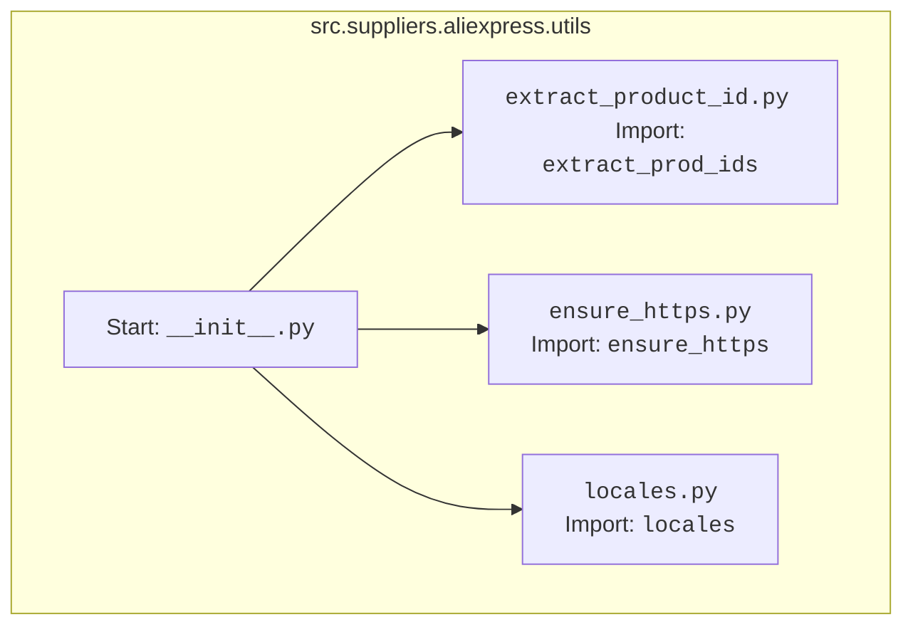

## Анализ кода `hypotez/src/suppliers/aliexpress/utils/__init__.py`

### <алгоритм>

1.  **Импорт `extract_product_id`:** Импортирует функцию `extract_prod_ids` из модуля `extract_product_id.py`. Эта функция, вероятно, предназначена для извлечения идентификаторов продуктов из каких-либо данных (например, URL-адресов или HTML).
    *   Пример: Вызов `extract_prod_ids("https://aliexpress.ru/item/123456.html")` вернет `['123456']`.

2.  **Импорт `ensure_https`:** Импортирует функцию `ensure_https` из модуля `ensure_https.py`. Эта функция, вероятно, отвечает за преобразование URL-адресов в HTTPS, если они еще не в HTTPS.
    *   Пример: Вызов `ensure_https("http://aliexpress.ru")` вернет `"https://aliexpress.ru"`. Вызов `ensure_https("https://aliexpress.ru")` вернет `"https://aliexpress.ru"`.

3.  **Импорт `locales`:** Импортирует переменную `locales` из модуля `locales.py`. Эта переменная, скорее всего, является словарем или списком, содержащим информацию о локалях AliExpress.
    *   Пример: Обращение `locales['ru']` вернет словарь с данными для русской локали, например, `{'currency': 'RUB', 'language': 'ru'}`.

### <mermaid>

**Анализ зависимостей `mermaid`:**

-   `Start`: Начало обработки, где происходит импорт.
-   `ExtractProductId`: Обозначает модуль `extract_product_id.py`, из которого импортируется функция `extract_prod_ids`.
-   `EnsureHttps`: Обозначает модуль `ensure_https.py`, из которого импортируется функция `ensure_https`.
-   `Locales`: Обозначает модуль `locales.py`, из которого импортируется переменная `locales`.

### <объяснение>

**Импорты:**

-   `from .extract_product_id import extract_prod_ids`: Импортирует функцию `extract_prod_ids` из модуля `extract_product_id.py`, который расположен в той же директории, что и `__init__.py`. Эта функция используется для извлечения идентификаторов продуктов, вероятно, из URL-адресов или HTML-кода страниц AliExpress. Это ключевая функция для работы с продуктами.
-   `from .ensure_https import ensure_https`: Импортирует функцию `ensure_https` из `ensure_https.py`. Она гарантирует, что все URL-адреса, используемые в приложении, используют протокол HTTPS, что повышает безопасность.
-   `from .locales import locales`: Импортирует переменную `locales` из модуля `locales.py`. Эта переменная, скорее всего, содержит информацию о локалях, которые поддерживаются AliExpress, например, валюты, языки и другие региональные параметры. Она важна для поддержки мультиязычности и мультивалютности.

**Классы:**
    В данном файле нет классов, только импорты.

**Функции:**

-   **`extract_prod_ids`**: Функция, импортированная из `extract_product_id.py`, которая принимает на вход данные (вероятно, строку или HTML-код) и извлекает из них идентификаторы продуктов. Возвращает список идентификаторов продуктов.
-   **`ensure_https`**: Функция, импортированная из `ensure_https.py`, которая принимает на вход URL-адрес и возвращает этот же URL-адрес, но с протоколом HTTPS.

**Переменные:**

-   `locales`: Словарь или список, содержащий информацию о локалях AliExpress. Эта переменная используется для определения региональных параметров, таких как валюта и язык.

**Цепочка взаимосвязей:**

-   `__init__.py` служит точкой входа для пакета `utils` и позволяет другим модулям в проекте легко использовать функции `extract_prod_ids`, `ensure_https` и переменную `locales`.
-   Пакет `utils` используется другими модулями в `src/suppliers/aliexpress`, например, для парсинга данных, обработки URL-адресов и учета региональных настроек.

**Потенциальные ошибки и улучшения:**

1.  **Обработка ошибок:** Функции `extract_prod_ids` и `ensure_https` могут потребовать обработки ошибок, таких как неверный формат входных данных или сетевые проблемы.
2.  **Валидация данных:** `locales` должна быть тщательно валидирована, чтобы избежать ошибок при доступе к её данным.
3.  **Кэширование:** Результаты функции `extract_prod_ids` могут быть кэшированы для ускорения обработки повторных запросов.

**Общее:**

Файл `__init__.py` в пакете `utils` выполняет роль точки входа и объединяет ряд важных утилит, необходимых для работы с AliExpress. Эти утилиты включают функции для извлечения идентификаторов товаров, обеспечения использования HTTPS протокола и доступа к локализованным настройкам. Код хорошо структурирован и прост для понимания, хотя и содержит потенциальные области для улучшения в плане обработки ошибок и производительности.