## АНАЛИЗ JSON КОНФИГУРАЦИИ ПОСТАВЩИКА AMAZON

### <алгоритм>

Этот JSON-файл содержит конфигурацию для парсера поставщика Amazon. Алгоритм обработки файла следующий:

1.  **Инициализация**: Парсер загружает JSON-файл и преобразует его в структуру данных (словарь Python).
    *   Пример:
        ```json
        {
          "supplier": "amazon",
          "supplier_id": "2800",
          ...
        }
        ```

2.  **Чтение параметров**: Парсер извлекает параметры, такие как имя поставщика, его ID, префикс, URL начала парсинга, правила ценообразования и т.д.
    *   Пример: `supplier` = "amazon", `supplier_id` = "2800", `start_url` = "https://www.amazon.com/".
    *   `if_list`: Определяет стратегию списка, в данном случае `first` - нужно взять первую доступную.
    *   `use_mouse`: Определяет использование мыши (в данном случае `false`).
    *   `mandatory`: Указывает является ли поставщик обязательным для парсинга (в данном случае `true`).
    *   `if_login`: Указывает, требуется ли вход на сайт поставщика (в данном случае `false`).
    *   `login_url`: URL для входа на сайт (если требуется).
    *   `lang`: Язык сайта поставщика.
    *   `check categories on site`: Флаг, проверять ли категории на сайте.
    *   `parsing via api`: Флаг, использовать ли API для парсинга.
    *   `collect_products_from_categorypage`: Флаг, собирать ли продукты из страниц категорий.

3.  **Обработка сценариев**: Парсер получает список файлов сценариев, которые будут использоваться для парсинга.
    *   Пример: `scenario_files` = `["amazon_categories_murano_glass.json"]`.
        *   `excluded`: Список файлов сценариев, которые нужно исключить из обработки.

4.  **Состояние**: Парсер отслеживает последний запущенный сценарий и его имя файла.
    *   Пример: `last_runned_scenario` = "", `last_runned_scenario_filename` = "".

5.  **Использование параметров**: Извлеченные параметры используются для настройки парсера.

```mermaid
flowchart TD
    Start --> LoadConfig[Загрузка конфигурации из JSON файла]
    LoadConfig --> ExtractParams[Извлечение параметров]
    ExtractParams --> SupplierDetails[Получение данных поставщика: <br><code>supplier</code>, <code>supplier_id</code>, <code>supplier_prefix</code>]
    SupplierDetails --> StartURL[Определение начального URL: <code>start_url</code>]
    StartURL --> PriceRule[Определение правила ценообразования: <code>price_rule</code>]
    PriceRule --> ListStrategy[Определение стратегии списка: <code>if_list</code>]
    ListStrategy --> MouseUsage[Использование мыши: <code>use_mouse</code>]
    MouseUsage --> MandatoryCheck[Обязательность поставщика: <code>mandatory</code>]
    MandatoryCheck --> LoginRequired[Требуется ли логин: <code>if_login</code>]
    LoginRequired --> LoginURL[URL для логина: <code>login_url</code>]
    LoginURL --> Language[Язык сайта поставщика: <code>lang</code>]
    Language --> CheckCategories[Проверять ли категории на сайте: <code>check categories on site</code>]
    CheckCategories --> ParsingAPI[Использовать API для парсинга: <code>parsing via api</code>]
    ParsingAPI --> CollectProducts[Собирать ли продукты из категорий: <code>collect_products_from_categorypage</code>]
    CollectProducts --> ScenarioFiles[Список файлов сценариев: <code>scenario_files</code>]
    ScenarioFiles --> ExcludedFiles[Список исключенных файлов: <code>excluded</code>]
    ExcludedFiles --> LastRunScenario[Последний запущенный сценарий: <code>last_runned_scenario</code>]
    LastRunScenario --> LastRunFileName[Имя файла последнего сценария: <code>last_runned_scenario_filename</code>]
    LastRunFileName --> ConfigureParser[Конфигурация парсера]
    ConfigureParser --> End[Конец]
```

### <mermaid>



**Описание зависимостей:**

Диаграмма `mermaid` описывает последовательность действий парсера при обработке JSON-конфигурации. Все переменные в диаграмме имеют описательные имена, например `SupplierDetails`, `StartURL`, `PriceRule` и т.д., что делает процесс понятным.
Каждый блок представляет собой шаг в процессе инициализации и настройки парсера. Данные передаются последовательно от одного блока к другому, начиная с загрузки конфигурации и заканчивая конфигурацией парсера.

### <объяснение>

**Импорты:**

В данном коде нет явных импортов Python. Этот JSON-файл является конфигурационным и не содержит Python-кода. Он предназначен для использования парсером, который может быть написан на Python.

**Классы:**

В данном коде нет классов. JSON-файл - это структура данных, а не класс.

**Функции:**

В данном коде нет функций. JSON-файл - это структура данных, а не набор функций.

**Переменные:**

*   `supplier`: (string) Название поставщика (`"amazon"`).
*   `supplier_id`: (string) ID поставщика (`"2800"`).
*   `supplier_prefix`: (string) Префикс поставщика для идентификации (`"amazon"`).
*   `start_url`: (string) URL, с которого начинается процесс парсинга (`"https://www.amazon.com/"`).
*   `price_rule`: (string) Правило ценообразования (`"+0"`).
*  `if_list`: (string) стратегия выбора списка.
*   `use_mouse`: (boolean) Указывает, использовать ли мышь при парсинге (`false`).
*   `mandatory`: (boolean) Указывает, является ли парсинг поставщика обязательным (`true`).
*   `if_login`: (boolean) Указывает, требуется ли вход на сайт (`false`).
*   `login_url`: (string) URL для входа на сайт, если требуется (`"https://amazon.com"`).
*   `lang`: (string) Язык сайта поставщика (`"EN"`).
*   `check categories on site`: (boolean) Указывает, нужно ли проверять категории на сайте (`false`).
*   `parsing via api`: (boolean) Указывает, нужно ли использовать API для парсинга (`false`).
*  `collect_products_from_categorypage`: (boolean) Указывает, нужно ли собирать продукты из страниц категорий.
*   `scenario_files`: (list of strings) Список файлов сценариев для парсинга (`["amazon_categories_murano_glass.json"]`).
*   `excluded`: (list of strings) Список файлов сценариев, которые нужно исключить (`["amazon_categories_lighting.json", ...]`).
*   `last_runned_scenario`: (string) Имя последнего запущенного сценария (в данном случае пустая строка).
*   `last_runned_scenario_filename`: (string) Имя файла последнего запущенного сценария (в данном случае пустая строка).

**Потенциальные ошибки и области для улучшения:**

1.  **Несоответствие типов данных**: JSON допускает разные типы данных (строки, числа, булевы значения), но парсер должен уметь правильно интерпретировать их. Например, `supplier_id` здесь строка, хотя по логике это может быть и число.
2.  **Отсутствие валидации**: Нет валидации данных. Парсер должен проверять, что значения параметров находятся в допустимых диапазонах. Например, `lang` должен быть в списке поддерживаемых языков, а URL должны иметь правильный формат.
3.  **Жесткая привязка к именам файлов**: Список исключенных файлов `excluded` и список файлов сценариев `scenario_files` жёстко заданы. Это может привести к проблемам при изменении файлов. Можно использовать гибкий механизм поиска файлов.
4. **Отсутствие обработки ошибок**: Нет явной обработки ошибок в JSON. Парсер должен обрабатывать некорректный JSON или отсутствующие поля.
5. **Отсутствие комментариев**: JSON не имеет комментариев, что усложняет понимание некоторых параметров.

**Цепочка взаимосвязей с другими частями проекта:**

Этот JSON-файл является частью конфигурации парсера для конкретного поставщика (Amazon). Он будет использоваться в сочетании с:

1.  **Парсер:** Парсер считывает этот файл и использует параметры для настройки процесса парсинга сайта Amazon.
2.  **Файлы сценариев (`.json`):** Файлы из `scenario_files` содержат детальные инструкции по навигации по сайту, извлечению данных и другим действиям парсера.
3.  **Другие конфигурации**:  Могут быть другие конфигурационные файлы, общие для всех поставщиков.
4.  **База данных**: Собранные данные будут сохранены в базе данных, где они будут использоваться для других целей (анализ, отчеты, и т.д.).

В целом, этот JSON файл обеспечивает гибкую настройку парсера для конкретного поставщика.