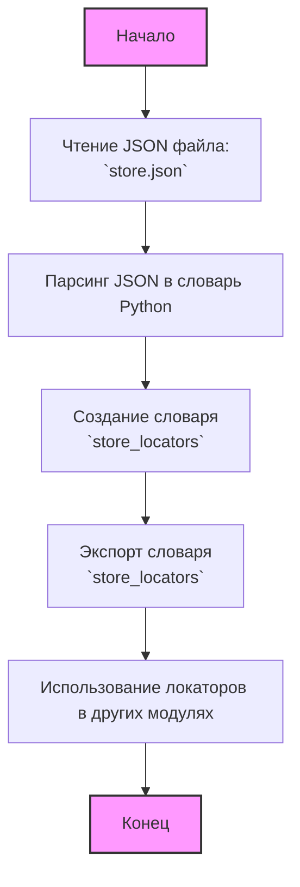

## АНАЛИЗ КОДА

### <алгоритм>

1.  **Чтение JSON файла**: Скрипт начинается с чтения JSON файла `hypotez/src/suppliers/amazon/locators/store.json`. Этот файл, как предполагается, содержит JSON структуру, представляющую локаторы для веб-элементов на странице магазина Amazon.

    *   Пример:
        ```json
        {
            "search_field": {
                "css": "#twotabsearchtextbox"
            },
            "search_button": {
                "css": "#nav-search-submit-button"
            },
            "product_list":{
                "css": "[data-component-type='s-search-result']"
            }
        }
        ```

2.  **Представление данных**: JSON данные преобразуются в структуру данных Python, скорее всего, в словарь. Этот словарь будет использоваться для доступа к локаторам.

3.  **Локаторы**:  Ключи словаря (например, `search_field`, `search_button`, `product_list`) представляют собой логические имена для веб-элементов на странице Amazon. Значения, ассоциированные с этими ключами, содержат словари с информацией о локаторах (например, `{css: #twotabsearchtextbox}`).
4.  **Использование**: Словарь с локаторами импортируется в другие модули, где используются для поиска элементов на веб-странице с помощью Selenium или подобных инструментов.

    *   Пример:
        ```python
        from src.suppliers.amazon.locators.store import store_locators
        from selenium.webdriver.common.by import By

        search_field = driver.find_element(By.CSS_SELECTOR, store_locators['search_field']['css'])
        ```

### <mermaid>



**Объяснение зависимостей `mermaid`:**

Диаграмма представляет собой простой блок-схему, отражающую процесс обработки JSON файла с локаторами.
*   `Start`: Начало процесса.
*   `ReadFile`:  Чтение файла `store.json`.
*   `ParseJson`:  Разбор JSON структуры в словарь Python.
*   `StoreLocators`: Представление JSON в виде  словаря `store_locators`.
*   `ExportLocators`: Экспорт словаря для использования в других модулях.
*    `Usage`:  Использование локаторов в других модулях.
*   `End`: Конец процесса.

### <объяснение>

**Импорты:**

В данном фрагменте кода нет явных импортов. Предполагается, что данные просто загружаются из JSON файла и преобразуются в структуру Python. Однако если бы были импорты, они бы взаимодействовали следующим образом:

*   `import json`: Если бы использовался импорт `json` для парсинга JSON, это был бы стандартный модуль Python для работы с JSON.
*   `from src import gs`: Импорт `gs` из пакета `src` означал бы использование глобальных настроек (если такие есть).

**Классы:**

В этом фрагменте нет классов, поскольку это просто JSON файл с данными.

**Функции:**

В этом фрагменте кода нет функций, поскольку это просто JSON файл с данными.

**Переменные:**

*   `store_locators`: Это словарь, который содержит все локаторы для элементов на странице магазина Amazon. Ключи словаря — это логические названия элементов (например, `search_field`, `search_button`), а значения — словари, содержащие информацию о локаторах (например, `css` селекторы, `xpath` и т.д.).

**Потенциальные ошибки и улучшения:**

*   **Отсутствие валидации**: Нет проверки структуры JSON. Если структура файла изменится, код, использующий эти данные, может сломаться.
*   **Жестко закодированные локаторы**:  Локаторы (css, xpath) могут измениться при обновлении сайта. Было бы лучше иметь механизм обновления этих локаторов.

**Цепочка взаимосвязей с другими частями проекта:**

1.  **`src/suppliers/amazon/locators/store.json`**:  Этот файл находится в модуле `locators` и является частью модуля `amazon` в рамках поставщиков `suppliers`.
2.  **`src/suppliers/amazon/pages/*`**: Локаторы из `store.json` будут использоваться в модулях `pages`, в которых выполняются действия на страницах Amazon (например, поиск, добавление в корзину).
3.  **`src/suppliers/amazon/tests/*`**: Модули `tests` будут использовать классы и методы из `pages`, включая локаторы из `store.json` для написания тестов.
4.  **`src/utils/webdriver.py`**:  Для выполнения действий с веб-страницами, возможно, используется утилита для работы с веб-драйвером, которая инициализирует драйвер и применяет локаторы.
5.   **`src/conftest.py`**: Этот файл используется pytest и может включать конфигурацию для тестов, где также используется драйвер и, следовательно, локаторы.

**Общее**:

В этом JSON-файле определены локаторы для веб-элементов Amazon.  Эти данные являются ключевым компонентом в автоматизации работы с веб-сайтом Amazon и используются для поиска веб-элементов при тестировании или сборе данных.