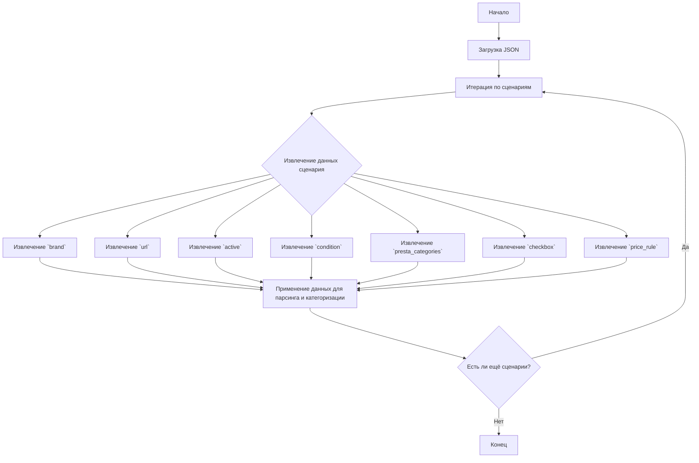

## <алгоритм>

1. **Начало**: Загрузка JSON-данных, представляющих конфигурацию сценариев для парсинга товаров Lenovo с Amazon.
2. **Итерация по сценариям**: Перебор ключей (имен сценариев) в словаре `scenarios`. Каждый ключ представляет собой отдельный сценарий.
   - Пример: `"NEW LENOVO DESKTOP INTEL I3"`, `"NEW LENOVO DESKTOP INTEL I5"`, и т.д.
3. **Извлечение данных для сценария**:  Для каждого сценария извлекаются следующие данные:
    - `brand`: Бренд товара (например, "LENOVO").
    - `url`: URL страницы Amazon, откуда нужно парсить товары.
    - `active`: Флаг, указывающий, активен ли сценарий (обычно `true`).
    - `condition`: Состояние товара (например, "new").
    - `presta_categories`:  Словарь, определяющий, к какой категории PrestaShop относится товар, используется шаблон с ключом "lenovo" для определения категории.
        - Пример: `{"template": {"lenovo": "DESKTOPS INTEL I3"}}`
    - `checkbox`: Логическое значение, связанное с чекбоксом (в данном случае `false`).
    - `price_rule`: Идентификатор ценового правила (в данном случае `1`).
4. **Применение данных**: Извлеченные данные используются для настройки процесса парсинга и категоризации товаров Lenovo на платформе PrestaShop. URL используется для сбора данных с Amazon, а `presta_categories` определяет, в какую категорию PrestaShop следует поместить найденные товары.
5. **Конец**: Завершение обработки всех сценариев.

## <mermaid>



**Объяснение зависимостей `mermaid`:**

*   **`Start`**: Начало процесса.
*   **`LoadJson`**: Загружает JSON-файл, содержащий настройки сценариев.
*   **`LoopScenarios`**: Цикл, который проходит через все сценарии, определенные в JSON-файле.
*   **`ExtractScenarioData`**: Извлечение данных для текущего сценария.
*   **`ExtractBrand`**: Извлечение бренда товара из сценария (например, "LENOVO").
*   **`ExtractUrl`**: Извлечение URL-адреса страницы Amazon, содержащей товары для парсинга.
*   **`ExtractActive`**: Извлечение статуса активности сценария (обычно `true`).
*   **`ExtractCondition`**: Извлечение состояния товара (например, "new").
*   **`ExtractPrestaCategories`**: Извлечение информации о категориях PrestaShop, куда следует отнести товары.
*   **`ExtractCheckbox`**: Извлечение состояния флажка.
*   **`ExtractPriceRule`**: Извлечение идентификатора ценового правила.
*   **`ApplyData`**: Применение извлеченных данных для настройки процесса парсинга и категоризации товаров.
*   **`ConditionCheck`**: Проверка, есть ли еще сценарии для обработки.
*   **`End`**: Конец процесса.

## <объяснение>

**Импорты:**

В данном коде импорты отсутствуют, так как это чистый JSON файл.

**Структура JSON:**

JSON-файл содержит объект с ключом "scenarios", значением которого является словарь. Ключи этого словаря - это названия сценариев, а значения - это словари, описывающие конфигурацию каждого конкретного сценария.

**Сценарии:**

Каждый сценарий описывает конкретную конфигурацию для парсинга товаров Lenovo с Amazon. Например, `NEW LENOVO DESKTOP INTEL I3` соответствует парсингу новых компьютеров Lenovo с процессором Intel i3.

**Ключи сценария:**

*   **`brand`**: Бренд товаров, которые будут парсится (в данном случае, всегда "LENOVO").
*   **`url`**:  URL-адрес страницы Amazon, откуда будут загружаться товары. Этот URL содержит фильтры, чтобы отображались именно нужные товары (например, по процессору, состоянию и т.д.).
*   **`active`**: Логическое значение, указывающее, активен ли данный сценарий. Обычно `true`.
*   **`condition`**: Указывает состояние товара (в данном случае, "new").
*   **`presta_categories`**: Объект, определяющий, к какой категории PrestaShop следует отнести товары, найденные в результате парсинга. Содержит вложенный объект `template` с ключом `lenovo` и значением, представляющим наименование категории.
*    **`checkbox`**: Логическое значение, связанное с чекбоксом (всегда `false`).
*    **`price_rule`**: Идентификатор правила ценообразования, которое следует применить к товарам, полученным из данного сценария.

**Пример сценария `NEW LENOVO DESKTOP INTEL I3`:**
```json
  "NEW LENOVO DESKTOP INTEL I3": {
      "brand": "LENOVO",
      "url": "https://www.amazon.com/s?i=computers&bbn=565098&rh=n%3A172282%2Cn%3A541966%2Cn%3A13896617011%2Cn%3A565098%2Cp_n_is_free_shipping%3A10236242011%2Cp_89%3ALenovo%2Cp_n_condition-type%3A2224371011%2Cp_n_feature_four_browse-bin%3A2289794011&dc&qid=1674307266&rnid=676578011&NEW=sr_nr_p_n_feature_four_browse-bin_3&ds=v1%3AKlEK7d3d3I73AQlcsVe8lRRx32AKYSwkhFxPVb49vMI",
      "active": true,
      "condition": "new",
      "presta_categories": {
        "template": { "lenovo": "DESKTOPS INTEL I3" }
      },
      "checkbox": false,
      "price_rule": 1
    },
```

Этот сценарий определяет, что нужно парсить новые настольные компьютеры Lenovo с процессором Intel i3 с конкретной страницы Amazon и относить их к категории "DESKTOPS INTEL I3" в PrestaShop.

**Цепочка взаимосвязей:**

Этот файл является частью системы, которая автоматически парсит товары с Amazon и размещает их в интернет-магазине на платформе PrestaShop. Он определяет, какие товары и с каких страниц следует парсить, и к каким категориям PrestaShop их нужно отнести. Этот файл используется для настройки парсера.

**Потенциальные улучшения:**

1.  **Гибкость `presta_categories`:**  Можно сделать структуру `presta_categories` более гибкой, например, добавив возможность назначать несколько категорий.
2.  **Обработка ошибок:** Необходимо предусмотреть обработку ошибок, если URL-адрес недействителен или если парсинг с Amazon не удался.
3.  **Динамическая настройка:** Можно улучшить систему, чтобы сценарии и их параметры можно было настраивать динамически, а не только через JSON-файл.

**Заключение:**

Этот JSON-файл представляет собой конфигурационный файл, который определяет параметры парсинга товаров с Amazon и их категоризацию в PrestaShop. Он содержит данные, необходимые для работы парсера, и позволяет настраивать процесс сбора данных.