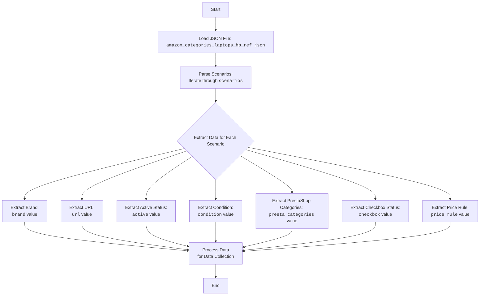

## ИНСТРУКЦИЯ:

Анализируй предоставленный код подробно и объясни его функциональность. Ответ должен включать три раздела:  

1. **<алгоритм>**: Опиши рабочий процесс в виде пошаговой блок-схемы, включая примеры для каждого логического блока, и проиллюстрируй поток данных между функциями, классами или методами.  
2. **<mermaid>**: Напиши код для диаграммы в формате `mermaid`, проанализируй и объясни все зависимости, 
    которые импортируются при создании диаграммы. 
    **ВАЖНО!** Убедитесь, что все имена переменных, используемые в диаграмме `mermaid`, 
    имеют осмысленные и описательные имена. Имена переменных вроде `A`, `B`, `C`, и т.д., не допускаются!  
    
    **Дополнительно**: Если в коде есть импорт `import header`, добавьте блок `mermaid` flowchart, объясняющий `header.py`:\
    ```mermaid
    flowchart TD
        Start --> Header[<code>header.py</code><br> Determine Project Root]
    
        Header --> import[Import Global Settings: <br><code>from src import gs</code>] 
    ```

3. **<объяснение>**: Предоставьте подробные объяснения:  
   - **Импорты**: Их назначение и взаимосвязь с другими пакетами `src.`.  
   - **Классы**: Их роль, атрибуты, методы и взаимодействие с другими компонентами проекта.  
   - **Функции**: Их аргументы, возвращаемые значения, назначение и примеры.  
   - **Переменные**: Их типы и использование.  
   - Выделите потенциальные ошибки или области для улучшения.  

Дополнительно, постройте цепочку взаимосвязей с другими частями проекта (если применимо).  

Это обеспечивает всесторонний и структурированный анализ кода.
## Формат ответа: `.md` (markdown)
**КОНЕЦ ИНСТРУКЦИИ**
## Анализ кода:

### 1. <алгоритм>
Этот JSON-файл определяет набор сценариев для сбора данных о ноутбуках HP с Amazon. Каждый сценарий описывает параметры поиска для конкретной модели ноутбука (например, HP с процессором Intel Celeron 11 дюймов) и сопоставляет их с категориями PrestaShop.

**Пошаговый блок-схема:**

1.  **Начало**: Загрузка JSON-файла.
    *   *Пример*: JSON-файл `amazon_categories_laptops_hp_ref.json` загружается в программу.

2.  **Разбор структуры**: Проход по структуре `scenarios`.
    *   *Пример*:  Перебираются ключи `LAPTOPS HP INTEL CELERON 11`, `LAPTOPS HP INTEL CELERON 13` и т.д.

3.  **Извлечение данных для каждого сценария**:
    *   **brand**: Извлекается бренд (`HP`).
        *   *Пример*:  `brand` = `HP`.
    *   **url**: Извлекается URL-адрес для поиска.
        *   *Пример*: `url` = `"https://www.amazon.com/s?i=computers&bbn=565108&rh=n%3A565108%2Cp_n_is_free_shipping%3A10236242011%2Cp_n_feature_thirty-one_browse-bin%3A23716064011%2Cp_89%3AHP%2Cp_n_feature_four_browse-bin%3A1264420011%7C1264444011%2Cp_n_size_browse-bin%3A13580785011&dc&qid=1673003876&rnid=2242797011&ref=sr_nr_p_n_size_browse-bin_5&ds=v1%3AX04xpAWnKr6xvuDflqgcXwlFEA0yw8Vn%2FryiGCUqVig"`.
    *   **active**: Определяется, активен ли сценарий (`true` или `false`).
        *   *Пример*: `active` = `true`.
    *   **condition**: Условие товара (`new`).
        *   *Пример*: `condition` = `"new"`.
    *   **presta_categories**: Сопоставление с категориями PrestaShop.
        *   *Пример*: `presta_categories` = `{"template": { "hp": [ "LAPTOPS INTEL CELERON", "11" ] }}`.
    *  **checkbox**: Флаг для использования чекбокса (`false`).
        * *Пример*: `checkbox` = `false`.
    *   **price_rule**: Правило ценообразования (`1`).
        *   *Пример*: `price_rule` = `1`.
4. **Сохранение данных**:  Данные каждого сценария используются для настройки процесса сбора данных.
    *   *Пример*: Скрипт использует `url` для запроса Amazon, `presta_categories` для определения категорий PrestaShop.

### 2. <mermaid>


**Анализ зависимостей (mermaid):**

Диаграмма `mermaid` представляет собой блок-схему, которая описывает процесс чтения и обработки данных из JSON-файла. Нет импорта внешних модулей, так как это описание структуры данных, а не исполняемый код. Диаграмма демонстрирует следующие этапы:

*   **LoadJSON**: Загрузка JSON-файла `amazon_categories_laptops_hp_ref.json`.
*   **ParseScenarios**: Разбор структуры `scenarios`, которая содержит определения каждого сценария.
*   **ExtractScenarioData**: Извлечение данных для каждого сценария.
*   **BrandExtraction**: Извлечение бренда.
*   **UrlExtraction**: Извлечение URL-адреса для поиска на Amazon.
*   **ActiveStatus**: Извлечение статуса активности сценария.
*   **ConditionExtraction**: Извлечение условия товара.
*    **PrestaCategoriesMapping**: Извлечение сопоставлений категорий PrestaShop.
*    **CheckboxStatus**: Извлечение статуса чекбокса.
*   **PriceRule**: Извлечение правила цены.
*   **ProcessScenarioData**: Обработка извлеченных данных для дальнейшего использования.
*   **End**: Завершение процесса.

### 3. <объяснение>

**Импорты:**
В данном файле нет импортов. Этот файл является файлом данных в формате JSON, а не исполняемым кодом Python. Он используется для хранения конфигурации.

**Классы:**
В этом файле нет классов, так как это файл данных в формате JSON.

**Функции:**
В этом файле нет функций, так как это файл данных в формате JSON.

**Переменные:**

*   `scenarios`: Основной объект JSON, содержащий словарь сценариев, где каждый ключ является названием сценария.
    *   Тип: `dict`.
    *   Использование:  Содержит все сценарии для сбора данных о ноутбуках.
*   `brand`: Название бренда ноутбука.
    *   Тип: `str`.
    *   Использование:  Используется для фильтрации результатов поиска на Amazon и для сопоставления с категориями PrestaShop.
*   `url`: URL-адрес Amazon для поиска конкретных моделей ноутбуков.
    *   Тип: `str`.
    *   Использование:  Используется для запроса результатов поиска с Amazon.
*   `active`: Флаг, указывающий, активен ли сценарий.
    *   Тип: `bool`.
    *   Использование:  Позволяет включать или отключать сценарии сбора данных.
*   `condition`: Состояние товара (обычно "new").
    *   Тип: `str`.
    *   Использование:  Используется для фильтрации товаров по состоянию на Amazon.
*    `presta_categories`: Словарь, содержащий сопоставление категорий PrestaShop.
    *   Тип: `dict`.
    *   Использование:  Определяет, в какие категории PrestaShop должны быть добавлены собранные данные.
*    `checkbox`: Флаг для использования чекбокса.
    *   Тип: `bool`.
     *   Использование: Определяет, использовать ли чекбокс.
*   `price_rule`: Идентификатор правила ценообразования.
    *   Тип: `int`.
    *   Использование: Определяет, какое правило ценообразования применять к товарам.

**Примеры:**

```json
"LAPTOPS HP INTEL CELERON 11": {
      "brand": "HP",
      "url": "https://www.amazon.com/s?i=computers&bbn=565108&rh=n%3A565108%2Cp_n_is_free_shipping%3A10236242011%2Cp_n_feature_thirty-one_browse-bin%3A23716064011%2Cp_89%3AHP%2Cp_n_feature_four_browse-bin%3A1264420011%7C1264444011%2Cp_n_size_browse-bin%3A13580785011&dc&qid=1673003876&rnid=2242797011&ref=sr_nr_p_n_size_browse-bin_5&ds=v1%3AX04xpAWnKr6xvuDflqgcXwlFEA0yw8Vn%2FryiGCUqVig",
      "active": true,
      "condition": "new",
      "presta_categories": {
        "template": { "hp": [ "LAPTOPS INTEL CELERON", "11" ] }
      },
      "checkbox": false,
      "price_rule": 1
    }
```

Этот пример определяет сценарий для сбора данных о ноутбуках HP с процессором Intel Celeron и диагональю экрана 11 дюймов.

**Потенциальные ошибки и области для улучшения:**
*   **Уязвимость к изменениям Amazon**: URL-адреса и параметры фильтрации могут меняться на Amazon, что может привести к поломке скриптов сбора данных. Необходимо отслеживать эти изменения и адаптировать URL-адреса.
*   **Жестко закодированные значения**: Жестко закодированные параметры в URL-адресах могут быть заменены переменными для более гибкой настройки.
*   **Отсутствие валидации**: Нет валидации JSON-файла, что может привести к ошибкам при обработке данных, если файл имеет неправильный формат.
*   **Зависимость от структуры PrestaShop**: Структура `presta_categories` зависит от конкретной конфигурации PrestaShop, что делает этот файл менее переносимым.

**Взаимосвязь с другими частями проекта:**
Этот JSON-файл, вероятно, используется в качестве конфигурационного файла для скрипта, который взаимодействует с API Amazon и PrestaShop. Скрипт будет:
1.  Читать данные из JSON-файла.
2.  Использовать URL-адреса для запроса данных с Amazon.
3.  Сопоставлять найденные продукты с категориями PrestaShop, используя `presta_categories`.
4.  Применять правила ценообразования, используя `price_rule`.
5.  Сохранять полученные данные в PrestaShop.