## АНАЛИЗ КОДА

### 1. <алгоритм>

Представленный код - это JSON-файл, который описывает конфигурацию для сбора данных о ноутбуках Lenovo с сайта Amazon. Он определяет параметры для различных категорий ноутбуков Lenovo на основе их процессоров (AMD Athlon, AMD Ryzen 3/5/7, Intel Celeron, Intel i3/i5/i7). 

**Блок-схема:**

```mermaid
flowchart TD
    Start[Начало] --> LoadConfig[Загрузка JSON-конфигурации];
    LoadConfig --> ParseStoreData[Разбор данных о магазине (store)];
    ParseStoreData --> LoopScenarios[Цикл по сценариям (scenarios)];
    LoopScenarios -- Для каждого сценария --> ParseScenarioData[Разбор данных сценария];
    ParseScenarioData --> ExtractScenarioParameters[Извлечение параметров сценария (brand, url, active, condition, presta_categories, checkbox, price_rule)];
      ExtractScenarioParameters --> CheckActive[Проверка активности сценария (`active` = true?)]
    CheckActive -- Да --> ProcessScenario[Обработка сценария];
      CheckActive -- Нет --> NextScenario[Переход к следующему сценарию];
    ProcessScenario --> ExtractPrestaCategories[Извлечение категорий PrestaShop (`presta_categories`)];
    ExtractPrestaCategories --> MapCategories[Сопоставление категорий с шаблоном];
     MapCategories --> DataReady[Данные готовы для сбора];
     DataReady --> NextScenario;
    NextScenario --> LoopScenarios;
    LoopScenarios -- Завершен --> End[Конец];

    
    
    
  
    style Start fill:#f9f,stroke:#333,stroke-width:2px
    style End fill:#f9f,stroke:#333,stroke-width:2px
    style LoopScenarios fill:#ccf,stroke:#333,stroke-width:2px
    style ProcessScenario fill:#ccf,stroke:#333,stroke-width:2px
    
```

**Примеры:**

1.  **Загрузка JSON-конфигурации:** Файл `amazon_categories_laptops_lenovo.json` читается и интерпретируется как JSON-объект.
2.  **Разбор данных о магазине:** Извлекаются данные о магазине, такие как `store_id`, `supplier_id`, `description`, `about`, `brand`, `url` и т.д.
    *   Пример: `"brand": "LENOVO"`
    *   Пример: `"url": "https://www.amazon.com/s?i=computers&bbn=565108&rh=n%3A565108%2Cp_n_is_free_shipping%3A10236242011%2Cp_89%3ALenovo&dc&qid=1671858970&rnid=23716050011&ref=sr_nr_p_n_feature_thirty-one_browse-bin_1&ds=v1%3AEaENIiWwifDcRT6qTB%2FxEy6WSOBD%2FsskOooUf%2FcAiGU"`
3.  **Цикл по сценариям:** Проходит по каждому сценарию, определенному в ключе `"scenarios"`.
    *   Пример первого сценария: `"LAPTOP LENOVO AMD ATHLON 13": { ... }`
4.  **Разбор данных сценария:** Извлекаются данные для текущего сценария.
    *   Пример: `"brand": "LENOVO"`, `"url": "https://www.amazon.com/s?i=computers&bbn=565108&rh=n%3A565108%2Cp_n_is_free_shipping%3A10236242011%2Cp_n_feature_thirty-one_browse-bin%3A23716057011%2Cp_89%3ALenovo%2Cp_n_feature_four_browse-bin%3A1264728011%2Cp_n_size_browse-bin%3A3545275011&dc&qid=1674228094&rnid=2242797011&ref=sr_nr_p_n_size_browse-bin_2&ds=v1%3AM9nKGPOL2sEa75Wq%2BN5ibb4AA3CUqLERK%2Fewcx2E9G4"`
    *   Пример:  `"presta_categories": { "template": { "lenovo": [ "LAPTOPS AMD ATHLON", "13" ] } }`
5.  **Проверка активности сценария:** Проверяется, является ли сценарий активным (значение `"active"` равно `true`). Если нет, то переходим к следующему сценарию.
6.  **Обработка сценария:** Если сценарий активен, извлекаются данные для дальнейшей обработки.
7.  **Извлечение категорий PrestaShop:** Извлекается структура `"presta_categories"`, которая содержит шаблон для сопоставления с категориями в PrestaShop.
    *   Пример: `{ "lenovo": [ "LAPTOPS AMD ATHLON", "13" ] }`
8.  **Сопоставление категорий с шаблоном:** Категории преобразуются согласно заданному шаблону.
9.  **Данные готовы для сбора:** После обработки сценария данные готовы для использования в процессе сбора.
10. **Переход к следующему сценарию:** Цикл продолжается до тех пор, пока не будут обработаны все сценарии.

```mermaid
flowchart TD
    Config[<code>amazon_categories_laptops_lenovo.json</code><br>JSON Configuration File]
    
    subgraph Store Data
    StoreId(store_id)
    SupplierId(supplier_id)
    GetBanners(get store banners)
    Description(description)
    About(about)
    Brand(brand)
    StoreUrl(url)
    ShopCategoriesPage("shop categories page")
    ShopCategoriesJson("shop categories json file")
    end
    
   Config -->  StoreId
     Config -->  SupplierId
      Config -->  GetBanners
      Config -->  Description
      Config -->  About
    Config --> Brand
     Config -->  StoreUrl
      Config --> ShopCategoriesPage
      Config --> ShopCategoriesJson
    

    subgraph Scenario Data
        
        Scenario1(LAPTOP LENOVO AMD ATHLON 13)
        Scenario2(LAPTOP LENOVO AMD RYZEN 3)
        Scenario3(LAPTOP LENOVO AMD RYZEN 5)
        Scenario4(LAPTOP LENOVO AMD RYZEN 7)
        Scenario5(LAPTOP LENOVO INTEL CELERON)
        Scenario6(LAPTOP LENOVO INTEL I3)
         Scenario7(LAPTOP LENOVO INTEL I5)
        Scenario8(LAPTOP LENOVO INTEL I7)
        
        
        
        subgraph Scenario Parameters
        BrandScenario(brand)
         ScenarioUrl(url)
         Active(active)
         Condition(condition)
         PrestaCategories(presta_categories)
         Checkbox(checkbox)
         PriceRule(price_rule)
        end
    end
     Config --> Scenario1
      Config --> Scenario2
       Config --> Scenario3
        Config --> Scenario4
        Config --> Scenario5
        Config --> Scenario6
         Config --> Scenario7
        Config --> Scenario8
        
        Scenario1 -->BrandScenario
        Scenario1 --> ScenarioUrl
        Scenario1 --> Active
        Scenario1 --> Condition
        Scenario1 --> PrestaCategories
        Scenario1 --> Checkbox
        Scenario1 --> PriceRule
        
        Scenario2 -->BrandScenario
        Scenario2 --> ScenarioUrl
        Scenario2 --> Active
        Scenario2 --> Condition
        Scenario2 --> PrestaCategories
        Scenario2 --> Checkbox
        Scenario2 --> PriceRule
         
        Scenario3 -->BrandScenario
        Scenario3 --> ScenarioUrl
        Scenario3 --> Active
        Scenario3 --> Condition
        Scenario3 --> PrestaCategories
        Scenario3 --> Checkbox
        Scenario3 --> PriceRule

        Scenario4 -->BrandScenario
        Scenario4 --> ScenarioUrl
        Scenario4 --> Active
        Scenario4 --> Condition
        Scenario4 --> PrestaCategories
        Scenario4 --> Checkbox
        Scenario4 --> PriceRule
        
          Scenario5 -->BrandScenario
        Scenario5 --> ScenarioUrl
        Scenario5 --> Active
        Scenario5 --> Condition
        Scenario5 --> PrestaCategories
        Scenario5 --> Checkbox
        Scenario5 --> PriceRule
        
          Scenario6 -->BrandScenario
        Scenario6 --> ScenarioUrl
        Scenario6 --> Active
        Scenario6 --> Condition
        Scenario6 --> PrestaCategories
        Scenario6 --> Checkbox
        Scenario6 --> PriceRule
        
          Scenario7 -->BrandScenario
        Scenario7 --> ScenarioUrl
        Scenario7 --> Active
        Scenario7 --> Condition
        Scenario7 --> PrestaCategories
        Scenario7 --> Checkbox
        Scenario7 --> PriceRule
        
         Scenario8 -->BrandScenario
        Scenario8 --> ScenarioUrl
        Scenario8 --> Active
        Scenario8 --> Condition
        Scenario8 --> PrestaCategories
        Scenario8 --> Checkbox
        Scenario8 --> PriceRule
       

    style Config fill:#f9f,stroke:#333,stroke-width:2px
    
```

### 2. <mermaid>



**Объяснение зависимостей:**

*   **`Config`**: Представляет JSON-файл конфигурации (`amazon_categories_laptops_lenovo.json`), который является источником всех данных.
*   **`Store Data`**: Содержит данные, относящиеся к магазину (например, Amazon), как поставщику.
    *   `store_id`, `supplier_id`: Идентификаторы магазина и поставщика.
    *   `get store banners`: Флаг для получения баннеров магазина.
    *    `description`, `about`: Описательная информация о магазине.
    *    `brand`: Бренд (в данном случае `LENOVO`).
    *   `url`: URL-адрес магазина на сайте Amazon.
    *    `shop categories page`: URL-адрес страницы с категориями магазина.
    *   `shop categories json file`: Путь к JSON-файлу с категориями магазина.
*   **`Scenario Data`**:  Включает в себя различные сценарии сбора данных, каждый из которых представляет собой конкретную категорию ноутбуков Lenovo (по процессору).
    *   `LAPTOP LENOVO AMD ATHLON 13`, `LAPTOP LENOVO AMD RYZEN 3` и т.д.: Названия сценариев, представляющие собой конкретные типы ноутбуков Lenovo.
    *   `Scenario Parameters`: Параметры, определяющие каждый сценарий.
        *   `brand`: Бренд (в данном случае `LENOVO`).
        *   `url`: URL-адрес страницы с ноутбуками для текущего сценария.
        *   `active`: Флаг, указывающий, активен ли сценарий.
        *   `condition`: Условие товара (в данном случае всегда `new`).
        *   `presta_categories`: Категории PrestaShop, куда будут отнесены товары.
            *   Включают в себя шаблон, определяющий соответствие между товарами и категориями магазина PrestaShop.
        *   `checkbox`: Флаг для выбора или снятия выделения с элемента.
        *    `price_rule`: Правило для обработки цен.

### 3. <объяснение>

**Импорты:**

В данном коде нет импортов, поскольку это JSON-файл конфигурации, а не Python-скрипт. Этот файл используется в других частях проекта (предположительно, скриптах Python) для настройки процесса сбора данных.

**Классы:**

Классы в этом файле не используются, так как это JSON-файл. Он представляет собой структуру данных в формате ключ-значение.

**Функции:**

Функции также отсутствуют, поскольку это JSON-файл. Данные, описанные в файле, используются функциями, расположенными в других частях проекта.

**Переменные:**

*   **`store`**: Объект, содержащий информацию о магазине (поставщике).
    *   `store_id`: Идентификатор магазина (тип строка).
    *   `supplier_id`: Идентификатор поставщика (тип строка).
    *   `get store banners`: Флаг (тип boolean), указывающий, нужно ли собирать баннеры магазина.
    *   `description`: Описание (тип строка).
    *   `about`: Дополнительная информация (тип строка).
    *   `brand`: Бренд (тип строка).
    *   `url`: URL-адрес магазина на сайте Amazon (тип строка).
    *   `shop categories page`: URL-адрес страницы категорий магазина (тип строка).
    *   `shop categories json file`: Путь к JSON-файлу с категориями магазина (тип строка).
*   **`scenarios`**: Объект, содержащий сценарии для сбора данных, где каждый ключ (например, `"LAPTOP LENOVO AMD ATHLON 13"`) - это название сценария, а значение - его параметры.
    *   **`brand`**: Бренд ноутбука (тип строка, в данном случае всегда `"LENOVO"`).
    *   **`url`**: URL-адрес страницы с товарами для текущего сценария (тип строка).
    *   **`active`**: Флаг (тип boolean), указывающий, активен ли сценарий.
    *   **`condition`**: Состояние товара (тип строка, в данном случае всегда `"new"`).
    *   **`presta_categories`**: Объект, описывающий категории PrestaShop.
        *   **`template`**: Объект, определяющий соответствие между названием категории и её представлением в PrestaShop. Значение может быть строкой (например, `"LAPTOPS AMD RYZEN 3"`) или массивом строк (например, `["LAPTOPS AMD ATHLON", "13"]`).
    *   **`checkbox`**: Флаг для checkbox (тип boolean).
    *   **`price_rule`**: Номер правила для обработки цен (тип число).

**Потенциальные ошибки и области для улучшения:**

*   **Жестко заданные URL**: URL-адреса страниц Amazon жестко заданы в коде. Их стоит сделать более гибкими, чтобы их можно было менять через переменные окружения или конфигурацию.
*   **Отсутствие валидации**: Нет валидации данных. Например, можно было бы проверить, что URL-адрес имеет правильный формат, а значения флагов (`active`, `checkbox`) являются булевыми.
*   **Шаблон категорий**: Структура `presta_categories` довольно проста. Возможно, потребуется более сложная логика сопоставления категорий.
*   **Управление ошибками**: В процессе обработки данных может возникнуть множество ошибок (например, недоступность URL-адреса). Необходимо добавить обработку исключений в скрипты, которые будут использовать этот JSON-файл.
*   **Масштабируемость:** Если количество сценариев станет очень большим, структура JSON-файла может стать неудобной для управления. Может потребоваться использование базы данных для хранения конфигураций.

**Цепочка взаимосвязей с другими частями проекта:**

Этот JSON-файл является конфигурационным файлом, который используется другими частями проекта, скорее всего, скриптами на Python, для:

1.  **Сбор данных**: Скрипты используют URL-адреса для скачивания HTML-кода страниц Amazon.
2.  **Парсинг данных**: Извлекают информацию о товарах (название, цена, описание и т.д.) из скачанных HTML-страниц.
3.  **Классификация**: Используют данные `presta_categories` для определения соответствующих категорий в PrestaShop.
4.  **Загрузка данных**: Подготовленные данные о товарах загружаются в PrestaShop.

В целом, этот JSON-файл является важной частью конфигурации для сбора данных о ноутбуках Lenovo с Amazon, предоставляя гибкую и настраиваемую структуру для различных категорий товаров.