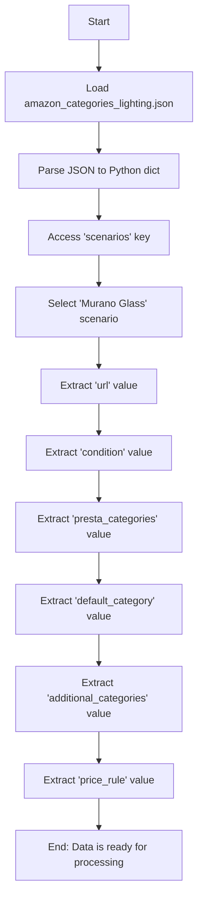

## Анализ кода `hypotez/src/suppliers/amazon/scenarios/amazon_categories_lighting.json`

### 1. <алгоритм>

Файл `amazon_categories_lighting.json` содержит JSON-объект, описывающий сценарии для категоризации товаров на Amazon. В данном случае, есть только один сценарий, определяемый ключом `"Murano Glass"`.

**Блок-схема:**

1.  **Начало**: Загрузка JSON-файла (`amazon_categories_lighting.json`).
2.  **Разбор JSON**: Парсинг JSON-структуры в объект Python (например, словарь).
    *   Пример: `{ "scenarios": { ... } }`  преобразуется в словарь Python.
3.  **Доступ к сценариям**: Получение доступа к ключу `"scenarios"`, значение которого является словарем.
    *   Пример: `data['scenarios']` вернёт словарь со сценариями.
4.  **Выбор сценария**: Получение доступа к конкретному сценарию по ключу, например `"Murano Glass"`.
    *   Пример:  `data['scenarios']['Murano Glass']` вернёт словарь с деталями сценария.
5.  **Извлечение URL**: Извлечение значения по ключу `"url"`, представляющего URL товара.
    *   Пример:  `data['scenarios']['Murano Glass']['url']` вернёт `"https://amzn.to/46PWVcs"`.
6. **Извлечение условия**: Извлечение значения по ключу `"condition"`, представляющего состояние товара.
    * Пример: `data['scenarios']['Murano Glass']['condition']` вернет `"new"`.
7.  **Извлечение категорий**: Извлечение значений по ключу `"presta_categories"`, представляющие категории PrestaShop.
    *   Пример: `data['scenarios']['Murano Glass']['presta_categories']` вернёт словарь.
8.  **Извлечение дефолтной категории**: Извлечение значения по ключу `"default_category"`.
     * Пример: `data['scenarios']['Murano Glass']['presta_categories']['default_category']` вернет `{"11209": "MURANO GLASS"}`
9. **Извлечение дополнительных категорий**: Извлечение значений по ключу `"additional_categories"`.
    *   Пример: `data['scenarios']['Murano Glass']['presta_categories']['additional_categories']` вернёт список `[""]`.
10. **Извлечение правила цены**: Извлечение значения по ключу `"price_rule"`.
     * Пример: `data['scenarios']['Murano Glass']['price_rule']` вернет `1`.
11. **Конец**: Использование извлеченных данных для дальнейшей обработки (например, категоризация товаров).

### 2. <mermaid>

**Объяснение зависимостей:**

В данном `mermaid`-коде нет явных зависимостей, поскольку это диаграмма, отражающая последовательность операций с JSON-данными. Нет импортируемых модулей или функций. Вся диаграмма построена на основе анализа структуры JSON.

### 3. <объяснение>

**Импорты:**
В данном коде нет импортов. Это JSON-файл, который используется как файл конфигурации и данных.

**Классы:**
В данном файле нет классов. JSON файл описывает структуру данных.

**Функции:**
В данном файле нет функций.

**Переменные:**

*   `scenarios`:  Словарь, содержащий ключи, представляющие имена сценариев (например, `"Murano Glass"`), и значения, являющиеся словарями с параметрами сценария.
*   `"Murano Glass"`:  Ключ, определяющий название конкретного сценария.
*   `url`:  Строка, представляющая URL товара. В данном случае: `"https://amzn.to/46PWVcs"`.
*   `condition`:  Строка, представляющая условие товара (новое, б/у и тд.). В данном случае: `"new"`.
*  `presta_categories`:  Словарь, содержащий  категории PrestaShop.
*  `default_category`: Словарь, содержащий ID и название дефолтной категории PrestaShop. В данном случае: `{"11209": "MURANO GLASS"}`.
* `additional_categories`: Список, содержащий ID дополнительных категорий PrestaShop. В данном случае: `[""]`.
*   `price_rule`:  Целое число, определяющее правило ценообразования. В данном случае: `1`.

**Объяснение и потенциальные улучшения:**

1.  **Назначение файла**: Файл `amazon_categories_lighting.json` используется для определения правил категоризации товаров, продаваемых на Amazon. Каждому сценарию соответствует набор параметров, включая URL, состояние товара, категории PrestaShop и правило ценообразования.

2.  **Структура данных:** JSON-структура организована таким образом, что её легко разбирать и использовать в коде. Ключи и значения имеют понятные имена, что упрощает понимание структуры данных.

3.  **Универсальность:** Хотя в примере присутствует только один сценарий (`"Murano Glass"`), формат файла позволяет добавлять новые сценарии с различными параметрами. Это делает файл гибким и масштабируемым.

4.  **Потенциальные улучшения:**

    *   **Валидация данных**: Можно добавить валидацию JSON-схемы для обеспечения корректности данных и предотвращения ошибок во время обработки.
    *  **Более гибкое правило категорий:** Вместо жестко заданных `default_category` и `additional_categories`, можно использовать более сложные правила категоризации, основанные, например, на атрибутах продукта.
    *   **Описание сценариев:** Добавить описание каждого сценария, которое может помочь понять его назначение.
    *   **Расширяемость:** Для более сложной категоризации можно добавить больше параметров для каждого сценария, например, характеристики товара, бренды, материалы и т.д.
5.  **Взаимосвязь с другими частями проекта:** Данный файл конфигурации, вероятно, используется в коде, который отвечает за обработку данных о товарах с Amazon. Из него будут извлекаться данные для определения того, к какой категории PrestaShop отнести товар.  Файл входит в состав `src/suppliers/amazon`, что явно указывает на его роль в системе обработки данных поставщика Amazon.