## АНАЛИЗ JSON ФАЙЛА: `hypotez/src/suppliers/amazon/scenarios/amazon_stores_asus.json`

### 1. <алгоритм>

Этот файл содержит конфигурацию для парсинга товаров с Amazon для магазина ASUS.
   
1.  **Начало**: Файл представляет собой JSON-объект с двумя основными ключами: `store` и `scenarios`.
2.  **`store`**: Этот раздел описывает основной магазин ASUS на Amazon.
    *   `store_id`: Уникальный идентификатор магазина на Amazon (`D844B8DB-D9D3-42D4-8FC2-F2DE0800864B`).
    *   `supplier_id`: Идентификатор поставщика (4534).
    *   `get store banners`: Флаг, указывающий, нужно ли загружать баннеры магазина (true).
    *   `description`: Описание магазина "ASUS Official store".
    *   `about`: Дополнительное описание (пустое).
    *   `brand`: Бренд магазина "ASUS".
    *   `url`: URL-адрес магазина на Amazon.
    *   `shop categories page`: URL-адрес страницы категорий магазина (пустой).
    *   `shop categories json file`: Путь к JSON файлу категорий (пустой).
3.  **`scenarios`**: Раздел описывает сценарии парсинга для различных линеек продуктов ASUS. Каждый сценарий содержит:
    *   Название сценария (например, "ZenBook", "ROG Gaming").
    *   `brand`: Бренд товара (всегда "ASUS").
    *   `url`: URL-адрес страницы для этого сценария.
    *   `active`: Флаг, указывающий, активен ли этот сценарий (true).
    *   `condition`: Состояние товара (всегда "new").
    *   `presta_categories`: Категории PrestaShop, куда должны попадать товары. 
        *   `template`: Шаблон для сопоставления категорий. В данном случае, всем сценариям назначена категория "ZENBOOK".
    *   `checkbox`: Флаг для какого-то чекбокса, назначение неясно (всегда false).
    *   `price_rule`: Правило ценообразования (всегда 1).
4.  **Поток данных**:
    *   Данные из JSON используются для определения параметров парсинга.
    *   Каждый сценарий в разделе `scenarios` представляет собой отдельный URL, который будет обработан парсером.
    *   Данные о товарах, полученные с этих URL, будут сопоставлены с категориями PrestaShop в соответствии с `presta_categories`.
    *   `price_rule` может использоваться для корректировки цен товаров.

**Примеры:**

*   **Магазин**:  `store` определяет общие параметры, например, что все товары будут бренда ASUS с конкретного магазина Amazon.
*   **Сценарии**: Сценарий `ZenBook` будет парсить товары с URL  `https://www.amazon.com/stores/page/D844B8DB-D9D3-42D4-8FC2-F2DE0800864B?ingress=2&visitId=7527aa1d-ac4c-46e5-8bec-04f6ae5a2068&ref_=ast_bln`  и помещать их в категорию `ZENBOOK`.
*   **Цена**: Для всех товаров будет применено правило ценообразования `1` (что конкретно это значит, можно узнать из кода парсера).

```mermaid
graph TD
    Start[Начало] --> LoadJson[Загрузить JSON файл]
    LoadJson --> StoreConfig[Извлечь конфигурацию магазина]
    StoreConfig --> StoreID[Идентификатор магазина: store_id]
    StoreConfig --> SupplierID[Идентификатор поставщика: supplier_id]
    StoreConfig --> GetBanners[Получить баннеры магазина: get store banners]
    StoreConfig --> StoreDescription[Описание магазина: description]
    StoreConfig --> AboutStore[Доп. описание: about]
     StoreConfig --> BrandName[Бренд магазина: brand]
     StoreConfig --> StoreURL[URL магазина: url]
     StoreConfig --> ShopCategoriesPage[URL страницы категорий: shop categories page]
     StoreConfig --> ShopCategoriesJson[JSON файл категорий: shop categories json file]

    LoadJson --> Scenarios[Извлечь сценарии]
    Scenarios --> ScenarioZenBook[Сценарий: ZenBook]
    Scenarios --> ScenarioROG[Сценарий: ROG Gaming]
    Scenarios --> ScenarioTUF[Сценарий: TUF Gaming]
    Scenarios --> ScenarioVIVO[Сценарий: VIVOBook]
    Scenarios --> ScenarioChrome[Сценарий: ChromeBook]
    Scenarios --> ScenarioProArtStudio[Сценарий: Asus ProArt Studiobook]
    Scenarios --> ScenarioProArtDesktops[Сценарий: Asus ProArt Desktops]

    ScenarioZenBook --> ZenBookBrand[Бренд товара ZenBook: brand]
    ScenarioZenBook --> ZenBookURL[URL товара ZenBook: url]
    ScenarioZenBook --> ZenBookActive[Активен ZenBook: active]
    ScenarioZenBook --> ZenBookCondition[Состояние товара ZenBook: condition]
    ScenarioZenBook --> ZenBookPrestaCategories[Категории PrestaShop ZenBook: presta_categories]
    ScenarioZenBook --> ZenBookCheckbox[Чекбокс ZenBook: checkbox]
    ScenarioZenBook --> ZenBookPriceRule[Правило цены ZenBook: price_rule]

     ScenarioROG --> ROGBrand[Бренд товара ROG: brand]
    ScenarioROG --> ROGURL[URL товара ROG: url]
    ScenarioROG --> ROGActive[Активен ROG: active]
    ScenarioROG --> ROGCondition[Состояние товара ROG: condition]
    ScenarioROG --> ROGPrestaCategories[Категории PrestaShop ROG: presta_categories]
    ScenarioROG --> ROGCheckbox[Чекбокс ROG: checkbox]
    ScenarioROG --> ROGPriceRule[Правило цены ROG: price_rule]
    
    ScenarioTUF --> TUFBrand[Бренд товара TUF: brand]
    ScenarioTUF --> TUFURL[URL товара TUF: url]
    ScenarioTUF --> TUFActive[Активен TUF: active]
    ScenarioTUF --> TUFCondition[Состояние товара TUF: condition]
    ScenarioTUF --> TUFPrestaCategories[Категории PrestaShop TUF: presta_categories]
    ScenarioTUF --> TUFCheckbox[Чекбокс TUF: checkbox]
    ScenarioTUF --> TUFPriceRule[Правило цены TUF: price_rule]

    ScenarioVIVO --> VIVOBrand[Бренд товара VIVO: brand]
    ScenarioVIVO --> VIVOURL[URL товара VIVO: url]
    ScenarioVIVO --> VIVOActive[Активен VIVO: active]
    ScenarioVIVO --> VIVOCondition[Состояние товара VIVO: condition]
     ScenarioVIVO --> VIVOPrestaCategories[Категории PrestaShop VIVO: presta_categories]
    ScenarioVIVO --> VIVOCheckbox[Чекбокс VIVO: checkbox]
    ScenarioVIVO --> VIVOPriceRule[Правило цены VIVO: price_rule]
    
    ScenarioChrome --> ChromeBrand[Бренд товара Chrome: brand]
    ScenarioChrome --> ChromeURL[URL товара Chrome: url]
    ScenarioChrome --> ChromeActive[Активен Chrome: active]
    ScenarioChrome --> ChromeCondition[Состояние товара Chrome: condition]
     ScenarioChrome --> ChromePrestaCategories[Категории PrestaShop Chrome: presta_categories]
    ScenarioChrome --> ChromeCheckbox[Чекбокс Chrome: checkbox]
    ScenarioChrome --> ChromePriceRule[Правило цены Chrome: price_rule]
    
    ScenarioProArtStudio --> ProArtStudioBrand[Бренд товара ProArtStudio: brand]
    ScenarioProArtStudio --> ProArtStudioURL[URL товара ProArtStudio: url]
    ScenarioProArtStudio --> ProArtStudioActive[Активен ProArtStudio: active]
    ScenarioProArtStudio --> ProArtStudioCondition[Состояние товара ProArtStudio: condition]
     ScenarioProArtStudio --> ProArtStudioPrestaCategories[Категории PrestaShop ProArtStudio: presta_categories]
    ScenarioProArtStudio --> ProArtStudioCheckbox[Чекбокс ProArtStudio: checkbox]
    ScenarioProArtStudio --> ProArtStudioPriceRule[Правило цены ProArtStudio: price_rule]
    
    ScenarioProArtDesktops --> ProArtDesktopsBrand[Бренд товара ProArtDesktops: brand]
    ScenarioProArtDesktops --> ProArtDesktopsURL[URL товара ProArtDesktops: url]
    ScenarioProArtDesktops --> ProArtDesktopsActive[Активен ProArtDesktops: active]
    ScenarioProArtDesktops --> ProArtDesktopsCondition[Состояние товара ProArtDesktops: condition]
    ScenarioProArtDesktops --> ProArtDesktopsPrestaCategories[Категории PrestaShop ProArtDesktops: presta_categories]
    ScenarioProArtDesktops --> ProArtDesktopsCheckbox[Чекбокс ProArtDesktops: checkbox]
    ScenarioProArtDesktops --> ProArtDesktopsPriceRule[Правило цены ProArtDesktops: price_rule]
    
```

### 2. <mermaid>

**Зависимости:**

*   Диаграмма показывает поток данных, начиная с загрузки JSON файла, затем извлечения данных о магазине и сценариях.
*   Каждый сценарий имеет свои параметры: URL, состояние, категории, чекбокс и правило цены.
*   Все данные, полученные из JSON, будут использованы для парсинга товаров с Amazon и их дальнейшей интеграции в PrestaShop.

### 3. <объяснение>

**Общее:**

*   Этот JSON-файл используется как конфигурационный файл для парсера, который занимается сбором данных о товарах с Amazon.
*   Файл содержит информацию о магазине ASUS и о различных линейках продуктов ASUS, которые нужно парсить с Amazon.

**Раздел `store`**:

*   `store_id` (`string`): Уникальный идентификатор магазина ASUS на Amazon. Используется для идентификации магазина при парсинге.
*   `supplier_id` (`int`): Идентификатор поставщика. Вероятно, используется внутри системы, чтобы связать товары с поставщиком.
*   `get store banners` (`boolean`): Флаг, указывающий, нужно ли загружать баннеры магазина. Если true, то парсер должен получить баннеры.
*   `description` (`string`): Описание магазина "ASUS Official store".
*   `about` (`string`): Дополнительная информация о магазине, пока пустая.
*   `brand` (`string`): Бренд магазина "ASUS".
*   `url` (`string`): URL-адрес магазина на Amazon. Парсер использует этот URL для доступа к странице магазина.
*   `shop categories page` (`string`): URL-адрес страницы с категориями товаров в магазине. В данном случае пустой, что означает, что категории, вероятно, будут получены другим способом.
*   `shop categories json file` (`string`): Путь к JSON файлу, содержащему категории магазина. В данном случае пустой, как и `shop categories page`, что означает, что категории, вероятно, определены статически внутри парсера или в другом файле конфигурации.

**Раздел `scenarios`**:

*   Этот раздел содержит описание различных сценариев парсинга, соответствующих разным линейкам продуктов ASUS.
*   Каждый сценарий представлен как объект с ключом, соответствующим названию линейки (например, "ZenBook").
*   Каждый сценарий имеет следующие общие атрибуты:
    *   `brand` (`string`): Бренд товара "ASUS".
    *   `url` (`string`): URL-адрес страницы товара на Amazon.
    *   `active` (`boolean`): Флаг, указывающий, активен ли этот сценарий. Если true, то товары будут парситься из данного URL.
    *   `condition` (`string`): Состояние товара, обычно "new".
    *   `presta_categories` (`object`): Объект, содержащий шаблон для определения категорий в PrestaShop. 
        *   `template` (`object`): Шаблон для сопоставления категорий. В данном случае, всем сценариям назначена категория "ZENBOOK" через `{"asus": "ZENBOOK"}`. Ключ `asus` может быть связан с брендом или каким-то идентификатором товара.
    *   `checkbox` (`boolean`): Неизвестно назначение, но скорее всего используется для какого-то фильтра или настройки в парсере, всегда false.
    *   `price_rule` (`int`): Правило ценообразования, в данном случае всегда 1.

**Потенциальные проблемы и улучшения:**

*   **Отсутствие `shop categories page` и `shop categories json file`**: Данные о категориях товаров не определены в JSON, что может сделать парсер менее гибким. Возможно, стоит добавить эти параметры, если категории могут отличаться от "ZENBOOK".
*  **Статический шаблон категорий**: Все сценарии используют одинаковый шаблон для категорий "ZENBOOK". Это может быть неверно, если товары должны быть в разных категориях PrestaShop. Нужно сделать шаблон более динамичным, возможно, через дополнительный параметр, зависящий от сценария.
*   **Неясное назначение `checkbox`**: Нужно уточнить назначение этого параметра. Возможно, его можно убрать или переименовать в более понятный параметр.
*   **Жестко заданное правило `price_rule`**: Сейчас во всех сценариях используется правило 1.  Было бы полезно сделать его более гибким.
*   **Дублирование атрибутов `brand` и `condition`:** Значение этих атрибутов всегда одно и то же, для всех сценариев, возможно, их стоит вынести в раздел `store` или сделать общими для всех сценариев.
*   **Отсутствие явной структуры для парсинга**: JSON не описывает, какие именно данные необходимо парсить. Это скорее всего, реализовано в коде парсера.

**Взаимосвязь с другими частями проекта:**

*   Этот файл является конфигурационным и должен использоваться парсером, скорее всего, в модуле `src.suppliers.amazon`.
*   Структура категорий в `presta_categories` говорит о связи с модулем, который отвечает за интеграцию с PrestaShop.
*   `supplier_id` может использоваться для связи товаров с поставщиками в базе данных.

В заключение, JSON файл предоставляет необходимую конфигурацию для парсинга товаров ASUS с Amazon, но может быть улучшен путем добавления динамических категорий, уточнения назначения некоторых атрибутов и внесения дополнительных параметров в конфигурацию.