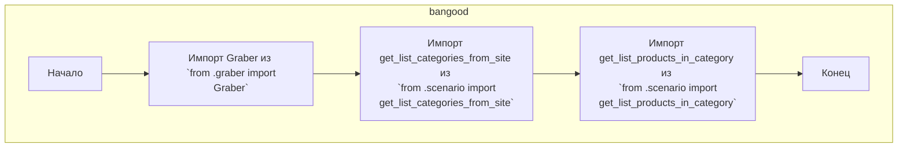

## АНАЛИЗ КОДА `src/suppliers/bangood/__init__.py`

### 1. <алгоритм>

**Блок-схема:**

**Примеры:**

*   **Импорт `Graber`**:  `from .graber import Graber` - Это импортирует класс `Graber` из модуля `graber.py`, расположенного в том же каталоге `bangood`. Это позволяет использовать класс `Graber` для создания объектов и вызова его методов в других частях кода, где необходимо получить данные с сайта Banggood.
*   **Импорт `get_list_categories_from_site`**: `from .scenario import get_list_categories_from_site` - Эта строка импортирует функцию `get_list_categories_from_site` из модуля `scenario.py`. Эта функция вероятно предназначена для сбора списка категорий товаров с сайта Banggood.
*   **Импорт `get_list_products_in_category`**: `from .scenario import get_list_products_in_category` -  Импортируется функция `get_list_products_in_category` из модуля `scenario.py`.  Она, по-видимому, используется для получения списка товаров в рамках конкретной категории на сайте Banggood.

### 2. <mermaid>

**Объяснение зависимостей:**

*   Диаграмма представляет собой поток импорта модулей в файле `__init__.py` в каталоге `bangood`.
*   **`Start`**: Начальная точка, представляющая начало выполнения файла.
*   **`ImportGraber`**: Представляет импорт класса `Graber` из модуля `graber.py`. Это показывает зависимость `__init__.py` от класса `Graber`.
*   **`ImportCategoriesFunc`**: Показывает импорт функции `get_list_categories_from_site` из модуля `scenario.py`. `__init__.py` зависит от этой функции.
*   **`ImportProductsFunc`**: Демонстрирует импорт функции `get_list_products_in_category` из модуля `scenario.py`. `__init__.py` зависит от этой функции.
*   **`End`**: Конечная точка процесса импорта, когда все необходимые модули и функции были импортированы.
*   Вся диаграмма заключена в `subgraph bangood`, представляющий пакет `bangood` внутри проекта `src/suppliers`, что подчеркивает контекст этих импортов.

### 3. <объяснение>

**Импорты:**

*   `from .graber import Graber`: Импортирует класс `Graber` из модуля `graber.py`, который расположен в том же каталоге `bangood`. Этот класс, вероятно, отвечает за парсинг HTML и извлечение данных с сайта Banggood.  Он используется для сбора и структурирования информации о товарах.
*   `from .scenario import get_list_categories_from_site`: Импортирует функцию `get_list_categories_from_site` из модуля `scenario.py` внутри того же каталога. Эта функция, вероятно, реализует логику для получения списка категорий товаров с сайта Banggood.
*   `from .scenario import get_list_products_in_category`: Импортирует функцию `get_list_products_in_category` из того же модуля `scenario.py`. Эта функция, вероятно, реализует логику получения списка товаров внутри выбранной категории.

**Классы:**

*   В данном файле не определяются собственные классы, а импортируется класс `Graber` из файла `graber.py`.  `Graber`, вероятно, содержит методы для получения и обработки HTML-содержимого с сайта Banggood.

**Функции:**

*   В данном файле не определяются собственные функции, а импортируются функции `get_list_categories_from_site` и `get_list_products_in_category` из модуля `scenario.py`.
    *   `get_list_categories_from_site`: Предположительно, принимает на вход URL сайта Banggood, а возвращает список категорий товаров.
    *   `get_list_products_in_category`:  Предположительно, принимает URL конкретной категории, а возвращает список товаров из данной категории.

**Переменные:**

*   В данном файле не определяются переменные.

**Потенциальные ошибки и области для улучшения:**

*   **Отсутствие документации:** В данном файле присутствует общая документация модуля `src.suppliers.bangood`, однако отсутствует документация для импортированных классов и функций. Стоит добавить docstring для каждой функции и класса.
*   **Обработка ошибок:** При работе с сетью стоит добавить обработку потенциальных ошибок сети или ошибок при парсинге HTML.
*   **Масштабируемость:**  Код можно улучшить путем создания абстрактных классов или интерфейсов для `Graber`, чтобы в дальнейшем было проще добавлять поддержку других магазинов.

**Взаимосвязь с другими частями проекта:**

*   Данный модуль `bangood` является частью пакета `src.suppliers`. Он предоставляет интерфейс для работы с поставщиком Banggood, и его импортированные классы и функции будут использоваться в других частях проекта, где требуется сбор информации о товарах.
*   Скорее всего, данный модуль используется в модуле, где организуется работа по сбору данных с различных поставщиков.
*   Файл `__init__.py` выполняет роль точки входа и связывает между собой модули `graber.py` и `scenario.py`, делая их доступными для импорта из пакета `src.suppliers.bangood`.