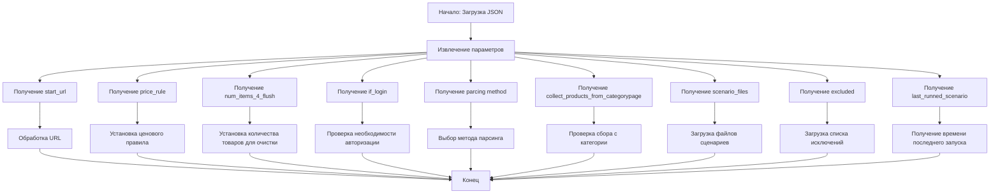

## АНАЛИЗ КОДА

### 1. <алгоритм>
Представленный код — это JSON-файл, описывающий конфигурацию для парсера интернет-магазина Banggood. Его можно представить следующим образом:

1.  **Начало**: Загрузка JSON-файла конфигурации.
    *   _Пример_: Файл `bangood.json` загружается в программу парсинга.
2.  **Чтение параметров**: Извлечение основных параметров парсинга.
    *   _Пример_:  `supplier = "ksp"`, `supplier_prefix = "ksp"`, `start_url = "https://www.banggood.com/search/rc-drones.html?...`
3.  **Обработка URL**: Получение начального URL для парсинга.
    *   _Пример_: Используется `start_url`.
4.  **Установка ценового правила**:  Определение способа корректировки цены.
    *   _Пример_: `price_rule = "+100"` означает увеличение цены на 100 единиц.
5.  **Определение количества товаров для очистки**: Установка количества товаров для обработки перед очисткой кэша.
     *   _Пример_: `num_items_4_flush = 300` означает, что после 300 обработанных товаров будет выполнена очистка.
6.  **Определение необходимости авторизации**: Проверка, требуется ли вход в систему.
     *   _Пример_:  `if_login = false` означает, что авторизация не требуется.
7.  **Выбор метода парсинга**: Определение, какой метод будет использоваться для парсинга (веб-драйвер или API).
     *   _Пример_: `parcing method [webdriver|api] = "web"` означает использование веб-драйвера.
8.  **Установка режима сбора товаров с категории**: Определение, нужно ли собирать товары напрямую со страницы категории.
    *   _Пример_: `collect_products_from_categorypage = false` - товары с категорий собирать не нужно.
9.  **Получение списка файлов сценариев**: Загрузка списка файлов сценариев.
    *   _Пример_: `scenario_files` содержит имена файлов для обработки категорий.
10. **Получение списка исключений**: Загрузка списка исключенных файлов сценариев.
    *   _Пример_: `excluded` содержит имена файлов, которые нужно исключить из обработки.
11. **Получение времени последнего запуска сценария**: Загрузка времени последнего запуска сценария.
    *   _Пример_:  `last_runned_scenario = ""` - означает, что сценарий не запускался.

    **Поток данных:**

    JSON-файл -> Параметры парсинга -> URL -> Правило цены -> Количество товаров для очистки -> Флаг авторизации -> Метод парсинга -> Список файлов сценариев -> Список исключений -> Время последнего запуска

### 2. <mermaid>

**Объяснение диаграммы:**
-   `Start` – начало процесса, загрузка JSON-файла конфигурации.
-   `ParseParams` –  извлечение всех параметров из JSON.
-   `URL` – получение начального URL.
-   `PriceRule` – получение правила изменения цены.
-   `ItemsFlush` – получение количества товаров, после обработки которых нужно сделать сброс кеша.
-   `LoginRequired` – получение флага, определяющего нужна ли авторизация.
-    `ParsingMethod` – получение метода парсинга.
-   `CollectFromCategory` – получение флага, определяющего нужно ли собирать товары с категории.
-   `ScenarioFiles` – получение списка файлов сценариев.
-   `ExcludedFiles` – получение списка исключений.
-    `LastRun` - получение времени последнего запуска.
-   `ProcessURL` – обработка URL.
-    `ProcessPriceRule` – установка ценового правила.
-   `ProcessItemsFlush` – установка количества товаров для очистки.
-   `CheckLogin` – проверка необходимости авторизации.
-   `ChooseParsingMethod` – выбор метода парсинга.
-  `CheckCategoryCollection` – проверка сбора с категории.
-  `LoadScenarioFiles` – загрузка файлов сценариев.
-   `LoadExcludedFiles` – загрузка списка исключений.
-    `GetLastRunTime` - получение времени последнего запуска.
-   `End` – конец процесса.

### 3. <объяснение>

-   **Импорты**:  В данном фрагменте кода нет явных импортов, поскольку это JSON, а не Python-файл. Однако, в контексте проекта `src` предполагается, что этот JSON будет загружен и обработан Python скриптами.
-   **Классы**: В коде нет классов. JSON-файл представляет собой структуру данных, которая будет использоваться классами-парсерами.
-   **Функции**: В данном файле функции отсутствуют.
-   **Переменные**: JSON файл содержит набор переменных, определяющих параметры для парсинга сайта Banggood.
    *   `supplier`: Имя поставщика (в данном случае "ksp").
    *   `supplier_prefix`: Префикс поставщика (тоже "ksp").
    *   `start_url`: URL начальной страницы для парсинга.
    *   `price_rule`: Правило корректировки цены ("+100").
    *  `num_items_4_flush`: Количество товаров для обработки перед сбросом кеша.
    *   `if_login`: Флаг, указывающий на необходимость авторизации (false).
    *    `parcing method [webdriver|api]`: Метод парсинга (web - через webdriver).
    *   `about method web scrapping [webdriver|api]`: Комментарий о методе веб-парсинга.
    *   `collect_products_from_categorypage`: флаг, который говорит нужно ли собирать товары со страницы категории.
    *   `scenario_files`: Список файлов сценариев для парсинга.
    *   `excluded`: Список файлов сценариев, которые должны быть исключены.
    *  `last_runned_scenario`:  Последнее время запуска сценария.

-   **Взаимосвязи с другими частями проекта**:
    - Этот файл используется в качестве конфигурации для парсеров, которые, вероятно, располагаются в других частях проекта (`src.`). Парсеры используют данные из этого JSON для настройки своей работы. Например, `start_url` указывает, откуда начать сбор данных, а `price_rule` — как обрабатывать цены. Файлы сценариев, указанные в `scenario_files` и `excluded`, вероятно, управляют выбором категорий и брендов для парсинга.
-   **Потенциальные ошибки и области для улучшения**:
    -   **Опечатки в названии**:  `parcing method`  - правильное написание parsing.
    -   **Неоднозначность**: Комментарий `about method web scrapping [webdriver|api]` можно убрать или сделать более точным.
    -   **Жестко закодированные параметры**:  Все параметры заданы непосредственно в файле, что усложняет конфигурацию. Лучше использовать переменные среды или отдельный конфигурационный файл.
    -   **Расширяемость**:  Код сложно расширить, например, добавив новые правила ценообразования.
-   **Улучшения**:
    -   Перенести часть параметров в файл конфигурации или переменные окружения.
    -   Разработать более гибкую структуру правил ценообразования.
    -   Использовать более информативные имена ключей JSON.
    -   Добавить валидацию данных для предотвращения ошибок.

**Цепочка взаимосвязей с другими частями проекта:**

1.  JSON файл (этот файл `bangood.json`) загружается парсером, который, вероятно, является частью модуля `src.suppliers`.
2.  Парсер использует `start_url` для запуска процесса сканирования сайта.
3.  Затем парсер использует `price_rule` для обработки цен товаров.
4.  `num_items_4_flush` используется для управления очисткой кэша.
5.  `scenario_files` и `excluded` определяют, какие сценарии парсинга будут выполнены.
6.  Данные, полученные парсером, используются для обновления базы данных или других целей проекта.
7.  Результаты парсинга сохраняются или используются для других процессов в рамках проекта.