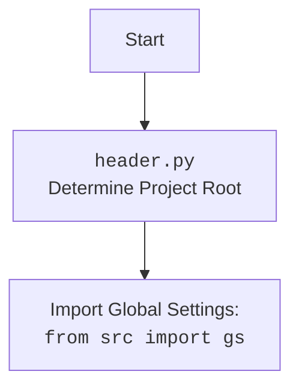

## АНАЛИЗ КОДА

### 1. <алгоритм>

**Блок-схема:**

1.  **Начало:**
    *   Запускается скрипт `header.py`.
2.  **`set_project_root`:**
    *   Определение текущего каталога файла:
        *   Пример: Если файл находится в `/home/user/hypotez/src/suppliers/bangood/header.py`, то текущий каталог будет `/home/user/hypotez/src/suppliers/bangood`.
    *   Инициализация переменной `__root__` текущим каталогом.
    *   Цикл по текущему каталогу и его родительским каталогам:
        *   Проверка наличия файлов-маркеров (`'__root__'`, `'.git'`) в текущем родительском каталоге.
            *   Пример: Проверка наличия файла `/home/user/hypotez/src/suppliers/bangood/__root__` или `/home/user/hypotez/src/suppliers/bangood/.git`.
            *   Пример: Если файл `__root__` найден в `/home/user/hypotez`, то `__root__` станет `/home/user/hypotez`, цикл прервется.
        *   Если маркер найден, `__root__` обновляется и цикл прерывается.
    *   Проверка наличия `__root__` в `sys.path`.
        *   Пример: Если `/home/user/hypotez` отсутствует в `sys.path`, то он добавляется.
    *   Возвращает `__root__` (путь к корневому каталогу проекта).
3.  **Инициализация `__root__`:**
    *   Переменной `__root__` присваивается значение, возвращенное функцией `set_project_root`.
        *   Пример: `__root__` становится `/home/user/hypotez`.
4.  **Загрузка настроек из `settings.json`:**
    *   Попытка открыть и прочитать файл `settings.json` в `/home/user/hypotez/src/settings.json`.
        *   Пример: Если файл существует и корректный JSON, данные загружаются в переменную `settings`.
    *   Если файл не найден или JSON некорректен, возникает исключение `FileNotFoundError` или `json.JSONDecodeError`, которое игнорируется.
5.  **Загрузка содержимого `README.MD`:**
    *   Попытка открыть и прочитать файл `README.MD` из `/home/user/hypotez/src/README.MD`.
        *   Пример: Если файл существует, его содержимое загружается в переменную `doc_str`.
    *   Если файл не найден, возникает исключение `FileNotFoundError` и игнорируется.
6.  **Инициализация переменных:**
    *   Переменные `__project_name__`, `__version__`, `__doc__`, `__details__`, `__author__`, `__copyright__`, `__cofee__` инициализируются значениями из `settings`, если `settings` загружены успешно. В противном случае используются значения по умолчанию.
        *   Пример: Если `settings` содержит `{"project_name": "my_project", "version": "1.0.0"}`, то `__project_name__` станет `"my_project"`, а `__version__` станет `"1.0.0"`. Если `settings` не загружен, то `__project_name__` станет `"hypotez"`, а `__version__` станет `""`.
7.  **Конец:**
    *   Скрипт завершает работу.

### 2. <mermaid>

```mermaid
flowchart TD
    Start(Начало) --> FindRoot[<code>set_project_root()</code><br>Определение корня проекта];
    FindRoot --> CheckParentDir[Проверка на маркерные файлы в родительских директориях];
    CheckParentDir -- Маркер найден --> SetRoot[Установить корень проекта];
    CheckParentDir -- Маркер не найден --> NextParent[Перейти к следующей родительской директории];
    NextParent -- Есть еще родительские --> CheckParentDir
    NextParent -- Нет родительских --> SetRoot
    SetRoot --> AddRootToPath[Добавить корень проекта в sys.path];
    AddRootToPath --> LoadSettings[Загрузка настроек из <code>settings.json</code>];
    LoadSettings -- Успешно --> LoadReadme[Загрузка содержимого <code>README.MD</code>];
    LoadSettings -- Неудачно --> LoadReadme
    LoadReadme -- Успешно --> InitVariables[Инициализация переменных];
    LoadReadme -- Неудачно --> InitVariables
    InitVariables --> End(Конец);


    classDef subStyle fill:#f9f,stroke:#333,stroke-width:2px;
     class FindRoot,CheckParentDir,SetRoot,AddRootToPath,LoadSettings,LoadReadme,InitVariables subStyle;
```



**Объяснение `mermaid`:**

*   **`flowchart TD`**: Определяет тип диаграммы как блок-схему с направлением сверху вниз.
*   **`Start(Начало)`**: Начальная точка процесса.
*   **`FindRoot`**: Блок, представляющий функцию `set_project_root()`, которая определяет корень проекта.
*    **`CheckParentDir`**: Блок, представляющий проверку наличия маркерных файлов в родительских директориях.
*   **`SetRoot`**: Блок, представляющий установку корня проекта.
*   **`NextParent`**: Блок, представляющий переход к следующей родительской директории.
*   **`AddRootToPath`**: Блок, представляющий добавление корня проекта в `sys.path`.
*   **`LoadSettings`**: Блок, представляющий загрузку настроек из `settings.json`.
*   **`LoadReadme`**: Блок, представляющий загрузку содержимого `README.MD`.
*   **`InitVariables`**: Блок, представляющий инициализацию переменных.
*   **`End(Конец)`**: Конечная точка процесса.
*   **`classDef subStyle ...`**: Определяет стиль для выделения основных шагов алгоритма.
*   **`class FindRoot,CheckParentDir,SetRoot,AddRootToPath,LoadSettings,LoadReadme,InitVariables subStyle;`**: Применяет определенный стиль к блокам.
* **Импорты в `mermaid`:**
  - Диаграмма показывает, что в файле `header.py` происходит импорт глобальных настроек из `src` с использованием `from src import gs`.

### 3. <объяснение>

**Импорты:**

*   `sys`: Модуль `sys` используется для работы с параметрами и функциями, специфичными для среды выполнения. В данном случае `sys.path` используется для добавления корневого каталога проекта в путь поиска модулей.
*   `json`: Модуль `json` используется для работы с JSON-данными. В данном случае он используется для чтения файла `settings.json`, который, как ожидается, содержит настройки проекта в формате JSON.
*   `packaging.version.Version`: Импортируется класс `Version` для работы с версиями пакетов. В данном коде он не используется, вероятно, остался от предыдущих итераций кода и может быть удален.
*   `pathlib.Path`: Класс `Path` используется для представления путей к файлам и каталогам. Он облегчает работу с файловой системой, предоставляя более объектно-ориентированный интерфейс.
*   `src`: Пакет `src`, который импортируется как `from src import gs`, содержит глобальные настройки и константы, используемые в проекте. В данном случае, это используется для получения пути к корневому каталогу проекта.

**Функция `set_project_root`:**

*   **Назначение**: Функция `set_project_root` предназначена для автоматического определения корневого каталога проекта. Это делается путем поиска определенных файлов-маркеров (`'__root__'`, `'.git'`) в текущем каталоге и его родительских каталогах.
*   **Аргументы**: Функция принимает один необязательный аргумент `marker_files`, который представляет собой кортеж с именами файлов или каталогов, которые служат индикаторами корневого каталога. По умолчанию это `('__root__', '.git')`.
*   **Возвращаемое значение**: Функция возвращает объект `Path`, представляющий путь к корневому каталогу проекта. Если маркерные файлы не найдены, возвращается путь к текущему каталогу, где находится файл `header.py`.
*   **Логика**: Функция начинает с текущего каталога файла и перебирает его родительские каталоги. Если в каком-либо из каталогов найден один из маркерных файлов, то этот каталог считается корневым, и цикл прерывается. Найденный корневой каталог добавляется в `sys.path`, чтобы другие модули проекта могли быть импортированы.
*   **Пример**: Если файл `header.py` находится в `/home/user/hypotez/src/suppliers/bangood/header.py`, и файл `__root__` находится в `/home/user/hypotez`, то функция вернет `/home/user/hypotez`.

**Переменные:**

*   `__root__`: Переменная типа `Path`, хранит путь к корневому каталогу проекта. Она инициализируется результатом функции `set_project_root`.
*   `settings`: Переменная типа `dict`, хранит настройки проекта, загруженные из файла `settings.json`. Если загрузка не удалась, значение `None`.
*   `doc_str`: Переменная типа `str`, хранит содержимое файла `README.MD`. Если чтение не удалось, значение `None`.
*   `__project_name__`, `__version__`, `__doc__`, `__details__`, `__author__`, `__copyright__`, `__cofee__`: Переменные типа `str`, хранят метаданные проекта (имя, версия, документация, авторские права и т.д.), извлеченные из `settings` или значения по умолчанию.

**Потенциальные ошибки и области для улучшения:**

*   **Обработка исключений:** В блоках `try/except` не предусмотрено логирование ошибок при загрузке `settings.json` и `README.MD`, это затрудняет отладку. Можно добавить логирование ошибок в блок `except`.
*   **Обработка отсутствующих настроек:** Если файл `settings.json` отсутствует или содержит не все необходимые поля, используются значения по умолчанию. Можно улучшить обработку таких случаев, например, выводить предупреждения или использовать значения из окружения.
*   **Неиспользуемый импорт:** Импорт `packaging.version.Version` не используется, его можно удалить.
*   **Статический коментарий:**
  - Комментарий `#! venv/bin/python/python3.12` может быть убран, так как он не имеет значения для работы кода.
*  **Дублирование кода:**
  - Код обработки  `settings.json` и `README.MD` дублируется. Можно создать отдельную функцию для обработки файлов и избежать дублирования.
*  **Зависимость от `gs`:**
  - Зависимость от `gs` создает неявную связь с другими частями проекта и может усложнить тестирование `header.py`. Лучше передавать `gs.path.root` как параметр в функцию, если возможно.

**Цепочка взаимосвязей с другими частями проекта:**

*   **`set_project_root`**: Используется для определения корневого каталога, что важно для всех модулей, работающих с файловой системой проекта. Эта функция критически важна для нахождения `settings.json` и `README.MD`, а также для импорта других модулей проекта.
*   **`from src import gs`**: Зависимость от `src` обеспечивает доступ к глобальным настройкам проекта. В частности, здесь используется `gs.path.root` для получения пути к корневому каталогу проекта.
*   **Инициализация переменных**: Переменные, такие как `__project_name__`, `__version__`, и `__doc__`, могут использоваться в других частях проекта для отображения информации о проекте, например, в документации или при сборке.
*   **Модули проекта**: Путь к корневой директории, добавленный в `sys.path`, позволяет импортировать другие модули из проекта, так как он автоматически добавляется в путь поиска модулей.

**В заключение:**

Файл `header.py` выполняет важную функцию автоматического определения корневого каталога проекта, загрузки настроек и метаданных. Он является важным элементом инфраструктуры, обеспечивающим корректную работу других модулей. Однако, в коде есть некоторые моменты, которые можно улучшить, в частности обработку исключений и дублирование кода.