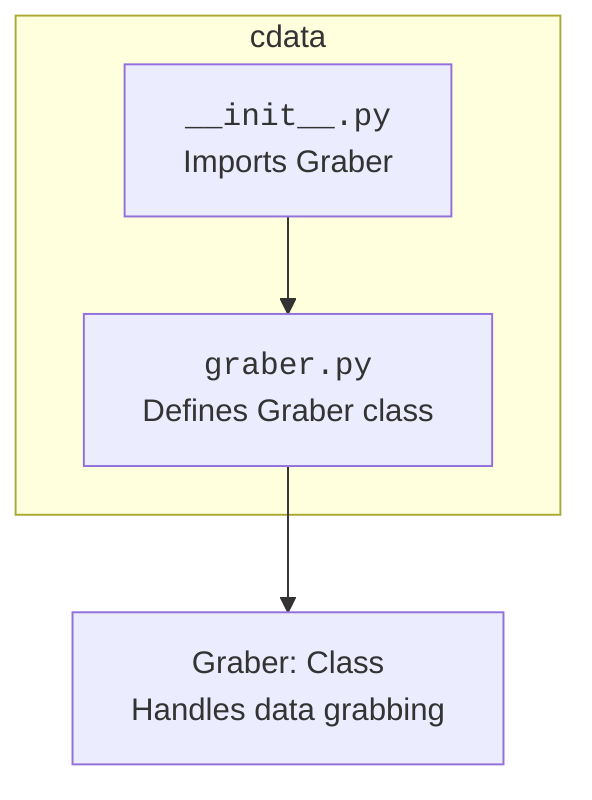

## Анализ кода `hypotez/src/suppliers/cdata/__init__.py`

### 1. <алгоритм>

**Блок-схема:**


**Описание:**

1. **Начало:** Начало выполнения файла `__init__.py`.
2. **Импорт `Graber`:** Импортируется класс `Graber` из файла `graber.py`, находящегося в той же директории `cdata`. Этот класс, вероятно, отвечает за извлечение данных (парсинг) определенного типа.
3. **Конец:** Завершение выполнения файла `__init__.py`.

**Пример:**
Представим, что в файле `graber.py` есть класс `Graber` с методом `grab_data()`, который извлекает данные из источника. Когда мы импортируем `Graber` в `__init__.py`, мы делаем этот класс доступным для использования в других модулях пакета `cdata`.
```python
# пример содержимого graber.py
class Graber:
    def grab_data(self, url):
        """Извлекает данные по указанному URL."""
        # Логика извлечения данных
        return "Данные извлечены"
```

### 2. <mermaid>


**Описание диаграммы:**

- Диаграмма показывает структуру пакета `cdata`.
- `__init__.py` импортирует класс `Graber` из `graber.py`.
- Класс `Graber` из `graber.py` используется для извлечения данных.
- **Зависимости:**
    - `__init__.py` зависит от `graber.py`.

### 3. <объяснение>

#### Импорты:

- `from .graber import Graber`:
   - **Назначение:** Импортирует класс `Graber` из файла `graber.py`, находящегося в том же пакете `cdata`.
   - **Взаимосвязь:** Делает класс `Graber` доступным для использования в других модулях, которые импортируют пакет `cdata`. Точка `.` означает, что `graber.py` находится в той же директории, что и `__init__.py`.
   - **Пример:** Если другой файл в пакете импортирует `from src.suppliers.cdata import Graber`, он сможет создать экземпляр класса `Graber`.

#### Классы:
-  `Graber` :
    - **Роль:** Представляет класс, ответственный за получение данных. В данном контексте подразумевается, что `Graber` занимается сбором и парсингом данных с определенного ресурса, например веб-сайта, API или файла.
    - **Атрибуты:** Конкретные атрибуты класса не видны в этом файле. Они определяются в `graber.py`.
    - **Методы:** Вероятнее всего, класс имеет методы для извлечения, обработки и возврата данных. Например, метод `grab_data()`.
    - **Взаимодействие:**  Этот класс предназначен для использования в других модулях проекта, которые нуждаются в получении данных. Он изолирует логику извлечения данных, что упрощает поддержку и изменение кода.

#### Файлы:

- `__init__.py`: Этот файл делает директорию `cdata` пакетом, позволяя импортировать модули и классы, содержащиеся в ней. Импортируя `Graber` в `__init__.py`, он делает этот класс доступным для импорта напрямую из пакета `cdata`.

#### Переменные:
- В данном коде нет явных переменных, кроме импортируемого класса `Graber`.

#### Потенциальные ошибки и области для улучшения:
1. **Отсутствие документации:** Код не содержит docstrings или комментариев, описывающих назначение модуля, что может затруднить понимание при дальнейшей работе.
2. **Конкретный `Graber`:** Конкретная реализация класса `Graber` не видна. Возможно, стоит сделать его более абстрактным или предоставить механизм для настройки параметров.
3. **Обработка ошибок:** В `graber.py` может потребоваться реализация более надежной обработки ошибок при получении и парсинге данных.

#### Цепочка взаимосвязей с другими частями проекта:
-  `src.suppliers.cdata` является частью пакета `src.suppliers`, который, вероятно, занимается интеграцией с различными поставщиками данных. Пакет `cdata` отвечает за сбор данных от конкретного поставщика или их типа.
- Класс `Graber` может использоваться в других модулях проекта, которые нуждаются в данных, получаемых от этого поставщика. Например, для загрузки, обработки или отображения данных.