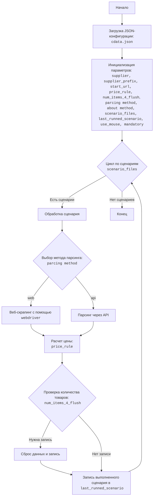

## АНАЛИЗ КОДА

### 1. <алгоритм>

JSON-файл `cdata.json` представляет собой конфигурацию для парсера поставщика `cdata`. Процесс его использования можно представить в виде следующей пошаговой блок-схемы:

1.  **Чтение конфигурации**:
    *   Парсер читает файл `cdata.json`.
    *   Пример: Загружается JSON-объект в память.

2.  **Инициализация**:
    *   Из JSON-объекта извлекаются основные параметры.
    *   Примеры:
        *   `supplier` = `"cdata"`
        *   `supplier_prefix` = `"CDT-"`
        *   `start_url` = `"https://www.c-data.co.il/"`
        *   `price_rule` = `"3.5*1.17"`
        *   `num_items_4_flush` = `300`
        *    `parcing method [webdriver|api]` = `"web"`
        *   `use_mouse` = `false`
        *    `mandatory` = `true`
       *    `about method web scrapping [webdriver|api]` = `"Если я работаю через API мне не нужен webdriver"`

3.  **Обработка `scenario_files`**:
    *   `scenario_files` содержит список сценариев.
    *   Пример: 
        *   Первый сценарий: `["cdata_categories_aio_asus.json", "cdata_categories_aio_dell.json", "cdata_categories_aio_hp.json"]`
        *   Второй сценарий: `["cdata_categories_desktops.json", "cdata_categories_gaming_desktops.json", "cdata_categories_workstatios.json"]`
        *   И так далее для остальных сценариев.

4.  **Выбор метода парсинга**:
    *   Если `parcing method` равен `"web"`, то используется `webdriver`.
    *   Если `parcing method` равен `"api"`, то используется API.
    *   В данном случае метод парсинга установлен в `"web"` (веб-скрапинг).

5.  **Применение `price_rule`**:
    *   Значение `price_rule` (`"3.5*1.17"`) используется для расчета цены товара.
    *   Пример: Итоговая цена товара вычисляется как `цена_из_парсера * 3.5 * 1.17`.

6.  **Контроль `num_items_4_flush`**:
    *   `num_items_4_flush` управляет количеством товаров, после которых данные сбрасываются/сохраняются.
    *   Пример:  После парсинга 300 товаров данные сохраняются, и затем процесс парсинга продолжается.

7. **Установка `if_list`:**
   * Параметр `if_list` может принимать значение `first`, в данном случае он имеет значение `first`. Данный параметр может отвечать за логику парсинга, например, если `if_list` установлен в `first`, обрабатываются только первые значения `scenario_files`.

8. **Установка параметров**:
    * Параметр `use_mouse` установлен в `false`, что говорит об использовании бескнопочного режима.
    * Параметр `mandatory` установлен в `true`, что говорит о том, что обработка этого поставщика обязательна.

9.  **Запись `last_runned_scenario`**:
    *   После выполнения сценария, имя выполненного сценария записывается в переменную `last_runned_scenario`.
    *   Пример: Если был выполнен первый сценарий, то `last_runned_scenario` станет `["cdata_categories_aio_asus.json", "cdata_categories_aio_dell.json", "cdata_categories_aio_hp.json"]`

### 2. <mermaid>

**Объяснение `mermaid` диаграммы:**

*   `Start`: Начало процесса обработки JSON-конфигурации.
*   `LoadConfig`: Загрузка JSON файла `cdata.json` в память для дальнейшей обработки.
*   `InitParams`: Инициализация основных параметров из загруженной JSON-конфигурации. Переменные включают:
    *   `supplier`: Название поставщика.
    *   `supplier_prefix`: Префикс для ID товаров поставщика.
    *   `start_url`: Начальный URL для сбора данных.
    *   `price_rule`: Правило для расчета цены.
    *  `num_items_4_flush`: Количество товаров для сброса данных.
    *   `parcing method`: Метод парсинга (`web` или `api`).
    * `about method`: Комментарий о методе парсинга.
    *  `scenario_files`: Массив сценариев с файлами конфигурации для парсинга.
    *   `last_runned_scenario`:  Последний запущенный сценарий.
    *   `use_mouse`:  Использование мыши `true` или `false`.
    *   `mandatory`: Является ли поставщик обязательным для обработки.
*   `ScenarioLoop`: Цикл перебирает сценарии из списка `scenario_files`.
*   `ProcessScenario`: Обработка конкретного сценария.
*   `SelectParsingMethod`: Проверка, какой метод парсинга выбран (`web` или `api`).
*   `WebScraping`:  Веб-скрапинг с использованием `webdriver`.
*   `ApiParsing`: Парсинг данных через API.
*   `CalculatePrice`: Расчет цены товара в соответствии с правилом `price_rule`.
*   `CheckFlush`: Проверка, нужно ли сбрасывать данные после обработки определенного количества товаров (`num_items_4_flush`).
*   `FlushData`: Сброс и сохранение собранных данных.
*   `UpdateLastScenario`: Обновление переменной `last_runned_scenario` с информацией о последнем обработанном сценарии.
*   `End`: Конец процесса обработки.

### 3. <объяснение>

**Импорты:**

В предоставленном JSON-коде импорты отсутствуют, так как это конфигурационный файл.

**Классы:**

JSON-файл не содержит классов.

**Функции:**

JSON-файл не содержит функций. Он является конфигурационным файлом и содержит параметры для работы парсера.

**Переменные:**

*   `supplier` (string): Имя поставщика, в данном случае `"cdata"`.
*   `supplier_prefix` (string): Префикс для ID товаров, в данном случае `"CDT-"`.
*   `if_list` (string): Параметр, указывающий, какую логику парсинга использовать. В данном случае `"first"`.
*   `use_mouse` (boolean): Указывает, нужно ли использовать мышь, в данном случае `false`.
*   `mandatory` (boolean): Указывает, является ли парсинг обязательным, в данном случае `true`.
*   `start_url` (string): URL главной страницы поставщика, `"https://www.c-data.co.il/"`.
*   `price_rule` (string):  Правило для расчета цены товара, `"3.5*1.17"`.
*   `num_items_4_flush` (number): Количество товаров для сброса данных, `300`.
*   `parcing method [webdriver|api]` (string): Метод парсинга, в данном случае `"web"`.
*   `about method web scrapping [webdriver|api]` (string): Описание метода парсинга, `"Если я работаю через API мне не нужен webdriver"`.
*   `scenario_files` (array): Массив сценариев парсинга, каждый сценарий - это массив с файлами конфигурации.
*   `last_runned_scenario` (string): Содержит последний выполненный сценарий, изначально пустая строка.

**Потенциальные ошибки и области для улучшения:**

*   **Отсутствие валидации**: Нет явной проверки типов данных или валидации значений.
*   **Жестко заданные правила**: `price_rule` является строкой, что может потребовать дополнительной обработки для вычисления. Лучше использовать структуру, которую можно легко обработать.
*   **Зависимость от строковых значений**: `parcing method` зависит от строковых значений (`"web"` и `"api"`), что может привести к ошибкам из-за опечаток.
*   **Отсутствие документации:** Необходимо добавить комментарии для  `scenario_files` - что каждый файл делает.

**Взаимосвязи с другими частями проекта:**

Данный JSON-файл является частью конфигурации парсера и вероятно будет использоваться в `src/suppliers/parser.py` или в схожем месте. При запуске парсера, файл `cdata.json` будет загружен, а затем на основе его параметров будет настроен процесс парсинга для сайта поставщика `"cdata"`.

**Цепочка взаимосвязей:**
1.  Файл `cdata.json` используется для конфигурации парсера.
2.  Парсер, вероятно, находится в `src/suppliers/parser.py` или аналогичном файле.
3.  `parser.py` читает `cdata.json`, чтобы получить параметры парсинга.
4.  `parser.py` использует эти параметры для сбора данных с сайта поставщика `cdata` (https://www.c-data.co.il/).
5.  Собранные данные обрабатываются и сохраняются.