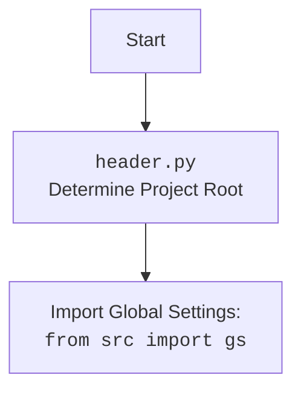

## ИНСТРУКЦИЯ:

Анализируй предоставленный код подробно и объясни его функциональность. Ответ должен включать три раздела:  

1. **<алгоритм>**: Опиши рабочий процесс в виде пошаговой блок-схемы, включая примеры для каждого логического блока, и проиллюстрируй поток данных между функциями, классами или методами.  
2. **<mermaid>**: Напиши код для диаграммы в формате `mermaid`, проанализируй и объясни все зависимости, 
    которые импортируются при создании диаграммы. 
    **ВАЖНО!** Убедитесь, что все имена переменных, используемые в диаграмме `mermaid`, 
    имеют осмысленные и описательные имена. Имена переменных вроде `A`, `B`, `C`, и т.д., не допускаются!  
    
    **Дополнительно**: Если в коде есть импорт `import header`, добавьте блок `mermaid` flowchart, объясняющий `header.py`:\
    ```mermaid
    flowchart TD
        Start --> Header[<code>header.py</code><br> Determine Project Root]
    
        Header --> import[Import Global Settings: <br><code>from src import gs</code>] 
    ```

3. **<объяснение>**: Предоставьте подробные объяснения:  
   - **Импорты**: Их назначение и взаимосвязь с другими пакетами `src.`.  
   - **Классы**: Их роль, атрибуты, методы и взаимодействие с другими компонентами проекта.  
   - **Функции**: Их аргументы, возвращаемые значения, назначение и примеры.  
   - **Переменные**: Их типы и использование.  
   - Выделите потенциальные ошибки или области для улучшения.  

Дополнительно, постройте цепочку взаимосвязей с другими частями проекта (если применимо).  

Это обеспечивает всесторонний и структурированный анализ кода.
## Формат ответа: `.md` (markdown)
**КОНЕЦ ИНСТРУКЦИИ**

## <алгоритм>

1. **Начало:**
   - Скрипт начинает выполнение.

2. **Определение `set_project_root`:**
   - Функция `set_project_root` вызывается для определения корневой директории проекта.
   - **Пример:** `marker_files` установлены как `('__root__', '.git')`.

3. **Поиск корневой директории:**
   - Функция получает путь к текущему файлу (`__file__`) и его родительскую директорию.
     - **Пример:**  Если текущий файл находится в `hypotez/src/suppliers/cdata/header.py`, то `current_path` будет `hypotez/src/suppliers/cdata`.
   -  Переменная `__root__` изначально устанавливается равной `current_path`.
   - Функция итерируется по родительским директориям, начиная с `current_path`.
   - Для каждой директории проверяется наличие одного из файлов-маркеров (`__root__`, `.git`).
   - Если маркер найден, `__root__` обновляется до родительской директории, и цикл прерывается.
    - **Пример:** Если `.git` найден в `hypotez`, то `__root__` будет установлен в `hypotez`.
   - Если корневая директория не найдена, `__root__` остается равным директории где скрипт расположен `hypotez/src/suppliers/cdata`.
4. **Добавление корневой директории в `sys.path`:**
   - Проверяется, находится ли `__root__` в списке путей поиска модулей `sys.path`.
   - Если нет, путь к корневой директории добавляется в начало `sys.path`
   - Функция возвращает путь к корневой директории.
   - **Пример:** если `__root__` равен `hypotez`, то в `sys.path` будет добавлен `hypotez`
5. **Сохранение корня проекта:**
    - Переменная `__root__` сохраняет возвращённое значение функции `set_project_root()`.
6. **Импорт глобальных настроек:**
   - Импортируются глобальные настройки из модуля `src.gs`.
7. **Загрузка настроек:**
   - Пытается открыть файл `settings.json`, находящийся в `src` директории корневого каталога, загрузить настройки в словарь `settings`.
   - Если файл не найден или не является валидным JSON, то пропускается.
8. **Чтение документации:**
   - Пытается открыть `README.MD`, находящийся в `src` директории корневого каталога, и загрузить его содержимое в `doc_str`.
   - Если файл не найден, или не удается прочитать пропускается.
9. **Определение переменных:**
    - Переменные  `__project_name__`, `__version__`, `__doc__`, `__details__`, `__author__`, `__copyright__`, `__cofee__` инициализируются значениями из словаря `settings` или значениями по умолчанию.
10. **Завершение:**
    - Скрипт завершает выполнение.

## <mermaid>
```mermaid
flowchart TD
    Start --> SetProjectRoot[<code>set_project_root()</code><br>Find Project Root]
    SetProjectRoot --> FindParentDir[Get Current File Path<br> & Parent Directories]
    FindParentDir --> CheckMarkerFiles[Check for Marker Files<br>('__root__', '.git')]
    CheckMarkerFiles -- Marker Found --> UpdateRoot[Update Project Root]
    UpdateRoot --> BreakLoop[Break Loop]
    CheckMarkerFiles -- No Marker --> NextParent[Move to Next Parent Directory]
     NextParent --> CheckMarkerFiles
    CheckMarkerFiles -- All Parent Checked --> UseCurrentDir[Use Current Dir as Project Root]
    UseCurrentDir --> CheckSysPath[Check if Project Root in sys.path]
    UpdateRoot --> CheckSysPath
    BreakLoop --> CheckSysPath
    CheckSysPath -- Not in sys.path --> InsertSysPath[Insert Root to sys.path]
    InsertSysPath --> ReturnRoot[Return Project Root Path]
    CheckSysPath --  In sys.path --> ReturnRoot[Return Project Root Path]
    ReturnRoot --> SaveRoot[Save Project Root to __root__]
    SaveRoot --> ImportGS[Import Global Settings: <br><code>from src import gs</code>]
     ImportGS --> LoadSettings[Load settings from <br> <code>settings.json</code>]
    LoadSettings -- Success --> LoadDocString[Load <code>README.md</code>]
    LoadSettings -- Failed --> LoadDocString
    LoadDocString -- Success --> DefineVariables[Define Global Variables]
    LoadDocString -- Failed --> DefineVariables
    DefineVariables --> End
    
    
    
    
    
    
    
    
    
    
    
    
     
     
    style Start fill:#f9f,stroke:#333,stroke-width:2px
    style End fill:#f9f,stroke:#333,stroke-width:2px
```



### Анализ зависимостей `mermaid`:

- **`flowchart TD`**:  Определяет тип диаграммы как блок-схему (flowchart) и направление потока сверху вниз (Top Down).
- **`Start`**: Начало выполнения скрипта.
- **`SetProjectRoot`**: Вызов функции `set_project_root()` для определения корня проекта.
- **`FindParentDir`**: Получение абсолютного пути текущего файла и его родительских директорий.
- **`CheckMarkerFiles`**: Проверка наличия файлов-маркеров ( `__root__`, `.git`) в каждой родительской директории.
- **`UpdateRoot`**:  Обновление переменной `__root__` в случае нахождения файла-маркера.
- **`BreakLoop`**: Выход из цикла.
- **`NextParent`**: Переход к следующей родительской директории.
- **`UseCurrentDir`**: Использует текущую директорию как корневую, если маркер не найден.
- **`CheckSysPath`**: Проверяет, находится ли путь к корневой директории в `sys.path`.
- **`InsertSysPath`**: Вставляет путь к корневой директории в `sys.path` если ее там нет.
- **`ReturnRoot`**: Возвращает путь к корневой директории.
- **`SaveRoot`**: Сохраняет путь к корневой директории в глобальную переменную `__root__`.
- **`ImportGS`**: Импорт глобальных настроек из модуля `src.gs`.
- **`LoadSettings`**: Попытка загрузить настройки из файла `settings.json`.
- **`LoadDocString`**: Попытка загрузить контент из файла `README.MD`
- **`DefineVariables`**: Определение переменных проекта с использованием загруженных данных или значений по умолчанию.
- **`End`**: Завершение работы скрипта.

-  **Второй блок**
    - **`Start`**: Начало процесса.
    - **`Header`**: Обозначает выполнение скрипта `header.py`.
    - **`Import`**: Импорт глобальных настроек из `src.gs`.

## <объяснение>

**Импорты:**

- `sys`:  Используется для доступа к системным параметрам и функциям, в частности для изменения `sys.path` (списка путей поиска модулей).
- `json`: Используется для работы с JSON-файлами, в частности для загрузки настроек из `settings.json`.
- `packaging.version.Version`: Импортируется класс `Version` из библиотеки `packaging` для работы с версиями.
- `pathlib.Path`:  Используется для работы с путями к файлам и директориям в объектно-ориентированном стиле.
- `src.gs`:  Импортируется модуль глобальных настроек, который предположительно содержит пути к ресурсам проекта (например, путь к корневой директории проекта) и общие настройки.  Это позволяет получить доступ к общим ресурсам проекта, например путям к файлам,  независимо от того, где находится текущий файл.

**Функции:**

- `set_project_root(marker_files: tuple) -> Path`:
    - **Аргументы:**
        - `marker_files` (tuple): Кортеж имен файлов или директорий, которые используются для идентификации корневой директории проекта.
    - **Возвращаемое значение:**
        - `Path`: Объект Path, представляющий путь к корневой директории проекта.
    - **Назначение:**
        - Функция определяет корневую директорию проекта, идя вверх по дереву директорий, пока не найдет один из файлов-маркеров.
        - Добавляет путь к корневой директории в `sys.path`, чтобы модули в проекте можно было импортировать без проблем.
        - Функция гарантирует, что корневая директория проекта всегда будет известна,  и это позволяет модулям внутри проекта импортировать другие модули, используя относительные пути от корня.
    - **Пример:**
        ```python
        root_path = set_project_root(marker_files=(".git", "__root__"))
        print(root_path) # Output: Path("/path/to/project")
        ```

**Переменные:**
- `__root__`: (Path) Путь к корневой директории проекта. Определяется в результате работы функции `set_project_root`.
- `settings`: (dict) Словарь с настройками проекта, загруженный из файла `settings.json`, если загрузка прошла успешно.
- `doc_str`: (str) Строка с содержимым `README.MD`, если файл удалось прочитать.
- `__project_name__`: (str) Имя проекта, полученное из `settings`, иначе по умолчанию `'hypotez'`.
- `__version__`: (str) Версия проекта, полученная из `settings`, иначе пустая строка `''`.
- `__doc__`: (str) Содержимое файла `README.MD` или пустая строка `''`.
- `__details__`: (str) Пустая строка `''`.
- `__author__`: (str) Автор проекта, полученный из `settings`, иначе пустая строка `''`.
- `__copyright__`: (str) Авторские права проекта, полученные из `settings`, иначе пустая строка `''`.
- `__cofee__`: (str) Сообщение о возможности угостить разработчика кофе, полученное из `settings`, иначе значение по умолчанию.

**Взаимосвязи с другими частями проекта:**

- `src.gs`:  Используется для получения доступа к глобальным настройкам проекта, что позволяет  скрипту находить файлы и директории,  и настраивать себя, в зависимости от настроек проекта.
- `settings.json`: Содержит общие настройки проекта, такие как имя, версия, авторские права и др.
- `README.MD`: Содержит документацию к проекту.

**Потенциальные ошибки и области для улучшения:**

- Обработка ошибок при чтении файлов `settings.json` и `README.MD` выполняется только как `pass`. Логирование ошибок могло бы помочь в диагностике проблем при загрузке данных.
- `set_project_root` не обрабатывает ситуации, когда маркерные файлы могут находиться в разных местах.  Было бы полезно добавить проверку, что маркер находится в ожидаемом месте.
- Используется несколько пустых строк подряд, стоит привести форматирование к общему стилю проекта.

**Цепочка взаимосвязей с другими частями проекта:**

1.  Скрипт `header.py` определяет корень проекта, что необходимо для корректной работы всех модулей проекта, которые могут импортироваться, используя относительные пути.
2.  Скрипт загружает настройки из файла `settings.json`, используя `src.gs`, которые влияют на поведение всего проекта.
3.  Загружается документация из файла `README.MD`.
4.  Определяются глобальные переменные, которые используются в других частях проекта для получения общей информации о проекте.

Таким образом, `header.py` является важным скриптом в проекте, который обеспечивает общую среду для всех модулей и позволяет им корректно работать, используя общие ресурсы и настройки.