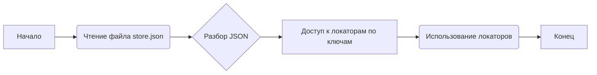
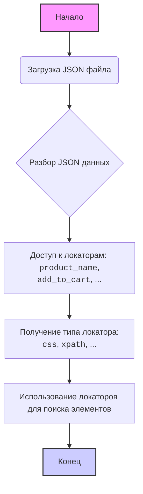

## Анализ кода `hypotez/src/suppliers/cdata/locators/store.json`

### 1. <алгоритм>

Файл `store.json` представляет собой JSON-файл, который содержит структуру данных, описывающую локаторы для взаимодействия с элементами веб-страницы (вероятно, для тестирования или сбора данных). Поскольку это статический файл данных, алгоритм его использования сводится к чтению и разбору содержимого JSON.

**Блок-схема:**



**Примеры:**

1. **Чтение файла `store.json`**: Файл загружается в память, обычно с помощью функций работы с файловой системой (например, `open()` в Python).
    ```python
    import json
    with open('store.json', 'r') as file:
        data = json.load(file)
    ```

2. **Разбор JSON**: Содержимое файла преобразуется из JSON-строки в структуру данных, понятную для программы (например, словарь в Python).
    ```python
    # data - это словарь, соответствующий структуре JSON файла.
    # Например:
    # {
    #   "product_name": {"css": ".product_name"},
    #   "add_to_cart": {"xpath": "//button[@id='add_cart']"}
    # }
    ```

3. **Доступ к локаторам по ключам**: Локаторы извлекаются из структуры данных по их ключам.
    ```python
    product_name_locator = data['product_name'] # {'css': '.product_name'}
    add_to_cart_locator = data['add_to_cart'] # {'xpath': "//button[@id='add_cart']"}
    ```

4. **Использование локаторов**: Локаторы применяются для поиска элементов на веб-странице.
    ```python
    # Предполагается, что используется какой-либо инструмент для веб-автоматизации
    # (например, Selenium)
    # element = driver.find_element(product_name_locator['css'])
    # element = driver.find_element(By.XPATH, add_to_cart_locator['xpath'])
    ```

### 2. <mermaid>



**Объяснение зависимостей:**

*   **`Загрузка JSON файла`**: Этот шаг требует наличия файла `store.json` и инструмента для его чтения (например, `open()` в Python).
*   **`Разбор JSON данных`**: Для этого необходима библиотека для работы с JSON, например, `json` в Python.
*   **`Доступ к локаторам`**: Зависит от структуры JSON-файла и предполагает наличие ключей, по которым извлекаются данные. Примеры: `product_name`, `add_to_cart`.
*   **`Получение типа локатора`**: Предполагает, что каждый локатор в JSON содержит информацию о типе селектора, например: `css`, `xpath`, `id` и т.д.
*   **`Использование локаторов для поиска элементов`**: Зависит от инструмента для веб-автоматизации, который использует эти локаторы (например, Selenium).

### 3. <объяснение>

**Импорты:**

В данном файле `store.json` нет импортов, так как это файл данных, а не программный код. Однако, для работы с этим файлом в коде, потребуются импорты:

*   `json`: Модуль для работы с JSON (чтение, запись, разбор). `json`  модуль обычно входит в стандартную библиотеку python. Он необходим для преобразования содержимого файла `store.json` в структуру данных python (например, словарь).

**Классы:**

В файле `store.json` нет классов, так как это файл статических данных.

**Функции:**

В файле `store.json` нет функций. Файл содержит только структуру данных в формате JSON.

**Переменные:**

В файле `store.json` определяются переменные, соответствующие ключам в JSON объекте. Значения переменных являются локаторами:

*   Ключи: `product_name`, `add_to_cart`
*   Значения: объекты JSON, содержащие тип локатора (например `css`, `xpath`) и значение локатора.

**Потенциальные ошибки и улучшения:**

1.  **Некорректный JSON**: Ошибка при разборе JSON (например, из-за синтаксической ошибки в JSON файле). Это приведет к сбою при использовании файла.
2.  **Отсутствие ключей**: Отсутствие ожидаемых ключей в файле, приведет к `KeyError` при попытке доступа к ним.
3.  **Некорректные значения локаторов**: Если значения локаторов не соответствуют структуре веб-страницы, поиск элементов по ним завершится неудачей.
4.  **Изменения в структуре веб-страницы**: При изменении структуры HTML страницы, локаторы могут стать неактуальными и их необходимо будет обновлять.
5.  **Отсутствие документации**: Необходимо добавлять документацию к значениям, чтобы понимать предназначение локатора и место на странице.

**Цепочка взаимосвязей с другими частями проекта:**

1.  **`suppliers/cdata/`**: Данные из `store.json` используются в модулях, отвечающих за сбор данных о поставщиках (в модуле `cdata`), так как он является частью модуля `suppliers`.
2.  **`src.tests`**: Файл `store.json` используется в тестах для поиска элементов веб-страницы.
3. **`src.locators`**: Содержимое `store.json` может использоваться в качестве источника локаторов, в файлах которые отвечают за их хранения.

Таким образом, файл `store.json` играет ключевую роль в проекте, предоставляя данные, необходимые для взаимодействия с элементами веб-страниц. Любые изменения в структуре этого файла могут затронуть работу других частей проекта.