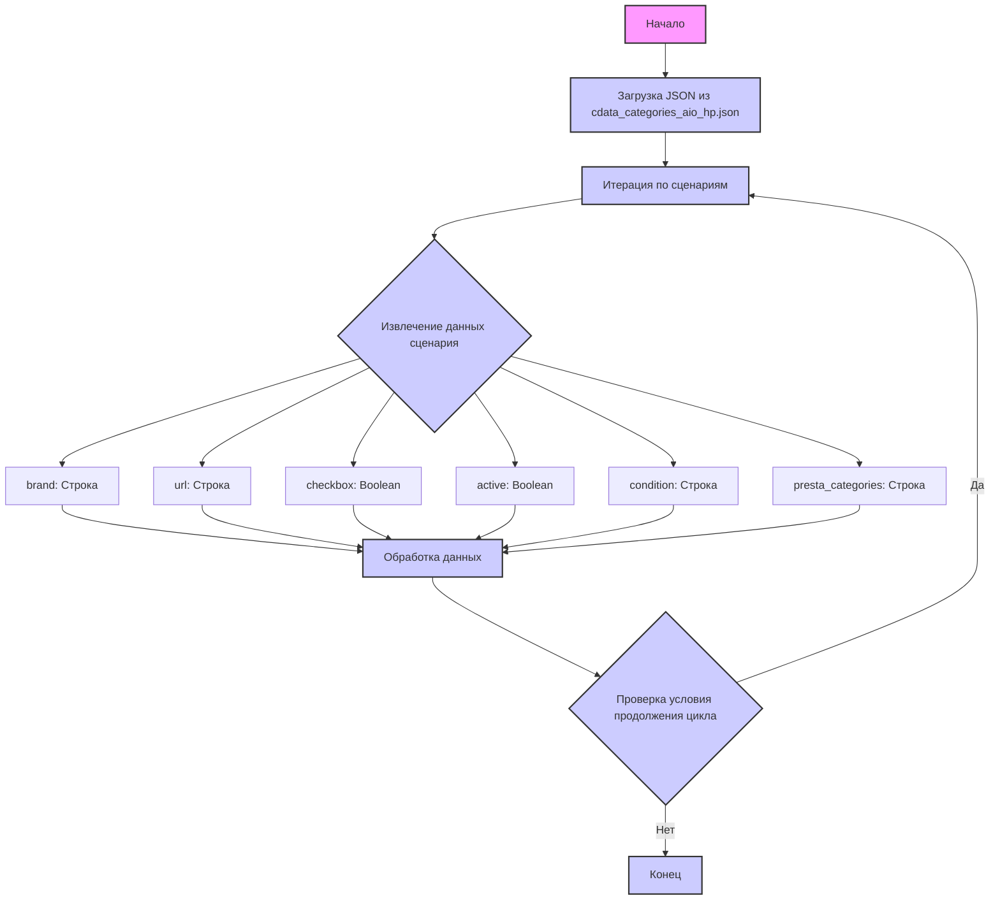

## ИНСТРУКЦИЯ:

Анализируй предоставленный код подробно и объясни его функциональность. Ответ должен включать три раздела:

1.  **<алгоритм>**: Опиши рабочий процесс в виде пошаговой блок-схемы, включая примеры для каждого логического блока, и проиллюстрируй поток данных между функциями, классами или методами.
2.  **<mermaid>**: Напиши код для диаграммы в формате `mermaid`, проанализируй и объясни все зависимости,
    которые импортируются при создании диаграммы.
    **ВАЖНО!** Убедитесь, что все имена переменных, используемые в диаграмме `mermaid`,
    имеют осмысленные и описательные имена. Имена переменных вроде `A`, `B`, `C`, и т.д., не допускаются!

    **Дополнительно**: Если в коде есть импорт `import header`, добавьте блок `mermaid` flowchart, объясняющий `header.py`:
    ```mermaid
    flowchart TD
        Start --> Header[<code>header.py</code><br> Determine Project Root]

        Header --> import[Import Global Settings: <br><code>from src import gs</code>]
    ```

3.  **<объяснение>**: Предоставьте подробные объяснения:
    -   **Импорты**: Их назначение и взаимосвязь с другими пакетами `src.`.
    -   **Классы**: Их роль, атрибуты, методы и взаимодействие с другими компонентами проекта.
    -   **Функции**: Их аргументы, возвращаемые значения, назначение и примеры.
    -   **Переменные**: Их типы и использование.
    -   Выделите потенциальные ошибки или области для улучшения.

Дополнительно, постройте цепочку взаимосвязей с другими частями проекта (если применимо).

Это обеспечивает всесторонний и структурированный анализ кода.
## Формат ответа: `.md` (markdown)
**КОНЕЦ ИНСТРУКЦИИ**

### <алгоритм>

1.  **Начало**: Загрузка JSON-данных из файла `cdata_categories_aio_hp.json`.
    *   Пример: Данные представляют собой словарь, где ключом является `"scenarios"`, а значением – словарь с набором сценариев для All-In-One компьютеров HP.
2.  **Итерация по сценариям**: Проход по каждому элементу внутри словаря `scenarios`. Каждый элемент представляет собой отдельный сценарий.
    *   Пример: Первый сценарий `"HP 21.5 - I3"`:
        ```json
        {
          "brand": "HP",
          "url": "https://reseller.c-data.co.il/All-In-One#/specFilters=227m!#-!4633!-#!225!#-!6058&manFilters=2",
          "checkbox": false,
          "active": true,
           "condition":"new",
          "presta_categories": "35,37,46,41"
        }
        ```
3.  **Анализ сценария**: Для каждого сценария извлекаются следующие поля:
    *   `brand` (строка): Марка компьютера ("HP").
    *   `url` (строка): URL-адрес страницы товара на сайте поставщика.
    *   `checkbox` (логическое значение): Флаг, указывающий на состояние чекбокса (всегда `false` в данном случае).
    *   `active` (логическое значение): Флаг, указывающий, активен ли сценарий (всегда `true` в данном случае).
    *   `condition` (строка): Состояние товара ("new" в данном случае).
    *   `presta_categories` (строка): Строка, содержащая идентификаторы категорий PrestaShop, разделенные запятыми.
4.  **Обработка данных**:
    *   Значения полей, таких как `brand`, `url`, `condition`, `presta_categories` и другие, используются для дальнейшей обработки, например, для парсинга веб-страниц или импорта данных в базу.
    *   `presta_categories` может быть преобразован в список целых чисел.
5.  **Завершение**: После обработки всех сценариев процесс завершается.
6.  **Цепочка взаимосвязей**: Данные из этого файла могут использоваться для настройки процесса извлечения данных с сайта c-data.  На основе `url` производится парсинг веб страниц, а `presta_categories` используются для сопоставления товаров с категориями в PrestaShop.

### <mermaid>



**Объяснение диаграммы `mermaid`:**

*   `Start`: Начало процесса обработки данных.
*   `LoadJson`: Загружает данные JSON из файла `cdata_categories_aio_hp.json`.
*   `LoopScenarios`: Итерирует по каждому сценарию в загруженных данных.
*    `ExtractScenarioData`: Извлекает данные из текущего сценария.
*   `Brand`, `Url`, `Checkbox`, `Active`, `Condition`, `PrestaCategories`: Представляют собой извлеченные поля данных сценария.
    *   `brand`: Марка продукта (например, "HP").
    *   `url`: URL-адрес страницы продукта.
    *   `checkbox`: Статус чекбокса (всегда false в данном файле).
    *   `active`: Статус активности сценария (всегда true в данном файле).
    *    `condition`: Состояние товара (например, "new").
    *   `presta_categories`: Список идентификаторов категорий PrestaShop, разделенных запятыми.
*   `ProcessData`:  Обрабатывает извлеченные данные.
*    `ConditionCheck`: Проверяет условие, чтобы продолжить цикл, переходя к следующему сценарию, или завершить.
*   `End`: Конец процесса обработки.

### <объяснение>

**Общее описание:**

Предоставленный JSON-файл `cdata_categories_aio_hp.json` содержит конфигурационные данные для парсинга и обработки информации о All-In-One компьютерах марки HP на сайте c-data.co.il. Каждый объект в массиве `scenarios` описывает конкретную конфигурацию компьютера (например, HP 21.5 - I3, HP 23.8 I5).

**Разбор полей каждого сценария:**

*   `brand`: `"HP"` - Указывает на то, что все сценарии относятся к бренду HP.
*   `url`: Содержит URL-адрес страницы товара на сайте поставщика. Этот URL используется для получения подробной информации о конкретной модели компьютера. Некоторые URL заменены строками, это может указывать на то, что они не используются, или URL для этих позиций будет добавлен на следующем этапе.
*   `checkbox`: Всегда установлен в `false`. Вероятно, это поле предназначено для настройки видимости элементов в каком-то интерфейсе, но в контексте этого файла его значение всегда `false`.
*   `active`: Всегда установлен в `true`, что указывает на активность всех этих сценариев.
*   `condition`: Всегда установлен в `"new"`, что указывает на то, что все товары в этих сценариях новые.
*   `presta_categories`: Строка, содержащая идентификаторы категорий PrestaShop, к которым должен быть отнесен данный товар. Идентификаторы категорий разделены запятыми.

**Назначение и использование:**

*   Этот файл служит источником данных для автоматизации процесса сбора информации о товарах, их ценах и характеристиках, представленных на сайте c-data.co.il.
*   URL-адреса используются для парсинга веб-страниц и извлечения необходимых данных.
*   `presta_categories` используются для сопоставления товаров с соответствующими категориями в PrestaShop.

**Потенциальные проблемы и улучшения:**

1.  **Отсутствие обработки ошибок:** Не предусмотрено механизмов обработки ошибок при загрузке JSON или при парсинге страниц.
2.  **Жестко закодированные значения:**  Значения `checkbox` и `active` всегда `false` и `true` соответственно. Это может указывать на избыточность этих полей.
3.  **Необработанные URL:** Некоторые URL-адреса заменены на заглушки. Необходимо убедиться, что для всех продуктов есть корректные URL-адреса.
4.  **Структура данных:** Возможно, более гибким решением было бы представление `presta_categories` как списка целых чисел, а не строки, разделенной запятыми.
5.  **Расширяемость**: В текущем виде файл ограничен маркой HP. Возможно, потребуется добавить поддержку других брендов.

**Цепочка взаимосвязей с другими частями проекта:**

1.  **Парсинг веб-страниц:** URL-адреса из этого файла используются для загрузки HTML-страниц с сайта c-data.co.il, которые затем анализируются для получения данных о товарах.
2.  **Импорт данных в PrestaShop:** `presta_categories` используются для определения категорий товаров при их импорте в PrestaShop.
3.  **Конфигурация:** Данные из этого файла определяют, какие именно товары и с какими параметрами нужно собирать.

**В заключение:**

Этот файл представляет собой конфигурационный файл, который определяет, какие сценарии парсинга и импорта данных нужно выполнить. Потенциальные проблемы и улучшения касаются обработки ошибок, избыточности некоторых полей, необходимости обработки заглушек URL и расширения функциональности.