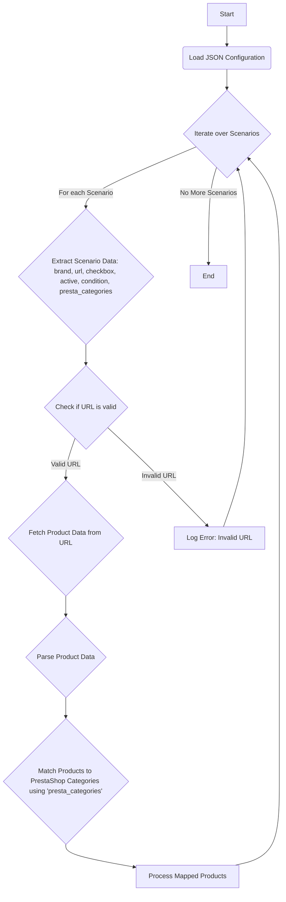

## АНАЛИЗ КОДА

### 1. <алгоритм>

**Описание алгоритма**:
Этот JSON-файл описывает сценарии для парсинга категорий "Игровые компьютеры" для поставщика C-Data. Каждый сценарий представляет собой конфигурацию для конкретной модели или линейки компьютеров, включая бренд, URL для парсинга, флаг активности, условие и связанные категории PrestaShop.

**Блок-схема:**

```mermaid
graph TD
    A[Начало] --> B{Выбрать сценарий из "scenarios"};
    B -- Выбран сценарий --> C{Проверка наличия полей "brand", "url", "checkbox", "active", "condition", "presta_categories"};
    C -- Все поля есть --> D{Извлечение значений полей для выбранного сценария};
    D --> E{Использование значений для парсинга товаров с сайта C-Data};
    E --> F{Сопоставление найденных товаров с категориями PrestaShop};
    F --> G[Завершение обработки сценария];
    C -- Отсутствуют обязательные поля --> H[Логирование ошибки];
    H --> G;
    B -- Все сценарии обработаны --> I[Конец];
```

**Примеры для блоков:**

*   **B**: В качестве примера возьмем сценарий "GAMING DESKTOP ASUS I5".
*   **C**: Проверка проходит, все поля "brand", "url", "checkbox", "active", "condition" и "presta\_categories" присутствуют.
*   **D**: Извлекаются значения: `brand = "ASUS"`, `url = "https://reseller.c-data.co.il/%D7%9E%D7%97%D7%A9%D7%91%D7%99%D7%9D-%D7%A0%D7%99%D7%99%D7%97%D7%99%D7%9D#/specFilters=227m!#-!4634&manFilters=10"`, `checkbox = false`, `active = true`, `condition = "new"`, `presta_categories = "91,89,231,236,242"`.
*   **E**: Используется `url` для доступа к сайту и `brand` для фильтрации результатов (если необходимо)
*   **F**: Найденные товары сопоставляются с категориями  `91`, `89`, `231`, `236`, `242`.
*   **G**: Обработка сценария "GAMING DESKTOP ASUS I5" завершена.

**Поток данных:**
Данные перетекают из JSON-файла в процесс парсинга, где URL используется для получения данных с сайта поставщика C-Data. Затем данные о товарах сопоставляются с категориями PrestaShop.

### 2. <mermaid>



**Объяснение зависимостей:**
Диаграмма `mermaid` описывает процесс обработки сценариев из JSON-файла.
1.  **A (Start)**: Начало процесса.
2.  **B (Load JSON Configuration)**: Загрузка конфигурации из JSON файла. Это предполагает, что существует функция или механизм для чтения и парсинга файла JSON.
3.  **C (Iterate over Scenarios)**: Итерация по всем сценариям, определенным в JSON файле, что подразумевает использование цикла `for` или `while`.
4.  **D (Extract Scenario Data)**: Извлечение данных из текущего сценария, то есть извлекаются значения ключей `brand`, `url`, `checkbox`, `active`, `condition` и `presta_categories`.
5.  **E (Check if URL is valid)**: Проверка является ли URL корректным.
6.  **F (Fetch Product Data from URL)**: Загрузка данных с URL-адреса, это предполагает использование HTTP-клиента (например, `requests` в Python).
7.  **G (Log Error: Invalid URL)**: Логирование ошибки в случае невалидного URL.
8.  **H (Parse Product Data)**: Разбор полученных данных о продуктах. Это предполагает, что есть парсер, который знает структуру HTML или JSON на сайте C-Data.
9.  **I (Match Products to PrestaShop Categories)**: Сопоставление найденных продуктов с категориями PrestaShop.
10. **J (Process Mapped Products)**: Обработка сопоставленных продуктов, например, сохранение их в базу данных или другое хранилище.
11. **K (End)**: Конец процесса.

### 3. <объяснение>

**Импорты**:
В данном коде нет явных импортов. Это файл конфигурации (JSON), а не исполняемый код. Поэтому, импорты будут на уровне программы, использующей этот файл.

**Классы**:
В данном коде нет классов. Это JSON-файл, описывающий структуру данных.

**Функции**:
В данном коде нет функций. Это JSON-файл, описывающий структуру данных.

**Переменные**:
Здесь, "переменными" являются ключи и значения в JSON:
*   `scenarios`: Основной ключ, содержащий все сценарии. Это объект (словарь)
*   `"GAMING DESKTOP ASUS I5"`: Ключ, представляющий конкретный сценарий.  Это строка.
*   `brand`: Ключ, представляющий бренд товара. Это строка (например, `"ASUS"`).
*   `url`: Ключ, представляющий URL для парсинга. Это строка (например, `"https://reseller.c-data.co.il/%D7%9E%D7%97%D7%A9%D7%91%D7%99%D7%9D-%D7%A0%D7%99%D7%99%D7%97%D7%99%D7%9D#/specFilters=227m!#-!4634&manFilters=10"`).
*   `checkbox`: Ключ, представляющий флаг для checkbox. Это булево значение (`false`).
*   `active`: Ключ, представляющий флаг активности сценария. Это булево значение (`true`).
*   `condition`: Ключ, представляющий условие товара. Это строка (`"new"`).
*  `presta_categories`: Ключ, представляющий категории PrestaShop. Это строка, содержащая ID категорий, разделенных запятыми (`"91,89,231,236,242"`).

**Взаимосвязь с другими частями проекта**:
Данный JSON файл используется как конфигурация для парсера товаров, а именно игровых компьютеров, у поставщика C-Data. Он предоставляет данные, необходимые для определения какие страницы парсить, какой бренд, и к каким категориям PrestaShop относить товары.

**Потенциальные ошибки и области для улучшения**:
*   Отсутствует проверка URL на валидность (используется проверка в блоке E `mermaid`). Некоторые URL заменены строками типа  `"-------------------------------------GAMING DESKTOP ASUS AMD-----------------------------------"`, что означает отсутствие реального URL для парсинга. Это нужно обработать на уровне парсера, в случае если url не валиден не выполнять парсинг а логировать ошибку.
*   Строка  `presta_categories` не является массивом целых чисел, а является строкой разделенной запятыми.  Парсеру потребуется ее преобразовать в массив чисел.
*   Необходимо предусмотреть механизм для обработки ошибок при парсинге данных с сайта C-Data (например, отсутствие элемента по указанному селектору или 404 ошибка).

**Цепочка взаимосвязей:**
1.  **JSON File (Данный файл):** Содержит конфигурацию сценариев для парсинга.
2.  **Parser (Парсер):** Читает JSON файл, итерирует по сценариям, использует URL для загрузки данных со страниц C-Data, обрабатывает HTML, извлекает данные о товарах и связывает их с категориями PrestaShop.
3.  **PrestaShop (Интернет-магазин):** Парсер вносит новые товары в нужные категории.
4.  **Data Storage (Хранилище данных):**  Сохраненные данные о товарах могут сохранятся в базу данных.