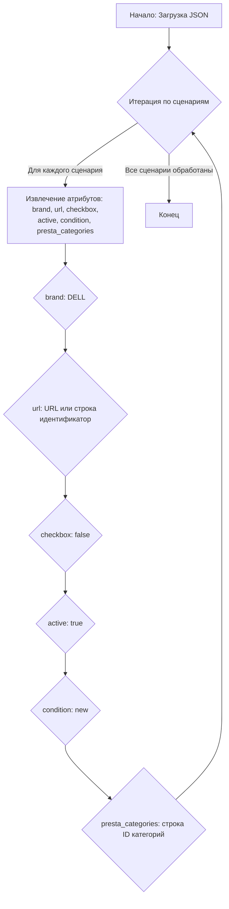

## АНАЛИЗ КОДА

### <алгоритм>
Данный код представляет собой JSON-файл, описывающий сценарии для парсинга данных о игровых ноутбуках Dell. Ключ верхнего уровня `scenarios` содержит объект, где каждый ключ — это название конкретной модели ноутбука, а значение — это объект с информацией о данной модели.

**Блок схема:**

1. **Начало:** Файл JSON загружается.
   ```
    Пример: 
    { "scenarios": { ... } }
   ```

2. **Итерация по сценариям:** Проход по каждой записи в объекте `scenarios`.
   ```
   Пример:
        "DELL GAMING 14 I5": { ... }
        "DELL GAMING 14 I7": { ... }
   ```

3. **Обработка сценария:** Для каждого сценария извлекаются следующие атрибуты:
   - `brand`: Строка, представляющая бренд ноутбука (всегда "DELL" в данном случае).
   ```
   Пример:
        "brand": "DELL"
   ```
   - `url`: Строка, содержащая URL-адрес или уникальный идентификатор для данного сценария (может быть URL или строка разделитель).
   ```
   Пример:
       "url": "https://reseller.c-data.co.il/%D7%A0%D7%99%D7%99%D7%93%D7%99-gaming#/specFilters=227!#-!4635!-#!225m!#-!4663&manFilters=4"
        "url": "------------------------------DELL GAMING 14 I5--------------------------------"
   ```
   - `checkbox`: Логическое значение, определяющее состояние чекбокса (всегда `false` в данном случае).
    ```
   Пример:
       "checkbox": false
   ```
   - `active`: Логическое значение, определяющее, активен ли сценарий (всегда `true` в данном случае).
    ```
   Пример:
        "active": true
    ```
    - `condition`: Строка, определяющая состояние товара (всегда `new` в данном случае).
    ```
    Пример:
        "condition": "new"
    ```
   - `presta_categories`: Строка, содержащая ID категорий PrestaShop через запятую.
   ```
   Пример:
         "presta_categories": "3,49,50,23,93,10,5"
    ```

4.  **Конец итерации:** Повторение шагов 2-3 для всех сценариев в объекте `scenarios`.

5.  **Завершение:**  Обработка файла завершена.

### <mermaid>

**Объяснение зависимостей:**

- **A (Начало: Загрузка JSON):**  Начальная точка процесса, где JSON-файл читается и подготавливается для обработки.
- **B (Итерация по сценариям):**  Управляет циклом обработки каждого сценария в объекте `scenarios`. Каждый сценарий обрабатывается по очереди.
- **C (Извлечение атрибутов):** Для каждого сценария происходит извлечение необходимых атрибутов, таких как `brand`, `url`, `checkbox`, `active`, `condition` и `presta_categories`.
- **D (brand: DELL):**  Извлечение значения атрибута `brand`. В данном файле всегда "DELL".
- **E (url: URL или строка идентификатор):** Извлечение значения атрибута `url`, которое может быть как URL-адресом, так и строкой-идентификатором.
- **F (checkbox: false):** Извлечение значения атрибута `checkbox`. В данном файле всегда false.
- **G (active: true):**  Извлечение значения атрибута `active`. В данном файле всегда true.
- **H (condition: new):** Извлечение значения атрибута `condition`. В данном файле всегда new.
- **I (presta_categories: строка ID категорий):** Извлечение значения атрибута `presta_categories`, представляющего собой строку с ID категорий.
- **J (Конец):**  Конечная точка процесса после обработки всех сценариев.

### <объяснение>

**Общее описание:**

Этот JSON-файл представляет собой конфигурационный файл, который описывает сценарии для парсинга данных о игровых ноутбуках Dell. Каждый сценарий представляет собой конкретную модель ноутбука и содержит информацию, необходимую для её идентификации и категоризации. Файл используется для автоматизации процесса сбора информации о товарах,  подготовки данных для импорта в интернет-магазин на базе PrestaShop или другой системы.

**Импорты:**

В данном коде нет импортов. Это просто данные в формате JSON, которые не требуют импорта каких-либо библиотек или модулей.

**Классы:**
В данном коде нет классов. Он содержит только данные в формате JSON.

**Функции:**
В данном коде нет функций. Он содержит только данные в формате JSON.

**Переменные:**
- `"scenarios"`: Это ключ объекта верхнего уровня, содержащий в себе все сценарии для парсинга.
- `"DELL GAMING 14 I5"` (и другие подобные ключи): Ключи, представляющие названия моделей ноутбуков.
- `"brand"`: Строковая переменная, обозначающая бренд ноутбука.
- `"url"`: Строковая переменная, содержащая URL или идентификатор для конкретной модели.
- `"checkbox"`: Логическая переменная, определяющая состояние чекбокса.
- `"active"`: Логическая переменная, определяющая, активен ли сценарий.
- `"condition"`: Строковая переменная, определяющая состояние товара.
- `"presta_categories"`: Строковая переменная, содержащая ID категорий PrestaShop через запятую.

**Детали:**

- Файл представляет собой словарь Python, который может быть легко загружен с помощью библиотеки `json`.
- Каждая запись в `scenarios` описывает сценарий для конкретной модели ноутбука.
- Значение `url` может быть как реальным URL-адресом, так и строкой-разделителем, используемой для идентификации модели.
- `presta_categories` указывает на категории товаров в PrestaShop, к которым относится данная модель.
- Атрибуты `checkbox`, `active` и `condition` имеют фиксированные значения, что предполагает стандартизированное использование файла в рамках определенной системы.
- Наличие различных моделей Dell (14, 15, 17 дюймов) с процессорами Intel (I5, I7, I9) и AMD указывает на структурированный подход к парсингу и категоризации товаров.

**Потенциальные ошибки и области для улучшения:**

- **Отсутствие валидации данных:** Нет проверок на корректность URL-адресов или формата `presta_categories`.
- **Дублирование данных:**  `brand` всегда "DELL", `checkbox` всегда `false`, `active` всегда `true`, `condition` всегда `new`, что может быть вынесено в общие настройки для всех сценариев.
- **Жестко закодированные значения:**  Фиксированные значения для `checkbox`, `active` и `condition` могут ограничивать гибкость использования файла в других контекстах.

**Взаимосвязь с другими частями проекта:**

Этот файл вероятно используется как часть более крупной системы парсинга и импорта данных. Его данные могут быть использованы следующими модулями:
1.  **Парсер**: Использует данные из `scenarios` для навигации по сайту поставщика и сбора информации о товарах.
2.  **Категоризатор**: Использует `presta_categories` для отнесения товара к соответствующей категории в PrestaShop.
3.  **Импортёр**: Подготавливает данные для импорта в PrestaShop или другую систему.

Таким образом, этот JSON-файл является важным компонентом системы, обеспечивающим структурированные данные для автоматизации процесса сбора и импорта данных о товарах.