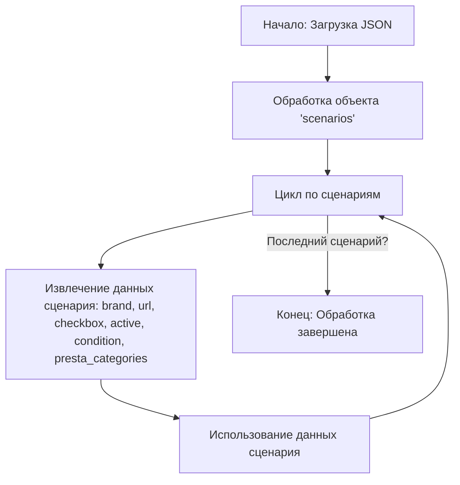

## Анализ кода `cdata_categories_gaming_laptops_hp.json`

### 1. <алгоритм>

Этот JSON файл описывает сценарии для игровых ноутбуков HP, которые будут использоваться для каких-либо процессов, вероятно, импорта или синхронизации данных.

**Блок-схема:**

1.  **Начало**: Чтение JSON файла.

    *   Пример: Загрузка содержимого файла `cdata_categories_gaming_laptops_hp.json` в программу.
2.  **Обработка**: Обход объекта `scenarios`.

    *   Пример: Получение списка всех ключей (имен сценариев) в объекте `scenarios`.
3.  **Цикл по сценариям**: Для каждого ключа (имя сценария) выполняется следующий блок.

    *   Пример: Для сценария `"HP GAMING 14 I5"`:
4.  **Извлечение данных сценария**: Получение данных для каждого сценария (brand, url, checkbox, active, condition, presta_categories).

    *   Пример: Извлечение `brand: "HP"`, `url: "---------------------------HP GAMING 14 I5-----------------------------------"`, `checkbox: false`, `active: true`, `condition: "new"`, `presta_categories: "3,49,50,52,101,10,5,462"`.
5.  **Использование данных**: Данные каждого сценария используются для дальнейшей обработки.

    *   Пример: Данные могут быть использованы для запросов к API, сравнения с существующими данными или для формирования новых записей в БД.
6.  **Конец цикла**:  Переход к следующему сценарию (если есть).
7.  **Конец**: Завершение обработки JSON файла.

### 2. <mermaid>

**Объяснение `mermaid` диаграммы:**

*   **Start**: Начало процесса, представляет загрузку JSON файла `cdata_categories_gaming_laptops_hp.json`.
*   **Scenarios**: Этап обработки объекта `scenarios` внутри JSON файла, где хранятся все сценарии.
*   **Loop**:  Итерация по каждому сценарию.
*   **Extract**: Извлечение данных для текущего сценария.
*   **UseData**: Данные используются в соответствии с логикой программы.
*   **End**: Завершение обработки данных.

### 3. <объяснение>

**Общая структура:**

JSON файл содержит объект `scenarios`, который является словарем, где ключи — это названия сценариев для моделей игровых ноутбуков HP (например, `"HP GAMING 14 I5"`). Каждый сценарий содержит набор атрибутов, описывающих этот конкретный сценарий.

**Атрибуты каждого сценария:**

*   `brand` (строка): Бренд ноутбука, в данном случае всегда `"HP"`.
*   `url` (строка): URL-адрес, связанный с конкретной моделью ноутбука.  Для некоторых моделей указан URL-адрес c-data, для других - строка заглушка.
*   `checkbox` (логическое): Флаг, который, вероятно, используется в UI для отметки сценария. Всегда имеет значение `false`.
*   `active` (логическое): Флаг, указывающий, активен ли сценарий. Всегда `true`.
*  `condition` (строка): Состояние товара, всегда `new`.
*   `presta_categories` (строка): Список категорий PrestaShop, к которым относится товар, в виде строки чисел, разделенных запятыми.

**Примеры данных:**

*   Сценарий `"HP GAMING 15 I5"` имеет `url` :`https://reseller.c-data.co.il/%D7%A0%D7%99%D7%99%D7%93%D7%99-gaming#/specFilters=227m!#-!4634!-#!225!#-!4663!##!6406&manFilters=2` и `presta_categories`: `"3,49,50,52,102,11,5,469"`.
*  Сценарий `"HP GAMING 14 I9"` имеет `url` : `"--------------------------------HP GAMING 14 I9------------------------------"` и  `presta_categories`: `"3,49,50,52,101,10,7,464"`.

**Потенциальные ошибки и области для улучшения:**

*   **Непоследовательность URL**: Некоторые URL представлены как заглушки (`"---------------------------HP GAMING 14 I5-----------------------------------"`). Это может привести к ошибкам, если эти URL используются в дальнейшей обработке. Желательно чтобы все `url` были реальными ссылками или имели понятные заглушки.
*   **Неопределенное назначение `checkbox`**: Все значения `checkbox` равны `false`. Возможно, это устаревший или пока неиспользуемый атрибут.
*   **Непонятное использование `presta_categories`**:  Представление категорий в виде строки затрудняет их программную обработку. Лучше использовать список (массив) целых чисел.
*   **Отсутствие проверок:** Нет проверок на корректность данных, таких как валидация URL или корректность `presta_categories`.
*  **Зависимость от c-data**: Некоторые URL ведут на сайт c-data. Это делает сценарии зависимыми от внешнего источника.

**Цепочка взаимосвязей с другими частями проекта:**

Этот JSON файл, вероятно, используется как источник данных для какого-то скрипта или сервиса, который занимается синхронизацией товаров и категорий в магазине PrestaShop. Он может быть частью процесса, который:

1.  **Загружает данные из файла**: Программа читает `cdata_categories_gaming_laptops_hp.json`.
2.  **Парсит JSON**: Преобразует данные в структуру данных для дальнейшей обработки.
3.  **Использует данные**:
    *   Для обновления информации о товарах в PrestaShop.
    *   Для создания новых товаров.
    *   Для формирования отчетов.

**Дополнительные замечания**:

*   Этот файл содержит конфигурационные данные, а не исполняемый код.
*   Структура данных простая и понятная, но можно улучшить ее для упрощения обработки (например, используя списки вместо строк для `presta_categories`).
*   Рекомендуется добавить проверку данных для избежания ошибок в дальнейшем.