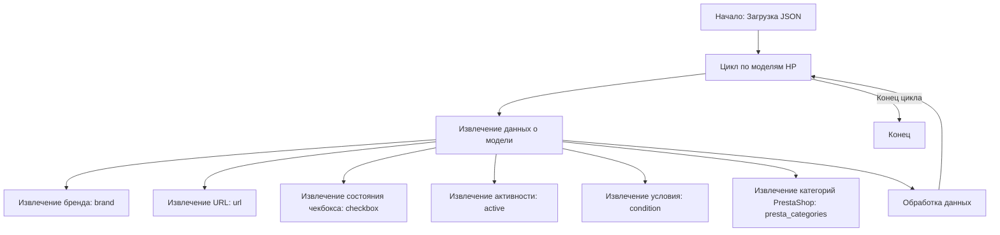

## АНАЛИЗ КОДА

### 1. **<алгоритм>**

Этот JSON файл представляет собой набор сценариев для ноутбуков HP, предназначенных для какой-то системы обработки данных. Каждый сценарий описывает конкретную модель ноутбука HP и содержит информацию, необходимую для ее идентификации и классификации.

**Блок-схема:**

1.  **Начало**: Загрузка JSON-файла.
    ```
    Пример: {"scenarios": { ... }}
    ```

2.  **Итерация по сценариям**: Цикл проходит по всем ключам (названиям моделей) в словаре `"scenarios"`.
    ```
    Пример: "HP 11.6 I3", "HP 11.6 I5", ...
    ```

3.  **Извлечение данных**: Для каждого сценария извлекаются значения для ключей: `brand`, `url`, `checkbox`, `active`, `condition`, `presta_categories`.
    ```
     Пример:
    {
        "brand": "HP",
        "url": "------------HP 11.6 I3 -------------r  ",
        "checkbox": false,
        "active": true,
        "condition":"new",
        "presta_categories": "3,52,8,52,4,362,989"
    }
    ```

4.  **Обработка данных**: Извлеченные данные могут быть использованы для различных целей, например:
    *   Определение списка моделей ноутбуков HP.
    *   Классификация моделей по процессору (I3, I5, I7, I9, AMD, Celeron, Pentium) и размеру экрана (11.6, 13.4, 14, 15, 16, 17.3).
    *   Формирования URL для перехода на страницу с описанием модели на сайте поставщика.
    *   Интеграция с системой Prestashop с помощью `presta_categories`.
    *   Определение активности и состояния модели для какой-либо обработки.

5.  **Конец**: Завершение обработки всех сценариев.
    
### 2. **<mermaid>**



**Объяснение:**

*   `Start`: Начальная точка диаграммы, представляющая загрузку JSON-файла.
*   `Loop`: Блок, обозначающий цикл, который итерируется по каждой модели ноутбука HP.
*   `ExtractData`: Блок, где извлекаются данные для каждой модели из JSON.
*   `Brand`: Извлечение названия бренда (например, "HP").
*   `Url`: Извлечение URL-адреса, связанного с моделью.
*   `Checkbox`: Извлечение значения чекбокса, обычно используемого для выбора.
*   `Active`: Извлечение статуса активности.
*   `Condition`: Извлечение условия (например, "new").
*    `PrestaCategories`: Извлечение категорий PrestaShop, разделенных запятыми, для интеграции с интернет-магазином.
*   `ProcessData`: Блок, представляющий обработку извлеченных данных. Здесь данные могут быть использованы для различных операций, таких как добавление в базу данных, фильтрация,  или отображение в интерфейсе.
*   `End`: Конечная точка диаграммы, представляющая завершение обработки всех сценариев.

**Зависимости:**

В данном случае, зависимости отсутствуют, поскольку диаграмма описывает работу со структурой данных внутри JSON файла. Импортирование внешних модулей не требуется.
    
### 3. **<объяснение>**

**Общая структура JSON файла:**

JSON-файл содержит объект верхнего уровня с ключом `"scenarios"`, значением которого является другой объект (словарь). Ключами этого объекта являются названия моделей ноутбуков HP, а значениями являются объекты, описывающие свойства каждой модели.

**Свойства каждой модели:**

*   `brand` (строка): Указывает бренд ноутбука, в данном случае всегда "HP".
*   `url` (строка): URL-адрес, который, вероятно, ведет на страницу с описанием соответствующей модели ноутбука на сайте поставщика.
*   `checkbox` (логическое значение): Флаг, показывающий, выбран ли этот сценарий. В данном случае всегда `false`, что может говорить о том, что выбор сценариев выполняется другим способом.
*  `active` (логическое значение): Флаг, показывающий, активен ли этот сценарий. В данном случае всегда `true`, что может говорить о том, что все сценарии должны быть обработаны.
*   `condition` (строка): Указывает состояние товара, в данном случае всегда "new" (новый).
*   `presta_categories` (строка): Строка, содержащая список идентификаторов категорий Prestashop, разделенных запятыми. Эти категории, вероятно, используются для привязки модели ноутбука к категориям товаров в интернет-магазине.

**Примеры:**

*   `"HP 11.6 I3": { ... }`: Описывает модель ноутбука HP с диагональю экрана 11.6 дюйма и процессором Intel Core i3.
*   `"HP 13.4 - 13.3 I5 ProBook 430": { ... }`: Описывает модель ноутбука HP ProBook 430 с диагональю экрана 13.4 - 13.3 дюйма и процессором Intel Core i5.
*   `"HP 15 I7": { ... }`: Описывает модель ноутбука HP с диагональю экрана 15 дюймов и процессором Intel Core i7.

**Потенциальные проблемы и области для улучшения:**

1.  **Неоднородность URL**: Некоторые URL-адреса представлены в виде текстовых строк, например, `"------------HP 11.6 I3 -------------r  "`, а некоторые как полные URL-адреса, например `"https://reseller.c-data.co.il/...".` Это может вызывать проблемы при автоматизированной обработке, т.к. нет единого формата.
2.  **Жесткое кодирование `presta_categories`**: Категории Prestashop жестко закодированы в JSON. Это может усложнить процесс обслуживания, если идентификаторы категорий в Prestashop изменятся.
3.  **Повторяющийся url для некоторых моделей**: Например,  `"HP 14 Celeron"` и `"HP 14 AMD"` имеют одинаковый URL.
4.  **Отсутствие описаний**: Для моделей с текстовыми URL, нет никакого описания, а для моделей с нормальными URL есть описания на иврите, что может создать проблемы с обработкой.
5.  **Использование строк для числовых значений**: `presta_categories` хранятся как строки, а не списки чисел, что может потребовать дополнительной конвертации.
6.  **Непоследовательность именования моделей**: Например, "HP 13.4 - 13.3 I5 ProBook 430" и "HP 14 I3" - разные стили. Это затрудняет анализ и поиск нужной модели.
    
**Цепочка взаимосвязей с другими частями проекта:**

Этот файл, вероятно, используется в более крупной системе, предназначенной для сбора данных о товарах от поставщиков (в данном случае, C-Data) и последующей загрузки этих данных в интернет-магазин Prestashop.

*   **src.suppliers**: Файл, скорее всего, является частью модуля `suppliers`, который отвечает за интеграцию с поставщиками.
*   **src.cdata**: Папка `cdata`, указывает на то, что данный файл используется для обработки данных, поступающих от поставщика C-Data.
*   **src.presta**: Идентификаторы категорий `presta_categories` указывают на связь с системой Prestashop, где данные могут использоваться для создания категорий товаров и назначения их конкретным моделям ноутбуков.

**В заключении:**
JSON-файл представляет собой структуру данных, предназначенную для описания различных моделей ноутбуков HP. Несмотря на простоту структуры, существуют области для улучшения, особенно в части однородности данных и гибкости их использования. Этот файл является частью более крупного процесса, целью которого является автоматизация работы с данными о товарах поставщика и их интеграция с интернет-магазином.