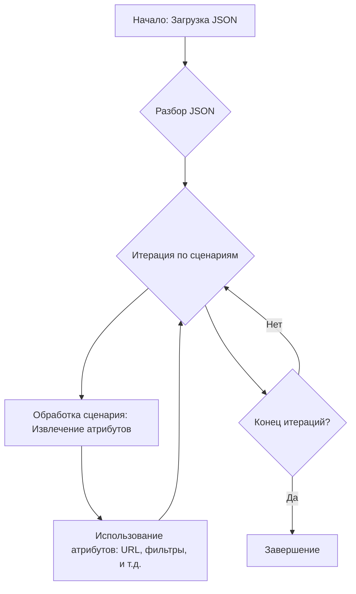

## <алгоритм>

Данный JSON-файл представляет собой конфигурацию сценариев для сбора данных о мониторах Apple.  Каждый сценарий описывает определенную модель монитора и содержит информацию, необходимую для извлечения данных с веб-сайта поставщика (c-data.co.il).

1.  **Начало**: Чтение JSON-файла.
    *   Пример: Загрузка содержимого файла `cdata_categories_monitors_apple.json`.

2.  **Разбор JSON**: Преобразование JSON-структуры в структуру данных (словарь/объект).
    *   Пример: Получение словаря Python, где ключом является строка "scenarios", а значением - другой словарь, представляющий сценарии.

3.  **Итерация по сценариям**: Перебор всех сценариев (записей в словаре "scenarios").
    *   Пример: Цикл по ключам "APPLE 18", "APPLE 21.5", "APPLE 23.5" и т.д.

4.  **Обработка каждого сценария**:
    *   **Извлечение атрибутов**: Доступ к атрибутам каждого сценария, таким как "brand", "url", "checkbox", "active", "condition" и "presta_categories".
        *   Пример: Для сценария "APPLE 18" извлекаем `brand` = "APPLE", `url` = "---------------------APPLE 18----------------------",  `checkbox` = false, `active`=true, `condition`="new", `presta_categories` = "127,241"
    *   **Использование атрибутов**: Эти атрибуты используются для дальнейшей обработки, например, для формирования URL-адресов запросов, фильтрации данных и т.д.

5.  **Завершение**: Конец обработки всех сценариев.

## <mermaid>

**Разбор диаграммы:**

1.  **Начало: Загрузка JSON**:  Начальная точка, представляющая загрузку JSON файла.

2.  **Разбор JSON**: Разбирает JSON-структуру в структуру данных (словарь/объект).

3.  **Итерация по сценариям**: Управляет циклом для перебора всех сценариев мониторов.

4.  **Обработка сценария: Извлечение атрибутов**: Извлекает атрибуты такие как `brand`, `url`, `checkbox`, `active`, `condition` и `presta_categories` для каждого сценария.

5. **Использование атрибутов: URL, фильтры, и т.д.**: Атрибуты, извлеченные на предыдущем шаге, используются для дальнейшей обработки, например, для формирования URL-адресов запросов, фильтрации данных и т.д.

6. **Конец итераций?**: Проверяет, есть ли еще сценарии для обработки.

7. **Завершение**: Конечная точка после обработки всех сценариев.

## <объяснение>

**Структура файла**

Файл `cdata_categories_monitors_apple.json` содержит JSON-объект, представляющий собой словарь с единственным ключом "scenarios". Значение этого ключа – это словарь, где ключи представляют собой наименование сценария (например, "APPLE 18", "APPLE 21.5"), а значениями являются словари, содержащие параметры для каждого сценария.

**Атрибуты сценариев:**

*   **brand**: (String) Указывает на бренд монитора, в данном случае всегда "APPLE".
*   **url**: (String) URL-адрес или маркер, используемый для идентификации товара на веб-сайте поставщика.
    *   **Примечание**: Некоторые `url` представляют собой маркеры "---------------------APPLE 18----------------------", в то время как для "APPLE 31" указан полноценный URL-адрес. Это может быть связано с разными способами обработки URL для различных моделей.
*   **checkbox**: (Boolean) Логическое значение, вероятно, указывающее, выбран ли сценарий для обработки (все значения false).
*   **active**: (Boolean) Логическое значение, указывающее, активен ли сценарий (все значения true).
*   **condition**: (String) Строка, описывающая состояние товара, в данном случае "new".
*   **presta_categories**: (String) Строка, содержащая идентификаторы категорий PrestaShop (разделены запятыми).

**Использование в проекте**

Этот файл используется как конфигурационный для парсинга данных с сайта поставщика `c-data.co.il` для мониторов Apple.
Данные используются для добавления товаров в интернет-магазин на базе PrestaShop.

1.  **`brand`**: Используется для фильтрации или категоризации товаров по бренду.
2.  **`url`**: Используется для формирования URL-адреса запроса на сайт поставщика или для идентификации товара.
3.  **`checkbox`**: Может использоваться для управления выбором сценариев в пользовательском интерфейсе.
4.  **`active`**: Определяет, нужно ли обрабатывать данный сценарий.
5.  **`condition`**: Используется для установки или фильтрации товаров по состоянию.
6.  **`presta_categories`**: Указывает, к каким категориям в PrestaShop нужно отнести товар.

**Потенциальные ошибки и улучшения**

*   **Маркеры URL**: Вместо маркеров `url`, таких как "---------------------APPLE 18----------------------", лучше использовать реальные URL или стандартизованные маркеры, которые легко обрабатывать. Это упростит парсинг и сделает данные более надежными.
*   **Одинаковые условия**: Все сценарии имеют одинаковые значения `checkbox` (false), `active` (true) и `condition` ("new"). Возможно, это стоит пересмотреть, если в будущем понадобятся более разнообразные условия.
*   **Проверка URL**:  Для более надежной обработки, стоило бы валидировать URL-адреса, чтобы исключить возможность ошибок.
*   **Структура файла**: Если бы файл был частью большего модуля, можно было бы импортировать его как  `import settings_file from src.suppliers.cdata.scenarios`.
*   **Именование переменных**: Именование ключей словаря можно сделать более понятным, например,  `"scenarios"` --> `"monitor_scenarios"`

**Связь с другими частями проекта**

Этот файл является частью модуля сбора данных поставщика `cdata`. Он взаимодействует со следующими частями проекта:

*   **Парсеры**: Используют данные из этого файла для загрузки данных с веб-сайта `c-data.co.il`.
*   **Преобразование данных**: Преобразует данные в формат, подходящий для PrestaShop.
*   **API PrestaShop**: Отправляет данные для создания или обновления товаров в PrestaShop.
*   **Настройки проекта**: Может зависеть от общих настроек проекта для конфигурации параметров.