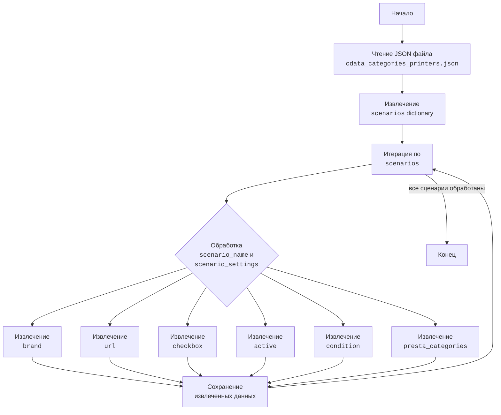

# Анализ JSON файла `cdata_categories_printers.json`

## 1. <алгоритм>

Файл `cdata_categories_printers.json` представляет собой JSON-объект, содержащий словарь под ключом `"scenarios"`. Значением этого ключа является другой словарь, где каждый ключ представляет собой название сценария (например, `"HP DIO AIO A4"`) , а значение - словарь с настройками для этого сценария.

**Пошаговая блок-схема:**

1.  **Начало**: Чтение JSON файла `cdata_categories_printers.json`.
2.  **Извлечение "scenarios"**: Получение словаря, связанного с ключом `"scenarios"`.
    *   Пример: `scenarios = data["scenarios"]`
3.  **Итерация по сценариям**: Перебор элементов словаря `scenarios`.
    *   Для каждого ключа-сценария (например, `scenario_name = "HP DIO AIO A4"`) и его словаря настроек (`scenario_settings`).
4.  **Обработка настроек сценария**: Для каждого сценария, извлекаются следующие данные:
    *   `brand` (строка): Например, `"HP"`
    *   `url` (строка): URL для C-Data, например, `"https://reseller.c-data.co.il/...&manFilters=2"` или строка с описанием `---------------------------------------HP DIO AIO A3--------------------------------------------`
    *   `checkbox` (логическое значение): Всегда `false` в этом файле.
    *   `active` (логическое значение): Всегда `true` в этом файле.
    *   `condition` (строка): Всегда `"new"` в этом файле.
    *   `presta_categories` (строка): Строка с номерами категорий, разделенными запятыми, например, `"209,248,320"`.
5.  **Конец**: Завершение итерации и обработки всех сценариев.

## 2. <mermaid>

**Объяснение зависимостей:**

Диаграмма `mermaid` представляет собой блок-схему, отображающую процесс анализа файла `cdata_categories_printers.json`.

*   **Start**: Начальная точка процесса.
*   **ReadJSON**: Блок, представляющий операцию чтения JSON-файла. На входе - путь к файлу, на выходе - загруженный JSON объект.
*   **ExtractScenarios**: Блок, представляющий извлечение словаря `scenarios` из прочитанного JSON. На входе - JSON объект, на выходе - словарь `scenarios`.
*   **LoopScenarios**: Блок, представляющий цикл итерации по ключам в словаре `scenarios`.
*   **ProcessScenario**:  Блок, представляющий обработку каждого отдельного сценария. На входе -  `scenario_name` и словарь `scenario_settings`
*   **ExtractBrand, ExtractURL, ExtractCheckbox, ExtractActive, ExtractCondition, ExtractPrestaCategories**:  Блоки, представляющие извлечение значений соответствующих ключей из словаря `scenario_settings`
*   **DataOutput**: Блок, представляющий сохранение или использование извлеченных данных для каждого сценария.
*   **End**: Конечная точка процесса.

## 3. <объяснение>

**Общая структура:**
Файл `cdata_categories_printers.json` содержит конфигурационные данные для настройки категорий принтеров для C-Data, скорее всего, для последующего использования в системе, которая работает с категориями товаров.

**Импорты:**
В данном файле импортов нет, поскольку это файл данных, а не код.

**Классы:**
В данном файле нет классов.

**Функции:**
В данном файле нет функций.

**Переменные:**
В файле определен один объект JSON, который содержит в себе:
-   `scenarios`: словарь (dictionary) где ключом является название сценария, например `"HP DIO AIO A4"`, а значением словарь с параметрами:
    *   `brand`: строка, представляющая бренд принтера, например `"HP"`.
    *   `url`: строка, представляющая URL-адрес на сайте C-Data или строка с текстовым описанием.
    *   `checkbox`: логическое значение (Boolean), в данном случае всегда `false`.
    *   `active`: логическое значение (Boolean), в данном случае всегда `true`.
    *   `condition`: строка, представляющая состояние принтера, в данном случае всегда `"new"`.
    *   `presta_categories`: строка, представляющая идентификаторы категорий PrestaShop, разделенные запятыми, например, `"209,248,320"`.

**Цепочка взаимосвязей с другими частями проекта:**

Этот файл, вероятно, используется в системе, которая синхронизирует данные товаров с C-Data и PrestaShop. В частности:
1.  **Получение данных**: Этот файл используется для загрузки конфигурации сценариев, связывающих модели принтеров с категориями.
2.  **Обработка категорий**: Значение `presta_categories` используется для определения, к каким категориям PrestaShop относится определенный продукт C-Data.
3.  **Синхронизация**: URL-адреса используются для получения данных о товарах с сайта C-Data.
4.  **Фильтрация и активация**: Параметры `active` и `checkbox`, а так же `condition` используются для фильтрации и определения, какие сценарии должны быть активны и какие товары соответствуют условиям.

**Потенциальные ошибки или области для улучшения:**

1.  **Жестко заданные значения**: Значения `checkbox` всегда `false`, а `active` всегда `true`. Возможно, эти значения должны быть переменными и определяться извне или иметь иное предназначение.
2.  **Описание URL**: Некоторые значения `url` не являются URL, а являются описаниями, например, `"---------------------------------------HP DIO AIO A3--------------------------------------------"`. Это может вызвать проблемы, если система ожидает URL в этом поле.
3.  **Магические числа**: Значения `presta_categories` являются магическими числами. Было бы полезно иметь их описание в другом месте (в другом файле конфигурации или базе данных) для повышения читаемости и удобства сопровождения.
4.  **Типы данных**: Все значения хранятся в виде строк, даже `presta_categories` (которые можно хранить как список чисел). Можно улучшить структуру данных для более удобной обработки (например, `presta_categories` можно хранить как список целых чисел).
5.  **Отсутствие валидации**: Отсутствует проверка значений на корректность. Необходимо добавить валидацию данных (например, проверка формата URL, проверка того, что категории это целые числа, проверка существования `presta_categories`).
6.  **Связь с C-Data**: Из файла невозможно понять, как именно используются URL для работы с C-Data. Необходима дополнительная информация или анализ кода для этого.

**Заключение:**

Файл `cdata_categories_printers.json` представляет собой простой JSON-файл с конфигурационными данными. Он используется для сопоставления моделей принтеров с категориями товаров, но имеет некоторые потенциальные области для улучшения, такие как валидация данных, использование более структурированных типов данных и разъяснение неясных моментов с `url`.