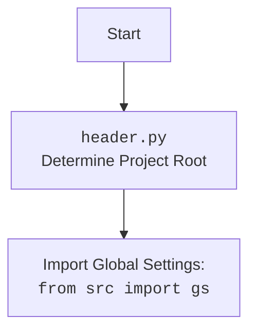

## Анализ кода `converstions_parser.py`

### 1. <алгоритм>
**Функция `extract_conversations_from_html`:**

1.  **Начало:** Функция принимает на вход `file_path` (объект `Path`), который представляет путь к HTML-файлу.
    *   Пример: `file_path` может быть `/home/user/data/chat_gpt/chat.html`
2.  **Открытие файла:** Открывает HTML-файл в режиме чтения (`'r'`) с кодировкой UTF-8.
    *   Пример: открывается файл `/home/user/data/chat_gpt/chat.html`.
3.  **Создание объекта BeautifulSoup:** Использует `BeautifulSoup` для парсинга HTML-содержимого файла.
    *   Пример: `soup = BeautifulSoup(file, 'html.parser')` преобразует HTML в древовидную структуру, доступную для навигации и извлечения данных.
4.  **Поиск элементов:** Находит все `div` элементы с классом `conversation`.
    *   Пример: `conversations = soup.find_all('div', class_='conversation')` возвращает список всех найденных элементов.
5.  **Итерация и вывод:** Проходит циклом по найденным `div` элементам и возвращает каждый элемент с помощью `yield`.
    *   Пример: Для каждого элемента `conversation` в списке `conversations`, `yield conversation` возвращает этот элемент.
6.  **Конец:** Функция завершается после обработки всех `div` элементов.

**Основной блок кода:**

1.  **Определение пути к файлу:** Создаёт объект `Path`, который представляет путь к файлу `chat.html`.
    *   Пример: `file_path = Path(gs.path.data / 'chat_gpt'  / 'chat.html')` создает путь, например, `/home/user/data/chat_gpt/chat.html` основываясь на значениях `gs`.
2.  **Вызов генератора:** Вызывает функцию `extract_conversations_from_html` и итерируется по полученному генератору.
    *   Пример: `for conversation in extract_conversations_from_html(file_path):`
3.  **Печать беседы:** Для каждой полученной беседы выводит её отформатированное содержимое.
    *   Пример: `print(conversation.prettify())` выводит HTML-код каждой беседы в отформатированном виде.

### 2. <mermaid>
```mermaid
flowchart TD
    Start(Начало) --> ReadFile[OpenFile: Open HTML file in read mode]
    ReadFile --> ParseHTML[ParseHTML: BeautifulSoup(file, 'html.parser')]
    ParseHTML --> FindConversations[FindAllDivs: soup.find_all('div', class_='conversation')]
    FindConversations --> LoopConversations[Loop through each conversation]
    LoopConversations --> YieldConversation[Yield conversation]
    YieldConversation --> LoopConversations
    LoopConversations -- No More Conversations --> End(Конец функции extract_conversations_from_html)
    End --> SetFilePath[Set file path using Path and gs.path]
    SetFilePath --> CallGenerator[Call extract_conversations_from_html generator]
    CallGenerator --> LoopGenerator[Loop through yielded conversations]
    LoopGenerator --> PrintConversation[Print conversation.prettify()]
    PrintConversation --> LoopGenerator
    LoopGenerator -- No More Conversations --> EndMain(Конец)
```

### 3. <объяснение>

**Импорты:**

*   `import header`: Импортирует модуль `header`, который, судя по всему, отвечает за определение корня проекта и настройку путей.
*   `from src import gs`: Импортирует глобальные настройки проекта (`gs`) из пакета `src`. Этот объект содержит пути и другие важные параметры проекта.
*   `from pathlib import Path`: Импортирует класс `Path` из модуля `pathlib`, который используется для работы с путями файлов и каталогов.
*   `from bs4 import BeautifulSoup`: Импортирует класс `BeautifulSoup` из библиотеки `bs4` (Beautiful Soup), который используется для парсинга HTML и XML документов.

**Функции:**

*   `extract_conversations_from_html(file_path: Path)`:
    *   **Аргументы:**
        *   `file_path` (`Path`): Путь к HTML-файлу, из которого нужно извлечь беседы.
    *   **Возвращаемое значение:** Генератор, который выдаёт по одному элементу `div` с классом `conversation` из HTML-файла.
    *   **Назначение:** Парсит HTML-файл и извлекает все блоки с беседами (`div` с классом `conversation`).
    *   **Примеры:**
        *   Вызов `extract_conversations_from_html(Path('/path/to/chat.html'))` откроет указанный файл и вернет генератор, который будет выдавать по одной беседе за раз.
        *   Пример итерации по генератору:
           ```python
           for conversation in extract_conversations_from_html(Path('/path/to/chat.html')):
              print(conversation.prettify())
           ```

**Переменные:**

*   `file_path`: Объект типа `Path`, представляющий путь к файлу `chat.html`.  Путь формируется на основе глобальных настроек `gs.path.data`, каталога `'chat_gpt'` и имени файла `'chat.html'`.
*   `conversations`: Список, содержащий все найденные `div` элементы с классом `conversation` внутри HTML-файла.
*   `soup`: Объект типа `BeautifulSoup`, представляющий распарсенный HTML документ.
*   `conversation`: Переменная, которая используется в цикле для представления каждого элемента `div` с классом `conversation` из списка `conversations`.

**Объяснение кода:**

1.  Код предназначен для извлечения HTML-контента, представляющего беседы, из HTML-файла, сохранённого из ChatGPT.
2.  Функция `extract_conversations_from_html` является генератором, позволяя итерироваться по беседам по мере их извлечения, что может быть полезно при работе с большими файлами.
3.  Использование `BeautifulSoup` упрощает работу с HTML, позволяя легко находить и извлекать нужные элементы.
4.  Код использует `pathlib.Path` для работы с путями, что является кроссплатформенным подходом.
5.  Код использует глобальные настройки `gs`, что позволяет гибко настраивать пути к данным и другие параметры проекта.

**Потенциальные ошибки и области для улучшения:**

1.  **Обработка исключений:** В коде отсутствует обработка исключений, которые могут возникнуть при открытии файла или парсинге HTML. Необходимо добавить обработку `FileNotFoundError` и `BeautifulSoup`-ошибок.
2.  **Кодировка:** Явно указана кодировка UTF-8, но было бы полезно добавить механизм автоматического определения кодировки файла или обработки нескольких кодировок.
3.  **Отсутствие логирования:** Отсутствует логирование, которое бы помогло отслеживать ошибки и ход выполнения программы.

**Взаимосвязь с другими частями проекта:**

*   `header.py`: Определяет корневую директорию проекта и предоставляет глобальный объект настроек.
*   `gs`: Глобальные настройки проекта, которые содержат пути к данным, в данном случае к файлу `chat.html`.
*   `src`: Родительский пакет, который содержит все исходные файлы проекта.
*   `BeautifulSoup` - сторонняя библиотека для парсинга HTML, устанавливаемая через `pip`.

**Улучшения:**

1.  Добавить обработку исключений `FileNotFoundError`, `UnicodeDecodeError`  и других возможных ошибок, которые могут возникнуть при открытии файла.
2.  Добавить обработку исключений связанных с парсингом HTML, например, когда HTML-структура не соответствует ожидаемой.
3.  Добавить логирование для отслеживания ошибок.
4.  Обеспечить более надежный механизм определения кодировки файла.