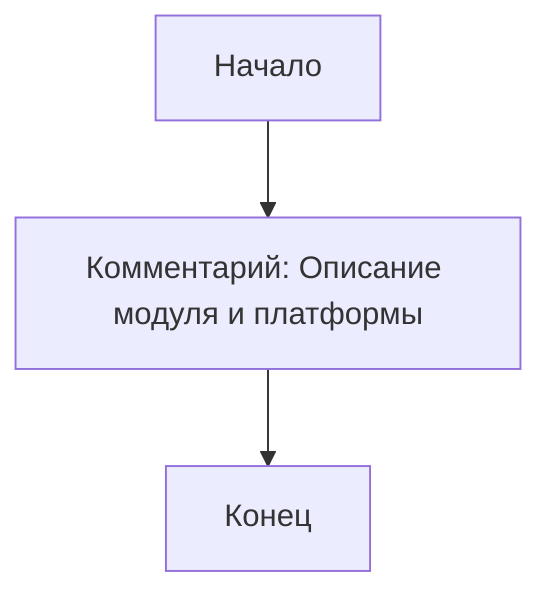
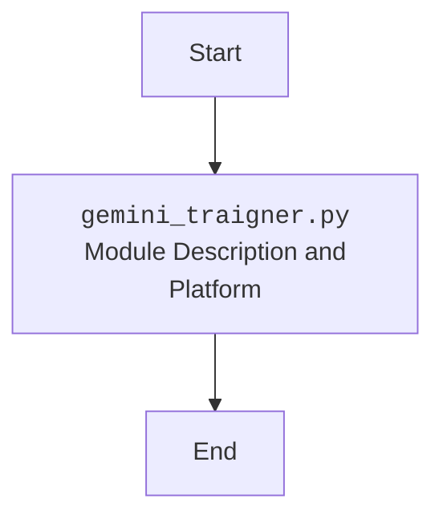

## АНАЛИЗ КОДА: `hypotez/src/suppliers/chat_gpt/gemini_traigner.py`

### 1. <алгоритм>

Код `gemini_traigner.py` является частью модуля `src.suppliers.chat_gpt`. Судя по представленному коду, он содержит только комментарии и заголовки, но никакой исполняемой логики. Исходя из этого, можно предположить, что это либо шаблон файла, либо файл, находящийся в процессе разработки.

**Блок-схема:**

**Примеры:**
* **Start:** Начало выполнения скрипта.
* **Docstring:** Различные строки, начинающиеся с `"""` содержат информацию о модуле, платформе и т.д. 
* **End:** Завершение обработки файла.

**Поток данных:** 
В данном коде нет потока данных в явном виде, так как нет выполняемых функций или классов. Все взаимодействие ограничивается обработкой комментариев.

### 2. <mermaid>

**Объяснение зависимостей `mermaid`:**
В этом коде отсутствуют импорты, поэтому и нет зависимостей. Диаграмма показывает только блок начала и конца обработки и блок, содержащий комментарии.

### 3. <объяснение>

**Импорты:**
В коде отсутствуют какие-либо импорты.

**Классы:**
В представленном коде нет ни одного класса.

**Функции:**
В данном коде также отсутствуют какие-либо функции.

**Переменные:**
В коде нет явных переменных.

**Объяснение:**
Файл `gemini_traigner.py` на данный момент представляет собой пустой шаблон или файл-заготовку, предназначенный для добавления кода. В текущем состоянии он содержит только комментарии с метаданными о модуле, платформе и назначении.

**Потенциальные ошибки и улучшения:**

*   **Отсутствие реализации:** Основной недостаток — отсутствие фактического кода. Необходимо добавить функциональность, соответствующую названию файла (вероятно, обучение модели Gemini или взаимодействие с ней).
*   **Комментарии:** Комментарии, которые повторяются, выглядят избыточно. Необходимо уточнить их назначение, либо убрать их.
*   **Отсутствие обработки ошибок:** После добавления кода следует предусмотреть обработку ошибок и исключений.
*   **Область улучшения:** Необходимо добавить реализацию методов, классов или функций для обучения или вызова модели Gemini.

**Взаимосвязь с другими частями проекта:**

На данном этапе файл не имеет явных взаимосвязей с другими частями проекта. Как только будет добавлен код, потребуется определить его взаимодействие с другими модулями `src`, например, `src.suppliers`, `src.chat_gpt` или другими.