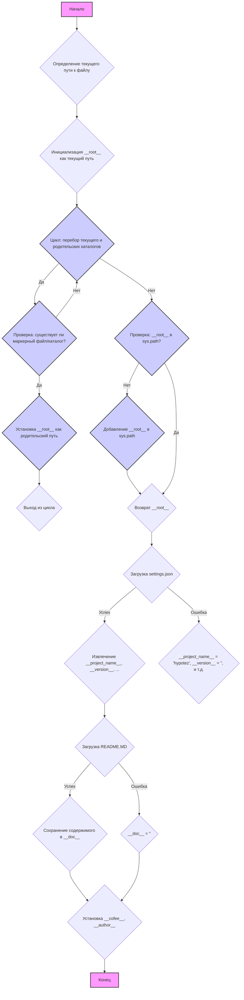

## АНАЛИЗ КОДА `header.py`

### 1. <алгоритм>
**Блок-схема:**

**Примеры:**
*   **Блок B**: Если `header.py` находится в `/home/user/project/src/suppliers/chat_gpt/header.py`, то текущий путь будет `/home/user/project/src/suppliers/chat_gpt`.
*   **Блок D**: Проверка каталогов, начиная от `/home/user/project/src/suppliers/chat_gpt`, далее `/home/user/project/src/suppliers`, затем `/home/user/project/src`, и так далее.
*  **Блок E:** Если в каталоге `/home/user/project` существует файл `__root__` или папка `.git`, то родительским каталогом (корнем проекта) будет считаться именно `/home/user/project`.
*   **Блок K**: Если `settings.json` найден в `/home/user/project/src`, то его содержимое будет загружено в переменную `settings`.
*   **Блок L**: При наличии `settings` значения `project_name`, `version` и др. будут взяты из него, иначе будут использованы значения по умолчанию.

### 2. <mermaid>
```mermaid
flowchart TD
    Start[Начало: <code>header.py</code>] --> FindProjectRoot[Определение корня проекта:<br><code>set_project_root()</code>]
    FindProjectRoot --> DetermineRootPath[Определение текущего пути<br>с помощью <code>Path(__file__).resolve().parent</code>]
    DetermineRootPath --> InitRootVar[Инициализация переменной<br><code>__root__ = current_path</code>]
    InitRootVar --> LoopThroughParents[Цикл по родительским каталогам]
    LoopThroughParents --> CheckMarkerFile[Проверка на наличие маркерных файлов<br>(<code>__root__</code>, <code>.git</code>)]
    CheckMarkerFile -- "Да" --> SetRootPath[Установка<br><code>__root__ = parent</code>]
    SetRootPath --> BreakLoop[Выход из цикла]
     CheckMarkerFile -- "Нет" --> LoopThroughParents
      BreakLoop --> CheckRootInSysPath[Проверка: Корень проекта в <br><code>sys.path</code>?]
      LoopThroughParents -- "Нет" --> CheckRootInSysPath
    CheckRootInSysPath -- "Нет" --> InsertRootToSysPath[Добавление корня проекта в<br> <code>sys.path</code>]
    InsertRootToSysPath --> ReturnRoot[Возврат <code>__root__</code>]
    CheckRootInSysPath -- "Да" --> ReturnRoot
    ReturnRoot --> ImportGlobalSettings[Импорт глобальных настроек: <br><code>from src import gs</code>]
    ImportGlobalSettings --> LoadSettingsJSON[Загрузка <code>settings.json</code><br>из <code>gs.path.root/src/settings.json</code>]
     LoadSettingsJSON --> ExtractSettings[Извлечение значений настроек:<br><code>project_name, version</code> и т.д.]
     LoadSettingsJSON -- "Ошибка" --> DefaultSettings[Установка настроек по умолчанию]
     ExtractSettings --> LoadReadmeMD[Загрузка <code>README.MD</code><br>из <code>gs.path.root/src/README.MD</code>]
     DefaultSettings --> LoadReadmeMD
     LoadReadmeMD --> ExtractDocString[Извлечение текста из <code>README.MD</code><br>в <code>__doc__</code> ]
     LoadReadmeMD -- "Ошибка" --> EmptyDocString[Установка пустой строки для <code>__doc__</code>]
    ExtractDocString --> SetGlobalVariables[Установка глобальных переменных:<br><code>__project_name__, __version__, __doc__, __cofee__</code> и т.д.]
    EmptyDocString --> SetGlobalVariables
    SetGlobalVariables --> End[Конец: <code>header.py</code>]

    style Start fill:#f9f,stroke:#333,stroke-width:2px
    style End fill:#f9f,stroke:#333,stroke-width:2px
    style FindProjectRoot fill:#ccf,stroke:#333,stroke-width:2px
    style DetermineRootPath fill:#ccf,stroke:#333,stroke-width:2px
    style InitRootVar fill:#ccf,stroke:#333,stroke-width:2px
    style LoopThroughParents fill:#ccf,stroke:#333,stroke-width:2px
    style CheckMarkerFile fill:#ccf,stroke:#333,stroke-width:2px
     style SetRootPath fill:#ccf,stroke:#333,stroke-width:2px
     style BreakLoop fill:#ccf,stroke:#333,stroke-width:2px
     style CheckRootInSysPath fill:#ccf,stroke:#333,stroke-width:2px
      style InsertRootToSysPath fill:#ccf,stroke:#333,stroke-width:2px
      style ReturnRoot fill:#ccf,stroke:#333,stroke-width:2px
       style ImportGlobalSettings fill:#ccf,stroke:#333,stroke-width:2px
         style LoadSettingsJSON fill:#ccf,stroke:#333,stroke-width:2px
          style ExtractSettings fill:#ccf,stroke:#333,stroke-width:2px
             style DefaultSettings fill:#ccf,stroke:#333,stroke-width:2px
         style LoadReadmeMD fill:#ccf,stroke:#333,stroke-width:2px
           style ExtractDocString fill:#ccf,stroke:#333,stroke-width:2px
           style EmptyDocString fill:#ccf,stroke:#333,stroke-width:2px
           style SetGlobalVariables fill:#ccf,stroke:#333,stroke-width:2px
```
### 3. <объяснение>
#### Импорты:
1.  `import sys`: Используется для модификации пути поиска модулей (`sys.path`) для добавления корня проекта, чтобы модули `src` могли быть найдены.
2.  `import json`: Используется для работы с файлами JSON, в частности для загрузки настроек из `settings.json`.
3.  `from packaging.version import Version`: Импортируется класс `Version` из пакета `packaging`, используется для работы с версиями. Однако в коде он не используется напрямую.
4.  `from pathlib import Path`: Импортируется класс `Path` для удобной работы с путями к файлам и каталогам.
5.  `from src import gs`: Импортируется модуль `gs` из пакета `src`. Предположительно, `gs` содержит глобальные переменные, которые используются в проекте, в данном случае `gs.path.root` - путь к корню проекта.

#### Функции:
1.  **`set_project_root(marker_files=('__root__', '.git')) -> Path`**
    *   **Аргументы**: `marker_files` (кортеж строк) - список файлов или директорий, которые могут служить признаком корня проекта. По умолчанию `('__root__', '.git')`.
    *   **Возвращаемое значение**: `Path` - путь к корню проекта, либо к текущему каталогу, если корень не найден.
    *   **Назначение**: Функция определяет корень проекта, поднимаясь по директориям вверх от текущего файла до тех пор, пока не найдет один из маркерных файлов или папок.
    *   **Примеры**:
        *   Если `header.py` находится в `/home/user/project/src/suppliers/chat_gpt/header.py`, и в `/home/user/project/` есть файл `__root__`, то функция вернет `Path('/home/user/project')`.
        *   Если маркерные файлы не найдены, то вернется `Path('/home/user/project/src/suppliers/chat_gpt')`.

#### Переменные:
1.  `__root__` (`Path`): Переменная хранит путь к корневой директории проекта, определенный функцией `set_project_root()`.
2.  `settings` (`dict` или `None`): Словарь, содержащий настройки проекта, загруженные из `settings.json`. Если файл не найден или невалидный JSON, будет `None`.
3.  `doc_str` (`str` или `None`): Содержит содержимое файла `README.MD` в виде строки. Если файл не найден, значение `None`.
4.  `__project_name__` (`str`): Название проекта, по умолчанию `hypotez`. Значение берется из `settings` или устанавливается по умолчанию.
5.  `__version__` (`str`): Версия проекта. Значение берется из `settings` или устанавливается в пустую строку по умолчанию.
6.  `__doc__` (`str`): Описание проекта, берется из `README.MD` или устанавливается в пустую строку по умолчанию.
7.  `__details__` (`str`): Всегда пустая строка.
8.  `__author__` (`str`): Имя автора проекта. Значение берется из `settings` или устанавливается в пустую строку по умолчанию.
9.  `__copyright__` (`str`): Информация о копирайте. Значение берется из `settings` или устанавливается в пустую строку по умолчанию.
10. `__cofee__` (`str`): Строка с предложением угостить разработчика кофе.  Значение берется из `settings` или устанавливается значением по умолчанию.
11.  `current_path` (`Path`): Временно хранит путь к директории, где находится скрипт.

#### Взаимосвязь с другими частями проекта:
*   **`src.gs`**: Данный модуль, предположительно, предоставляет доступ к глобальным настройкам и путям проекта, включая `gs.path.root`, который используется для доступа к `settings.json` и `README.MD`.

#### Потенциальные ошибки и области для улучшения:
1. **Обработка ошибок**:
    *   Файлы `settings.json` и `README.MD` загружаются в блоках `try ... except`. Однако исключения `FileNotFoundError` и `json.JSONDecodeError` перехватываются, но не логируются. Было бы полезно добавить логирование ошибок, чтобы легче отслеживать проблемы с загрузкой этих файлов.
2. **Использование `packaging.version.Version`**:
    *  Импортируется `from packaging.version import Version`, но  `Version` не используется, нужно либо его использовать, либо удалить.
3. **Глобальные переменные**:
    *  В коде используются глобальные переменные (например, `__project_name__`, `__version__`), что может усложнить тестирование и понимание кода. Возможно стоит использовать класс или модуль для хранения этих переменных.
4.  **Пустые `__details__`**:
    *   Переменная `__details__` всегда инициализируется пустой строкой.  Необходимо либо убрать ее из кода, либо добавить функционал ее наполнения.
5. **`__cofee__`**:
    *   Используется нестандартное написание `copyrihgnt` вместо `copyright`. Рекомендуется исправить опечатку.
    *   Переменная `__cofee__` не очень информативна. Возможно, стоит переименовать её в `__donation_url__`.

#### Цепочка взаимосвязей:
1.  `header.py` определяет корень проекта.
2.  Загружает `settings.json` из корня проекта.
3.  Загружает `README.MD` из корня проекта.
4.  Инициализирует глобальные переменные проекта (например, `__project_name__`, `__version__`).
5.  Модули, импортирующие `header.py`, используют эти глобальные переменные для работы.
6.  Модуль `gs` (предположительно) используется другими модулями для доступа к путям проекта.