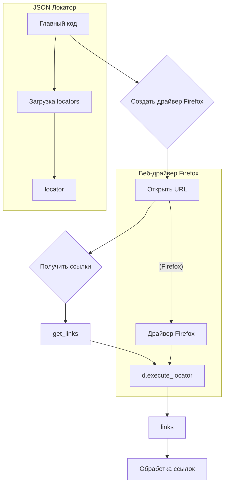

# <input code>

```python
## \file hypotez/src/suppliers/chat_gpt/scenarios/grab_lilnks_to_chats.py
# -*- coding: utf-8 -*-\

#! venv/bin/python/python3.12

"""
.. module: src.suppliers.chat_gpt.scenarios 
	:platform: Windows, Unix
	:synopsis:

"""


"""
	:platform: Windows, Unix
	:synopsis:

"""


"""
	:platform: Windows, Unix
	:synopsis:

"""


"""
  :platform: Windows, Unix

"""
"""
  :platform: Windows, Unix
  :platform: Windows, Unix
  :synopsis:
"""
  
""" module: src.suppliers.chat_gpt.scenarios """

###############################################################################################
#                                                                                             #
#                                                                                             #
#                   НЕ ДАЕТ РАБОТАТЬ ЧЕРЕЗ ДРАЙВЕРЫ CHROME, FIREFOX                           #
#                                                                                             #
#                                                                                             #
###############################################################################################


import header
from src import gs
from src.webdriver.driver import Driver
from src.webdriver.chrome import Chrome
from src.webdriver.firefox import Firefox
from src.utils.jjson import j_loads_ns

locator = j_loads_ns(gs.path.src / 'suppliers' / 'chat_gpt' / 'locators' / 'chats_list.json')
def get_links(d:Driver):
    """Ссылки на отдельные чаты """
    ...
    links = d.execute_locator(locator.link)
    return links

if __name__ == '__main__':
    d = Driver(Firefox)
    d.get_url('https://chatgpt.com/')
    links = get_links(d)
    ...
```

# <algorithm>

**Шаг 1:** Импортируются необходимые модули.
* `header`: Вероятно, содержит общие импорты, необходимые для проекта.
* `gs`: Модуль, содержащий глобальные настройки и пути (из `src`).
* `Driver`, `Chrome`, `Firefox`: Классы для работы с веб-драйверами (из `src.webdriver`).
* `j_loads_ns`: Функция для загрузки JSON-данных (из `src.utils`).

**Пример:** `from src import gs` - импортирует модуль `gs` из пакета `src`.

**Шаг 2:** Загружаются локаторы из файла `chats_list.json`.
* `locator = j_loads_ns(...)`: Функция `j_loads_ns` загружает данные из файла `chats_list.json`, расположенного в папке `locators` внутри папки `chat_gpt` в подпапке `suppliers` проекта.

**Пример:** `locator = j_loads_ns(...)` - загружает данные локатора, который будет использован для поиска ссылок на чаты.

**Шаг 3:** Определяется функция `get_links`.
* `get_links(d:Driver)`: Принимает на вход объект `Driver` (веб-драйвер).
* `links = d.execute_locator(locator.link)`: Ищет ссылки на чаты, используя локатор `locator.link`. Результат помещается в переменную `links`.
* `return links`: Возвращает список ссылок на чаты.


**Пример:** `d.execute_locator(locator.link)` - выполняет поиск элементов на странице, соответствующих локатору, хранящемуся в `locator.link`.

**Шаг 4:** В блоке `if __name__ == '__main__':`
* `d = Driver(Firefox)`: Создается объект веб-драйвера Firefox.
* `d.get_url('https://chatgpt.com/')`: Открывает URL `https://chatgpt.com/`.
* `links = get_links(d)`: Вызывается функция `get_links` для получения ссылок на чаты.
* Далее предполагается обработка полученного списка `links`.

**Пример:** `d = Driver(Firefox)` - инициализирует веб-драйвер Firefox.


# <mermaid>




# <explanation>

**Импорты:**

* `header`:  Этот импорт указывает на наличие файла `header.py` в проекте, который содержит общие импорты, необходимые для запуска программы. Без конкретного содержания `header.py` трудно сказать точно, что он содержит.
* `gs`:  Модуль `gs` импортируется из корня проекта (`src`). Предполагается, что он содержит конфигурационные данные, например, пути к файлам или другим ресурсам.
* `Driver`, `Chrome`, `Firefox`: Эти классы импортируются из пакета `src.webdriver`. Они представляют собой драйверы для веб-браузеров Chrome и Firefox, позволяющие взаимодействовать с веб-страницами.
* `j_loads_ns`: Эта функция, вероятно, реализует загрузку данных из JSON файла, импортирована из `src.utils.jjson`.

**Классы:**

* `Driver`: Базовый класс для управления веб-драйвером.  Учитывая `Driver(Firefox)`, `Driver` - абстрактный класс или интерфейс, а `Firefox` - производный класс, который реализует конкретную функциональность для драйвера Firefox.


**Функции:**

* `get_links(d: Driver)`: Функция получает ссылки на чаты, используя переданный драйвер `d` и локатор `locator.link`. Предполагается, что `d.execute_locator` возвращает список ссылок.

**Переменные:**

* `locator`: Переменная типа словарь, хранит данные локаторов для поиска элементов на странице (загруженные из `chats_list.json`).

**Возможные ошибки и улучшения:**

* **Обработка ошибок:** Отсутствует обработка ошибок при открытии веб-страницы, поиске элементов и работе с JSON данными. Добавление проверок (например, `try...except` блоков) поможет программе работать надёжнее.
* **Зависимость от `locator`:**  Локатор `locator.link` находится в файле `chats_list.json`, который должен быть доступен. Нет проверки существования и валидности этого файла.
* **Многословные комментарии:** Не все комментарии приносят большую ценность, можно сократить их, чтобы они были более лаконичными.
* **Неясная логика:** Неясно, что происходит в блоке `...`. Требуется дополнительный код для понимания дальнейшей обработки полученных ссылок.
* **Выход из функции `get_links`:** Код в `get_links` некорректен, так как не возвращает значения.
* **Отсутствие обработки исключений:** Код не содержит обработку исключений, что может привести к аварийному завершению программы при возникновении ошибок.


**Взаимосвязи с другими частями проекта:**

Код явно использует модули и классы из других частей проекта (`src.webdriver`, `src.utils`, `src.gs`). Это указывает на наличие модулей, связанных с веб-драйверами, обработкой файлов и глобальными настройками.  Необходимо изучить `header.py`, `gs` и другие сопутствующие файлы, чтобы понять полный контекст проекта.