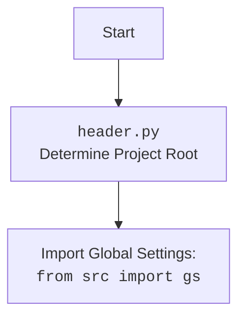

## АНАЛИЗ КОДА `hypotez/src/suppliers/chat_gpt/scenarios/grab_lilnks_to_chats.py`

### 1. <алгоритм>

**Начало:**

1.  Импортируются необходимые модули: `header`, `gs` (глобальные настройки), `Driver`, `Chrome`, `Firefox`, `j_loads_ns`.
2.  Из JSON файла `chats_list.json` загружаются локаторы элементов веб-страницы. Локаторы хранятся в переменной `locator`.

**Функция `get_links`:**

1.  Принимает объект `Driver` в качестве аргумента `d`.
2.  Использует метод `execute_locator` объекта `d` и локатор `locator.link` для извлечения списка ссылок с веб-страницы.
    *   Пример: Если `locator.link` содержит XPath `//div[@class='chat-item']/a`, метод найдет все элементы `<a>` внутри `<div>` с классом `chat-item` и вернет список их атрибутов `href`.
3.  Возвращает список найденных ссылок.

**Основной блок `if __name__ == '__main__':`:**

1.  Создается объект `Driver` с использованием `Firefox` в качестве браузера.
2.  Открывается URL `https://chatgpt.com/`.
3.  Вызывается функция `get_links` с переданным объектом `Driver`, результат записывается в переменную `links`.
4.  Выполняются дальнейшие действия с полученным списком ссылок (представлены многоточием `...`).

**Конец:**

### 2. <mermaid>

```mermaid
flowchart TD
    Start[Начало] --> ImportModules[Импорт модулей: header, gs, Driver, Chrome, Firefox, j_loads_ns];
    ImportModules --> LoadLocators[Загрузка локаторов из chats_list.json в 'locator'];
    LoadLocators --> FunctionGetLinks[Функция get_links(d: Driver)];
    FunctionGetLinks --> ExtractLinks[d.execute_locator(locator.link) <br> Извлечение ссылок с веб-страницы];
    ExtractLinks --> ReturnLinks[Возврат списка ссылок];
    ReturnLinks --> MainBlock[if __name__ == '__main__':];
    MainBlock --> CreateDriver[Создание объекта Driver(Firefox) <br> d = Driver(Firefox)];
    CreateDriver --> OpenURL[d.get_url('https://chatgpt.com/') <br> Открытие страницы ChatGPT];
    OpenURL --> CallGetLinks[links = get_links(d) <br> Вызов get_links];
    CallGetLinks --> ProcessLinks[Дальнейшая обработка списка ссылок  ( ... )];
    ProcessLinks --> End[Конец];
    
    style Start fill:#f9f,stroke:#333,stroke-width:2px
    style End fill:#f9f,stroke:#333,stroke-width:2px

    classDef box stroke:#333,stroke-width:1px
    class ImportModules,LoadLocators,FunctionGetLinks,ExtractLinks,ReturnLinks,MainBlock,CreateDriver,OpenURL,CallGetLinks,ProcessLinks box
```


**Объяснение `mermaid`:**

1. **flowchart TD**: Объявляет начало блок-схемы, где TD означает "Top-Down" (сверху вниз).
2. **Узлы**:
   - **`Start`**: Начало процесса.
   - **`ImportModules`**: Импортирует необходимые модули, включая `header`, `gs`, и классы для управления браузером.
   - **`LoadLocators`**: Загружает локаторы элементов веб-страницы из файла JSON.
   - **`FunctionGetLinks`**: Функция, которая получает ссылки со страницы, используя драйвер и локаторы.
   - **`ExtractLinks`**: Извлечение ссылок с помощью метода `execute_locator` драйвера.
   - **`ReturnLinks`**: Возвращает список найденных ссылок.
   - **`MainBlock`**: Основной блок, который выполняется при запуске скрипта.
   - **`CreateDriver`**: Создание экземпляра драйвера браузера Firefox.
   - **`OpenURL`**: Открытие URL-адреса `https://chatgpt.com/` в браузере.
   - **`CallGetLinks`**: Вызов функции `get_links` для получения списка ссылок.
   - **`ProcessLinks`**: Дальнейшая обработка полученных ссылок (показано как `...`).
   - **`End`**: Конец процесса.
3. **Стрелки**:
   - Стрелки указывают порядок выполнения операций.
4. **`classDef box`**: Объявление стиля для рамок вокруг блоков.
5. **`style Start` и `style End`**: Задают цвет фона и обводки для блоков "Начало" и "Конец".
6. **Зависимости**:
   -  `header` - определяет корень проекта.
   -  `gs` - импортирует глобальные настройки.
   -  `Driver` - абстрактный класс для взаимодействия с браузером.
   -  `Chrome` - конкретная реализация `Driver` для браузера Chrome.
   -  `Firefox` - конкретная реализация `Driver` для браузера Firefox.
   -  `j_loads_ns` - функция для загрузки данных из JSON.

### 3. <объяснение>

**Импорты:**

*   **`import header`**:
    *   **Назначение**: Модуль `header.py` используется для определения корня проекта и настройки путей.
    *   **Взаимосвязь**:  Используется для корректного импорта других модулей из проекта `src`.
*   **`from src import gs`**:
    *   **Назначение**: Модуль `gs` (глобальные настройки) содержит общие настройки проекта, включая пути к директориям.
    *   **Взаимосвязь**: `gs` используется для доступа к пути к файлу с локаторами `chats_list.json`.
*   **`from src.webdriver.driver import Driver`**:
    *   **Назначение**: `Driver` - это абстрактный класс, представляющий интерфейс для управления веб-браузером.
    *   **Взаимосвязь**: Используется как базовый класс для конкретных драйверов, таких как `Chrome` и `Firefox`.
*   **`from src.webdriver.chrome import Chrome`**:
    *   **Назначение**: `Chrome` - это класс, который наследует `Driver` и предоставляет методы для управления браузером Google Chrome.
    *   **Взаимосвязь**: В данном коде не используется, но присутствует как возможная альтернатива `Firefox`.
*   **`from src.webdriver.firefox import Firefox`**:
    *   **Назначение**: `Firefox` - это класс, который наследует `Driver` и предоставляет методы для управления браузером Firefox.
    *   **Взаимосвязь**: Используется для создания экземпляра драйвера браузера в основном блоке.
*   **`from src.utils.jjson import j_loads_ns`**:
    *   **Назначение**: Функция `j_loads_ns` используется для загрузки данных из JSON файла, обрабатывая ключи в виде namespace.
    *   **Взаимосвязь**: Используется для загрузки локаторов элементов веб-страницы из файла `chats_list.json`.

**Функция `get_links`:**

*   **Аргументы**:
    *   `d`: объект класса `Driver`, представляющий драйвер веб-браузера.
*   **Возвращаемое значение**:
    *   Список строк, представляющих URL-адреса ссылок, найденных на веб-странице.
*   **Назначение**: Функция извлекает ссылки из элементов, найденных по локатору `locator.link` на веб-странице, используя предоставленный драйвер `d`.
*   **Пример**: Если `locator.link` содержит XPath `//a[@class='chat-link']`, то функция вернет список всех атрибутов `href` у элементов `<a>` с классом `chat-link`.

**Основной блок `if __name__ == '__main__':`:**

*   **`d = Driver(Firefox)`**: Создает объект драйвера браузера Firefox. Это означает, что для управления браузером будет использоваться класс `Firefox`.
*   **`d.get_url('https://chatgpt.com/')`**: Открывает страницу `https://chatgpt.com/` в браузере, управляемом драйвером `d`.
*   **`links = get_links(d)`**: Вызывает функцию `get_links` для извлечения ссылок с открытой страницы. Результат сохраняется в переменной `links`.
*   **`...`**: Обозначает место, где код, обрабатывающий найденные ссылки, будет написан позже.

**Переменные:**

*   **`locator`**: Словарь или объект, содержащий локаторы элементов веб-страницы, загруженные из файла `chats_list.json`. Структура данных определяется содержимым JSON-файла.
*   **`d`**: Объект класса `Driver` (в данном случае, `Firefox`), представляющий собой экземпляр браузера.
*   **`links`**: Список строк, содержащий извлеченные URL-адреса.

**Потенциальные ошибки и области для улучшения:**

1.  **Обработка исключений**: В коде отсутствует обработка исключений. При ошибках с открытием URL или извлечением ссылок, скрипт может завершиться аварийно. Рекомендуется добавить `try-except` блоки для перехвата и обработки возможных ошибок.
2.  **Управление драйвером**: После завершения работы драйвер не закрывается. Необходимо добавить `d.quit()` или использовать контекстный менеджер, чтобы гарантировать корректное освобождение ресурсов.
3.  **Ожидание элементов**: Не предусмотрено ожидание загрузки элементов веб-страницы. Если элементы не загрузились сразу, `execute_locator` может вернуть пустой список. Рекомендуется добавить явные ожидания.
4. **Незаконченная логика**:  После получения ссылок `...` в коде обозначает пропущенную логику. Необходимо реализовать обработку этих ссылок, например, сохранение в файл или иное использование.
5. **Жестко закодированный URL**: URL `https://chatgpt.com/` прописан непосредственно в коде. Желательно вынести его в переменные или файл конфигурации для гибкости.

**Цепочка взаимосвязей с другими частями проекта:**

*   **`header.py`**: Определяет корень проекта и обеспечивает корректный импорт модулей.
*   **`src/gs`**: Содержит глобальные настройки проекта, такие как пути к файлам.
*   **`src/webdriver/driver.py`**: Абстрактный класс, представляющий интерфейс для управления браузером.
*   **`src/webdriver/chrome.py` / `src/webdriver/firefox.py`**: Конкретные реализации драйвера для соответствующих браузеров.
*   **`src/utils/jjson.py`**:  Утилиты для работы с JSON.
*   **`src/suppliers/chat_gpt/locators/chats_list.json`**:  Файл, содержащий локаторы элементов веб-страницы.

В целом, код представляет собой основу для извлечения ссылок с веб-страницы. Необходимо доработать его, добавив обработку исключений, корректное управление драйвером, ожидания, логику обработки ссылок и вынести жестко заданные параметры в конфигурацию.