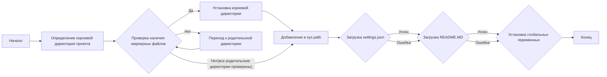

## АНАЛИЗ КОДА `header.py`

### 1. **<алгоритм>**

**Блок-схема:**



**Примеры:**

1.  **`FindRoot`:** Функция `set_project_root` вызывается без аргументов, по умолчанию ищет файлы `__root__` или `.git`.
2.  **`CheckMarkers`:** Проверяется наличие файлов или папок `__root__` или `.git` в текущей и родительских директориях. Если файл найден, то родительская директория будет установлена как корневая директория проекта.
3.  **`SetRoot`:** Переменной `__root__` присваивается найденная корневая директория.
4.  **`AddToPath`:**  Путь к корневой директории добавляется в `sys.path` если его там нет.
5.  **`LoadSettings`:**  Файл `settings.json` загружается из `src/settings.json` и парсится в словарь `settings`.
6.  **`LoadDocString`:** Файл `README.MD` загружается из `src/README.MD` в строку `doc_str`.
7.  **`SetVars`:** Глобальные переменные, такие как `__project_name__`, `__version__`, `__doc__` и другие, устанавливаются из данных, загруженных из `settings.json`.

**Поток данных:**

1.  Путь к файлу `header.py` передается в функцию `set_project_root` через `__file__`.
2.  Функция `set_project_root` возвращает путь к корневой директории и сохраняет его в переменной `__root__`.
3.  Корневая директория используется для построения путей к `settings.json` и `README.MD`.
4.  Содержимое `settings.json` и `README.MD` загружается в переменные `settings` и `doc_str`, соответственно.
5.  Глобальные переменные инициализируются на основе данных из `settings` и `doc_str`.

### 2. **<mermaid>**

```mermaid
flowchart TD
    Start[Start] --> SetRootPath[<code>set_project_root()</code><br>Найти корневую директорию];
    SetRootPath -->  CheckMarkerFiles{Проверка маркерных файлов<br>(<code>__root__</code>, <code>.git</code>)};
    CheckMarkerFiles -- Маркер найден --> SetRoot[Установка корневой директории];
    SetRoot --> AddPath[Добавление корня в <code>sys.path</code>];
    CheckMarkerFiles -- Маркер не найден --> ParentDir[Перейти к родительской директории];
    ParentDir --> CheckMarkerFiles;
    CheckMarkerFiles -- Маркер не найден (все родительские проверены) --> AddPath;
    AddPath --> RootVar[<code>__root__</code><br>Переменная корня проекта];
    RootVar --> ImportGS[Импорт глобальных настроек: <br><code>from src import gs</code>];
    ImportGS --> LoadSettingsFile[Загрузка файла settings.json:<br><code>settings = json.load(...)</code>];
    LoadSettingsFile -- Успешно --> LoadReadmeFile[Загрузка файла README.MD:<br><code>doc_str = file.read()</code>];
    LoadSettingsFile -- Ошибка --> LoadReadmeFile;
    LoadReadmeFile -- Успешно --> SetGlobalVars[Установка глобальных переменных:<br><code>__project_name__</code>, <code>__version__</code> и т.д.];
    LoadReadmeFile -- Ошибка --> SetGlobalVars;
    SetGlobalVars --> End[Конец];
    style Start fill:#f9f,stroke:#333,stroke-width:2px
    style End fill:#f9f,stroke:#333,stroke-width:2px
```

**Анализ зависимостей:**

*   `sys`: Используется для доступа к переменной `sys.path`, чтобы добавить путь к корневой директории проекта в список путей поиска модулей.
*   `json`: Используется для загрузки данных из файла `settings.json` в виде словаря Python.
*   `packaging.version`: Не используется в предоставленном коде, но импортируется. Возможно, предполагается использование в дальнейшем.
*   `pathlib.Path`: Используется для работы с путями к файлам и директориям, обеспечивая кроссплатформенную совместимость.
*   `src`: Импортирует `gs` (global settings), который, вероятно, содержит глобальные пути и настройки проекта, необходимые для доступа к `settings.json` и `README.MD`.

**Дополнительный блок `mermaid` для `header.py`:**

```mermaid
flowchart TD
    Start --> Header[<code>header.py</code><br> Определить корень проекта и глобальные переменные]
    Header --> ImportGS[Импорт глобальных настроек:<br><code>from src import gs</code>]
    ImportGS --> FindRoot[Определение корневой директории: <br> <code>set_project_root()</code>];
        FindRoot --> AddToPath[Добавление в sys.path];
    AddToPath --> LoadSettings[Загрузка settings.json];
    LoadSettings --> LoadReadme[Загрузка README.MD];
    LoadReadme --> SetVars[Установка глобальных переменных]
```

### 3. **<объяснение>**

**Импорты:**

*   `sys`: Предоставляет доступ к системным переменным и функциям, включая `sys.path`, который используется для добавления пути к корневой директории проекта в список путей поиска модулей.
*   `json`: Модуль для работы с данными в формате JSON. Используется для загрузки содержимого файла `settings.json`.
*   `packaging.version`: Модуль для работы с версиями пакетов. В данном коде импортируется, но не используется. Возможно, предназначен для будущего использования.
*   `pathlib`: Модуль для работы с файловыми путями. Класс `Path` обеспечивает кроссплатформенную работу с путями к файлам.
*   `src`: Пакет, содержащий `gs` (global settings), предоставляющий доступ к общим настройкам проекта.

**Функции:**

*   `set_project_root(marker_files=('__root__', '.git')) -> Path`:
    *   **Аргументы**:
        *   `marker_files` (tuple): Кортеж с именами файлов или директорий, которые используются для определения корневой директории проекта. По умолчанию: `('__root__', '.git')`.
    *   **Возвращаемое значение**:
        *   `Path`: Объект `pathlib.Path`, представляющий путь к корневой директории проекта. Если корневая директория не найдена, то возвращает директорию где находится файл.
    *   **Назначение**: Находит корневую директорию проекта, начиная с директории текущего файла и поднимаясь вверх по дереву каталогов, пока не будет найден файл или директория, указанные в `marker_files`.  Возвращает путь к найденной корневой директории.
    *   **Примеры**: Если файл `__root__` находится в директории `/home/user/my_project`, то функция вернет `Path('/home/user/my_project')`.
*   **`__root__ = set_project_root()`**
    *   **Назначение**: Переменная __root__ получает путь к корневому каталогу через функцию set_project_root()

**Переменные:**

*   `__root__`: (Path) Путь к корневой директории проекта.
*   `settings` (dict): Словарь, полученный из загруженного файла `settings.json`. Содержит общие настройки проекта.
*   `doc_str` (str): Строка, содержащая содержимое файла `README.MD`. Используется для получения документации проекта.
*   `__project_name__` (str): Имя проекта, по умолчанию `hypotez`, если не указано в `settings.json`.
*   `__version__` (str): Версия проекта, извлекается из `settings.json`.
*   `__doc__` (str): Строка, содержащая документацию проекта, загружается из `README.MD`.
*   `__details__` (str):  Описания проекта, пока пустая строка
*   `__author__` (str):  Автор проекта, извлекается из `settings.json`.
*    `__copyright__` (str):  Копирайт, извлекается из `settings.json`.
*   `__cofee__` (str):  Сообщение о поддержке разработчика, извлекается из `settings.json`.

**Потенциальные ошибки и области для улучшения:**

*   **Обработка ошибок:** В коде используются `try-except` блоки для обработки `FileNotFoundError` и `json.JSONDecodeError`, но в блоке `except` используется `...`, что заглушает ошибки. Лучше явно логировать ошибки или использовать обработчики.
*   **`packaging.version`:** Импортирован, но не используется. Следует удалить импорт, если он не нужен.
*   **Пустые переменные:**  `__details__`  всегда инициализируется пустой строкой. Можно либо её удалить либо добавить функциональность для инициализации.
*   **Жестко заданные пути:** Пути к `settings.json` и `README.MD` формируются через конкатенацию строк, что делает код менее гибким. Можно использовать константы.

**Взаимосвязь с другими частями проекта:**

*   Данный модуль используется как часть `src`, в частности, импортирует `gs` из `src`.
*   Переменные, объявленные в `header.py`, служат общими настройками и используются в других частях проекта для доступа к общим параметрам, версии, имени проекта и т.д.
*   Функция `set_project_root` является ключевой для правильной работы проекта, т.к. она обеспечивает определение абсолютного пути к корню проекта, независимо от того, откуда запускается скрипт.
*   Зависимость от `settings.json` и `README.MD` предполагает наличие этих файлов в проекте.
*   `header.py` служит как точка входа для получения общих параметров, таких как версия, имя проекта, автор и т.д.