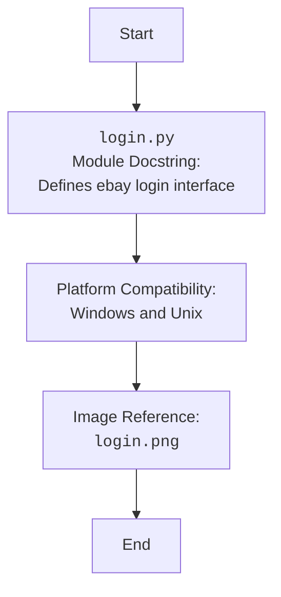

## АНАЛИЗ КОДА: `src/suppliers/ebay/login.py`

### 1. <алгоритм>

Файл `login.py` содержит только docstrings и не содержит исполняемого кода. Таким образом, алгоритм будет представлять собой просто описание цели этого файла:

1. **Начало:** Файл `login.py` предназначен для хранения кода, отвечающего за логику авторизации для поставщика eBay.
2. **Импорт:**  В текущей версии файла импорт не требуется, так как нет исполняемого кода.
3. **Документирование:** Файл содержит docstrings, указывающие на назначение модуля, его совместимость с разными платформами (Windows, Unix) и его роль в системе поставщиков.  Docstring также включает ссылку на изображение `login.png`.
4. **Конец:** В будущем здесь будет реализация авторизации, скорее всего с использованием веб-драйвера.

### 2. <mermaid>

**Объяснение диаграммы `mermaid`:**

Диаграмма описывает структуру и назначение файла `login.py`, который является частью модуля `src.suppliers.ebay`.

- `Start`: Начало процесса.
- `ModuleDocstring`: docstring модуля. Описывает назначение файла - интерфейс для авторизации eBay.
- `PlatformCompatibility`: Указывает, что модуль совместим с Windows и Unix.
- `ImageReference`: Указывает на наличие  графического файла `login.png`, связанного с авторизацией.
- `End`: Завершение описания.

В данном примере, нет импорта `header`  поэтому, дополнительный блок `mermaid` отсутствует.

### 3. <объяснение>

**Импорты:**
   - В текущей версии файла импорты отсутствуют. Это связано с тем, что файл содержит только docstrings и не содержит исполняемого кода.

**Классы:**
   - Файл не содержит определений классов. Предполагается, что в будущем здесь будет класс или несколько классов, отвечающих за авторизацию пользователя на eBay.

**Функции:**
   - Файл не содержит определений функций. Предполагается, что в будущем здесь будут функции, реализующие логику авторизации (например, получение токенов, ввод логина и пароля и т.д.).

**Переменные:**
   - Файл не содержит глобальных переменных.

**Детальное объяснение:**

- **Назначение:** Файл `login.py` предназначен для реализации авторизации пользователя в системе eBay. В данном виде он является заглушкой, с docstrings, где указана информация о модуле.
- **Docstrings:** Docstrings содержат важную информацию для документирования и понимания кода. Они описывают предназначение модуля, его платформы (Windows, Unix), а также указывают на наличие изображения `login.png`, связанного с процессом авторизации.
- **Будущая реализация:** Предполагается, что в будущем этот файл будет содержать:
    -   Классы, реализующие логику авторизации (возможно, используя веб-драйвер).
    -  Функции для управления процессом авторизации (например, ввод данных, отправка запросов, обработка ответов и т. д.)
- **Потенциальные улучшения:**
    - Необходимо реализовать класс для авторизации в eBay.
    - Необходимо добавить обработку ошибок и исключений.
    - Стоит обратить внимание на безопасность, особенно при хранении данных авторизации.
    - При использовании веб-драйвера, необходимо учитывать политику eBay по взаимодействию с их ресурсом через автоматизацию.

**Цепочка взаимосвязей с другими частями проекта:**

- Этот файл является частью модуля `src.suppliers.ebay`, который отвечает за интеграцию с поставщиком eBay.  
- В будущем этот модуль, вероятно, будет зависеть от других частей проекта, таких как:
    -   Модули `src.settings`, для получения настроек (возможно, ключей API).
    -   Модули для работы с БД, для хранения данных аутентификации.
    -   Модули `src.core`, для использования общих функций и инструментов проекта.
    -   Модули для веб-драйвера, для автоматизации браузера при авторизации.
- Взаимодействие будет осуществляться через вызовы функций и методов, определённых в этом файле.

В целом, текущая версия файла `login.py` является заготовкой, и требует дальнейшей разработки для полноценной реализации авторизации в системе eBay.