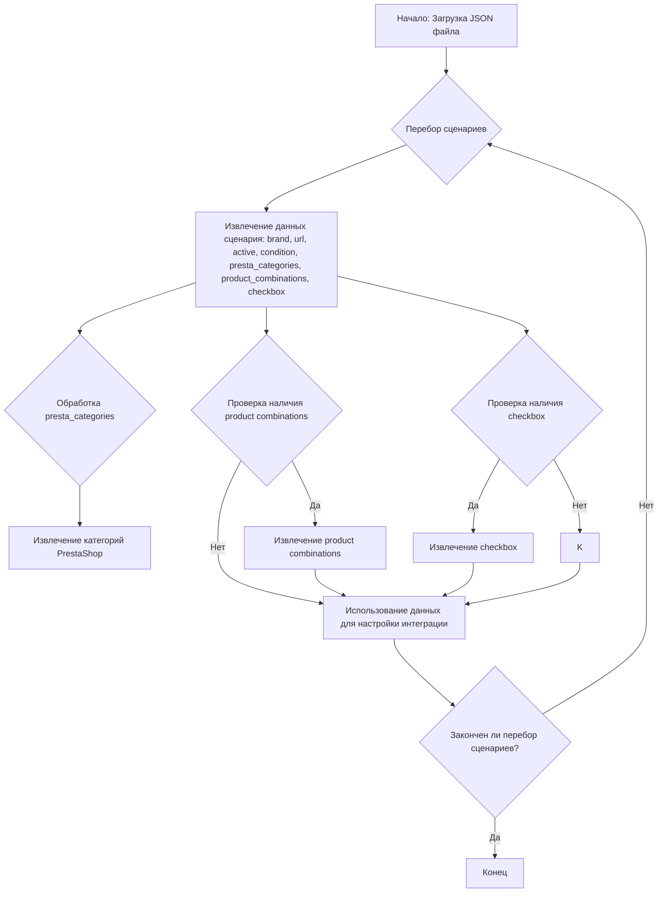

## АНАЛИЗ КОДА

### <алгоритм>

1.  **Начало**: Загружается JSON-файл конфигурации, который содержит определения сценариев для различных моделей iPhone.
   *   *Пример*: Загрузка `ebay_categories_phones_apple.json`.

2.  **Итерация по сценариям**: Происходит перебор каждого ключа в словаре `scenarios`. Каждый ключ представляет собой модель iPhone, например, `"iPhone XS MAX"`, `"iPhone 11"`.
    *   *Пример*: Обрабатывается сначала `"iPhone XS MAX"`, затем `"iPhone XS"`, и так далее.

3.  **Извлечение данных сценария**: Для каждого сценария извлекаются данные, такие как `brand`, `url`, `active`, `condition`, `presta_categories`, `product combinations` (если есть) и `checkbox` (если есть).
    *   *Пример*: Для `"iPhone XS MAX"` извлекается `brand: "APPLE"`, `url: "https://www.ebay.com/..."`, `active: true`, `condition: "new"`, `presta_categories: {"template": {"apple": "iPhone XS MAX"}}`, `product combinations: ["bundle", "color"]`.

4.  **Обработка `presta_categories`**: Извлекается информация о категориях PrestaShop, где ключом `template` является вложенный словарь, сопоставляющий `apple` с названием модели iPhone.
    *   *Пример*: Для `"iPhone XS MAX"` `presta_categories` имеет вид `{"template": {"apple": "iPhone XS MAX"}}`, где `"apple"` - это ключ, а `"iPhone XS MAX"` - значение.

5.  **Обработка `product combinations`**: Если существует поле `product combinations`, оно определяет, какие характеристики товара (например, `bundle`, `color`) нужно учитывать при его создании в PrestaShop.
    *   *Пример*: Для `"iPhone XS MAX"` `product combinations` имеет вид `["bundle", "color"]`.

6.  **Обработка `checkbox`**: Если существует поле `checkbox`, оно определяет состояние чекбокса для этого сценария. По умолчанию, если поле не определено, то можно считать, что чекбокс отмечен.
     *   *Пример*: Для `"iPhone SE 2022"` `checkbox` имеет значение `false`.

7.  **Использование данных**: Извлеченные данные используются для настройки интеграции с eBay и PrestaShop, где URL используется для поиска товаров на eBay, а данные `presta_categories` используются для определения категорий товаров в PrestaShop. Параметр `active` указывает, нужно ли обрабатывать данный сценарий.
    *   *Пример*: URL `"https://www.ebay.com/..."` используется для парсинга страниц eBay в поисках товаров модели `"iPhone XS MAX"`.

8.  **Завершение**: Процесс повторяется для каждого сценария до обработки всех моделей iPhone.

### <mermaid>

### <объяснение>

**Общая структура**:

Файл `ebay_categories_phones_apple.json` представляет собой JSON-объект, содержащий словарь `scenarios`, где каждый ключ – это модель iPhone (например, `"iPhone XS MAX"`), а значение – это объект, описывающий конфигурацию для этой модели.

**Элементы конфигурации:**

*   **`brand`**: Строка, указывающая на бренд товара (в данном случае всегда `"APPLE"`).
*   **`url`**: Строка, представляющая собой URL для поиска товаров данной модели на eBay. URL-адреса содержат параметры, которые фильтруют результаты поиска, например, `Network=Unlocked` и `Model=Apple%2520iPhone%2520XS%2520Max`.
*   **`active`**: Логическое значение (`true` или `false`), указывающее, следует ли обрабатывать данный сценарий. Если `true`, то товар будет обрабатываться, если `false`, то сценарий игнорируется.
*   **`condition`**: Строка, указывающая на состояние товара (в данном случае всегда `"new"`).
*   **`presta_categories`**: Объект, который определяет соответствие между категориями товаров на eBay и категориями в PrestaShop. Вложенный объект `template` содержит отображение, где ключ `"apple"` соответствует названию модели iPhone в PrestaShop.
*   **`product combinations`**: Массив строк, определяющий комбинации продуктов, которые нужно учитывать (например, `"bundle"` и `"color"`). Это используется для создания вариантов товара в PrestaShop.
*   **`checkbox`**: Логическое значение (`true` или `false`), указывающее на то, отмечен ли чекбокс для данного сценария. Если не указано, считается, что чекбокс отмечен.

**Использование:**

Этот файл конфигурации, вероятно, используется в системе для автоматизации процесса импорта и синхронизации товаров с eBay в интернет-магазин на PrestaShop. Данные из JSON используются для:

1.  **Сбор данных с eBay**: URL-адреса используются для запросов на eBay API для сбора информации о товарах.
2.  **Сопоставление категорий**: `presta_categories` позволяют системе определять, в какую категорию PrestaShop нужно поместить товары.
3.  **Создание вариантов товара**: `product combinations` используются для создания вариантов товара, например, по цвету или комплектации.
4.  **Фильтрация сценариев**: `active` используется для того, чтобы определить, нужно ли обрабатывать данный сценарий.
5.  **Контроль активности**: `checkbox` позволяет вручную отключать некоторые модели из обработки.

**Потенциальные улучшения:**

*   **Валидация данных**: Можно добавить валидацию данных, чтобы убедиться, что URL-адреса корректны и что все необходимые поля присутствуют.
*   **Расширение категорий**: Возможно, потребуется расширить структуру `presta_categories`, если потребуется сопоставление с более чем одной категорией PrestaShop.
*   **Управление комбинациями**: Можно добавить более гибкую логику для управления `product combinations`, чтобы можно было задавать различные варианты комбинаций для разных товаров.

**Цепочка взаимосвязей:**

Этот JSON-файл является частью системы, которая связывает eBay и PrestaShop. Он используется как источник данных для скриптов, которые автоматизируют следующие процессы:

1.  Парсинг страниц eBay.
2.  Формирование данных для PrestaShop.
3.  Обновление каталога товаров в PrestaShop.

**Примеры**:
* Сценарий `iPhone XS MAX`:
    *  `url`  указывает на страницу eBay с iPhone XS MAX
    *  `presta_categories` указывает на то, что этот телефон нужно отнести к категории "iPhone XS MAX"
    *  `product combinations` указывает на то, что у товара будут варианты по комплектации и цвету.

* Сценарий `iPhone SE 2022`:
    *  `url`  указывает на страницу eBay с iPhone SE 2022
    *  `presta_categories` указывает на то, что этот телефон нужно отнести к категории "iPhone SE 2022"
    *  `checkbox` указывает на то, что данный сценарий по умолчанию отключен.

В целом, данный JSON-файл является важной частью конфигурации, которая позволяет автоматизировать процесс интеграции между eBay и PrestaShop для продажи телефонов Apple.