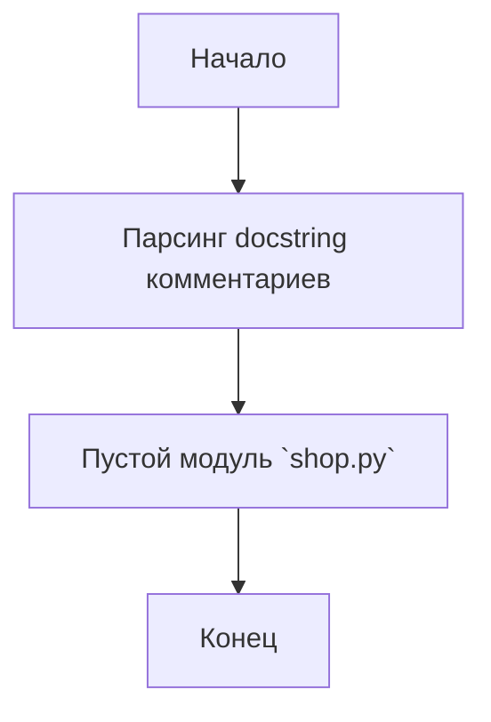

## АНАЛИЗ КОДА: `src/suppliers/ebay/shop.py`

### 1. <алгоритм>

**Описание:**

Файл `shop.py` в директории `src/suppliers/ebay` представляет собой пока что пустой модуль. Он предназначен для реализации логики, связанной с магазином eBay. В текущем состоянии он содержит только заголовочные комментарии и не имеет исполняемого кода.

**Пошаговая блок-схема:**

1. **Начало**: Запуск файла `shop.py`.
2. **Комментарии**: Происходит парсинг и игнорирование docstring комментариев и комментариев, которые описывают модуль.
3. **Конец**: Завершение выполнения файла.

**Пример:**
Представим, что позже в этом файле будет реализована логика.
1.  **Начало**: Запуск файла `shop.py`.
2.  **Импорт**: Импорт необходимых библиотек. Например, `import requests`.
3.  **Класс EbayShop**: Создание класса `EbayShop`, который содержит методы для взаимодействия с API eBay.
    *   **Метод fetch_products**: Получение списка продуктов с eBay.
    *   **Метод get_product_details**: Получение деталей конкретного продукта.
    *   **Метод add_to_cart**: Добавление продукта в корзину.
4.  **Конец**: Завершение выполнения файла или выполнение определенных операций в контексте.

### 2. <mermaid>

**Анализ `mermaid` диаграммы:**

Диаграмма показывает очень простую схему, так как файл в текущем состоянии не содержит исполняемого кода. Она состоит из трех основных этапов:
1. **Начало**: Указывает на начало выполнения скрипта.
2. **Парсинг комментариев**: Этап, на котором происходит чтение и пропускание docstring комментариев.
3. **Пустой модуль `shop.py`**: Обозначает, что данный модуль в настоящее время не содержит никакой исполняемой логики, кроме комментариев.
4. **Конец**: Указывает на завершение выполнения скрипта.

### 3. <объяснение>

**Импорты:**

В текущем состоянии файла нет импортов. Однако в будущей реализации модуля `shop.py` могут быть импортированы следующие библиотеки:

*   `requests`: Для выполнения HTTP запросов к API eBay.
*   `json`: Для работы с JSON данными, получаемыми от API eBay.
*   Возможно, другие модули из пакета `src`, например, для работы с общими настройками или моделями данных.

**Классы:**
На данный момент классы отсутствуют. В будущей реализации будет логично добавить класс, например, `EbayShop`, который будет инкапсулировать логику взаимодействия с API eBay. Этот класс может иметь методы для получения списка товаров, деталей конкретного товара, добавления товара в корзину и т.д.

**Функции:**

На данный момент функции отсутствуют. В будущей реализации могут быть добавлены функции для выполнения конкретных операций, например:
*   `fetch_products(search_query)`: Для получения списка товаров на основе поискового запроса.
*   `get_product_details(product_id)`: Для получения подробной информации о товаре по его ID.
*   `add_to_cart(product_id, quantity)`: Для добавления товара в корзину.

**Переменные:**

В текущем состоянии файла нет объявленных переменных. В будущем в модуле могут быть объявлены переменные для хранения API ключей, URL-адресов API eBay и других конфигурационных параметров.

**Цепочка взаимосвязей с другими частями проекта:**

Модуль `shop.py` будет взаимодействовать с другими частями проекта следующим образом:
1.  Модули из `src.suppliers.ebay`: Скорее всего будут другие модули, отвечающие за обработку данных, маппингу данных, подключение к API и т.д.
2.  `src.core`: Для использования общих классов или утилит.
3.  `src.database`: Для взаимодействия с базой данных для хранения и обработки данных, полученных с API eBay.
4.  `src.config`: Для чтения конфигурационных параметров, таких как API-ключи и др.

**Потенциальные ошибки и области для улучшения:**

*   В текущем состоянии файл пуст, поэтому его функциональность не может быть оценена.
*   Необходимо добавить реализацию класса `EbayShop` и других функций, отвечающих за взаимодействие с API eBay.
*   Требуется реализовать обработку ошибок, чтобы обеспечить корректную работу модуля.
*   Необходимо использовать `logging` для отслеживания работы модуля и диагностики ошибок.

**Заключение:**
Файл `shop.py` в директории `src/suppliers/ebay` является начальной точкой для реализации логики взаимодействия с eBay. На данный момент он не содержит исполняемого кода, но в будущем будет дополнен классами, функциями и переменными, необходимыми для выполнения требуемых операций.