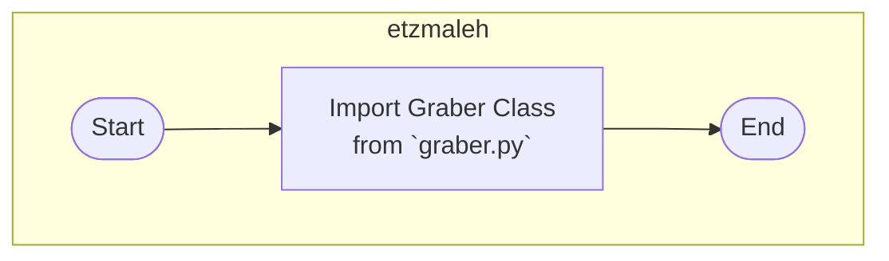

## АНАЛИЗ КОДА: `src/suppliers/etzmaleh/__init__.py`

### <алгоритм>

1.  **Импорт модуля `graber`**: Импортируется класс `Graber` из модуля `graber.py`, находящегося в том же каталоге `etzmaleh`.
    *   _Пример_: `from .graber import Graber` импортирует класс для дальнейшего использования в пакете `etzmaleh`.

2.  **Инициализация пакета**: Файл `__init__.py` служит для определения каталога `etzmaleh` как пакета Python. На данный момент он содержит только импорт, но в будущем может включать дополнительную логику инициализации пакета.
    *   _Пример_: Наличие файла `__init__.py` в каталоге `etzmaleh` позволяет импортировать модули и классы внутри него, например, `from src.suppliers.etzmaleh import Graber`.

### <mermaid>

**Объяснение `mermaid`:**
-  Диаграмма представляет собой блок-схему, отражающую процесс в файле `__init__.py` в пакете `etzmaleh`.
-  `Start` - начальная точка выполнения скрипта.
-  `ImportGraber` -  блок, представляющий импорт класса `Graber` из `graber.py`.
-  `End` - конечная точка выполнения скрипта.
- Подграф `etzmaleh` показывает, что все действия происходят в рамках данного пакета.

### <объяснение>

**Импорты:**

-   `from .graber import Graber`:
    -   Импортирует класс `Graber` из модуля `graber.py`, находящегося в той же директории, что и файл `__init__.py`.
    -   `.` означает относительный импорт, то есть импорт из текущего пакета `etzmaleh`.
    -   Класс `Graber` вероятно, предназначен для извлечения данных с веб-сайтов.

**Классы:**
-   В данном файле нет определений классов. Однако, импортируется класс `Graber`, который определён в другом модуле (`graber.py`).

**Функции:**
-   В данном файле нет определений функций.

**Переменные:**
-   В данном файле нет определений переменных.

**Цепочка взаимосвязей:**

1.  **`src` (Корень проекта)**: `src` является корнем проекта.
2.  **`src/suppliers`**: Каталог `suppliers` содержит подкаталоги для различных поставщиков.
3.  **`src/suppliers/etzmaleh`**: Пакет `etzmaleh` предназначен для работы с поставщиком Etzmaleh. Файл `__init__.py` объявляет каталог `etzmaleh` как пакет и импортирует класс `Graber`.
4.  **`src/suppliers/etzmaleh/graber.py`**: Модуль `graber.py` содержит класс `Graber`, который отвечает за извлечение данных.
5.  **Дальнейшее использование `Graber`**: Вероятно, `Graber` будет использоваться для получения данных от поставщика Etzmaleh.

**Потенциальные ошибки и области для улучшения:**

-   **Отсутствие документации**: Отсутствует документация в `__init__.py`. Добавление docstring может быть полезным.
-   **Пустой файл**:  На данный момент файл выполняет только импорт. Возможно, в будущем потребуется добавить дополнительную логику инициализации пакета или другие импорты.
-   **Нет примера использования**: Не показано использование `Graber` в данном файле. Код в `__init__.py` может быть дополнен демонстрацией использования `Graber` для облегчения понимания его работы в контексте пакета `etzmaleh`.