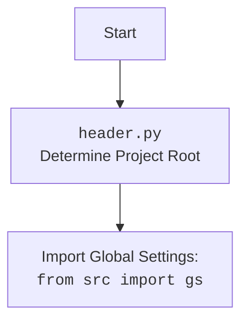

## <алгоритм>

1.  **Инициализация**:
    *   Создается экземпляр класса `Graber`, принимая объект `Driver` в качестве аргумента.
    *   Устанавливается префикс поставщика `supplier_prefix` как 'etzmaleh'.
    *   Вызывается конструктор родительского класса `Graber` (из `src.suppliers.graber`) с префиксом поставщика и драйвером.
    *   В `Context.locator_for_decorator` устанавливается значение `None`, что отключает выполнение стандартного декоратора `close_pop_up` при захвате данных.

2.  **Захват данных**:
    *   Класс `Graber` наследует от `Graber` (из `src.suppliers.graber`), предполагая наличие методов захвата данных для различных полей товара.
    *   Декоратор `@close_pop_up` (из `src.suppliers.graber`) в этом классе не используется (он отключен `Context.locator_for_decorator = None`), но существует шаблон для переопределения.
    *   При вызове любого метода сбора данных (напр. `get_product_name()`),  вызывается родительский класс, который применяет декоратор (если он включен), выполняет логику захвата данных и возвращает результат.
    *   Если нужна нестандартная обработка, методы переопределяются в этом классе.

3. **Пример выполнения**:
    * Создается объект `driver` класса `Driver`.
    * Создается объект `graber` класса `Graber`, с передачей объекта `driver`.
    * Вызывается метод `graber.get_product_name()`.
    * Стандартный декоратор `@close_pop_up` не выполняется, т.к.  `Context.locator_for_decorator` установлен в `None`.
    * Выполняется стандартная логика сбора названия товара в родительском классе и возвращается результат.

## <mermaid>

```mermaid
flowchart TD
    Start[Start] --> Init_Graber[Инициализация класса Graber<br>Установка supplier_prefix = 'etzmaleh'<br>и Context.locator_for_decorator = None]
    Init_Graber --> Init_Parent[Вызов __init__ родительского класса<br>Graber (из src.suppliers.graber)]
    Init_Parent --> Method_Call[Вызов метода сбора данных<br>(напр. get_product_name())]
    Method_Call --> Check_Decorator[Проверка Context.locator_for_decorator]<br>  
    Check_Decorator -- Context.locator_for_decorator is None --> Standard_Grab[Выполнение стандартной логики<br> захвата данных (родительский класс)]
    Check_Decorator -- Context.locator_for_decorator is not None --> Custom_Decorator[Выполнение кастомного декоратора <br>(если был переопределен)]
    Custom_Decorator --> Standard_Grab
    Standard_Grab --> Return_Data[Возврат полученных данных]
    Return_Data --> End[Конец]

    classDef highlight fill:#f9f,stroke:#333,stroke-width:2px
    Init_Graber, Method_Call, Check_Decorator,Standard_Grab, Return_Data  :::highlight
    
```



## <объяснение>

**Импорты:**

*   `from typing import Any`: Импортируется `Any` для аннотации типов, что позволяет указывать, что переменная может иметь любой тип.
*   `import header`: Импортируется модуль `header`, который предположительно содержит логику для определения корневой директории проекта и загрузки глобальных настроек.
*   `from src.suppliers.graber import Graber as Grbr, Context, close_pop_up`:
    *   Импортируется класс `Graber` из `src.suppliers.graber` и переименовывается в `Grbr` для краткости. Этот класс является родительским классом для текущего `Graber` и содержит общую логику сбора данных.
    *   Импортируется класс `Context`, который, вероятно, используется для хранения глобальных настроек и контекста выполнения.
     *   Импортируется функция `close_pop_up`,  которая представляет собой декоратор для обработки всплывающих окон.
*   `from src.webdriver.driver import Driver`: Импортируется класс `Driver` из `src.webdriver.driver`, который, предположительно, используется для управления веб-драйвером (например, Selenium).
*   `from src.logger.logger import logger`: Импортируется объект `logger` для логирования событий в коде.

**Классы:**

*   `class Graber(Grbr)`:
    *   **Роль:** Этот класс `Graber` предназначен для сбора данных со страниц товаров конкретного поставщика (`etzmaleh`). Он наследует от `Grbr` (из `src.suppliers.graber`), который предоставляет общую функциональность для сбора данных.
    *   **Атрибуты:**
        *   `supplier_prefix: str`:  `etzmaleh`  - префикс для идентификации поставщика.
    *   **Методы:**
        *   `__init__(self, driver: Driver)`: Конструктор класса. Принимает экземпляр `Driver` и:
            *   Устанавливает `supplier_prefix` как `'etzmaleh'`.
            *   Вызывает конструктор родительского класса `Grbr`, передавая `supplier_prefix` и `driver`.
            *   Устанавливает `Context.locator_for_decorator` в `None`, отключая стандартный декоратор `@close_pop_up`.

**Функции:**

*   (Закомментированный шаблон декоратора `close_pop_up`):
    *   **Аргументы:** `value: Any = None` (не используется).
    *   **Возвращаемое значение:** `Callable`: Декоратор, который обертывает функцию.
    *   **Назначение:** Этот закомментированный шаблон показывает, как можно создать кастомный декоратор для закрытия всплывающих окон перед выполнением основной логики сбора данных.
        *  Он определен в родительском классе.
    *   **Пример:** Если бы декоратор был раскомментирован, и `Context.locator_for_decorator` был установлен, при вызове метода сбора данных, сначала бы был выполнен код в декораторе (например, попытка закрыть всплывающее окно), а затем выполнился основной метод.

**Переменные:**

*   `supplier_prefix: str`: Атрибут класса, хранит префикс поставщика.
*   `Context.locator_for_decorator`:  Переменная в глобальном контексте, управляет применением декоратора `@close_pop_up`. `None` - отключает декоратор.

**Взаимосвязи с другими частями проекта:**

*   `src.suppliers.graber`: Наследует функциональность от общего класса `Graber` для сбора данных.
*   `src.webdriver.driver`: Использует класс `Driver` для управления веб-драйвером.
*   `src.logger.logger`: Использует объект `logger` для логирования событий.
*   `header.py`: использует для определения корневого каталога проекта, и загрузки глобальных настроек.

**Потенциальные ошибки и области для улучшения:**

*   **Зависимость от глобального контекста `Context`**:  Использование глобального контекста может усложнить отладку и тестирование кода. Возможно, стоит рассмотреть передачу необходимых параметров через аргументы функций или классов.
*   **Жесткая привязка к 'etzmaleh'**:  Значение  `'etzmaleh'`  жестко задано внутри класса, возможно следует вынести его как параметр в конструктор.
*   **Отсутствие переопределенных методов:**  В текущей реализации методы сбора данных не переопределены в классе,  поэтому используется логика родительского класса, это может привести к некорректному захвату данных, если логика сбора отличается.
*   **Закомментированный шаблон декоратора:**  Подразумевается, что разработчик должен раскомментировать шаблон и переопределить логику,  вместо того чтобы предоставить готовый механизм. Это может привести к ошибкам, если разработчик забудет это сделать.
*   **Обработка исключений:**  В шаблоне декоратора есть только debug логирование исключения, следует рассмотреть более полную обработку или передачу исключений на верхние уровни.

В целом, код представляет собой базовую реализацию класса для сбора данных с сайта `etzmaleh`, но имеет ряд потенциальных проблем и нуждается в более детальной проработке и тестировании.