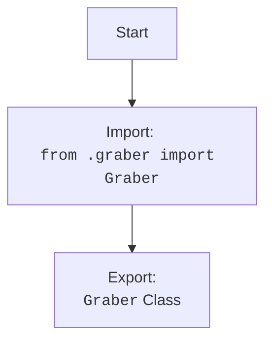

## <алгоритм>

1. **Импорт модуля `Graber`**:
   - Импортируется класс `Graber` из модуля `graber.py`, находящегося в той же директории (`.`) что и `__init__.py`.
   - Пример: `from .graber import Graber`

2. **Экспорт класса `Graber`**:
   -  Класс `Graber` становится доступным для импорта из пакета `src.suppliers.gearbest`.
   - Пример: Когда другой модуль делает `from src.suppliers.gearbest import Graber`, он импортирует этот класс.

## <mermaid>

**Объяснение зависимостей `mermaid`:**

*   **`Start`**: Начало процесса.
*   **`ImportGraber`**: Импортирует класс `Graber` из модуля `graber.py` находящегося в той же директории.
*   **`ExportGraber`**: Экспортирует класс `Graber`, делая его доступным для импорта другими модулями, использующими `src.suppliers.gearbest`.

## <объяснение>

**Импорты:**

*   `from .graber import Graber`: Этот импорт извлекает класс `Graber` из файла `graber.py`, который находится в той же директории, что и файл `__init__.py`. Точка (`.`) в начале пути указывает на текущую директорию, что делает `graber.py` частью пакета `src.suppliers.gearbest`. Этот импорт позволяет использовать класс `Graber` через пакет `src.suppliers.gearbest`.

**Классы:**

*   `Graber`: Этот класс, скорее всего, отвечает за парсинг или извлечение данных с веб-сайта Gearbest. Подробности реализации находятся в файле `graber.py`.  Класс `Graber` скорее всего имеет методы для получения, обработки данных со страниц Gearbest, и дальнейшей передачи их в другие части приложения.

**Функции:**
    * В данном коде функции не определены, но предполагается, что класс `Graber` содержит методы, которые будут выполняться после импорта этого класса в другие модули.

**Переменные:**
    * В данном коде переменные не определены.

**Потенциальные ошибки и области для улучшения:**

*   В данном коде нет ошибок, но нет и проверки импорта. Желательно добавить `try`-`except` блоки при импорте модуля для обработки возможных проблем с импортом или его отсутствием.
*   В данный момент код полагается на то, что `graber.py` существует в той же директории.
*   Документация внутри модуля `__init__.py` минимальна. Хорошей практикой будет добавление docstring для описания содержимого модуля и его предназначения.
*   Код не описывает реализацию `graber.py`, поэтому подробное описание его функций не может быть сделано.

**Взаимосвязь с другими частями проекта:**

*   `src.suppliers.gearbest` является пакетом, который предоставляет функциональность для работы с поставщиком Gearbest.
*   Другие части проекта (например, модули, отвечающие за обработку и хранение данных), могут импортировать класс `Graber` для получения данных с сайта Gearbest.
*  `__init__.py` выступает как точка входа в пакет `src.suppliers.gearbest` делая класс `Graber` доступным для импорта.

Этот код создаёт пакет `src.suppliers.gearbest` и экспортирует класс `Graber`, который является основным компонентом для работы с Gearbest.