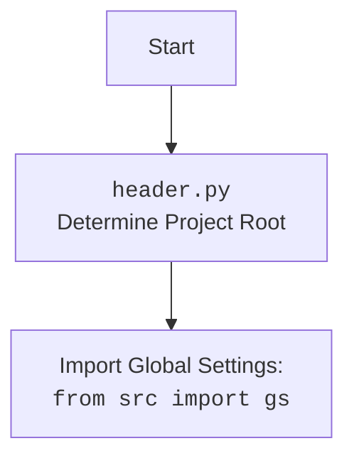

## ИНСТРУКЦИЯ:

Анализируй предоставленный код подробно и объясни его функциональность. Ответ должен включать три раздела:

1.  **<алгоритм>**: Опиши рабочий процесс в виде пошаговой блок-схемы, включая примеры для каждого логического блока, и проиллюстрируй поток данных между функциями, классами или методами.
2.  **<mermaid>**: Напиши код для диаграммы в формате `mermaid`, проанализируй и объясни все зависимости,
    которые импортируются при создании диаграммы.
    **ВАЖНО!** Убедитесь, что все имена переменных, используемые в диаграмме `mermaid`,
    имеют осмысленные и описательные имена. Имена переменных вроде `A`, `B`, `C`, и т.д., не допускаются!

    **Дополнительно**: Если в коде есть импорт `import header`, добавьте блок `mermaid` flowchart, объясняющий `header.py`:
    ```mermaid
    flowchart TD
        Start --> Header[<code>header.py</code><br> Determine Project Root]

        Header --> import[Import Global Settings: <br><code>from src import gs</code>]
    ```

3.  **<объяснение>**: Предоставьте подробные объяснения:
    -   **Импорты**: Их назначение и взаимосвязь с другими пакетами `src.`.
    -   **Классы**: Их роль, атрибуты, методы и взаимодействие с другими компонентами проекта.
    -   **Функции**: Их аргументы, возвращаемые значения, назначение и примеры.
    -   **Переменные**: Их типы и использование.
    -   Выделите потенциальные ошибки или области для улучшения.

Дополнительно, постройте цепочку взаимосвязей с другими частями проекта (если применимо).

Это обеспечивает всесторонний и структурированный анализ кода.
## Формат ответа: `.md` (markdown)
**КОНЕЦ ИНСТРУКЦИИ**

### 1. <алгоритм>

**`set_project_root` Function:**

1. **Начало:** Функция `set_project_root` вызывается с аргументом `marker_files` (по умолчанию `('__root__', '.git')`).
2. **Получение текущего пути:** Получается абсолютный путь к директории, где находится файл `header.py`, и сохраняется в `current_path`.
   *   **Пример:** Если `header.py` расположен в `/home/user/hypotez/src/suppliers/gearbest/`, то `current_path` будет `Path('/home/user/hypotez/src/suppliers/gearbest')`.
3. **Инициализация корня проекта:** Переменная `__root__` инициализируется текущим путем `current_path`.
4. **Поиск корневой директории:**
    *  Создается список путей, включающий текущий путь и все его родительские директории.
    *  Итерируясь по этим путям, проверяется, существует ли в какой-либо из них файл или директория с именем, указанным в `marker_files`.
      * **Пример:** Если `marker_files` равно `('__root__', '.git')`, то для каждой родительской директории проверяется, существует ли файл `__root__` или папка `.git`
    *  Если один из маркеров найден, то `__root__` переопределяется на путь, где найден маркер, и цикл завершается.
5. **Добавление в `sys.path`:** Если `__root__` не находится в списке путей поиска модулей (`sys.path`), то он добавляется в начало списка.
6. **Возврат корня проекта:** Функция возвращает путь к корневой директории проекта (`__root__`).
   * **Пример:** если маркер `.git` был найден в `/home/user/hypotez`, то `__root__` будет `Path('/home/user/hypotez')`.

**Главная часть скрипта:**

1. **Определение `__root__`:** Вызывается функция `set_project_root()`, и результат сохраняется в переменную `__root__`.
2. **Импорт `gs`:** Импортируются глобальные настройки `gs` из пакета `src`.
3. **Чтение `settings.json`:**
    *   Пытается открыть файл `settings.json` из директории `src` относительно корневой директории (`gs.path.root / 'src' / 'settings.json'`).
    *   Если файл существует, его содержимое загружается в переменную `settings` как словарь JSON.
    *   Если файл не существует или JSON невалиден, то переменная `settings` остается `None`.
4. **Чтение `README.MD`:**
    *   Пытается открыть файл `README.MD` из директории `src` относительно корневой директории (`gs.path.root / 'src' / 'README.MD'`).
    *   Если файл существует, его содержимое загружается в переменную `doc_str` как строку.
    *   Если файл не существует, то `doc_str` остается `None`.
5. **Извлечение настроек:**
    *  Извлекаются значения из словаря `settings` (если он был успешно загружен), такие как:
      *   `project_name`, по умолчанию `hypotez`.
      *   `version`, по умолчанию ''.
      *   `author`, по умолчанию ''.
      *   `copyright`, по умолчанию ''.
      *  `cofee`, по умолчанию `Treat the developer to a cup of coffee for boosting enthusiasm in development: https://boosty.to/hypo69`
    *  Если `settings` равен `None`, то используются значения по умолчанию.
6. **Установка `__doc__`:**
    *  Если `doc_str` не `None`, то `__doc__` будет равно `doc_str`
    *  Иначе `__doc__` будет равно пустой строке.
7.  **Инициализация  `__details__`:** Переменная `__details__` инициализируется пустой строкой.

### 2. <mermaid>

```mermaid
flowchart TD
    Start[Начало] --> SetRoot[set_project_root()]
    SetRoot --> FindRoot[Поиск корневой директории]
    FindRoot -- Маркер найден --> SetRootPath[Установить путь к корню]
    FindRoot -- Маркер не найден --> UseCurrentPath[Использовать текущий путь]
    SetRootPath --> AddToSysPath[Добавить корень в sys.path]
    UseCurrentPath --> AddToSysPath
    AddToSysPath --> ReturnRoot[Возврат пути к корню]
    ReturnRoot --> ImportGS[Импорт глобальных настроек из src.gs]
    ImportGS --> ReadSettings[Чтение settings.json]
    ReadSettings -- Файл найден --> LoadSettings[Загрузить настройки]
    ReadSettings -- Файл не найден --> SetSettingsToNone[settings = None]
    LoadSettings --> ReadDoc[Чтение README.MD]
    SetSettingsToNone --> ReadDoc
    ReadDoc -- Файл найден --> LoadDoc[Загрузить документацию]
    ReadDoc -- Файл не найден --> SetDocToNone[doc_str = None]
    LoadDoc --> ExtractSettings[Извлечение параметров из settings]
    SetDocToNone --> ExtractSettings
    ExtractSettings --> SetProjectName[Установить __project_name__]
    ExtractSettings --> SetVersion[Установить __version__]
        ExtractSettings --> SetDoc[Установить __doc__]
        ExtractSettings --> SetDetails[Установить __details__]
        ExtractSettings --> SetAuthor[Установить __author__]
        ExtractSettings --> SetCopyright[Установить __copyright__]
        ExtractSettings --> SetCofee[Установить __cofee__]
    SetProjectName --> End[Конец]
        SetVersion --> End
                SetDoc --> End
        SetDetails --> End
                SetAuthor --> End
        SetCopyright --> End
                SetCofee --> End
```


**Анализ зависимостей:**

*   **Импорты:**
    *   `sys`: Модуль `sys` используется для работы с системными параметрами и функциями, в данном случае для изменения `sys.path` (списка путей поиска модулей).
    *   `json`: Модуль `json` используется для работы с JSON-данными, а именно для загрузки настроек из файла `settings.json`.
    *   `pathlib.Path`: Модуль `pathlib` используется для работы с файловыми путями в объектно-ориентированном стиле.
    *   `packaging.version.Version`: Используется для работы с версиями. В этом коде он не используется.
    *   `src`: из пакета `src` импортируются глобальные настройки `gs`.

*   **Объяснение `mermaid`:**

    *   **`Start`**: Начало выполнения скрипта.
    *   **`SetRoot`**: Вызов функции `set_project_root()` для определения корневой директории проекта.
    *   **`FindRoot`**: Процесс поиска корневой директории проекта путем проверки наличия файлов-маркеров в родительских каталогах.
    *   **`SetRootPath`**: Установка пути к корневой директории, если маркер найден.
    *   **`UseCurrentPath`**: Использование текущего пути, если маркер не найден.
    *   **`AddToSysPath`**: Добавление пути к корневой директории в `sys.path`, если он еще там не добавлен.
    *   **`ReturnRoot`**: Возвращение пути к корневой директории.
    *   **`ImportGS`**: Импорт глобальных настроек из `src.gs`.
    *   **`ReadSettings`**: Попытка прочитать файл настроек `settings.json`.
    *   **`LoadSettings`**: Загрузка настроек из `settings.json` в случае успеха.
    *   **`SetSettingsToNone`**: Установка переменной `settings` в `None`, если файл не найден или некорректен.
    *   **`ReadDoc`**: Попытка прочитать файл документации `README.MD`.
    *   **`LoadDoc`**: Загрузка документации из `README.MD` в случае успеха.
     *   **`SetDocToNone`**: Установка переменной `doc_str` в `None`, если файл не найден.
    *   **`ExtractSettings`**: Извлечение параметров из загруженных настроек.
    *   **`SetProjectName`**: Установка переменной `__project_name__`
     *   **`SetVersion`**: Установка переменной `__version__`
     *   **`SetDoc`**: Установка переменной `__doc__`
     *   **`SetDetails`**: Установка переменной `__details__`
     *   **`SetAuthor`**: Установка переменной `__author__`
     *   **`SetCopyright`**: Установка переменной `__copyright__`
     *  **`SetCofee`**: Установка переменной `__cofee__`
    *   **`End`**: Конец выполнения скрипта.

### 3. <объяснение>

**Импорты:**

*   `sys`: Используется для работы с системными параметрами, в частности, для изменения `sys.path`. Добавление пути к корневой директории в `sys.path` позволяет импортировать модули из проекта.
*   `json`: Используется для загрузки данных из файла `settings.json`, который, вероятно, содержит конфигурацию проекта.
*   `pathlib.Path`: Используется для работы с файловыми путями. Предоставляет объектно-ориентированный интерфейс для манипуляции путями, облегчая кроссплатформенную разработку.
*   `packaging.version`: Модуль используется для работы с версиями пакетов. В данном коде он не используется, но, вероятно, планировался к использованию в будущем.
*   `src.gs`: Импортирует глобальные настройки. Это предполагает, что в проекте есть пакет `src`, который содержит модуль `gs`, вероятно, определяющий общие настройки и пути.

**Функция `set_project_root`:**

*   **Назначение**: Определяет корневую директорию проекта. Это необходимо для того, чтобы скрипт мог находить другие модули и ресурсы, независимо от того, где он запущен.
*   **Аргументы**:
    *   `marker_files` (tuple): Кортеж с именами файлов или директорий, которые используются в качестве маркеров для определения корневой директории. По умолчанию `('__root__', '.git')`.
*   **Возвращаемое значение**: `pathlib.Path` объект, представляющий путь к корневой директории проекта.
*   **Пример использования**:
    ```python
    project_root = set_project_root()
    print(project_root) # Выведет путь к корневой директории проекта
    ```

**Переменные:**

*   `__root__` (pathlib.Path): Хранит путь к корневой директории проекта. Используется для определения местоположения других файлов и модулей проекта.
*   `settings` (dict|None): Словарь, загруженный из файла `settings.json`. Содержит различные настройки проекта, такие как имя проекта, версию, авторские права и т.д. Если чтение `settings.json` не удалось, то `settings` будет `None`.
*   `doc_str` (str|None): Строка, прочитанная из файла `README.MD`. Содержит документацию проекта. Если чтение `README.MD` не удалось, то `doc_str` будет `None`.
*  `__project_name__` (str):  Имя проекта, полученное из `settings` или значение по умолчанию  `hypotez`
*   `__version__` (str): Версия проекта, полученная из `settings` или пустая строка по умолчанию.
*   `__doc__` (str): Документация проекта, полученная из `README.MD` или пустая строка по умолчанию.
*   `__details__` (str): Дополнительные детали проекта, которые пока не заданы.
*   `__author__` (str): Автор проекта, полученный из `settings` или пустая строка по умолчанию.
*   `__copyright__` (str): Авторские права на проект, полученные из `settings` или пустая строка по умолчанию.
*   `__cofee__` (str): Текст с ссылкой на донат, полученный из `settings` или значение по умолчанию: `Treat the developer to a cup of coffee for boosting enthusiasm in development: https://boosty.to/hypo69`

**Цепочка взаимосвязей с другими частями проекта:**

1.  **`set_project_root`:** Это первая функция, которая выполняется в скрипте. Она определяет корневую директорию, что необходимо для всех последующих операций, включая импорт модулей и чтение файлов конфигурации.
2.  **`import src.gs`:**  Зависит от структуры проекта, где `src` - это пакет, а `gs` - модуль внутри него, определяющий глобальные настройки, в том числе пути к файлам и директориям.
3.  **Чтение `settings.json` и `README.MD`:** Эти операции зависят от найденной корневой директории и от структуры проекта, которая ожидает наличия этих файлов в `src/`.
4.  **Определение переменных проекта:** Значения `__project_name__`, `__version__`, `__doc__`, `__author__`, `__copyright__` и `__cofee__` зависят от настроек, прочитанных из `settings.json`. Если этот файл отсутствует или невалиден, используются значения по умолчанию.
5.  **Использование `sys.path`**: Функция `set_project_root` добавляет корневой путь проекта в `sys.path`, чтобы можно было импортировать модули из этого проекта. Таким образом, этот модуль используется для правильной загрузки всех остальных модулей проекта.

**Потенциальные ошибки и области для улучшения:**

1.  **Обработка ошибок**: Обработка ошибок при чтении `settings.json` и `README.MD` довольно простая (`...`). Было бы полезно добавить логирование или более подробную обработку ошибок для отладки.
2.  **Использование `packaging.version`**: Импорт `packaging.version` присутствует, но не используется. Если планируется использовать, то нужно добавить функциональность для этого.
3.  **Расширение настроек:** Возможно, стоит добавить больше настроек в `settings.json` и обрабатывать их здесь, чтобы сделать этот файл более гибким.
4. **Универсальность `marker_files`:** Было бы полезно сделать `marker_files` настраиваемым через параметры окружения или аргументы командной строки.
5. **Логирование**: Можно добавить логирование для отслеживания ошибок и процесса определения корневой директории.

В целом, этот файл выполняет важную роль в инициализации проекта, определяя корневую директорию и загружая основные настройки, необходимые для работы других частей проекта.