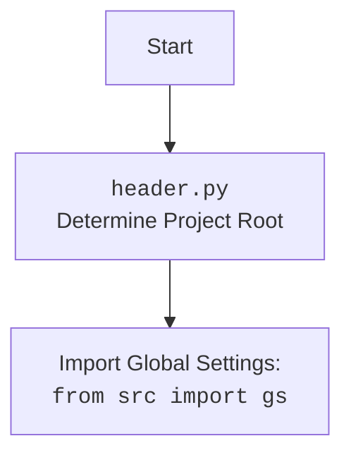

## ИНСТРУКЦИЯ:

Анализируй предоставленный код подробно и объясни его функциональность. Ответ должен включать три раздела:  

1. **<алгоритм>**: Опиши рабочий процесс в виде пошаговой блок-схемы, включая примеры для каждого логического блока, и проиллюстрируй поток данных между функциями, классами или методами.  
2. **<mermaid>**: Напиши код для диаграммы в формате `mermaid`, проанализируй и объясни все зависимости, 
    которые импортируются при создании диаграммы. 
    **ВАЖНО!** Убедитесь, что все имена переменных, используемые в диаграмме `mermaid`, 
    имеют осмысленные и описательные имена. Имена переменных вроде `A`, `B`, `C`, и т.д., не допускаются!  
    
    **Дополнительно**: Если в коде есть импорт `import header`, добавьте блок `mermaid` flowchart, объясняющий `header.py`:
    ```mermaid
    flowchart TD
        Start --> Header[<code>header.py</code><br> Determine Project Root]
    
        Header --> import[Import Global Settings: <br><code>from src import gs</code>] 
    ```

3. **<объяснение>**: Предоставьте подробные объяснения:  
   - **Импорты**: Их назначение и взаимосвязь с другими пакетами `src.`.  
   - **Классы**: Их роль, атрибуты, методы и взаимодействие с другими компонентами проекта.  
   - **Функции**: Их аргументы, возвращаемые значения, назначение и примеры.  
   - **Переменные**: Их типы и использование.  
   - Выделите потенциальные ошибки или области для улучшения.  

Дополнительно, постройте цепочку взаимосвязей с другими частями проекта (если применимо).  

Это обеспечивает всесторонний и структурированный анализ кода.
## Формат ответа: `.md` (markdown)
**КОНЕЦ ИНСТРУКЦИИ**
```
## <алгоритм>

1.  **Начало**: Функция `get_graber_by_supplier_url` вызывается с двумя аргументами: `self` (экземпляр класса, содержащий веб-драйвер) и `url` (строка, представляющая URL-адрес поставщика).
    *   _Пример_: `get_graber_by_supplier_url(self, "https://www.amazon.com/some-product")`
2.  **Загрузка страницы**: Веб-драйвер переходит по предоставленному URL с помощью `self.driver.get_url(url)`.
    *   _Пример_: Веб-драйвер открывает страницу `https://www.amazon.com/some-product`.
3.  **Проверка URL на соответствие**: Проверяются различные условия, чтобы определить, какому поставщику принадлежит URL.
    *   _Пример_: `if url.startswith(('https://aliexpress.com', 'https://wwww.aliexpress.com')):`.
4.  **Создание граббера**: Если URL соответствует одному из известных поставщиков, создается соответствующий объект граббера (например, `AliexpressGraber`, `AmazonGraber`).
    *   _Пример_: Если URL начинается с "https://www.amazon.com", создается `AmazonGraber(self.driver)`.
5.  **Возврат граббера**: Функция возвращает созданный объект граббера.
    *   _Пример_: Возвращается экземпляр `AmazonGraber`.
6.  **Обработка отсутствия граббера**: Если ни одно из условий не совпадает, в лог записывается сообщение об отсутствии граббера, возвращается `None`.
    *   _Пример_: Если URL не соответствует ни одному из известных поставщиков, сообщение об ошибке выводится в лог, и возвращается `None`.
7.  **Конец**: Функция завершает свою работу, возвращая либо экземпляр граббера, либо `None`.

## <mermaid>

```mermaid
flowchart TD
    Start[Начало функции get_graber_by_supplier_url] --> LoadPage[Загрузить страницу по URL: driver.get_url(url)]
    LoadPage --> CheckAliexpress[Проверка URL: url.startswith("aliexpress.com")]
    CheckAliexpress -- Да --> CreateAliexpressGraber[Создать: AliexpressGraber(driver)]
    CreateAliexpressGraber --> ReturnGraber[Вернуть граббер]
    CheckAliexpress -- Нет --> CheckAmazon[Проверка URL: url.startswith("amazon.com")]
     CheckAmazon -- Да --> CreateAmazonGraber[Создать: AmazonGraber(driver)]
    CreateAmazonGraber --> ReturnGraber
    CheckAmazon -- Нет --> CheckBangood[Проверка URL: url.startswith("bangood.com")]
     CheckBangood -- Да --> CreateBangoodGraber[Создать: BangoodGraber(driver)]
    CreateBangoodGraber --> ReturnGraber
    CheckBangood -- Нет --> CheckCdata[Проверка URL: url.startswith("cdata.co.il")]
     CheckCdata -- Да --> CreateCdataGraber[Создать: CdataGraber(driver)]
     CreateCdataGraber --> ReturnGraber
     CheckCdata -- Нет --> CheckEbay[Проверка URL: url.startswith("ebay.")]
    CheckEbay -- Да --> CreateEbayGraber[Создать: EbayGraber(driver)]
     CreateEbayGraber --> ReturnGraber
     CheckEbay -- Нет --> CheckEtzmaleh[Проверка URL: url.startswith("etzmaleh.co.il")]
     CheckEtzmaleh -- Да --> CreateEtzmalehGraber[Создать: EtzmalehGraber(driver)]
    CreateEtzmalehGraber --> ReturnGraber
     CheckEtzmaleh -- Нет --> CheckGearbest[Проверка URL: url.startswith("gearbest.com")]
    CheckGearbest -- Да --> CreateGearbestGraber[Создать: GearbestGraber(driver)]
     CreateGearbestGraber --> ReturnGraber
     CheckGearbest -- Нет --> CheckGrandadvance[Проверка URL: url.startswith("grandadvance.co.il")]
    CheckGrandadvance -- Да --> CreateGrandadvanceGraber[Создать: GrandadvanceGraber(driver)]
    CreateGrandadvanceGraber --> ReturnGraber
     CheckGrandadvance -- Нет --> CheckHb[Проверка URL: url.startswith("hb-digital.co.il")]
     CheckHb -- Да --> CreateHBGraber[Создать: HBGraber(driver)]
     CreateHBGraber --> ReturnGraber
     CheckHb -- Нет --> CheckIvory[Проверка URL: url.startswith("ivory.co.il")]
    CheckIvory -- Да --> CreateIvoryGraber[Создать: IvoryGraber(driver)]
    CreateIvoryGraber --> ReturnGraber
     CheckIvory -- Нет --> CheckKsp[Проверка URL: url.startswith("ksp.co.il")]
    CheckKsp -- Да --> CreateKspGraber[Создать: KspGraber(driver)]
    CreateKspGraber --> ReturnGraber
     CheckKsp -- Нет --> CheckKualaStyle[Проверка URL: url.startswith("kualastyle.com")]
    CheckKualaStyle -- Да --> CreateKualaStyleGraber[Создать: KualaStyleGraber(driver)]
    CreateKualaStyleGraber --> ReturnGraber
     CheckKualaStyle -- Нет --> CheckMorlevi[Проверка URL: url.startswith("morlevi.co.il")]
    CheckMorlevi -- Да --> CreateMorleviGraber[Создать: MorleviGraber(driver)]
    CreateMorleviGraber --> ReturnGraber
     CheckMorlevi -- Нет --> CheckVisualDG[Проверка URL: url.startswith("visualdg.com")]
     CheckVisualDG -- Да --> CreateVisualDGGraber[Создать: VisualDGGraber(driver)]
     CreateVisualDGGraber --> ReturnGraber
    CheckVisualDG -- Нет --> CheckWallaShop[Проверка URL: url.startswith("wallashop.co.il")]
     CheckWallaShop -- Да --> CreateWallaShopGraber[Создать: WallaShopGraber(driver)]
    CreateWallaShopGraber --> ReturnGraber
    CheckWallaShop -- Нет --> CheckWallmart[Проверка URL: url.startswith("wallmart.com")]
    CheckWallmart -- Да --> CreateWallmartGraber[Создать: WallmartGraber(driver)]
    CreateWallmartGraber --> ReturnGraber
    CheckWallmart -- Нет --> LogNoGraber[Лог: No graber found]
    LogNoGraber --> ReturnNone[Вернуть: None]
    ReturnGraber --> End[Конец функции]
    ReturnNone --> End
```



## <объяснение>

**Импорты:**

*   `from __future__ import annotations`: Этот импорт используется для отложенной оценки типов, что позволяет использовать типы, определенные позже в коде (например, аннотацию `-> 'Graber'`).
*   `import header`: Импортирует модуль `header` (из файла `header.py`), который, скорее всего, устанавливает корневой каталог проекта и может содержать другие глобальные настройки.
*   Импорты грабберов:
    *   `from src.suppliers.aliexpress.graber import Graber as AliexpressGraber`: Импортирует класс `Graber` из модуля `src.suppliers.aliexpress.graber` и переименовывает его в `AliexpressGraber`.
    *   Аналогичные импорты для остальных поставщиков (`AmazonGraber`, `BangoodGraber`, `CdataGraber` и т.д.) импортируют классы-грабберы для каждого поставщика. Это позволяет изолировать логику сбора данных для каждого из них.
*   `from src.logger.logger import logger`: Импортирует объект `logger` для логирования сообщений, в том числе об отсутствии соответствующего граббера.

**Классы:**

*   `Graber` (из каждого импортированного модуля): Каждый граббер (например, `AliexpressGraber`) - это класс, предназначенный для извлечения данных со страниц конкретного поставщика. Они вероятно имеют методы для навигации по странице и извлечения нужных данных (цены, описания, фото и тд.).

**Функции:**

*   `get_graber_by_supplier_url(self, url: str) -> 'Graber' | None`:
    *   `self`: Ссылка на экземпляр класса, из которого вызывается этот метод. Он используется для доступа к веб-драйверу (`self.driver`).
    *   `url: str`: URL-адрес страницы поставщика, для которого нужно получить граббер.
    *   `-> 'Graber' | None`: Аннотация типа, указывающая, что функция возвращает либо объект типа `Graber` (или его подкласс), либо `None`, если граббер не найден.
    *   Назначение: Функция определяет поставщика на основе URL-адреса и возвращает соответствующий объект граббера. Если граббер не найден, возвращается `None` и сообщение об этом записывается в лог.
    *   Пример:
        ```python
        driver = WebDriver() # Предполагается, что WebDriver - класс для управления браузером
        url = "https://www.amazon.com/some-product"
        graber = get_graber_by_supplier_url(driver, url)
        if graber:
            data = graber.extract_data() # Вызов метода extract_data(), если граббер найден
        else:
            print("Граббер не найден для данного URL")
        ```

**Переменные:**

*   `MODE = 'dev'`: Глобальная переменная, определяющая режим работы приложения. Возможно, используется для переключения между режимами разработки и продакшена.

**Потенциальные ошибки и улучшения:**

1.  **Обработка ошибок**: В коде не предусмотрена обработка ошибок, которые могут возникнуть при открытии URL или при создании граббера.  Следует добавить `try-except` блоки для обработки исключений.
2.  **Масштабируемость**: Логика выбора граббера через цепочку `if-elif` не очень масштабируема. Лучше использовать словарь, где ключом будет начало URL, а значением - класс граббера. Это сделает код более читабельным и простым в обслуживании.
3.  **Поддержка новых поставщиков**: Добавление нового поставщика потребует добавления нового импорта и условия в функции `get_graber_by_supplier_url`, что можно автоматизировать с помощью конфигурационного файла.
4.  **Дублирование кода**: Код проверки URL (`url.startswith`) и создания граббера повторяется для каждого поставщика. Это можно вынести в отдельную функцию или использовать словарь для сопоставления URL и граббера.

**Цепочка взаимосвязей:**

1.  `header.py` определяет корневой каталог проекта и импортирует глобальные настройки.
2.  `get_graber_by_supplier_url` использует импортированные классы-грабберы для каждого поставщика, создавая их экземпляры в зависимости от URL.
3.  Экземпляры грабберов (`AliexpressGraber`, `AmazonGraber`, и т.д.) предположительно используют веб-драйвер для навигации по страницам и извлечения данных.
4.  `logger` используется для записи сообщений, в том числе, когда граббер не найден.
5.  `WebDriver` (не показан в коде, но используется через `self.driver`) используется для взаимодействия с браузером и загрузки страниц.

Таким образом, этот модуль является центральным компонентом, который определяет, какой граббер использовать для обработки данных с разных сайтов.