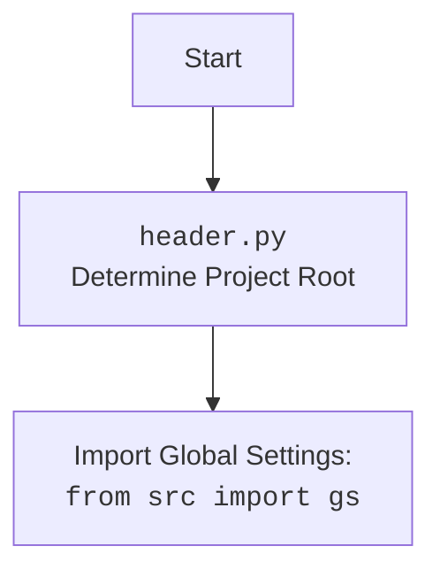

## <алгоритм>

1.  **Инициализация `Graber`**:
    *   При создании экземпляра `Graber` вызывается `__init__`, где устанавливается `supplier_prefix`, загружаются локаторы из JSON файла, создается экземпляр `ProductFields`,  и устанавливаются глобальные контекстные переменные `Context.driver` и `Context.supplier_prefix`.
    *   _Пример:_ `graber = Graber(supplier_prefix='test_supplier', driver=webdriver)`

2.  **`grab_page`**:
    *   Метод `grab_page` принимает список имен полей `args`  и  словарь `kwargs`.
    *   Для каждого имени поля из `args` вызывается соответствующий метод грабера (например, `name`, `price`, `description` и т.д.)  передавая в него значение из словаря `kwargs`.
    *   _Пример:_ `await grabber.grab_page('name', 'price', description='Some test description', name='Test Product')`

3.  **Декоратор `close_pop_up`**:
    *   Декоратор `close_pop_up` используется для закрытия всплывающих окон перед выполнением основной логики функции.
    *   Перед выполнением декорируемой функции проверяется `Context.locator_for_decorator`. Если он установлен, то вызывается `driver.execute_locator` для закрытия всплывающего окна.
    *   Если `Context.locator_for_decorator` не установлен, то не выполняется никаких действий и сразу вызывается декорируемая функция.
    *   _Пример_: `@close_pop_up()` применяется к методу `name`, и перед сбором имени товара, проверяется необходимость закрыть всплывающее окно.

4.  **Методы сбора полей (например, `name`, `price`, `description`)**:
    *   Каждый метод сбора поля принимает необязательный аргумент `value`.
        *   Если `value` передан, то он присваивается соответствующему полю в `self.fields`.
        *   Если `value` не передан, то метод пытается получить значение поля с помощью `driver.execute_locator`, используя локатор, определенный в `self.locator`.
        *   Полученное значение нормализуется с помощью функций из `src.utils.string.normalizer` (например, `normalize_string`, `normalize_int`, `normalize_float`, `normalize_sql_date`).
        *   Результат сохраняется в соответствующее поле в `self.fields` (например, `self.fields.name`, `self.fields.price`, `self.fields.description`).
    *   Если при выполнении `driver.execute_locator` или нормализации возникает исключение, оно логируется с помощью `logger.error`, и метод возвращает `None`.
    *   _Пример_: `async def name(self, value: Optional[Any] = None)`:
        *   Если `value` не передан, метод пытается найти элемент на странице через локатор `self.locator.name`.
        *   Значение, полученное с веб-страницы, проходит через `normalize_string` и присваивается `self.fields.name`.

5.  **`set_field_value`**:
    *   Функция `set_field_value` является универсальной функцией для установки значений полей.
    *   Принимает `value`, `locator_func`, `field_name` и `default`.
    *   Если `value` передан, то возвращается переданный `value`.
    *   Если `value` не передан, то вызывается `locator_func` в отдельном потоке для получения значения.
    *   Если результат `locator_func` есть, то возвращается результат.
    *   Если ни `value` ни `locator_func` не дали результат, то логируется ошибка и возвращается `default`.

6.  **`local_image_path`**:
    *   Метод  `local_image_path` получает URL изображения или байты, сохраняет изображение локально в `tmp` директории, используя `save_image` или `save_image_from_url`.
    *   Сохраняет путь к изображению в поле `local_image_path`
    *   _Пример:_ `await grabber.local_image_path()`

7.  **Возврат результата**:
    *   После выполнения всех методов сбора полей, метод `grab_page` возвращает объект `ProductFields`, который содержит все собранные и нормализованные данные.

## <mermaid>

```mermaid
flowchart TD
    Start[Start Graber Initialization] --> InitGraber[<code>__init__</code><br>Initialize Graber: supplier_prefix, locators, driver, fields, Context]
    InitGraber --> LoadLocators[Load Product Locators from JSON: <br><code>j_loads_ns</code>]
    LoadLocators --> CreateProductFields[Create <code>ProductFields</code> Object]
    CreateProductFields --> SetContext[Set <code>Context.driver</code> and <code>Context.supplier_prefix</code>]
    SetContext --> GrabPage[Call <code>grab_page</code>]
    GrabPage --> FetchAllData[<code>fetch_all_data</code><br>Iterate Through Field Names and Call Grab Methods]
     FetchAllData --> GetMethod[Get method by <code>filed_name</code> from class Graber: <code>getattr(self, filed_name)</code>]
   GetMethod -- Method exists -->  CheckDecorator[Check Decorator <code>@close_pop_up</code>]
    CheckDecorator -- Decorator is set --> ExecuteLocatorDecorator[Execute <code>driver.execute_locator(Context.locator_for_decorator)</code>]
    ExecuteLocatorDecorator --> GrabMethod[Call Field Grabbing Method:  method(value)]
      CheckDecorator -- Decorator is not set --> GrabMethod
       GrabMethod --> CheckValue[Check if passed value for field exists ]
       CheckValue -- Passed value exists -->  SetValueField[Set <code>self.fields.field_name</code> =  passed value]
       SetValueField --> FetchAllData
    CheckValue -- Passed value not exist --> ExecuteLocator[<code>driver.execute_locator(self.locator.field_name)</code>]
    ExecuteLocator --> NormalizeValue[Normalize value using <code>normalize_string</code>, <code>normalize_int</code>, etc]
    NormalizeValue --> SetValueFieldLocator[Set <code>self.fields.field_name</code>= normalized value]
    SetValueFieldLocator --> FetchAllData
    FetchAllData -- No more fields --> ReturnProductFields[Return <code>ProductFields</code> Object]
    ReturnProductFields --> End[End]
  ExecuteLocator -- Exception --> LogError[Log Error using <code>logger.error</code>]
  LogError --> FetchAllData
  GrabMethod -- Exception --> LogError
   
  
  
   subgraph "close_pop_up decorator"
     CheckDecorator
     ExecuteLocatorDecorator
   end

    style Start fill:#f9f,stroke:#333,stroke-width:2px
    style End fill:#ccf,stroke:#333,stroke-width:2px
```



## <объяснение>

### Импорты:

*   `from __future__ import annotations`:  Позволяет использовать аннотации типов, в том числе для классов, которые ещё не определены.
*   `datetime`: Для работы с датами и временем, например для `gs.now`.
*   `os`, `sys`: Для взаимодействия с операционной системой, хотя в данном коде не используются напрямую.
*   `asyncio`: Для асинхронного программирования.
*   `pathlib.Path`: Для работы с путями к файлам и директориям в кроссплатформенном режиме.
*   `typing.Optional, Any, Callable`:  Для определения типов, делает код более читаемым и уменьшает количество ошибок.
*   `types.SimpleNamespace`: Для создания объектов с атрибутами, доступными через точку, используется для локаторов.
*    `functools.wraps`: Декоратор для сохранения метаданных исходной функции при использовании декораторов.
*   `langdetect.detect`: Для определения языка текста, используется в методе `locale`.
*   `header`: Определяет корневую директорию проекта, используется для импорта глобальных настроек.
*   `from src import gs`: Импорт глобальных настроек проекта, включая пути к файлам, текущее время и т.д.
*   `from src.endpoints.prestashop.product_fields import ProductFields`: Импорт класса `ProductFields`, который представляет поля продукта.
*   `src.category.Category`: Импорт класса `Category` для работы с категориями товаров.
*   `src.utils.jjson`: Модуль для работы с JSON, функции `j_loads`, `j_loads_ns` и `j_dumps`.
*   `src.utils.image`: Модуль для сохранения изображений, функции `save_image_from_url` и `save_image`.
*   `src.utils.string.normalizer`: Модуль с функциями для нормализации строк, чисел, дат и т.д.
*   `src.logger.exceptions.ExecuteLocatorException`:  Исключение, которое может быть вызвано при выполнении локатора.
*   `src.utils.printer.pprint`:  Функция для красивого вывода данных.
*   `src.logger.logger.logger`: Объект `logger` для логирования.

### Классы:

1.  **`Context`**:
    *   Класс для хранения глобальных настроек, таких как `driver`, `locator_for_decorator` и `supplier_prefix`.
    *   `driver`:  Экземпляр класса `Driver` для взаимодействия с веб-страницей.
    *   `locator_for_decorator`:  Объект `SimpleNamespace` для хранения локатора, который используется в декораторе `@close_pop_up`.
    *   `supplier_prefix`:  Строка, представляющая префикс поставщика.
    *   Используется как глобальный контекст для передачи драйвера и настроек между методами.

2.  **`Graber`**:
    *   Базовый класс для сбора данных со страниц поставщиков.
    *   **Атрибуты:**
        *   `supplier_prefix`: Префикс поставщика.
        *   `locator`: Пространство имен (SimpleNamespace) с локаторами для полей продукта, загруженное из JSON файла.
        *   `driver`: Экземпляр класса `Driver` для управления браузером или другим интерфейсом.
        *   `fields`: Экземпляр класса `ProductFields` для хранения собранных данных.
    *   **Методы:**
        *   `__init__(self, supplier_prefix: str, driver: 'Driver')`: Конструктор класса, инициализирует атрибуты класса.
        *   `error(self, field: str)`:  Обработчик ошибок для полей.
        *   `set_field_value(self, value: Any, locator_func: Callable[[], Any], field_name: str, default: Any = '')`: Универсальная функция для установки значений полей с обработкой ошибок.
        *    `grab_page(self, *args, **kwards) -> ProductFields`: Основной метод для сбора данных со страницы, получает имена полей для сбора и словарь с значениями.
        *   `close_pop_up(value: 'Driver' = None)`: Декоратор для закрытия всплывающих окон.
        *   Методы для сбора отдельных полей продукта (например, `name`, `price`, `description`, `local_image_path` и т.д.), каждый из которых принимает необязательное значение `value` и использует `driver.execute_locator` для поиска элементов на странице.

### Функции:

*   `close_pop_up(value: 'Driver' = None) -> Callable`: Фабрика декораторов, создает декоратор для закрытия всплывающих окон.
*   Методы класса `Graber` предназначены для сбора и нормализации данных с веб-страниц, используя локаторы. Они используют `driver.execute_locator` для поиска элементов и `normalize_*` для преобразования данных.

### Переменные:

*   `Context.driver`:  Глобальная переменная для хранения экземпляра драйвера.
*   `Context.locator_for_decorator`: Глобальная переменная для хранения локатора для декоратора.
*   `Context.supplier_prefix`: Глобальная переменная для хранения префикса поставщика.
*   `self.supplier_prefix`, `self.locator`, `self.driver`, `self.fields`: Атрибуты экземпляра класса `Graber`, хранящие соответствующие значения.

### Взаимосвязи с другими частями проекта:

*   **`src.webdriver.driver.Driver`**: Класс `Graber` зависит от класса `Driver` для взаимодействия с веб-страницей.  `Driver` отвечает за навигацию по страницам, поиск элементов и выполнение действий.
*   **`src.endpoints.prestashop.product_fields.ProductFields`**: Класс `ProductFields` используется для хранения данных о продукте.
*   **`src.utils.jjson`**:  Используется для загрузки JSON-файлов с локаторами.
*   **`src.utils.image`**: Используется для сохранения изображений на локальный диск.
*   **`src.utils.string.normalizer`**: Используется для нормализации данных, полученных с веб-страниц.
*   **`src.logger.logger.logger`**: Используется для логирования ошибок и отладочной информации.
*   **`header`**: Используется для определения корневой директории проекта.
*   **`src.gs`**:  Глобальные настройки, используются для доступа к путям, текущему времени и т.д.
*   **`locators`**: Локаторы хранятся в JSON файлах, это внешняя зависимость от файловой системы.

### Потенциальные ошибки и области для улучшения:

*   **Обработка ошибок**:  В некоторых методах обработки ошибок есть многоточие `...`, что может привести к проглатыванию исключений.  Нужно добавить более детальную обработку ошибок.
*   **Зависимость от локаторов**:  Класс `Graber` сильно зависит от правильности локаторов, указанных в JSON файлах. Любая ошибка в локаторе может привести к сбою в работе.
*   **Глобальные переменные**: Использование глобальных переменных, таких как `Context.driver` и `Context.locator_for_decorator`, может усложнить отладку и тестирование.
*   **Множество методов**: Класс `Graber` содержит большое количество методов, что может сделать его сложным для понимания и поддержки. Можно рассмотреть рефакторинг и вынесение части логики в отдельные классы или функции.
*   **Асинхронность**:  Использование `asyncio` усложняет понимание кода, не всегда понятно зачем асинхронность.
*   **Слабая типизация**: В некоторых местах аннотации типов отсутствуют, это усложняет поддержку.

### Дополнительно:

*   Этот класс `Graber` является базовым классом для всех поставщиков. Каждый поставщик должен будет иметь свой класс, который наследуется от этого класса, и переопределять методы, если требуется нестандартная обработка.
*   Локаторы хранятся в отдельных JSON файлах для каждого поставщика, что позволяет гибко настраивать сбор данных.
*   Использование декоратора `close_pop_up` позволяет избежать дублирования кода для закрытия всплывающих окон.
*   Использование нормализаторов позволяет приводить данные к единому формату.

Этот анализ обеспечивает всестороннее понимание кода, его функциональности, взаимосвязей с другими частями проекта и потенциальных проблем.