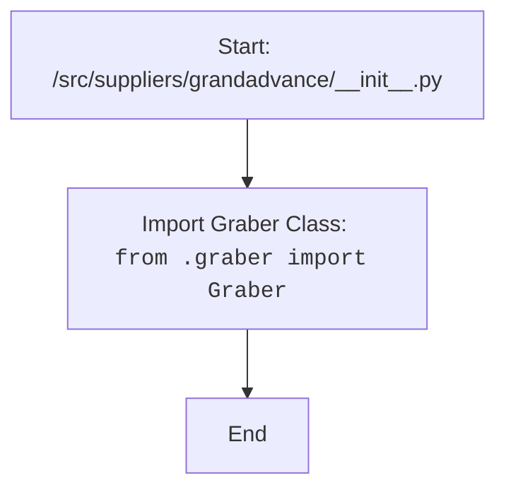

# Анализ кода `hypotez/src/suppliers/grandadvance/__init__.py`

## <алгоритм>

1.  **Импорт `Graber`**:
    *   Файл `__init__.py` импортирует класс `Graber` из модуля `graber.py`, находящегося в той же директории (`.`).
    *   Пример: `from .graber import Graber`

## <mermaid>

**Объяснение зависимостей `mermaid`:**

*   `Start`: Начальная точка кода.
*   `ImportGraber`: Импорт класса `Graber` из модуля `graber.py` в текущей директории.
*   `End`: Конечная точка кода.

## <объяснение>

**Импорты:**

*   `from .graber import Graber`:
    *   Этот импорт загружает класс `Graber` из модуля `graber.py`, расположенного в той же директории, что и текущий файл `__init__.py`.
    *   Символ `.` указывает на относительный импорт из текущей директории.
    *   Этот импорт предоставляет возможность использовать класс `Graber` в других частях пакета `grandadvance`.

**Классы:**

*   `Graber`:
    *   Класс `Graber`, импортируется из `graber.py`, скорее всего, предназначен для извлечения (парсинга) данных из некоторого источника.
    *   Без доступа к коду `graber.py` точное назначение класса `Graber` определить невозможно, но по имени можно предположить его функциональность.

**Функции:**

*   В данном файле нет явно определенных функций. Основная цель файла – предоставить возможность импорта класса `Graber` из других модулей в пакете `grandadvance`.

**Переменные:**

*   В этом файле нет явно объявленных переменных.

**Взаимосвязь с другими частями проекта:**

*   Файл `__init__.py` является точкой входа в пакет `grandadvance`. Он позволяет другим модулям проекта импортировать `Graber` через `from src.suppliers.grandadvance import Graber`.
*   Вероятно, `graber.py` содержит логику для извлечения данных от поставщика grandadvance.
*   Предполагается что другие части проекта могут использовать `Graber` для получения данных.

**Потенциальные ошибки и области для улучшения:**

*   Недостаток документации:  Отсутствуют docstrings, комментирующие предназначение пакета `grandadvance` и класса `Graber`. Это усложняет понимание кода и его поддержку.
*   Без содержимого `graber.py`, сложно определить точность архитектуры и потенциальные проблемы в логике работы `Graber`.
*  Отсутствие явной обработки ошибок.
*  Отсутствие тестов.

**Цепочка взаимосвязей:**

1.  Другие модули проекта импортируют `Graber` из `src.suppliers.grandadvance`.
2.  `Graber` (из `graber.py`) выполняет логику по извлечению данных от grandadvance.
3.  Результаты работы `Graber` используются другими модулями проекта.