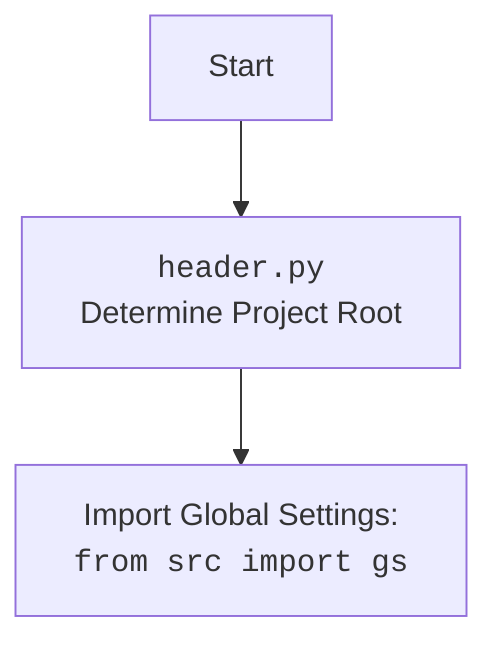

## АНАЛИЗ КОДА

### 1. <алгоритм>

**Блок-схема:**

```mermaid
flowchart TD
    Start[Начало] --> Init[Инициализация класса Graber]
    Init --> SetPrefix[Установка префикса поставщика: supplier_prefix = 'grandadvance']
    SetPrefix --> SuperInit[Вызов __init__ родительского класса Graber (Grbr)]
    SuperInit --> SetLocator[Установка Context.locator_for_decorator = None]
    SetLocator --> End[Конец инициализации]

    style Start fill:#f9f,stroke:#333,stroke-width:2px
    style End fill:#ccf,stroke:#333,stroke-width:2px
```

**Примеры:**

*   **Start**: Начало выполнения скрипта.
*   **Init**: Создание экземпляра класса `Graber` с передачей объекта `Driver` в качестве аргумента. Например: `graber_instance = Graber(driver_instance)`.
*   **SetPrefix**:  Установка атрибута экземпляра `supplier_prefix` равным `"grandadvance"`.
*   **SuperInit**: Вызов конструктора родительского класса `Grbr`, передавая ему `supplier_prefix` и объект `driver`.
*    **SetLocator**:  Установка атрибута `Context.locator_for_decorator`  в `None`.
*    **End**: Завершение инициализации экземпляра класса.

### 2. <mermaid>

```mermaid
flowchart TD
    Start[Start] --> ImportHeader[import header]
    ImportHeader --> ImportGraber[from src.suppliers.graber import Graber as Grbr, Context]
    ImportGraber --> ImportDriver[from src.webdriver.driver import Driver]
    ImportDriver --> ImportLogger[from src.logger.logger import logger]
    ImportLogger --> ClassGraber[class Graber(Grbr)]
    ClassGraber --> InitMethod[__init__(self, driver: Driver)]
    InitMethod --> SetSupplierPrefix[self.supplier_prefix = 'grandadvance']
    SetSupplierPrefix --> SuperInit[super().__init__(supplier_prefix=self.supplier_prefix, driver=driver)]
    SuperInit --> SetLocatorNone[Context.locator_for_decorator = None]
    SetLocatorNone --> End[End]
    
    style Start fill:#f9f,stroke:#333,stroke-width:2px
    style End fill:#ccf,stroke:#333,stroke-width:2px
```

**Зависимости:**

*   `header`: Этот модуль используется для определения корневой директории проекта и, вероятно, загрузки глобальных настроек. Он необходим для корректной работы всех модулей в проекте.
*   `src.suppliers.graber.Graber` (импортируется как `Grbr`) и `src.suppliers.graber.Context`: `Graber` - это, вероятно, базовый класс для всех граберов, который предоставляет общую логику. `Context` может быть классом, хранящим общее состояние.
*   `src.webdriver.driver.Driver`: Модуль для управления веб-драйвером. Он используется для взаимодействия с браузером и получения данных со страниц.
*   `src.logger.logger`:  Модуль для логирования. Используется для записи информации о работе программы и ошибок.

**mermaid** для `header.py`:



### 3. <объяснение>

**Импорты:**

*   `from typing import Any`: Импортирует `Any` из модуля `typing`, что позволяет использовать тип `Any` в аннотациях типов для указания, что переменная может быть любого типа.
*   `import header`: Импортирует модуль `header`, который, скорее всего, содержит общие настройки и функции для всего проекта, включая определение корневой директории.
*   `from src.suppliers.graber import Graber as Grbr, Context, close_pop_up`: Импортирует класс `Graber` (переименованный в `Grbr`), `Context`, и функцию `close_pop_up` из модуля `src.suppliers.graber`. `Graber` — это базовый класс для парсеров. `Context` может хранить общее состояние, а `close_pop_up` предназначена для декораторов.
*   `from src.webdriver.driver import Driver`: Импортирует класс `Driver` из модуля `src.webdriver.driver`, который отвечает за управление веб-драйвером.
*   `from src.logger.logger import logger`: Импортирует объект `logger` из модуля `src.logger.logger`, используемый для ведения логов.

**Классы:**

*   `class Graber(Grbr)`:
    *   Роль: Класс `Graber` является наследником класса `Grbr` (из `src.suppliers.graber`). Он предназначен для сбора данных с веб-сайта grandadvance.co.il.
    *   Атрибуты:
        *   `supplier_prefix: str`:  Строковый атрибут, хранящий префикс поставщика ('grandadvance').
    *   Методы:
        *   `__init__(self, driver: Driver)`: Конструктор класса. Принимает экземпляр класса `Driver` как аргумент. В конструкторе устанавливается `self.supplier_prefix` и вызывается конструктор родительского класса `Grbr`. Затем устанавливается `Context.locator_for_decorator` в `None`.

**Функции:**

*   В коде явно не определены функции, но есть закомментированный шаблон для декоратора `close_pop_up`.
    *   `close_pop_up(value: Any = None) -> Callable`:  Этот декоратор предназначен для закрытия всплывающих окон перед выполнением функции. Он принимает необязательный аргумент `value` и возвращает декоратор. Внутри декоратора есть попытка выполнить локатор `Context.locator.close_pop_up`, но в предоставленной реализации, это пока не используется.

**Переменные:**

*   `supplier_prefix: str`:  Атрибут экземпляра класса `Graber`, содержащий строковый префикс поставщика.

**Потенциальные ошибки и области для улучшения:**

*   Декоратор `close_pop_up` закомментирован и не используется. Возможно, его функциональность планировалось реализовать позже или перенести в другое место.
*   `Context.locator_for_decorator` всегда устанавливается в `None`. Это значит, что никакой кастомный декоратор не будет работать. Это может быть сделано намеренно, но стоит проверить, действительно ли это желаемое поведение.
*   В конструкторе класса вызывается конструктор родительского класса, но нет явных указаний, что именно он делает. Надо изучить код родительского класса `Grbr` для понимания полной функциональности.
*   В коде нет явного определения метода захвата данных. Скорее всего, этот метод должен быть в родительском классе, но это нужно проверить.

**Цепочка взаимосвязей:**

1.  Модуль `header.py` определяет корневую директорию проекта и импортирует глобальные настройки.
2.  `src.suppliers.graber.Graber` (родительский класс) предоставляет общую логику для парсеров.
3.  `src.webdriver.driver.Driver` управляет веб-драйвером.
4.  `src.logger.logger` используется для логирования событий.
5.  Класс `Graber` из `graber.py` наследуется от `src.suppliers.graber.Graber` и использует `Driver` для доступа к веб-сайту, специфичному для поставщика 'grandadvance'.
6. `Context` из  `src.suppliers.graber.Context` может хранить общее состояние, используемое в разных модулях.
7.  `close_pop_up` - декоратор, предназначен для обработки всплывающих окон, но в текущем коде не используется.

Этот анализ предоставляет подробное представление о функциональности и структуре кода.