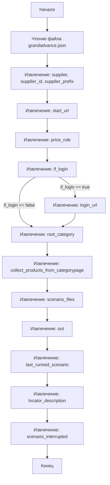

## АНАЛИЗ JSON КОНФИГУРАЦИИ ПОСТАВЩИКА GRANDADVANCE

### <алгоритм>

1.  **Чтение файла конфигурации:**
    *   JSON-файл `grandadvance.json` считывается (обычно программой или скриптом) для получения настроек поставщика "grandadvance".
    *   Пример: `with open('grandadvance.json', 'r') as f: data = json.load(f)`

2.  **Извлечение базовых настроек:**
    *   Извлечение `supplier` ("grandadvance"), `supplier_id` ("2789"), `supplier_prefix` ("grandadvance").
    *   Пример: `supplier_name = data['supplier']`, `supplier_id = data['supplier_id']`, `prefix = data['supplier_prefix']`.
        
3.  **Определение начального URL:**
    *   Извлечение `start_url` ("https://www.grandadvance.co.il/") - это URL, с которого начнется сбор данных.
    *   Пример: `start_url = data['start_url']`

4.  **Определение правила цены:**
    *   Извлечение `price_rule` ("+0") - правило, по которому будет рассчитываться цена.
    *   Пример: `price_rule = data['price_rule']`

5.  **Проверка на необходимость логина:**
    *   Извлечение `if_login` (false) - флаг, указывающий, требуется ли вход в систему для сбора данных.
    *   Пример: `need_login = data['if_login']`

6.  **Извлечение URL для логина (если требуется):**
    *   Извлечение `login_url` ("https://www.login.grandadvance.co.il") - URL для входа в систему (используется только если `if_login` = true).
    *   Пример: `login_url = data['login_url']` (используется в логике, зависящей от `need_login`)

7.  **Извлечение корневой категории:**
    *   Извлечение `root_category` (3) - ID корневой категории.
    *   Пример: `root_category_id = data['root_category']`

8.  **Флаг сбора данных с категории:**
    *   Извлечение `collect_products_from_categorypage` (true) - флаг, указывающий, нужно ли собирать продукты со страницы категорий.
    *   Пример: `collect_from_category = data['collect_products_from_categorypage']`

9.  **Извлечение списка сценариев:**
    *   Извлечение `scenario_files` ([]), - список файлов сценариев (пока пустой).
    *   Пример: `scenario_files = data['scenario_files']`

10. **Извлечение выходных данных:**
    *   Извлечение `out` ([]), -  выходные данные (пока пустые).
    *   Пример: `out_data = data['out']`

11. **Извлечение последнего выполненного сценария:**
     *   Извлечение `last_runned_scenario` (""), - название последнего выполненного сценария (пока пустое).
     *   Пример: `last_scenario = data['last_runned_scenario']`

12. **Извлечение описания локатора:**
     *   Извлечение `locator_description` (""), - описание локатора (пока пустое).
     *   Пример: `locator_desc = data['locator_description']`

13. **Извлечение флага прерывания сценария:**
      *  Извлечение `scenario_interrupted` (""), - флаг прерывания сценария (пока пустой).
      *  Пример: `scenario_interrupted_flag = data['scenario_interrupted']`

### <mermaid>

**Зависимости в `mermaid`:**

*   Диаграмма показывает последовательность извлечения данных из JSON файла.
*   Нет импортов, так как файл JSON - это данные, а не код.

### <объяснение>

**Импорты:**

*   В данном фрагменте кода нет импортов, поскольку это JSON-файл, который представляет собой данные, а не код Python.

**Классы:**

*   В данном коде нет классов.

**Функции:**

*   Здесь нет функций, так как это файл данных в формате JSON.

**Переменные:**

*   **`supplier`**: Строка, название поставщика ("grandadvance").
*   **`supplier_id`**: Строка, идентификатор поставщика ("2789").
*   **`supplier_prefix`**: Строка, префикс поставщика ("grandadvance").
*   **`start_url`**: Строка, URL-адрес, с которого начинается сбор данных ("https://www.grandadvance.co.il/").
*   **`price_rule`**: Строка, правило для расчета цены ("+0").
*   **`if_login`**: Логическое значение, указывающее, требуется ли вход в систему (false).
*   **`login_url`**: Строка, URL-адрес для входа в систему ("https://www.login.grandadvance.co.il").
*   **`root_category`**: Целое число, идентификатор корневой категории (3).
*   **`collect_products_from_categorypage`**: Логическое значение, указывающее, нужно ли собирать продукты со страницы категорий (true).
*   **`scenario_files`**: Список, содержащий файлы сценариев (сейчас пуст).
*   **`out`**: Список, содержащий выходные данные (сейчас пуст).
*   **`last_runned_scenario`**: Строка, содержащая имя последнего запущенного сценария (сейчас пустая).
*   **`locator_description`**: Строка, содержащая описание локатора (сейчас пустая).
*   **`scenario_interrupted`**: Строка, содержащая флаг прерывания сценария (сейчас пустая).

**Объяснение:**

Этот JSON-файл содержит настройки для парсера или веб-скрейпера, который собирает данные с сайта поставщика "grandadvance".

*   **`supplier`, `supplier_id`, `supplier_prefix`**:  Используются для идентификации поставщика в системе.
*   **`start_url`**:  Задает точку входа для сканирования сайта.
*   **`price_rule`**:  Определяет, как нужно обрабатывать цену товара (в данном случае, просто прибавить 0).
*   **`if_login` и `login_url`**: Определяют, требуется ли вход в систему и какой URL использовать для входа.
*   **`root_category`**: Указывает, с какой категории начинать сбор данных.
*   **`collect_products_from_categorypage`**:  Показывает, что сбор данных будет производиться со страниц категорий.
*   **`scenario_files`**: Предназначен для хранения списка файлов со сценариями, но в данном случае он пуст.
*   **`out`**: Предназначен для хранения выходных данных, но в данном случае он пуст.
*   **`last_runned_scenario`, `locator_description`, `scenario_interrupted`**: Служат для отслеживания состояния выполнения сценариев и промежуточных результатов.

**Потенциальные ошибки и улучшения:**

*   **`scenario_files` и `out`**: В данный момент эти списки пустые, что может указывать на то, что функционал сбора сценариев или хранения выходных данных еще не реализован или не используется в текущей конфигурации.
*   **`price_rule`**: Сейчас правило цены "+0" статично, но если будут другие правила (например, умножение на коэффициент), необходимо будет предусмотреть обработку различных вариантов.
*   **Обработка ошибок:** В коде, использующем этот JSON, следует предусмотреть обработку случаев, когда какие-либо из полей отсутствуют или имеют неверный формат.

**Связь с другими частями проекта:**

Этот файл является частью конфигурации, которая используется другими модулями проекта. Парсер или скрейпер будет использовать эти настройки для определения, как и откуда собирать данные с сайта `grandadvance`. Например, модуль парсинга прочитает этот файл, извлечет значения и использует их для навигации по сайту, сбора данных о товарах и т.д.