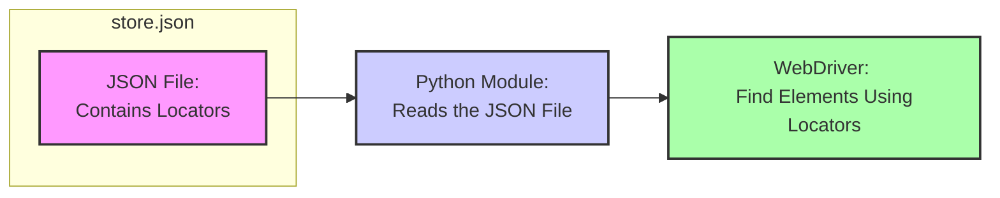

## АНАЛИЗ КОДА: `hypotez/src/suppliers/grandadvance/locators/store.json`

### 1. <алгоритм>

Файл `store.json` содержит JSON-объект, который определяет локаторы для элементов веб-страницы, используемых для взаимодействия с сайтом поставщика Grand Advance. Этот файл не содержит исполняемого кода, поэтому его "алгоритм" заключается в структурированном хранении данных, используемых другими частями программы.

**Блок-схема:**

```
[Начало] --> [Загрузка JSON]
[Загрузка JSON] --> [Доступ к Локаторам]
[Доступ к Локаторам] --> [Использование Локаторов в Коде]
[Использование Локаторов в Коде] --> [Конец]
```

**Примеры:**

*   **Загрузка JSON:** Другой модуль Python считывает содержимое файла `store.json`.
    Например, с помощью `json.load(open('hypotez/src/suppliers/grandadvance/locators/store.json'))`.
*   **Доступ к Локаторам:** После загрузки JSON-объекта, программный код обращается к конкретным локаторам по их именам, например: `data['product_list']['product_item']`.
*   **Использование Локаторов в Коде:** Значения, полученные из JSON, используются как аргументы для функций, взаимодействующих с веб-страницей, например: `driver.find_element(By.XPATH, data['product_list']['product_item'])`.

### 2. <mermaid>


**Объяснение зависимостей:**

*  `store.json` - JSON-файл, хранящий локаторы, он не является исполняемым кодом, а только предоставляет данные.
*  `Python Module` -  Представляет собой Python-модуль (скрипт), который читает данные из `store.json` . Использует библиотеку `json`.
* `WebDriver` - представляет собой программный интерфейс для управления веб-браузером, который использует  `locators` для поиска веб-элементов.

### 3. <объяснение>

Файл `store.json` служит хранилищем локаторов, необходимых для автоматизированного взаимодействия с веб-сайтом Grand Advance.

**Структура JSON:**
JSON объект имеет иерархическую структуру, состоящую из разделов, каждый из которых содержит специфические локаторы.  Например, 'product_list', 'product_item'.

**Пример:**

```json
{
  "product_list": {
    "product_item": "//div[@class='product-item']",
     "product_name": "//h2[@class='product-name']"
  },
  "product_page":{
    "add_to_cart_button": "//button[@id='add-to-cart']",
    "price": "//span[@class='price']"
    }
}
```

**Использование локаторов:**
  - Локаторы используются для поиска элементов на веб-странице.
  - Они позволяют автоматизированным скриптам взаимодействовать с нужными элементами, например, кнопками, ссылками, полями ввода.
  - XPath локаторы, например, `//div[@class='product-item']` , используются для точного определения положения элементов на странице.

**Преимущества:**

*   **Централизованное управление:** Все локаторы находятся в одном файле, что облегчает их обслуживание и обновление.
*   **Удобство:** Изменения локаторов можно вносить в одном файле, не затрагивая код скриптов, использующих эти локаторы.
*   **Масштабируемость:** Легко добавлять новые локаторы, когда это требуется.
*   **Гибкость:** Локаторы могут быть легко адаптированы к изменениям в структуре веб-сайта.

**Потенциальные ошибки и области для улучшения:**

*   **Невалидные локаторы:** Если локаторы в `store.json` станут невалидными (например, из-за изменений HTML-структуры веб-сайта), автоматизированные тесты начнут сбоить.
*   **Дублирование локаторов:** В больших проектах может возникнуть дублирование локаторов, что затруднит их отслеживание.
*   **Отсутствие единого стандарта:**  Отсутствие стандартизации при написании локаторов может привести к ошибкам и увеличению времени на отладку.

**Цепочка взаимосвязей с другими частями проекта:**

1.  **Скрипты автоматизации:** Файл `store.json` используется скриптами, написанными на Python (или других языках), которые выполняют автоматизированные тесты или задачи.
2.  **Модули работы с WebDriver:** Модули, работающие с `Selenium WebDriver`, загружают файл `store.json` для поиска элементов на веб-странице, а затем выполняют действия (клик, ввод текста и т.д.).
3. **Система конфигурации:**  Файл `store.json` может быть частью системы конфигурации всего проекта, где он используется для определения настроек взаимодействия с сайтом.

В целом, `store.json` является важным файлом для автоматизации, он позволяет разделить данные локаторов от кода, делая систему более гибкой и простой в обслуживании.